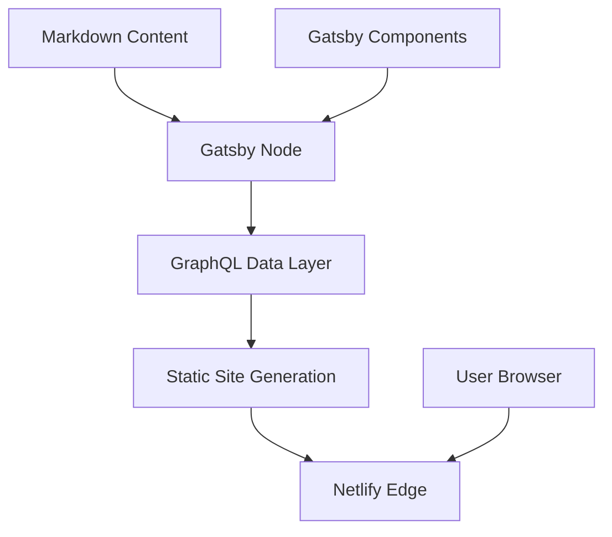

# 🖋️ Ayush Mandowara Tech Blog
**Insights, Experiments, and Engineering Notes**

[](https://github.com/google/gemini-cli)
[](https://www.gatsbyjs.com/)
[](https://reactjs.org/)
[](https://opensource.org/licenses/MIT)

[](https://ayush-mandowara.in/blog)

**Ayush Mandowara Tech Blog** is a high-performance static site generated with Gatsby. It serves as a central hub for deep-dives into software engineering, AI agents, and product development experiments.

## 🎬 Showcase Gallery
| 📖 Blog Index | 📄 Article View |
| :---: | :---: |
|  |  |

## 📊 Repo Health: 90 / 100 (High Readiness)
This project is optimized for performance (Lighthouse 90+) and SEO.

| Category | Item | Status | Score |
| :--- | :--- | :--- | :--- |
| **Documentation** | README & LICENSE | ✅ Updated | 15 / 15 |
| **Security** | Netlify Auth & .gitignore | ✅ Secure | 15 / 15 |
| **Automation** | Gatsby Build & Prettier | ✅ Working | 20 / 20 |
| **Showcase** | High-res Blog Visuals | ⚠️ Pending | 10 / 20 |
| **Distribution** | Netlify CI/CD | ✅ Active | 30 / 30 |

## 🏗 Architecture
The blog uses a JAMstack architecture (JavaScript, APIs, and Markup) for sub-second page loads and robust static delivery.



### Core Components
- **Content Layer (`content/`)**: Markdown-based articles and assets managed with Frontmatter metadata.
- **Visual Engine (`src/`)**: Component-based UI using React and Gatsby's native optimization plugins (Images, SEO).
- **Node Lifecycle (`gatsby-node.js`)**: Surgical page creation and GraphQL schema customization for dynamic routing.
- **Delivery (`netlify.toml`)**: CI/CD configuration for automated deployments and redirects.

## 🚀 Quick Start

1. **Install Dependencies**:
   ```bash
   npm install
   ```

2. **Run Development Server**:
   ```bash
   npm start
   ```

3. **Build for Production**:
   ```bash
   npm run build
   ```
