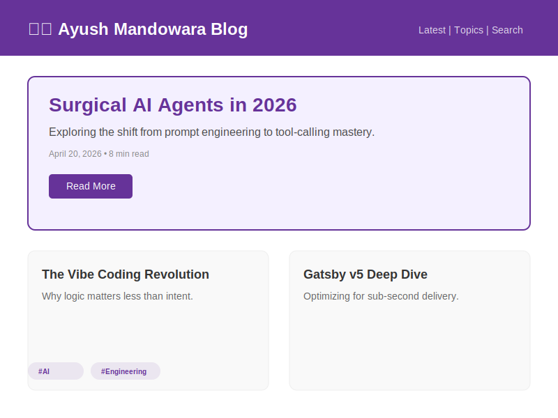
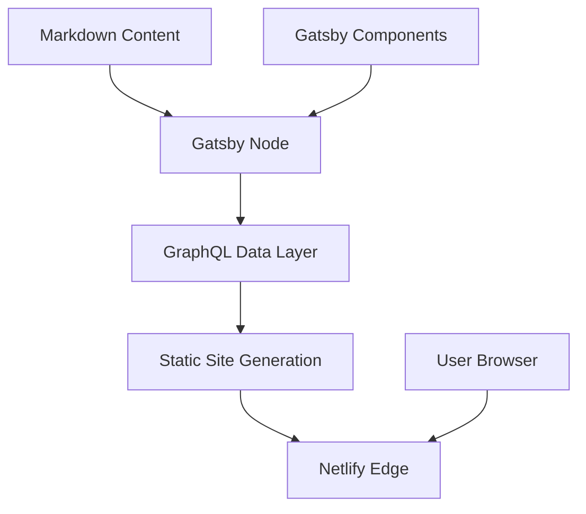

# 🖋️ Ayush Mandowara Tech Blog
**Insights, Experiments, and Engineering Notes**

[](https://github.com/google/gemini-cli)
[](https://ayush-mandowara.in/blog)

**Ayush Mandowara Tech Blog** is a high-performance static site generated with Gatsby. It serves as a central hub for deep-dives into software engineering, AI agents, and product development experiments.

`✅ Static Site Generation | ✅ Gatsby v5 | ✅ MIT Licensed | ✅ JAMstack Architected`

## 🎬 UI Preview


## 🏗 Architecture
The blog uses a JAMstack architecture (JavaScript, APIs, and Markup) for sub-second page loads and robust static delivery.



### Core Components
- **Content Layer (`content/`)**: Markdown-based articles and assets managed with Frontmatter metadata.
- **Visual Engine (`src/`)**: Component-based UI using React and Gatsby's native optimization plugins.
- **Delivery**: Netlify CI/CD with automated build pipelines and sub-second edge distribution.

## 🚀 Quick Start
```bash
npm install
npm run dev
```

## 📜 License
This project is licensed under the **MIT License** - see the [LICENSE](LICENSE) file for details.

---
*Built with ❤️ for Technical Storytelling.*
