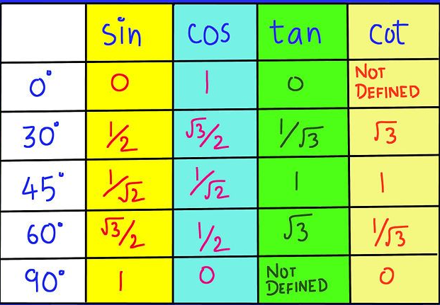
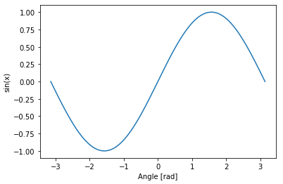

### Introduction
To put it simply, if you have ever used C/C++, Numpy is the equivalent of Arrays in Python. Along with all the basic operations such as creating and manipulating multidimensional matrices, Numpy provides us with a host of other useful operations that we can run right out of the box. I will list 5 of them down with a simple explanation.

### Functions explored
- `np.zeros`: create an array initialized with zeroes
  - one could use np.empty to initialize an empty numpy array, but there are times when you need the array to be filled with something, and zeroes are one of the most common ways to represent that there is no data present at the moment.

- `np.asmatrix`: Interprets the input numbers and generated a corresponding matrix
  - Matrices are at the core of any data science operation, they are an easy way to understand various data points, especially when working with images. Images can be interpreted as a series of RGB pixels, and matrices provide us with an easy to store this information.
  - There are some prebuilt functions in Numpy for matrices, such as for generating a diag matrix, lower triangle matrix.

- `np.fromfunction`: Generate values dynamically and fill the arrya.
  - Runs an operation over each (i,j) cell/coordinate to generate a value that will be placed in (i,j) coordinate

- `np.mean`: Calculate mean of the values present in the array
  - Mean of all values in the array can be calculated
  - Mean of values on each axis can be calculated

- `np.sin`: Calculate the sine values of a given angle
  - Numpy includes a host of Mathematical functions based on well founded concepts such as Trigonometry, Logarithms, Linear Algebra etc.
  - Trigonometry is very important when working with problems relating to phyics such as oscilation and signal processing. However, certain ML alogrithms also use trigonometry as a base. It is also used for advanced feature extraction where coordinates are transformed using Fourier Transform.

## Function 1 - np.zeros
#### Used to create multidimensional array of 0's

- Example 1
  ```py
  import numpy as np
  arr1 = np.zeros(5)
  print(arr1)
  ```
  - Output
      ```
      array([0., 0., 0., 0., 0.])
      ```

  Note: Creating an array filled with zeros is as simple as calling the np.zeros function. Here, we are simply creating an array using that method, without giving an data type, due to which the default data type, i.e. float has been used to store the numbers in the array.

- Example 2
  ```py
  arr2 = np.zeros((3,4), dtype=int)
  arr2
  ```
  - Output
    ```
    array([[0, 0, 0, 0],
           [0, 0, 0, 0],
           [0, 0, 0, 0]])
    ```

  Note: Creating a zero file array, with given dimensions (3 x 4), and providing data type as int so numbers are stored as 0 instead of 0..

- Example 3 - breaking
  ```py
  arr3 = np.zeros(3,4)
  ```
  - Output
      ```

      ---------------------------------------------------------------------------
      TypeError                                 Traceback (most recent call last)
      <ipython-input-27-11fc22649e4d> in <module>()
            1 #Example 3 - breaking
      ----> 2 arr3 = np.zeros(3,4)

      TypeError: data type not understood

      ```

  Note: It is breaking because the comma separted values are being interpreted as parameters. To fix, add the shape inside (), as shown in example #2.

### When to use this function?
This function should be called when,
- you need a zero filled array
- you need to initialize an array whose values will be filled later on


## Function 2 - np.asmatrix
#### Interprets the input numbers and generated a corresponding matrix

- Example 1
  ```py
  mat1 = np.asmatrix([[1,2],[3,4],[5,6]])
  print(mat1)
  type(mat1)
  for key in mat1:
    print(key)
    print(type(key))
  ```
  - Output
    ```
    [[1 2]
     [3 4]
     [5 6]]
    [[1 2]]
    <class 'numpy.matrix'>
    [[3 4]]
    <class 'numpy.matrix'>
    [[5 6]]
    <class 'numpy.matrix'>
    ```

  Note: The function asmatrix simply takes the input values and converts them to equivalent matrices. The type of the output is np.matrix.

- Example 2
  ```py
  mat2 = np.asmatrix([[1,2,3],[4,5,6],[7,8,9,10]])
  print(mat2)
  ```
  - Output
    ```
    [[list([1, 2, 3]) list([4, 5, 6]) list([7, 8, 9, 10])]]
    ```

  Note: When using uneven number of elements in the columns, the output will be a 1-d matrix, with each set of numbers interpreted as a list

- Example 3 - breaking
  ```py
  mat3 = np.asmatrix(1,2)
  ```
  - Output
      ```

      ---------------------------------------------------------------------------
      TypeError                                 Traceback (most recent call last)
      <ipython-input-62-ade2d1f66754> in <module>()
            1 # Example 3 - breaking
      ----> 2 mat3 = np.asmatrix(1,2)

      /usr/local/lib/python3.6/dist-packages/numpy/matrixlib/defmatrix.py in asmatrix(data, dtype)
           69
           70     """
      ---> 71     return matrix(data, dtype=dtype, copy=False)
           72
           73

      /usr/local/lib/python3.6/dist-packages/numpy/matrixlib/defmatrix.py in __new__(subtype, data, dtype, copy)
          145
          146         # now convert data to an array
      --> 147         arr = N.array(data, dtype=dtype, copy=copy)
          148         ndim = arr.ndim
          149         shape = arr.shape

      TypeError: data type not understood

      ```

  Note: Again, when setting the values, it is important that you pass them as a single paramter either as a list or a tuple, otherwise the function will break.

### When to use this function?
Matrices are a fundamental unit of data science. They are an easy to use and visualize. This function should be used whenever you need to convert a set of values into a np.matrix object. Further Reading: Try the np.diag, np.tri, np.tril and np.triu functions.


## Function 3 - np.fromfunction
#### To generate np arrays where the values are generated via some function, np.fromfunction can be used

- Example 1
  ```py
  f1 = np.fromfunction(lambda i,j: i==j, (3,3))
  f1
  ```
  - Output
      ```
      array([[ True, False, False],
             [False,  True, False],
             [False, False,  True]])
      ```

  Note: i,j represent the coordinates in the matrix, and the values are generated based on whether the value of i matches j or not, i.e. the diagonal values will be returned as True while rest of the values will be returned as False

- Example 2
  ```py
  f2 = np.fromfunction(lambda i,j: i*(j+1), (3,3), dtype=int)
  f2
  ```
  - Output
    ```
    array([[0, 0, 0],
           [1, 2, 3],
           [2, 4, 6]])
    ```

  Note: Using the lamba construct, we generate values of the form i*(j+1), and force the data type to be int

- Example 3 - breaking
  ```py
  f2 = np.fromfunction(lambda i,j: i/j, (3,3), dtype=int)
  f2
  ```
  - Output
      ```

      /usr/local/lib/python3.6/dist-packages/ipykernel_launcher.py:2: RuntimeWarning: divide by zero encountered in true_divide

      /usr/local/lib/python3.6/dist-packages/ipykernel_launcher.py:2: RuntimeWarning: invalid value encountered in true_divide
      ```

      ```

      array([[nan, 0. , 0. ],
             [inf, 1. , 0.5],
             [inf, 2. , 1. ]])

      ```

  Note: Even though the code executes successful, this would still be considered breaking logic. The reason is simple, when performing the operation, when dividing by 0, an exception will be thrown (as you cannot divide something by 0). Numpy handles the exception and puts in the 'nan' and 'inf' values in their place. nan: Not a Number, inf: Infinity

### When to use this function?
The function should be used whenever there is a requirement of generating values in the array based on some function rather than some predefined values


## Function 4 - np.mean
#### This calculates the arithmetic mean over the array. It is the sum of the elements along the axis divided by the number of elements.

- Example 1
  ```py
  print(mat1)
  mean1 = np.mean(mat1)
  print(mean1)
  ```
  - Output
      ```
      [[1 2]
       [3 4]
       [5 6]]
      3.5
      ```

  Note: Calculates sum of all value in the matrix (21) and divides them by the total number of values (6). 21/6 = 3.5 When axis is not specfied, mean is calculated over the flattened array.

- Example 2
  ```py
  mean2 = np.mean(mat1, axis=0)
  print(mean2)
  ```
  - Output
    ```
    [[3. 4.]]
    ```

  Note: Here we calculate mean over axis 0. The mean is calculated over each column individually. i.e. in our example, over (1,3,5) & (2,4,6).

- Example 3 - breaking
  ```py
  mean3 = np.mean(mat1, axis=2)
  print(mean3)
  ```
  - Output
      ```

      ---------------------------------------------------------------------------
      IndexError                                Traceback (most recent call last)
      <ipython-input-84-3b80448bf7f4> in <module>()
            1 # Example 3 - breaking
      ----> 2 mean3 = np.mean(mat1, axis=2)
            3 print(mean3)

      <__array_function__ internals> in mean(*args, **kwargs)

      /usr/local/lib/python3.6/dist-packages/numpy/core/fromnumeric.py in mean(a, axis, dtype, out, keepdims)
         3330             pass
         3331         else:
      -> 3332             return mean(axis=axis, dtype=dtype, out=out, **kwargs)
         3333
         3334     return _methods._mean(a, axis=axis, dtype=dtype,

      /usr/local/lib/python3.6/dist-packages/numpy/matrixlib/defmatrix.py in mean(self, axis, dtype, out)
          445
          446         """
      --> 447         return N.ndarray.mean(self, axis, dtype, out, keepdims=True)._collapse(axis)
          448
          449     def std(self, axis=None, dtype=None, out=None, ddof=0):

      /usr/local/lib/python3.6/dist-packages/numpy/core/_methods.py in _mean(a, axis, dtype, out, keepdims)
          136
          137     is_float16_result = False
      --> 138     rcount = _count_reduce_items(arr, axis)
          139     # Make this warning show up first
          140     if rcount == 0:

      /usr/local/lib/python3.6/dist-packages/numpy/core/_methods.py in _count_reduce_items(arr, axis)
           55     items = 1
           56     for ax in axis:
      ---> 57         items *= arr.shape[ax]
           58     return items
           59

      IndexError: tuple index out of range

      ```

  Note: It is breaking because the axis value is more than the number of axes present in the input array. To fix, use the correct axis number. Note: first axis starts with 0

### When to use this function?
This function should be used whenever mean is required to be calculated over a given input array. Further Reading: Try calculating average, standard deviation and variance.


## Function 5 - np.sin

### np.sin is a function that simply transforms input values to corresponding sine values

- Example 1
  ```py
  np.sin(np.pi/2)
  ```
  - Output
      ```
      1.0
      ```

  Note: The sine function takes input in the form of Radians i.e. pi*(somenumber) to generate angles. Hence, np.pi is used to calculate sin(90 degree) = 1. Note that pi = 180 degrees.

- Example 2
  ```py
  import matplotlib.pylab as plt
  x = np.linspace(-np.pi, np.pi, 201)
  plt.plot(x, np.sin(x))
  plt.xlabel('Angle [rad]')
  plt.ylabel('sin(x)')
  plt.axis('tight')
  plt.show()
  ```
  - Output
  

  Note:
  - To plot a graph we use the standard matplotlib library
  - `np.linspace` returns evenly spaced numbers over the specified interval. Here we are getting 201 numbers within the range of -pi to +pi (-180 to 180 degrees)
  - We calculate sines over the specified range and plot them in the graph.

- Example 3 - breaking
  ```py
  np.sin('180')
  ```
  - Output
      ```

      ---------------------------------------------------------------------------
      TypeError                                 Traceback (most recent call last)
      <ipython-input-91-794d04feb402> in <module>()
            1 # Example 3 - breaking (to illustrate when it breaks)
      ----> 2 np.sin('180')

      TypeError: ufunc 'sin' not supported for the input types, and the inputs could not be safely coerced to any supported types according to the casting rule ''safe''

      ```

  Note:
  - A mandatory input is requrired. Plus, the input should be a number (angle) that would be converted to the sine form.
  - Similar to sine functions there are other trigonometry functions that can also be invoked using Numpy.
  - One interesting article that I found was a worth a read, [Neural Networks with Sine Basis Function](https://towardsdatascience.com/neural-networks-with-sine-basis-function-c5c13fd63513)

### When to use this function?
This function should be called whenever you want to plot a sine graph
