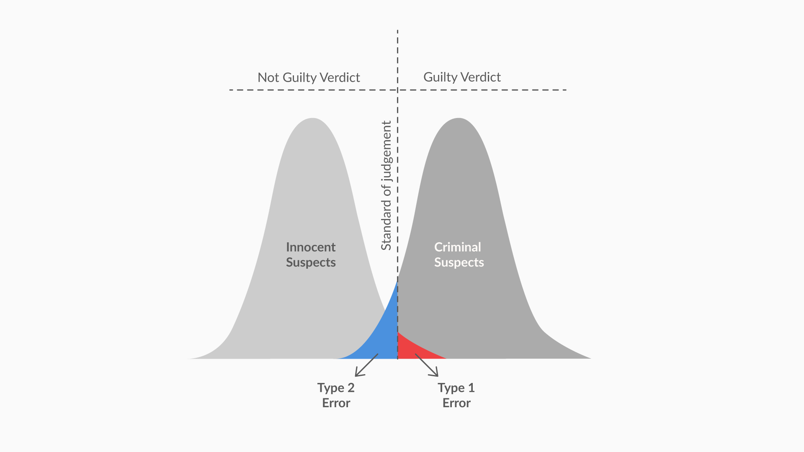

<!-- vim-markdown-toc GFM -->

* [Purpose](#purpose)
* [Difference between Inferential Statistics & Hypothesis Testing](#difference-between-inferential-statistics--hypothesis-testing)
* [Hypothesis Testing](#hypothesis-testing)
* [Critical Region](#critical-region)
* [Acceptance Region](#acceptance-region)
* [Types of Test](#types-of-test)
        * [Two Tail Test](#two-tail-test)
        * [One Tail Test - Directional Hypothesis](#one-tail-test---directional-hypothesis)
    * [Questions](#questions)
* [Making A decision](#making-a-decision)
    * [Critical Value Method](#critical-value-method)
* [One Tailed Test](#one-tailed-test)
* [Tip](#tip)
    * [Question](#question)
* [Summary](#summary)
* [The p-value method](#the-p-value-method)
            * [Revising Z-Score](#revising-z-score)
    * [How to find p-value](#how-to-find-p-value)
    * [Question](#question-1)
        * [Answer](#answer)
* [Types of Error](#types-of-error)
    * [Type 1 Error:](#type-1-error)
    * [Type 2 Error:](#type-2-error)
    * [Power of Hypothesis Test](#power-of-hypothesis-test)
    * [Relation of Type 1 Error (alpha) & Type 2 Error (beta)](#relation-of-type-1-error-alpha--type-2-error-beta)
* [z-test](#z-test)
    * [Steps for Hypothesis Testing](#steps-for-hypothesis-testing)
* [T-Distribution](#t-distribution)
* [t-test](#t-test)
* [Two-Sample Mean Test](#two-sample-mean-test)
    * [Paired t-test](#paired-t-test)
* [Question:](#question-2)
    * [Unpaired t-test](#unpaired-t-test)
* [Two-Sample Proportion Test](#two-sample-proportion-test)
    * [A/B Testing - Case of Two-Sample Proportion Test](#ab-testing---case-of-two-sample-proportion-test)
* [Using Python for Hypothesis Testing](#using-python-for-hypothesis-testing)
    * [1-sample t-test: testing the value of a population mean](#1-sample-t-test-testing-the-value-of-a-population-mean)
    * [2-sample t-test: testing for difference across populations](#2-sample-t-test-testing-for-difference-across-populations)
    * [Paired tests: repeated measurements on the same individuals](#paired-tests-repeated-measurements-on-the-same-individuals)
    * [Formula for two-sample t-test](#formula-for-two-sample-t-test)
* [Summary](#summary-1)
    * [T-distribution:](#t-distribution-1)
    * [Two-sample mean test - paired:](#two-sample-mean-test---paired)
    * [Two-sample mean test - unpaired:](#two-sample-mean-test---unpaired)
    * [Two-sample proportion test:](#two-sample-proportion-test-1)
    * [A/B Testing](#ab-testing)
* [F-Test](#f-test)
* [ANOVA - Analysis of Variance](#anova---analysis-of-variance)
    * [Variance](#variance)
    * [Key Terms](#key-terms)
    * [Degrees of Freedom](#degrees-of-freedom)
* [Chi-Square Test](#chi-square-test)
    * [Chi-square test of independence](#chi-square-test-of-independence)
    * [Example](#example)
    * [Chi-square goodness of fit](#chi-square-goodness-of-fit)
* [Questions](#questions-1)
* [References:](#references)

<!-- vim-markdown-toc -->

# Purpose
Notes about Hypothesis Testing

# Difference between Inferential Statistics & Hypothesis Testing

| Inferential Statistics                                                                                                                             | Hypothesis Testing                                                                                                         |
|----------------------------------------------------------------------------------------------------------------------------------------------------|----------------------------------------------------------------------------------------------------------------------------|
| To find some population parameter (mostly population mean) when you have no initial number to start with                                           | To confirm your conclusion (or hypothesis) about the population parameter (which you know from EDA or your intuition)      |
| start with the sampling activity and find out the sample mean. can estimate the population mean from the sample mean using the confidence interval | can determine whether there is enough evidence to conclude if the hypothesis about the population parameter is true or not

# Hypothesis Testing
- It is a method or procedure that tests the statistical validity of a claim

Hypothesis Testing starts with the formulation of these two hypotheses:
- `Null hypothesis (H₀)`: The status quo
    - A null hypothesis is the prevailing belief about a population; it states that there is no change or no difference in the situation and assumes that the status quo is true. 
    - We can either reject the null hypothesis or `fail to` reject the null hypothesis (we can never accept null hypothesis)
    - Failure to rejct null hypothesis != Accept null hypothesis
    - The null hypothesis always has the following signs:  =  OR   ≤   OR    ≥
- `Alternate hypothesis (H₁)`: The challenge to the status quo
    - An alternative hypothesis is a claim that opposes the null hypothesis. It challenges the status quo and may or may not be proved.
    - We cannot reject the alternate hypothesis, we can accept it, or fail to accept it
    The alternate hypothesis always has the following signs:  ≠   OR  >   OR    <
- Null & Alternate Hypothesis are 2 non-overlapping (or disjoint) sets


# Critical Region
- Upper Critical Value (ucv)
- Lower Critical Value (lcv)

# Acceptance Region
- It is the region between the ucv & lcv
- If your sample mean lies in the acceptance region, you fail to reject the null hypothesis because it is not beyond the critical point and you can consider that sample mean is equal to the population mean statistically.

# Types of Test
### Two Tail Test
### One Tail Test - Directional Hypothesis 
- Upper Tailed Test
- Lower Tailed Test
- Done in manufacturing

| Sign in H1 | Type of Test      | Implication                                    |
|------------|-------------------|------------------------------------------------|
| ≠ in H₁    | Two-tailed test   | Rejection region on both sides of distribution |
| < in H₁    | Lower-tailed test | Rejection region on left side of distribution  |
| in H₁      | Upper-tailed test | Rejection region on right side of distribution |

## Questions
**Government regulatory bodies have specified that the maximum permissible amount of lead in any food product is 2.5 parts per million or 2.5 ppm. If you conduct tests on randomly chosen Maggi Noodles samples from the market to see if its lead content is above the permissible amount of 2.5 ppm, what type of test this would be?**

- The alternate hypothesis in this case would be that the average lead content is more than 2.5 ppm, so the critical region would lie on right side of distribution. 
- So this would be an `upper-tailed test`. Here, you can notice that alternate hypothesis is formulated with “more than” argument (equivalently > sign), which justifies it being a right-tailed test.

**The average commute time for an UpGrad employee to and from office is at least 35 minutes. If this hypothesis has to be tested, select the type of the test and the location of the critical region.**

- `Lower-tailed test`, with the rejection region on the left side
- For this situation, the hypotheses would be formulated as H₀: μ ≥ 35 minutes and H₁: μ < 35 minutes. As `<` sign is used in alternate hypothesis, it would be a lower-tailed test and the rejection region would be on the left side of the distribution.

# Making A decision
## Critical Value Method

Alpha = signficance level

- alpha is the critical point so if alpha is 0.03, then acceptance region will be 0.95 (0.015 subtracted from both end)

$CV = \mu + (Zc * \sigma_{X_{bar}})$

In two tailed,
- $ucv = \mu + CV$
- $lcv = \mu - CV$

if xbar (mean of sample) is between ucv & lcv you fail to reject the null hypothesis

Question: Find out the UCV and LCV values for Zc = 2.17.
```py
import math
meu = 34.5
zc = 2.17
sigma = 4
n = 49
root_n = math.sqrt(n)
sigmaxbar = sigma/root_n
cv = zc * sigmaxbar
print(cv)
print(meu + cv)
print(meu - cv)
```

# One Tailed Test
- For 3% significance level, you would have only one critical region on the right side with a total area of 0.03. 
- This means that the area till the critical point (the cumulative probability of that point) would be 1 - 0.030 = 0.970. 
- So, you need to find the z-value of 0.970. The z-score for 0.9699 (~0.970) in the z-table is 1.88.


# Tip
If the standard deviation of the sample is given as 0.6, instead of the population’s standard deviation, we can approximate the population’s standard deviation to the sample’s standard deviation, which is 0.6 in this case.


## Question
**The critical value for this test at 3% significance level comes out to be 2.61 ppm. If you take more than 100 samples (with the same sample mean and standard deviation), how would the z-score and critical value change?**

- Since Zc is calculated from the given value of α (3%), it remains the same. Critical value is calculated using the formula: μ + Zc x (σ/​
√
N
​), since it is an upper-tailed test. If you increase the value of N, the critical value would decrease according to the formula.


# Summary
- `Hypothesis` — a claim or an assumption that you make about one or more population parameters
- Types of hypothesis:
    - Null hypothesis (H₀) 
        - Makes an assumption about the status quo
        - Always contains the symbols ‘=’, ‘≤’ or ‘≥’

    - Alternate hypothesis (H₁) 
        - Challenges and complements the null hypothesis
        - Always contains the symbols ‘≠’, ‘<’ or ‘>’

- Types of tests:
    - Two-tailed test   
        - The critical region lies on both sides of the distribution
        - The alternate hypothesis contains the ≠ sign
    - Lower-tailed test 
        - The critical region lies on the left side of the distribution
        - The alternate hypothesis contains the < sign
    - Upper-tailed test 
        - The critical region lies on the right side of the distribution
        - The alternate hypothesis contains the > sign

Making a decision - Critical value method:

- Calculate the value of Zc from the given value of α (significance level)
- Calculate the critical values (UCV and LCV) from the value of Zc
- Make the decision on the basis of the value of the sample mean xbar with respect to the critical values (UCV AND LCV)


The hypothesis is always made about the population parameters. The sample parameters are only used as evidence to test the hypothesis.


---

# The p-value method
- used more frequently in the industry
- p-value is the probability that null hypothesis will not be rejected
- Smaller p-values 
    - indicate more evidence in support of The alternate hypothesis
    - indicates sample mean is father away from population mean
    - indicates sample mean lies in the critical region
- p-value greater than alpha implies that we fail to reject null-hypothesis
- p-value less than alpha implies that we reject the null-hypothesis

#### Revising Z-Score
- $\Large \displaystyle Z = \frac{(\bar X - \bar \mu)}{\sigma_{\bar x}}$
- Z-table gives cumulative probability
- If sample mean lies on the left side of hypothesised mean, z-score will be negative and vice-versa

| Critical Value Method               | p-value Method                    |
|-------------------------------------|-----------------------------------|
| Zc is calculated for Critical Point | Z score is calculated for meuXbar |


## How to find p-value
1. for the sample mean value, find the Z score
1. Calculate the cumulative probability for the given Z-score using the Z-table
    - if Z-score is positive, subtract cumulative probability the value by 1
    - if Z-score is negative, drop the minus sign
1. Convert the cumulative probability to percentage by multiplying by 100 if required
    - if the test is one tailed, p-value will the one calculated in step 2
    - if the test is two tailed, p-value should be multiplied by 2
1. Check whether the probability (p-value * 100) is greater than alpha (significance level) or not
    - In case p-value > alpha, we fail to reject the null hypothesis
    - In case p-value < alpha, we reject the null hypothesis

## Question
What is the effect of increasing sample size on p-value?

### Answer
With an increase in the sample size, 
- the denominator of the z-score decreases, 
     - the absolute value of Z-score increases
     - the sample mean would move away from the central tendency towards the tails. 
- This means that the p-value would actually decrease. 

Conceptually, Increasing the sample size
- will make the distribution of sample means narrower
     - the chance of sample mean falling in the critical region decreases
- So p-value will decrease.

---

# Types of Error
## Type 1 Error: 
- Rejecting a True Null Hypothesis
    - Type-I error occurs when the null hypothesis is rejected when it is in fact correct
- denoted by alpha (significance level)
- usually alpha is set to 5% or 1%

## Type 2 Error: 
- Failing to reject a False Null Hypothesis
    - Type II error occurs when the null hypothesis is not rejected when it is in fact incorrect
- denoted by beta




## Power of Hypothesis Test
- (1 - beta) is called the power of Hypothesis Test
- [See this article](https://stattrek.com/hypothesis-test/power-of-test.aspx)

## Relation of Type 1 Error (alpha) & Type 2 Error (beta)
- alpha and beta are inversely related
    - if alpha increases beta decreases and vice-versa
    - the power of the test is reduced when you reduce the significance level; and vice versa.
- The lower the significance level, the lower the power of the test. 
   - If you reduce the significance level (e.g., from 0.05 to 0.01), the region of acceptance gets bigger. 
   - As a result, you are less likely to reject the null hypothesis. 
   - This means you are less likely to reject the null hypothesis when it is false, so you are more likely to make a Type II error. 

# z-test
1. Critical Value Method
2. p-value Method

## Steps for Hypothesis Testing
1. Formulate null and alternate hypothesis
2. If you know the population standard deviation and the sample size is greater than 30, use the z-test else use the t-test
3. Determine Test Statistic (Z-score)
    - $\Large \displaystyle Z = \frac{(\bar X - \bar \mu)}{\sigma_{\bar x}}$
    - $\large \sigma_{\bar x}$ is calculated as $\displaystyle  \large \frac{{}\sigma_{population}}{\sqrt \text{sample size (n)}}$
4. Based on the confidence level (like 95%, 99%), we determine the critical Z-Score. 
5. If the Z-score lies outside the region of the crtical Z-Score limits, we reject the null hypothesis, else we fail to reject the null hypothesis


# T-Distribution
A t-distribution is also referred to as Student’s T distribution. A t-distribution is similar to the normal distribution in many cases; for example, it is symmetrical about its central tendency. However, it is shorter than the normal distribution and has a flatter tail, which would eventually mean that it has a larger standard deviation.

T-Distribution becomes similar to Normal Distribution when sample size is greater than 30

The most important use of the t-distribution is that you can approximate the value of the standard deviation of the population (σ) from the sample standard deviation (s)

The calculations of t-distribution and normal distribution are similar. The methodology remains the same. The only difference is that instead of the Z-Table we use the the T-Table and Zc in this case is called t-statistic or t-critical.

In the t-table,
- one the y-axis we have the degree of freedom
    - df = sample size - 1

- on the x-axis we have the significance level
    - alpha = percentage / 100
    - significance level for two tailed and one tailed test are mentioned
    - [t-table](https://cdn.upgrad.com/UpGrad/temp/539fd5d0-aaf0-4502-8336-6050098ad8ce/t-table.pdf)


# t-test
t = (x – μ) / (s/√(n))

**Question**  

You are given the standard deviation of a sample of size 25 for a two-tailed hypothesis test of a significance level of 5%.

**Answer**  
For sample size = 25, your degrees of freedom would become 25 - 1 = 24. So, if you look for the value in the t-table corresponding to d.f. = 24 and α = 0.05 for a two-tailed test, you would get the t-value as 2.064.

---

# Two-Sample Mean Test

## Paired t-test
Null Hypothesis: Difference in mean between the two samples is 0
        - H₀: μ₁ - μ₂ = 0
Alternate Hypothesis: Difference in mean between the two samples is not 0
        - H₁: μ₁ - μ₂ ≠ 0

Paired t-test can be perfomed via spreadsheet software such as Excel & [LibreOffice](https://help.libreoffice.org/latest/si/text/scalc/01/statistics_test_t.html).

# Question:  
There is a hypothesis that Virat Kohli performs better or as good in the second innings of a test match as the first innings. This would be a two-sample mean test, where sample 1 would contain his score from the first innings and sample 2 would contain his score from the second innings. This would be a paired test since each row in the data would correspond to the same match.

Answer:
H₀: μ₂ - μ₁ ≥ 0
Here, the assumption is that Virat Kohli performs better or as good as in the second innings, which means his average in the second innings is assumed to be greater than or equal to his average in the first innings. So, the null hypothesis would be: μ₂ ≥ μ₁ or μ₂ - μ₁ ≥ 0

## Unpaired t-test

Two-sample mean test - unpaired is used when your sample observations are independent. During this test, you are not testing the same subject twice. For example, if you are testing a new drug, you would compare its effectiveness to that of the standard available drug. So, you would take a sample of patients who consumed the new drug and compare it with another sample who consumed the standard drug.

To perform unpaired t-test in LibreOffice:
Enter the following in a cell:
=T.TEST(range_of_cells_first_sample, range_of_cells_second_sample, num_tails, type_of_test)

For num_tails,  
- 1 = one-tailed test
- 2 = two-tailed test

For type_of_test,
- 1 = paired t-test
- 2 = unpaired t-test with equal variance
- 3 = unpaired t-test with unequal variance

Question:
What can you conclude from this test about the two unpaired samples if you take a significance level of 5%? Assume that p-value is 0.022 (2%).

Answer:
The null hypothesis in this test is that the means of the two samples are the same, and there is no significant difference between them. As the p-value (0.022) is less than 0.05 (value of α), you can reject the null hypothesis and conclude that there is some significant difference between the means of the two samples.

---

# Two-Sample Proportion Test
- Used for categorical analysis

Two-sample proportion test is used when your sample observations are categorical, with two categories. It could be True/False, 1/0, Yes/No, Male/Female, Success/Failure etc. 

For example, if you are comparing the effectiveness of two drugs, you would define the desired outcome of the drug as the success. So, you would take a sample of patients who consumed the new drug and record the number of successes and compare it with successes in another sample who consumed the standard drug. 

## A/B Testing - Case of Two-Sample Proportion Test
Two variations of the same website will be displayed to the users randomly.
- The variation which drives more sales, will be selected for final release.
- [Read More about A/B Testing](https://www.optimizely.com/ab-testing/)

---

# Using Python for Hypothesis Testing
## 1-sample t-test: testing the value of a population mean
To test, if the population mean of data is likely to be equal to a given value

```py
scipy.stats.ttest_1samp()
stats.ttest_1samp(data['column'], x) # where x is the mean value you want to test
```

## 2-sample t-test: testing for difference across populations

```py
scipy.stats.ttest_ind()
stats.ttest_ind(column_1,column_2) 
```

## Paired tests: repeated measurements on the same individuals

```py
stats.ttest_rel()  
stats.ttest_rel(column_1,column_2)  
```

## Formula for two-sample t-test
$\displaystyle t_{df} = \frac{\bar x_1 − \bar x_2 − μ_1 − μ_2}{\sqrt{\frac{s_1^2}{n_1} + \frac{s_2^2}{n_2}}}$  
where $df$ is smalerr of $n_1 - 1$ or $n_2-1$


# Summary
## T-distribution:
- A T-distribution is used whenever the standard deviation of the population is unknown
- The degrees of freedom of a T-distribution is equal to sample size n - 1
- For sample size ≥ 30, the T-distribution becomes the same as the normal distribution
- The output values and results of both t-test and z-test are same for sample size ≥ 30
 
## Two-sample mean test - paired:
- It is used when your sample observations are from the same individual or object
- During this test, you are testing the same subject twice
 
## Two-sample mean test - unpaired:
- During this test, you are not testing the same subject twice
- It is used when your sample observations are independent
 

## Two-sample proportion test:
- It is used when your sample observations are categorical, with two categories
- It could be True/False, 1/0, Yes/No, Male/Female, Success/Failure, etc. 
 

## A/B Testing
- A/B testing is a direct industry application of the two-sample proportion test
- It is a widely used process in digital companies in the ecommerce, manufacturing and advertising domains
- It provides a way to test two different versions of the same element and see which one performs better

---

# F-Test
It is used when there are more than 2 groups as the t-test in such cases becomes tedious. The reason is that we have to perofrm the tests for each combination of the groups. Moreover, the type 1 error increases in this process.

F-tests are named after the test statistic F, which was named in honor of Sir Ronald Fisher. The **F-statistic** is simply **a ratio of two variances.**

To use the F-test to determine whether group means are equal, all you need to do is include the correct variances in the ratio. In one-way ANOVA, the F-statistic is given by this ratio:

$F = \displaystyle \frac{\text{Variation between the sample means}}{\text{Variation within the samples}} = \frac{MSB}{MSW}$

# ANOVA - Analysis of Variance
ANOVA can determine whether the means of three or more groups are different. It uses F-Tests to statistically test the equality of means.

## Variance
Variance is the average squared deviation of a data point from the distribution mean. The distance between the sample mean and each data point is measured and squared. Then, you add it together and take the average. 

$\displaystyle s^2 = \frac{\sum(x-\bar x)^2}{n-1}$  
Here, 
- s2 represents the variance, 
- x represents the sample data points, 
- x-bar represents the sample mean, 
- and n represents the number of sample points.


## Key Terms
Total Sum of Squares = Sum of Squares between + Sum of squares within the group i.e. TSS = SSB + SSW

- $\displaystyle SS_{total} = \sum_{j=1}^p\sum_{i=1}^{n_j}(x_{ij} - \bar x)^2$
- $\displaystyle SS_{between} = \sum_{j=1}^pn_j(\bar x_{j} - \bar x)^2$
- $\displaystyle SS_{within} = \sum_{j=1}^p\sum_{i=1}^{n_j}(x_{ij} - x_j)^2$

Here, 
- ‘i’ represents the observations in a group or a treatment level, and 
- ‘j’ refers to a particular group or a treatment level.

- $n_j$: It represents the number of observations in a group. In your case, it will be the number of times feedback is received for, say, Snapdeal.
- $x_{ij}$:It represents all the observations that have been recorded in the dataset.
- $\bar x_j$: It represents the mean of a particular group or treatment.
- $\bar x$: It represents the grand mean of all the observations.

## Degrees of Freedom

| Type            | degree of freedom (df)                          |
|-----------------|-------------------------------------------------|
| between groups  | number of groups - 1                            |
| within a group | total number of observations - number of groups |
| complete data   | total number of observations - 1                |

Mean Square $\displaystyle = \frac{\text{sum of squares}}{df}$

- If caculated F &lt; critical F, you will fail to reject the null hypothesis.
- If caculated F &gt; critical F, you will reject the null hypothesis.

---

# Chi-Square Test
## Chi-square test of independence
- This is used to determine if there is a significant relationship between two nominal (categorical) variables.  

## Example
A researcher wants to examine the relationship between gender (male vs female) and the chances of getting Alzheimer's disease. The chi-square test of independence can be used to examine this relationship. 
- The null hypothesis (Ho) for this test is that there is no relationship between gender and life expectancy, and 
- the alternative hypothesis is that there is a relationship between gender and life expectancy.

Here, there are two categorical variables (nominal variables) — male and female.

Let’s draw a table for both these categorical values:

| Value    | Male | Female |
|----------|------|--------|
| Expected |      |        |
| Sample   |      |        |

The expected value is calculated by assuming that the null hypothesis is correct. So, if you select a sample of, say, 100 Alzheimer’s patients, 50 should be men and 50 should be women.

| Value    | Male | Female |
|----------|------|--------|
| Expected | 50   |   50   |
| Sample   |      |        |

Let's say the sample value comes up to be a bit different, and in a sample of 100 Alzheimer's patients, 60 are men and 40 are women.
Putting the expected values in the table above, you get —  

| Value    | Male | Female |
|----------|------|--------|
| Expected | 50   | 50     |
| Sample   | 60   | 40     |

The **test statistic for the chi-squre test** is equal to 
- $\displaystyle \chi^2 = \frac{\sum(O-E)^2}{E}$, where
- O is the observed sample value 
- E is the \expected value

So, our test statistic will be equal to 

$\displaystyle \chi^2 = \frac{10^2}{50}+\frac{-10^2}{50} = 4$

Let’s select the level of significance as 5%, or 0.05.
- Degrees of freedom = (r-1) x (c-1), where 
- r is the number of rows and 
- c is the number of columns.

So, the degree of freedom, in this case, is 1.

Now, you will use the [chi-square distribution table](https://people.smp.uq.edu.au/YoniNazarathy/stat_models_B_course_spring_07/distributions/chisqtab.pdf) to calculate the critical value. 

Select the value corresponding to the required Degrees of freedom and the significance level. 

- So, the critical value is 3.84, and the test statistic value is 4.
- In this case, the test statistic value (4), which is greater than the critical value, lies in the rejection region.
- Therefore, you reject the null hypothesis.


## Chi-square goodness of fit 
- This is used to test whether a sample data correctly represents a population data

---

# Questions

**A doctor states to a researcher, “A malaria patient takes either 10 or lesser number of days to recover on average.”
What will be the null and alternative hypotheses in this case if the average number of days is represented by μ?**

- H₀: μ ≤ 10 days and H₁: μ > 10 days

---

**The average growth of a certain variety of bamboo trees is less than or equal to 10.1 inches with a standard deviation of 2.1 inches in three years. A biologist claims that due to climate change, the average growth of bamboo is more than 10.1 inches for a period of three years. To prove this point, the biologist planted 35 bamboo trees and recorded that they had an average three-year growth of 10.8 inches. 
Use this information to solve the following questions:**

**A: Select the appropriate null and alternative hypotheses to test the biologist’s claim:**
- H0: μ ≤ 10.1 against H1: μ>10.1
- The null hypothesis is a premise that has been existing traditionally, so here, traditionally, the average growth of the bamboo trees is less than or equal to 10.1 inches. Thus, the null hypothesis is H0: μ ≤ 10.1, and the alternative hypothesis is that the growth was caused due to a trigger factor. Thus, based on the biologist’s claim, the alternative hypothesis is H1: μ > 10.1.

**B: Identify the distribution associated with the example above and the test statistic to be used for the hypothesis testing.**
- Normal distribution; Z-statistic
- As the sample size is more than 30 and the population standard deviation is known, we identify the distribution as normal and the statistic as z-statistic

**C: What is the Z statistic for the case?**
- The formula for z-statistic is $\displaystyle Z = \frac{(\bar X - \bar \mu)}{\frac{\sigma_{p}}{\sqrt n}}$
So, here, z= (10.8 - 10.1) / (2.1 / √35) = 1.97  

**D: Test the hypothesis above at 5% significance level and state the final result.**
- Reject the null hypothesis
- Look up Zc in z-table.
- Since Zc is 1.97, the value is 0.97558
- Since Zc is positive, we subtract the value obtained by 1
- so p-value is 0.02442 or 2.4%
- $p-value < Z_c \implies \text{reject the null hypothesis}$

---

**The ideal water used in concrete mixing should not have more than 200 mg/litre of solid organic content on an average. So, before a construction begins, the engineers test samples of water from different water sources to select an appropriate water source, or they use filtration of water. So, the hypotheses for this test are \
\
$H_0$: average organic  content ≤ 200 (water is fit for concrete) \
$H_1$: average organic content > 200 (water is unfit for concrete) \
\
Solve the following questions based on the above information.**

**A: Which of the following would be a Type-1 error?**
- The hypothesis test declares the water unfit for construction, when in fact it was fit.
- In type-1 error, the Ho is correct, but it is rejected. Hence if we declare the water unfit, we are rejecting the null hypothesis. But since the water is actually fit, then the rejection of the null hypothesis leads to a Type-1 error.

**B: What would be a type 2 error?**
- The hypothesis test declares the water fit for construction, when in fact it wasn't fit.
- In a type-2 error, the H0 is incorrect. Thus if we fail to reject the null hypothesis, we are declaring the water fit for construction. But the water was actually unfit for construction and hence this leads to a Type-2 error.

---

**According to a study, the daily average time spent by a user on social media website is 50 minutes. To test the claim of this study, Ramesh, a researcher, takes a sample of 25 website users and finds out that the mean time spent by the sample users is 60 minutes, and the sample standard deviation is 30 minutes.
Based on the information above, the null hypothesis and the alternate hypothesis will be \
\
Ho = The average time spent by the users is 50 minutes \
H1 = The average time spent by the users is not 50 minutes \
\
Use 5% significance level to test his hypothesis. Use the t-table from the [link here](http://www.sjsu.edu/faculty/gerstman/StatPrimer/t-table.pdf).**

- Fail to reject the null hypothesis
- Here, the population standard deviation is not known, and the sample size is less than 30; so, we can use the t-test.
- Therefore, the t-test statistic (t) = (x – μ) / (s/√(n)) = (60 - 50) / ( 30 / √25) = 1.66
- The sample size is 25. So, the degree of freedom = 25 - 1 = 24.
- This is a two-tailed t-test with a significance level of 5%; so, the critical t-value = t 0.05, 24 = 2.064 (using the t-table).
- Since the observed t-value is smaller than the critical value, Ramesh fails to reject the null hypothesis.

---

# References:
- https://statisticsbyjim.com/hypothesis-testing/failing-reject-null-hypothesis/
- https://stattrek.com/hypothesis-test/power-of-test.aspx
- https://cdn.upgrad.com/UpGrad/temp/539fd5d0-aaf0-4502-8336-6050098ad8ce/t-table.pdf
- https://help.libreoffice.org/latest/si/text/scalc/01/statistics_test_t.html
- https://support.google.com/docs/answer/6055837?hl=en
- https://www.optimizely.com/ab-testing/
