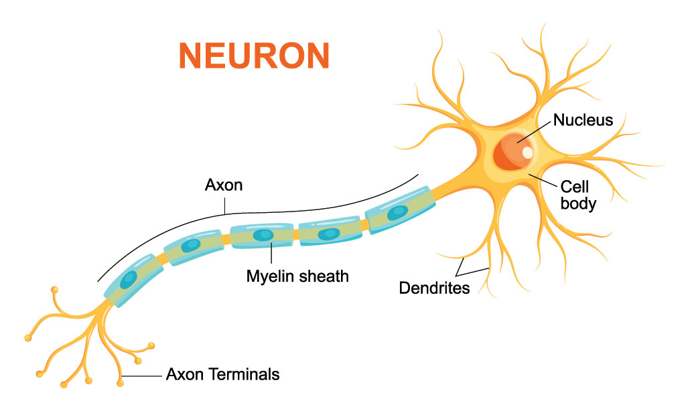
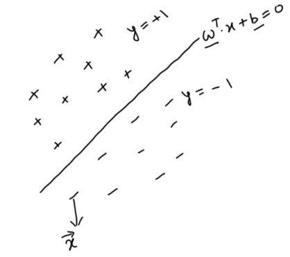
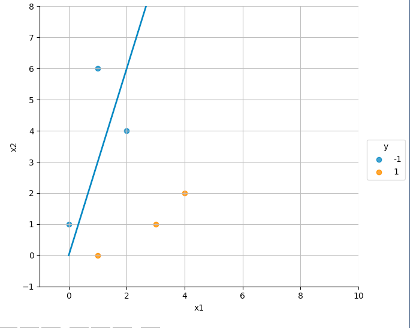
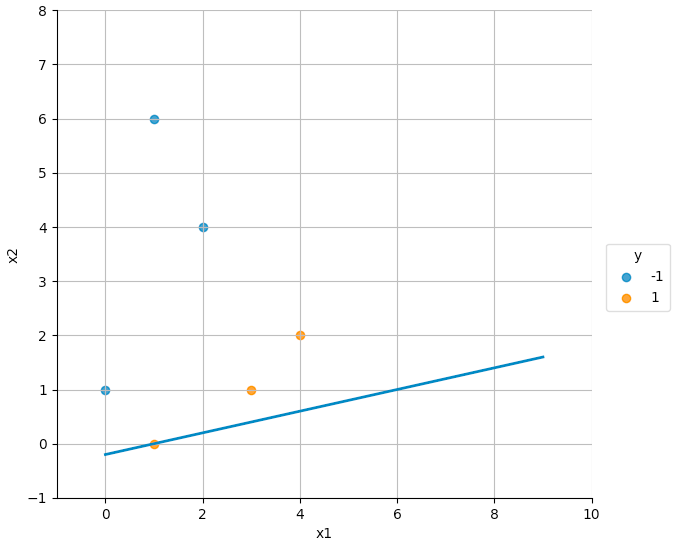
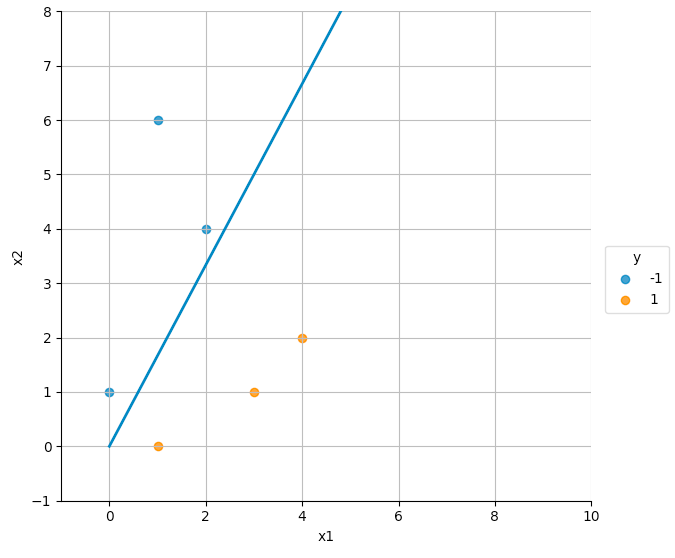
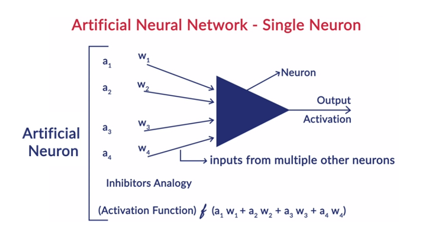
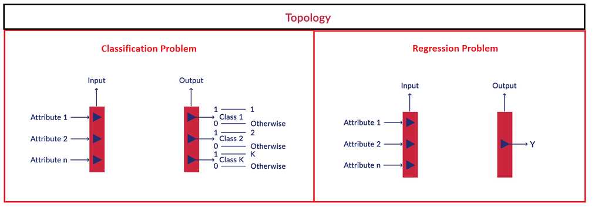
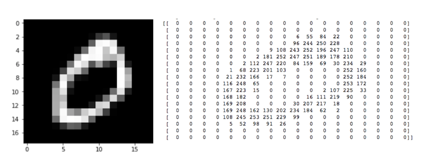
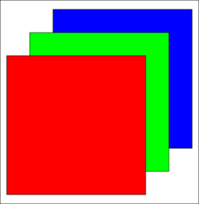

<!-- vim-markdown-toc GFM -->

* [Purpose](#purpose)
* [Artificial Neural Networks (ANNs)](#artificial-neural-networks-anns)
* [Bottlenecks with Neural Networks](#bottlenecks-with-neural-networks)
* [Deep Learning Applications](#deep-learning-applications)
* [Human Brain](#human-brain)
  * [Simplified Human Brain Analogy for Neural Networks](#simplified-human-brain-analogy-for-neural-networks)
* [What are ANNs](#what-are-anns)
* [Perceptron](#perceptron)
  * [How Perceptrons work](#how-perceptrons-work)
    * [Simplified Example](#simplified-example)
  * [Theory](#theory)
* [Question](#question)
* [Perceptron as a Classifier](#perceptron-as-a-classifier)
    * [Perceptron Problem Statement](#perceptron-problem-statement)
* [Question](#question-1)
* [Homogeneous Coordinates](#homogeneous-coordinates)
* [Question](#question-2)
* [Perceptron Algorithm](#perceptron-algorithm)
  * [Example](#example)
* [Perceptron - Multiclass Classification](#perceptron---multiclass-classification)
* [Artificial Neural Network - Single Neuron](#artificial-neural-network---single-neuron)
* [Neural Network](#neural-network)
  * [Specifying a Neural Network](#specifying-a-neural-network)
  * [Inputs to Neural Networks](#inputs-to-neural-networks)
    * [Questions](#questions)
  * [Output of a Neural Network](#output-of-a-neural-network)
    * [Softmax Output](#softmax-output)
    * [Sigmoid function as a special case of softmax in binary classification](#sigmoid-function-as-a-special-case-of-softmax-in-binary-classification)
    * [Question](#question-3)
  * [Assumptions made to Simplify Neural Networks](#assumptions-made-to-simplify-neural-networks)
  * [Parameters and Hyperparameters of Neural Networks](#parameters-and-hyperparameters-of-neural-networks)
* [Notations](#notations)
  * [Question](#question-4)
* [Activation Functions](#activation-functions)
  * [Most Popular Activation Functions](#most-popular-activation-functions)
    * [Logistic function](#logistic-function)
    * [Hyperbolic Tangent Function](#hyperbolic-tangent-function)
    * [Rectilinear Unit](#rectilinear-unit)
    * [Leaky ReLU](#leaky-relu)
    * [Questions](#questions-1)
* [Summary](#summary)
* [Takeaways](#takeaways)
    * [Questions](#questions-2)
* [References](#references)

<!-- vim-markdown-toc -->

# Purpose
Notes on Artificial Neural Networks

# Artificial Neural Networks (ANNs)
- The most sophisticated and cutting-edge models in machine learning
- Inspired by the structure of the human brain
- Established a reputation for successfully learning complex tasks such as object recognition in images, automatic speech recognition (ASR), machine translation, image captioning, video classification etc.
- Although not as powerful as the brain (yet), artificial neural networks are the most powerful learning models in the field of machine learning.
- Deep Artificial Neural Networks have proven to perform surprisingly well on complex tasks such as speech recognition (converting speech to text), machine translation, image and video classification, etc. Such models are also commonly called deep learning models.

# Bottlenecks with Neural Networks
1. Availability of Data
2. Training Methodology
3. Computational Power

# Deep Learning Applications
1. Image Recognition
2. Image Tagging and Video Analysis
3. Auto Text Generation
4. Annotations for text and video
5. Speech Recognition
6. Grammar change recommendations
7. Translating text
8. Automating games
9. Search text and draw inferences from it

# Human Brain
The biological neuron works as follows - it receives signals through its dendrites which are either amplified or inhibited as they pass through the axons to the dendrites of other neurons.

## Simplified Human Brain Analogy for Neural Networks
- Collection of simple devices working together - Neurons
- Can have billions of neurons
- Requires a lot of training - A lot of data is required

# What are ANNs
- Artificial Neural Networks, are a collection of a large number of simple devices called artificial neurons. 
- The network ‘learns’ to conduct certain tasks, such as recognising a cat, by training the neurons to ‘fire’ in a certain way when given a particular input, such as a cat. 
- In other words, the network learns to inhibit or amplify the input signals in order to perform a certain task, such as recognising a cat, speaking a word, identifying a tree etc.

# Perceptron
- developed by Rosemblatt
- simple device
- first step towards creating the large neural networks we have today

## How Perceptrons work 

### Simplified Example 

Consider a sushi place you plan to visit on the coming Saturday. There are various factors that would affect this decision, such as:
- How far is it?
- How costly is it?
- How many people are accompanying you?

You take a decision based on multiple such factors. Also, each decision factor has a different ‘weight’ - for example, the distance of the place might be more important than the number of people. 

Perceptrons work in a similar way. They take some signals as inputs and perform a set of simple calculations to arrive at a decision.

## Theory
- The perceptron takes a weighted sum of multiple inputs (along with a bias) as the cumulative input and applies a step function on the cumulative input, i.e. it returns 1 if the input is positive, else -1. 
- In other words, the perceptron “fires” (returns 1) if the cumulative input is positive and "stays dormant" (returns 0) if the input is negative.
- Note that there are different ways to define the step function. One can also use the -1, 1 or 0, 1 definition.
  - $y = 1, \text{if}\; x > 0$
  - $y = 0, \text{if}\; x \le 0$

- The input to a perceptron is the sum of weights multiplied with their respective inputs and the bias:
  - Cumulative Input = $w_1x_1+w_2x_2+\ldots+w_kx_k + b$
- In terms of Vector Algebra
  -  Say w and x are vectors representing the weights and inputs as follows 
  - $w = \begin{bmatrix}w_1\\w_2\\\ldots\\w_k\end{bmatrix}$  
  - $x = \begin{bmatrix}x_1\\x_2\\\ldots\\x_k\end{bmatrix}$
  - We can represent the cumulative sum as $w^T.x + b$
- Upon applying the step function if the cumulative sum is > 0, the output is 1/yes else 0/no

# Question

**$w = \begin{bmatrix}3\\1\\5\\7\\4\end{bmatrix}$**  
**$x = \begin{bmatrix}1\\1\\0\\1\\0\end{bmatrix}$**  
**bias = -2**  
**What is the cumulative input? What is the output of step function.**

- Cumulative Input: $w^T.x + b = 3.1 + 1.1 + 5.0 + 7.1 + 4.0 + (-2) = 9$
- Output: 1 (9 > 0)

# Perceptron as a Classifier
- The weights represent the importance of the corresponding feature for classification
- $sign(w^T.x + b) = y$

### Perceptron Problem Statement

- We need to find the correct $w$ and $b$ such that $w^T.b > 0$ for all points where $y = +1$ and $w^T.x + b$ < $0$ for points where $y = -1$
- Step function:
  - $y = 1 if x > 0$
  - $y = -1 if x \le 0$
- We can simplify by saying: $y(w^T.x + b) > 0$
- So we see that a certain set $(w, b)$ is a valid separator if $y(w^T.x + b) > 0$ for all the data points and not a valid separator if $y(w^T.x + b) < 0$ for any one of the data points.

# Question

| Data Points, x | Ground Truth, y |
|----------------|-----------------|
| (0, 3)         | 1               |
| (5, 9)         | 1               |
| (-1, 2)        | -1              |  

| Sepeartor                                     | Valid |
|-----------------------------------------------|-------|
| $w = \begin{bmatrix}-1\\1\end{bmatrix}, b=-2$ | Y     |
| $w = \begin{bmatrix}-1\\1\end{bmatrix}, b=5$  | N     |
| $w = \begin{bmatrix}-1\\2\end{bmatrix}, b=-1$ | Y     |
| $w = \begin{bmatrix}-1\\2\end{bmatrix}, b=2$  | Y     |
- Use formula: $y(w^T.x + b) > 0$

# Homogeneous Coordinates
- w and x will be represented as follows
  - $w = \begin{bmatrix}w_1\\w_2\\\ldots\\w_k\\b\end{bmatrix}$  
  - $x = \begin{bmatrix}x_1\\x_2\\\ldots\\x_k\\1\end{bmatrix}$
- This new representation does not explicitly state the existence of a bias term though it intrinsically includes it.

# Question
**Consider an input vector x which has dimensions (5,1). What is the dimension of w without transforming to homogenous coordinates?**
- (5,1) - dimension of w has to be same as x

**After converting to homogeneous coordinates, what should be the new dimension of x and w ?**
- (6,1) - There 1 additional input hence the dimension increases by 1. Hence (6,1).

**Suppose that x is $\begin{bmatrix}1\\2\\3\end{bmatrix}$ and w is $\begin{bmatrix}4\\5\\6\end{bmatrix}$ and b = 3. After homogenous transformation, what are new x & w?**
- $x_{new} = \begin{bmatrix}1\\2\\3\\1\end{bmatrix}$  
- $w_{new} = \begin{bmatrix}4\\5\\6\\3\end{bmatrix}$
- 1 is added in x and 3 that is bias is added in the w vector

# Perceptron Algorithm
- Iterative Procedure
- $w_0 \larr$ arbitrary initialization
- $w_{t+1} \larr w_t + y_{it}.\overrightarrow x_{it}$ where
  - $y_{it}.x_{it}$ is the error term
  - $x_{it}$ in this iterative procedure is a misclassified data point
  - $y_{it}$ is the corresponding true label
  - the dot in $y_{it}.x_{it}$ is not a dot product
- Pick one of the misclassified data points and multiply it with the actual label
- Obtain new weight by adding this value in the current weight
- Repeat process until all points are correctly classified

## Example

| Data Points | x_1 | x_2 | True Label (y) | Homogeneous Coordinates |
|-------------|-----|-----|----------------|-------------------------|
| 0           | 1   | 0   | 1              | (1, 0, 1)               |
| 1           | 3   | 1   | 1              | (3, 1, 1)               |
| 2           | 4   | 2   | 1              | (4, 2, 1)               |
| 3           | 0   | 1   | -1             | (0, 1, 1)               |
| 4           | 1   | 6   | -1             | (1, 6, 1)               |
| 5           | 2   | 4   | -1             | (2, 4, 1)               |

- Initial classifier: $w_0 = (3, -1, 0)$ which when expressed algebraically is $3x_1 - 1x_2 = 0$

- **Iteration 1**
- The misclassified data point is the data point '5': (2,4,1).
- In the formula: $w_{t+1} \larr w_t + y_{it}.\overrightarrow x_{it}$,
  - $x_{it} = (2, 4, 1)$ 
  - $y_{it} = -1$
- $w_1 = \begin{bmatrix}3\\-1\\0\end{bmatrix} + (-1)*\begin{bmatrix}2\\4\\1\end{bmatrix} = \begin{bmatrix}1\\-5\\-1\end{bmatrix}$
- $w_1 = (1, -5, -1)$ which is $1x_1-5x_2 = -1$ shown in the figure below:

- Notice that the line moves in the right direction, though it misclassifies two orange points now (and passes through one).
- Now, points 1 and 2 are misclassified
- The label for misclassified points (1 & 2) is +1

- **Iteration 2**
- Let us consider data point '2': $\begin{bmatrix}4\\2\\1\end{bmatrix}$ for the next update to get w_2
- $x_{it}.y_{it} = \begin{bmatrix}4\\2\\1\end{bmatrix}$ as true label ($y_{it} = 1$)
- $w_2 = \begin{bmatrix}1\\-5\\-1\end{bmatrix} + (1)*\begin{bmatrix}4\\2\\1\end{bmatrix} = \begin{bmatrix}5\\-3\\0\end{bmatrix}$
- $w_2 = (5, -3, 0)$ which is $5x_1-3x_2 = -1$ shown in the figure below.

- **All points are correctly classified now**

# Perceptron - Multiclass Classification
- Machine Learning is basically 
  - finding a function `f` such that $f(\overrightarrow x) = \overrightarrow y$
  - Input -> function -> Output
- A network of perceptrons can act as a universal function approximator
- A single layer of perceptron in combination with an AND gate leads to an enclosure in a polygon, and multiple such AND outputs using an OR gate lead to an enclosure in multiple polygons
- In the most extreme case, this can be extended to finding a polygon for every single data point

---

# Artificial Neural Network - Single Neuron
- A neuron is very similar to a perceptron, the only difference being that there is an activation function applied to the weighted sum of inputs. 
- In perceptrons, the activation function is the step function, though, in artificial neural networks, it can be any non-linear function

# Neural Network
- Neurons in a neural network are arranged in layers. 
- The first and the last layer are called the input and output layers. 
- Input layers have as many neurons as the number of attributes in the data set and 
- For a classification problem, the output layer has as many neurons as the number of classes of the target variable 
- For a regression problem, the number of neurons in the output layer would be 1 (a numeric variable)

## Specifying a Neural Network
There are 6 main things that need to be specified for specifying a neural network completely:
1. Network Topology
2. Input Layer
3. Output Layer
4. Weights
5. Activation functions
6. Biases

## Inputs to Neural Networks
- Input should always be numeric in nature. If the original data is not numeric, it has to converted to a suitable numeric representation.
- Text Data
  - We either use a one-hot vector or word embeddings corresponding to a certain word.
  - For example, if the vocabulary size is |V|, then you can represent the word $w_n$ as a one-hot vector of size |V| with a '1' at the $n^{th}$ element while all other elements being zero. 
  - The problem with one-hot representation is that usually the vocabulary size |V| is huge, in tens of thousands at least, and hence it is often better to use word embeddings which are a lower dimensional representation of each word.
- Images or Video
  - Feeding images (or videos) is straightforward since images are naturally represented as arrays of numbers. 
  - These numbers are the raw pixels of the image. 
  - Pixel is short for picture element. 
  - In images, pixels are arranged in rows and columns (an array of pixel elements). 
  - The figure below shows an image of a handwritten 'zero' in the MNIST dataset (black and white) and its corresponding representation in Numpy as an array of numbers. 
  - The pixel values are high where the intensity is high, i.e. the colour is white-ish, while they are low in the black regions
  
  - In a neural network, each pixel of the input image is a feature. 
  - For example, the image above is an 18 x 18 array. Hence, it will be fed as a vector of size 324 to the network.
  - Note that the image above is a black and white image (also called greyscale image), and thus, each pixel has only one ‘channel’. 
  - If it were a colour image (called an RGB image - Red, Green, Blue), each pixel would have three channels - one each for red, blue and green as shown below. 
  - Hence, the number of neurons in the input layer would be 18 x 18 x 3 = 972.
  

### Questions
**In a classification problem with 12 attributes and 3 class labels, the number of neurons in input and output layers will be:**
- 12, 3
- The input layer has 12 neurons corresponding to 12 attributes and the output layer has 3 neurons corresponding to probability of class labels 1, 2 and 3.

**Neural networks are quite popular in image recognition problems. The task is to classify a given black and white image (say a Google image) into categories like nature, animal, and sports. An image is just a collection of pixels. In a 720 x 1080 image, for example, there are 720 pixels along the vertical of the image and 1080 along the horizontal. Each pixel acts as an attribute and contains a ‘value’ which may represent the color, shade etc. at that point on the image. To classify an image into the three categories mentioned above, the number of neurons in the input and output layers are respectively:**
- 720 X 1080, 3
- The 720 x 1080 pixels each act as an attribute. The three output neurons contain the probability of an image being from nature, animal or sports.

**What would be the number of neurons in the input layer if the above 720 x 1080 image was RGB instead of black and white?**
- 720 x 1080 x 3

## Output of a Neural Network
### Softmax Output
- A softmax output is a multiclass logistic function commonly used to compute the 'probability' of an input belonging to one of the multiple classes. It is defined as follows:
- $\displaystyle p_{i}=\frac{e^{w_i.x'}}{\sum_{t=0}^{c-1}e^{w_t.x'}}$ where c is the number of neurons in the output layer
- If the output layer has 3 neurons and all of them have the same input x' (coming from the previous layers in the network), then the probability of the input belonging to class 0 is:
- $\displaystyle p_{0}=\frac{e^{w_0.x'}}{e^{w_0.x'} + e^{w_1.x'} + e^{w_2.x'}}$
- Although, it seems here that the x' and all the $w_i$s here are scalars but that is not the case in a neural network. In the neural network, the input x' is a large vector and the $wi$s are rows of a weight matrix which is present between the layers. 

### Sigmoid function as a special case of softmax in binary classification
- since binary classification is a special case of multiclass classification
- $p_1 = 1-p_0$
- In the case of a sigmoid output, there is only one neuron in the output layer since if there are two classes with probabilities $p_0$ and $p_1$, we know that $p_0 + p_1 = 1$. Hence, we need to compute the value of only one of $p_0$ or $p_1$.
- $\displaystyle p(l(x') = 1) = \frac{1}{1+e^{-wx'}}$
- $\displaystyle p_{0}=\frac{e^{w_0.x'}}{e^{w_0.x'} + e^{w_1.x'}}$
- $\displaystyle p_{1}=\frac{e^{w_1.x'}}{e^{w_0.x'} + e^{w_1.x'}}$
- Divide $p_1$ by numerator to get $\displaystyle p_{1}=\frac{1}{1+\frac{e^{w_0.x'}}{e^{w_1.x'}}} = \frac{1}{1+e^{(w_0-w_1).x'}}$
- And if we replace $w_1-w_0$ as w, we get the sigmoid function

### Question
**In a 3 class softmax output layer, if $p_0$ = 0.5, what is the range of $p_1$?**
- 0 to 0.5
- Maximum value $p_1$ can have is $1-0.5 = 0.5$. Minimum value is $0$ when $p_2 = 0.5$.

**Consider:**  
**$w_0 = \begin{bmatrix}1&1&-1\end{bmatrix}$**  
**$w_1 = \begin{bmatrix}2&0&-1\end{bmatrix}$**  
**$w_2 = \begin{bmatrix}1&2&2\end{bmatrix}$**  
**$x' = \begin{bmatrix}2\\1\\1\end{bmatrix}$**  
What are the values of $p_0, p_1, p_2$
- 0.017, 0.047, 0.936
- We get $w_0.x' = 2, w_1.x' = 3\;\text{and}\; w_2.x' = 6$. Plug the values in $\displaystyle p_{i}=\frac{e^{w_i.x'}}{\sum_{t=0}^{c-1}e^{w_t.x'}}$ to get the values.

## Assumptions made to Simplify Neural Networks

1. Neurons are arranged in layers and the layers are arranged sequentially.
2. Neurons within the same layer do not interact with each other.
3. All the inputs enter the network through the input layer and all the outputs go out of the network through the output layer.
4. Neurons in consecutive layers are densely connected, i.e. all neurons in layer l are connected to all neurons in layer l + 1.
5. Every interconnection in the neural network has a weight associated with it, and every neuron has a bias associated with it.
6. All neurons in all layers use the same activation function.

## Parameters and Hyperparameters of Neural Networks
- During training, the neural network learning algorithm fits various models to the training data and selects the best model for prediction. 
- The learning algorithm is trained with a fixed set of hyperparameters 
  - the network structure 
  - number of layers
  - number of neurons in the input
  - hidden layers
  - output layers
  - activation functions
- It is trained on the weights and the biases, which are the parameters of the network.

# Notations
The notations that we shall be going forward are as follows:
- W is for weight matrix
- b shall stand for the bias
- x stands for input
- y is the ground truth label
- p is the probability vector of the predicted output
- h is the output of the hidden layers
- superscript stands for layer number
- subscript stands for the index of the individual neuron

## Question
**According to the diagram below and notation stated above answer the following questions**  

**Note that the input vector is $x_1$ as shown in the image**  
 
**How will you represent the probability output coming out of the last layer represented as e?**
- $p_{14}$
- We know that the input vector is $x_1$. Hence, the corresponding output vector will be $p_1$. Like we represented the input into the 4th neuron as $x_{14}$, hence the element of  $p_1$ for the 4th neuron will be $p_{14}$.

**How will you represent the element of the weight matrix between layer 1 and 2 represented as b in the figure (do not confuse this with the bias)?**
- $W_{25}^2$
- The elements are of the matrix $W^2$. It is connecting to 2nd neuron in layer 2 from 5th neuron in the layer 1. Hence, $W^2_{25}$.

**On similar lines, how will you represent the element of the weight matrix represented as d?**
- $W_{33}^4$
- The elements are of the matrix $W^4$. It is connecting to 3rd neuron in layer 4 from 3rd neuron in the layer 3. Hence, $W_{33}^4$.

**How will you represent the bias of the neuron denoted by a?**
- $b_2^3$
- It is the bias of the 3rd layer for the 2nd neuron. Hence, $b_2^3$.

**How will you represent the output of the neuron denoted by c?**
- $h_5^2$
- It is the output of the 2nd layer for the 5th neuron. Hence, $h_5^2$.

# Activation Functions
The activation function could be any function, though it should have some important properties such as:
- Activation functions should be `smooth` i.e. they should have no abrupt changes when plotted.
- They should also make the inputs and outputs `non-linear` with respect to each other to some extent. This is because non-linearity helps in making neural networks more compact. 

## Most Popular Activation Functions

### Logistic function
- $f(x) = \frac{1}{1+e^{-x}}$

- You can also show that in a sigmoid neuron, if you multiply the weights and biases by a positive constant c>0, as the limit as c→∞ the behaviour of this sigmoid neurons is exactly the same as that of a perceptron, given w.x+b≠0 for the input x.

### Hyperbolic Tangent Function
- $tanh(x) = \frac{e^x-e^{-x}}{e^x+e^{-x}}$

- It is similar to sigmoid function

### Rectilinear Unit
- $x = \begin{cases}
   x, \;\text{if } x\ge 0 \\
   0, \;\text{otherwise}
\end{cases}$

### Leaky ReLU
- based on ReLU
- has a small slope for negative values instead of a flat slope
- $x = \begin{cases}
   x, \;\text{if } x\ge 0 \\
   \alpha x, \;\text{otherwise}
\end{cases}$

The output of a neuron is basically the activation function applied to the cumulative input to that neuron. 
- If the cumulative input to the neuron is $y = w_1a_1 + w_2a_2 + \ldots + w_ka_k + b$ then
- using the sigmoid activation function the output will be $y = \frac{1}{1+e^{-(w_{1}a_1+w_2a_2+\ldots+w_ka_k + b)}}$

### Questions
**Consider only a single neuron with the following weight vector, $w = \begin{bmatrix}2\\-6\\3\end{bmatrix}$, the input vector $x = \begin{bmatrix}3\\2\\1\end{bmatrix}$ and the bias $b=-1$.**

**What is the cumulative input into the neuron?**
- $w^T.x + b = -4$

**Output of ReLU**
- 0

**Output of leaky ReLU with $\alpha = 0.2$**
- $0.2*(-4) = -0.8$

**Output of sigmoid**
- $\frac{1}{1+e^{-(-4)}} = 0.018$

# Summary

- We learnt how the architecture of Artificial Neural Networks draws inspiration from the human brain.
- The perceptron acts as a binary classifier and can perform complex classification tasks.
- studied the architecture of ANNs - the topology, the parameters (weights and biases) on which the neural network is trained, the hyperparameters, etc.
- We made some simplifying assumptions in the architecture.
- ANNs only take numerical inputs, and hence, you need to convert all types of data to a numeric format so that neural networks can process it
- Next, we fixed the notations that we would use in the future
- introduced to most common activation functions

# Takeaways
- Perceptrons, though are very simple in nature, can be used as binary classifiers
- a group of neurons can approximate arbitrarily complex functions
- neurons + AND Gate = Polygon
- neurons + OR Gate = classification (checking which of the polygons a point belongs to)

### Questions
**Suppose we take all the weights and biases in a perceptron and multiply them by a positive constant, c > 0. The perceptron uses the following step function as the activation function:**  
**$y = 1, \text{if}\; x > 0$**  
**$y = 0, \text{if}\; x \le 0$**  
**Will the output of the perceptron change (compared to the vanilla perceptron without any positive constant c)?**
- No. [refer: [this blog post](https://nipunsadvilkar.github.io/blog/2018/09/04/neural-networks-and-deep-learning-book-chap1-ex1-part1-solution.html)]

**The hyperparameters in a neural network are:**

| Parameters                      | Is Hyperparameter |
|---------------------------------|-------------------|
| Number of layers                | Yes               |
| Number of neurons in each layer | Yes               |
| Weights                         | No                |
| Biases                          | No                |
| The activation function         | Yes               |

- Hyperparameters are the user-controlled inputs supplied to the learning algorithm which finds out the optimal parameters. 
- Since the user of Neural Networks decides 
  - how many layers are to be included in a given network
  - how many neurons are to be included in a given layer
  - which activation function is to be used in a given layer
- hence these are all hyperparameter.

**For an RGB image arranged in 32 x 32 pixels square array, you want to classify it into a dog, cat, bird or none of the above. How many features/data points will be fed into the neural network?**
- 3072. 
- A black white 32 x 32 image would have 32x32 input features. The RGB image has 3 channels. Hence 32x32x3 = 3072 input features.

**For an RGB image as input having 32 x 32 pixels, you want to classify it into a ‘dog’, ‘cat’, ‘bird’ or ‘none’. What will be the number of neurons in the output layer?**
- 4
- There are 4 classes we have to classify - dog, cat, bird and none. Hence, 4 output neurons.

**For an RGB image as input having 32 x 32 pixels, you want to classify it into a ‘dog’, ‘cat,’ bird’ or ‘none’. Would you use a sigmoid/ softmax activation in the output layer?**
- Softmax
- Since there are 4 classes, we shall use a softmax activation.

**How would you denote the output of the third hidden layer?**  
- $h^3$
- The output of the hidden layer is defined by $h$. Superscript denotes the layer number.

**How would you denote the weight which connects the 6th neuron of hidden layer 3 to the 8th neuron of hidden layer 4?**  
- $w^4_{86}$
- The first subscript denotes the neuron of layer 'l'. The second subscript refers to the neuron of layer 'l-1'.The superscript refers to layer 'l'.

**We have a hidden layer number 3 with 11 neurons and the hidden layer number 4 with 18 neurons. Also, these hidden layers are densely connected. How many connections will be present?**
- 198
- Number of interconnections  =  number of neurons in layer 'l' x number of neurons in layer 'l-1'

**According to the assumptions of the Neural Network, the activation function of all the neurons in a particular layer is the same. True or False.**
- True
- Correct, to simplify the network we assume that  the activation function of all the neurons in a particular layer is the same

--- 

# References
- [Link Invalid](https://www.cse.iitb.ac.in/~shivaram/teaching/old/cs344+386-s2017/resources/classnote-1.pdf)
- [Neural Nets to recognize handwritten digits](http://neuralnetworksanddeeplearning.com/chap1.html)
- [Softmax vs Sigmoid](https://medium.com/arteos-ai/the-differences-between-sigmoid-and-softmax-activation-function-12adee8cf322)
