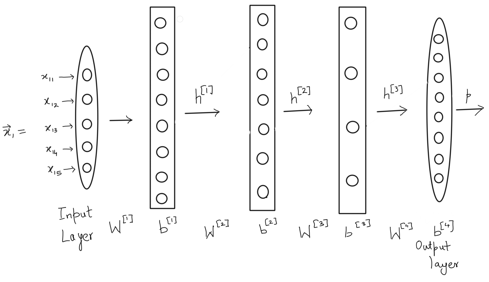

# Flow of Information in Neural Networks
In artificial neural networks, the output from one layer is used as input to the next layer. Such networks are called feedforward neural networks. This means there are no loops in the network - information is always fed forward, never fed back.

# Dimensions in a Neural Network
#### Input Vector
- The input vector dimensions are just the number of features times 1 making it a column vector.
- Ex: (5, 1) or (5, ) is an input vector, while (5, 5) or (1, 5) is not.
- Note that by default vectors are assumed to be column vectors unless state otherwise.

#### Weight Matrix
- The weights are always in a matrix form.
- Ex: (5, 5) or (3, 5) or (7, 2) are valid dimensions for weight matrices
- Note that the weight matrix should have column dimension same as the input vector it is going to receive since we take the dot product of the weight matrix ($\mathbf M$) with input vector ($\vec v$) as follows: `M.v`. 
- As per the rules of matrix multiplication, if Matrix $\mathbf A$ has dimension $(a, b)$ while B has dimensions $(c, d)$ then their dot product $(\mathbf A . \mathbf B)$ can only be taken if $b = c$

#### Example

##### Dimension of input vector $\vec x_1$
- (5, 1)
- There are 5 neurons in the input layer. Hence (5,1). By default, a vector is assumed to be a column vector.

##### Dimensions of $\mathbf W^1\; \text{to}\; \mathbf W^4$
- $(8, 5), (7, 8), (4,7)\; \text{and}\; (4,8)$
- The dimensions of $\mathbf W^l$ are defined as (number of neurons in layer l, number of neurons in layer l-1)

##### Dimensions of the output vectors of the hidden layers $\vec h^1$ and $\vec h^2$
- $(8,1)\;\text{and}\;(7,1)$
- The dimension of the output vector for a layer l is (number of neurons in the layer, 1)

##### The dimension of the bias vector is the same as the output vector for a layer l for a single input vector. True or False.
- True

##### What is the number of learnable parameters in this network? Note that the learnable parameters are weights and biases.
- 183
- The weights have 40, 56, 28, 32 individual parameters(the weight elements). The layers have 8, 7, 4, 8 biases respectively.

