# Purpose
Notes on Convolutional Neural Networks

# CNN - Introduction
- Convolutional Neural Networks, or CNNs, are neural networks specialised to work with visual data, i.e. images and videos (though not restricted to them). 
- They are very similar to the vanilla neural networks (multilayer perceptrons) - every neuron in one layer is connected to every neuron in the next layer, they follow the same general principles of forward and backpropagation, etc. 
- However, there are certain features of CNNs that make them perform extremely well on image processing tasks. 
- Convolutional Neural Networks, or CNNs, are specialised architectures which work particularly well with visual data, i.e. images and videos. 
- They have been largely responsible for revolutionizing 'deep learning' by setting new benchmarks for many image processing tasks that were very recently considered extremely hard.

# Challenges in Image Processing
Let's consider the common task of visual recognition (like identifying a ‘cat’ or a ‘dog’) - trivial as it is for humans, it is still a big challenge for algorithms. Let’s look at some of the challenges:

- Viewpoint variation: Different orientations of the image with respect to the camera.

- Scale variation: Different sizes of the object with respect to the image size.
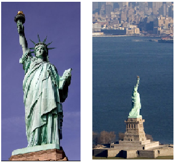

- Illumination conditions: Illumination effects.

- Background clutter: Varying backgrounds.
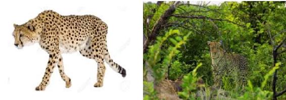

# CNNs - A specialised architecture for visual data
- Although the vanilla neural networks (MLPs) can learn extremely complex functions, their architecture does not exploit what we know about how the brain reads and processes images. 
- For this reason, although MLPs are successful in solving many complex problems, they haven't been able to achieve any major breakthroughs in the image processing domain.
- On the other hand, the architecture of CNNs uses many of the working principles of the animal visual system and thus they have been able to achieve extraordinary results in image-related learning tasks. 

# Applications of CNNs
- CNNs were first made popular due to their excellent performance in image classification problems such as the ImageNet Large Scale Visual Recognition Challenge (ILSVRC). They are performing even better than humans (5% error by humans, 3% error by CNN) in the challenge.
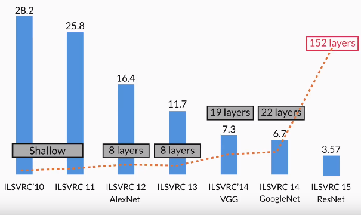

- Classifying image as portrait or landscape

- Classifying image as painting, animal, person

- Object localization: Identifying the local region of the objects (as a rectangular area) and classifying them.

  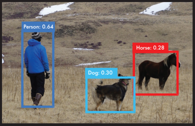

- Semantic Segmentation: Identifying the exact shapes of the objects (pixel by pixel) and classifying them.

  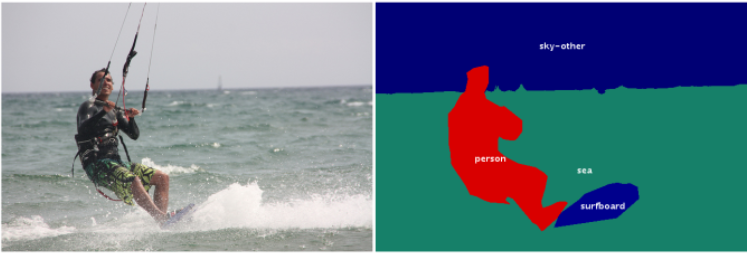

- Optical Character Recognition (OCR): Recognise characters in an image. For e.g. for the top-left image, the output will be ‘1680’.

  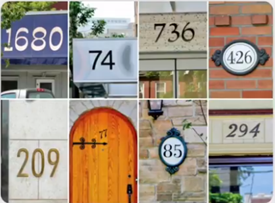

- Image search to find details or similar items in different retail stores

- There are various other applications of CNNs in the healthcare sector. Many medical imaging applications used in radiology, cardiology, gastroenterology etc. involve classification, detection, and segmentation of objects which can be analysed using CNNs.
 
- 3D Analysis has to be performed for medical problems such as to find out how big a tumor is. Volume of blood being pumped by taking contour images.
- Geographical Analysis can be performed such as monitoring land, water bodies, forest fires, mining sites by taking photos from a satellite
- Video Analysis: A video is a series of images (or frames). CNNs are commonly used for processing videos.
- Presence of craters on planets to understand meteor crashes
- Application of CNN is found in Insurance Claim Analysis such as assessing the payout when property gets damaged due to floods
- Can be used for Audio and text analysis as well

# Receptive field for single neurons in the cat striate cortex
- [Research Paper](https://www.ncbi.nlm.nih.gov/pmc/articles/PMC1363130/pdf/jphysiol01298-0128.pdf) published by Hubel and Wiesel

Some of the important observations made in the study were:

- Each neuron in the retina focuses on one part of the image and that part of the image is called the receptive field of that neuron.
 
- There are excitatory and inhibitory regions in the receptive field. The neurons only ‘fire’ when there is a contrast between the excitatory and the inhibitory regions. If we splash light over the excitatory and inhibitory regions together, because of no contrast between them, the neurons don’t ‘fire’ (respond). If we splash light just over the excitatory region, neurons respond because of the contrast.

  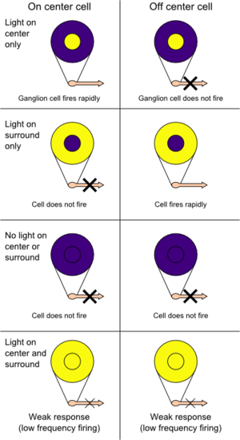

- The strength of the response is proportional to the summation over only the excitatory region (not inhibitory region). The pooling layer in CNNs corresponds to this observation.

The figure below shows a certain region of the receptive field of a cat. The excitatory region (denoted by the triangular marks) is at the centre surrounded by the inhibitory region marked by the crosses.

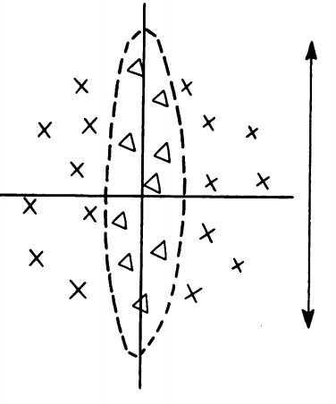
- The response will be the strongest if a "vertical slit" shaped light falls on excitatory region

- The receptive fields of all neurons are almost identical in shape and size

- There is a hierarchy in the units: Units at the initial level do very basic tasks such as picking raw features (such as horizontal edges) in the image. The subsequent units extract more abstract features, such as identifying textures, detecting movement, etc. The layers 'higher' in the hierarchy typically aggregate the features in the lower ones.

The image below illustrates the hierarchy in units  - the first level extracts low-level features (such as vertical edges) from the image, while the second level calculates the statistical aggregate of the first layer to extract higher-level features (such as texture, colour schemes etc.).

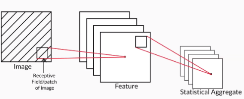

Using this idea, if we design a complex network with multiple layers to do image classification (for example), the layers in the network should do something like this:

- The first layer extracts raw features, like vertical and horizontal edges
- The second layer extracts more abstract features such as textures (using the features extracted by the first layer)
- The subsequent layers may identify certain parts of the image such as skin, hair, nose, mouth etc. based on the textures.
- Layers further up may identify faces, limbs etc. 
- Finally, the last layer may classify the image as 'human', 'cat' etc.

  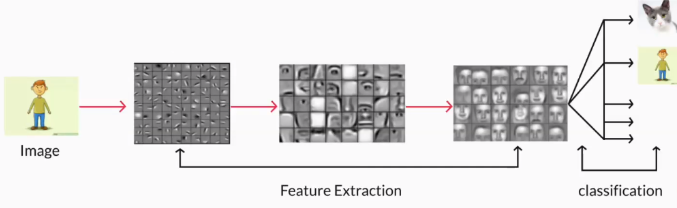

Apart from explaining the visual system, the paper also suggested that similar phenomena have been observed in the auditory system and touch and pressure in the somatosensory system. This suggests that CNN-like architectures can be used for speech processing and analysing signals coming from touch sensors or pressure sensors as well. 

# Research Paper Insights - Summary
- Each unit, or neuron, is dedicated to its own receptive field. Thus, every unit is meant to ignore everything other than what is found in its own receptive field.
- Each unit, or neuron, performs specialised tasks on its receptive field.
- The receptive field of each neuron is almost identical in shape and size.
- The subsequent layers compute the statistical aggregate of the previous layers of units. This is analogous to the 'pooling layer' in a typical CNN.
- Inference or the perception of the image happens at various levels of abstraction. The first layer pulls out raw features, subsequent layers pull out higher-level features based on the previous features and so on. Finally, the network gets an overall perception of an image in the last layer.

# VGGNet Architecture

Key elements of CNN
- Convolution - It Image size shrinks (scales down) after every couple of layers
- Pooling layers
- Feature maps
 
The VGGNet was specially designed for the ImageNet challenge which is a classification task with 1000 categories. Thus, the softmax layer at the end has 1000 categories. The blue layers are the convolutional layers while the yellow ones are pooling layers.

Finally, the green layer is a fully connected layer with 4096 neurons, the output from which is a vector of size 4096.

The most important point to notice is that the network acts as a feature extractor for images. For example, the CNN above extracts a 4096-dimensional feature vector representing each input image. In this case, the feature vector is fed to a softmax layer for classification, but you can use the feature vector to do other tasks as well (such as video analysis, object detection, image segmentation etc.).

# Questions
**Which of Convolution or Softmax operations acts as a feature extractor?**
- Convolution

---

**Which of the following is correct for last softmax layer in the CNN?**

| Statement                                    | True / False |
|----------------------------------------------|--------------|
| Each class probability lies in the range 0-1 | True         |
| Sum of class probability is 1                | True         |

- Probability always lies between 0 and 1

# Reading Digital Images
- Images are made up of pixels.
- A number between 0-255 represents the colour intensity of each pixel.
- Each pixel in a colour image is an array representing the intensities of red, blue and green. The red, blue and green layers are called channels.
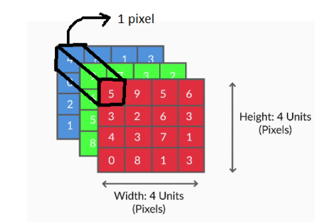

- In a grayscale image (a 'black and white' image), only one number is required to represent the intensity of white. Thus, grayscale images have only one channel.
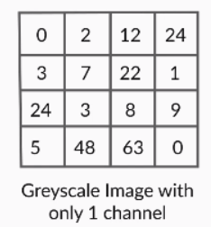

- [Reading Digits Example Notebook](https://colab.research.google.com/drive/1Bx8ESgvRKQ45DgQPf8eMSqx5CHy14_mI?usp=sharing)

## Why is the Range of Pixel Values 0-255
Usually, 8-bits (1 byte) are used to represent each pixel value. Since each bit can be either 0 or 1, 8-bits of information allows for $2^8 = 256$ possible values. Therefore, the range of each pixel is 0-255.

# Questions

**How many total number of pixels are there in a grayscale image whose dimension is (250,150)?**
- $250\times 150 = 37500$
- The number of pixels is height x width. Here, height is 250, and the width is 150. So, number of pixels is $250\times 150 = 37,500$

---

**How many channels are there in an image?**

| Statement                                                                                           | True / False |
|-----------------------------------------------------------------------------------------------------|--------------|
| If it is a grayscale image, number of channels is 1                                                 | True         |
| If it is a colour image, and if we represent by RGB (Red, Green, Blue), the number of channels is 3 | True         |
| If we represent an image in HSV (Hue, Saturation, Value) format, the number of channels is 3.       | True         |
| The number of channels is always 3                                                                  | False        | 

- A greyscale image has single channel. 
- If it is a colour image, and if we represent by RGB (Red, Green, Blue), the number of channels is 3 for Red, Green and Blue. 
- If it is a colour image, and if we represent by RGB (Red, Green, Blue), the number of channels is 3 for Hue, Saturation and Value.

---

**What is the total number of pixels in an image whose dimension is (250,150,3), where ‘3’ represents the RGB channels?**
- Numbers of pixels is 'width x height', which is 250 x 150, independent of depth.

---

**What is the range of possible values of each channel of a pixel if we represent each pixel by 8 bits?**
- 2^8(bits) = 256. So, the range is 0 to 255.

---

**In a grayscale image, which colours represent 0 and 255?**
- Lowest intensity - '0'  is black and the highest intensity-'255' is white. 

---

**What do the numbers signify in the pixel?**
- Each number in pixel represents intensity. If it's '0', it means black with no intensity and '255' means white with the highest intensity. 

---

# Video Analysis
A video is basically a sequence of frames where each frame is an image. You already know that CNNs can be used to extract features from an image. Let's now see how CNNs can be used to process a series of images (i.e. videos). 

## Process
Let's summarise the process of video analysis using a CNN + RNN (Recurrent Neural Network) stack. At this point, you only need to understand that RNNs are good at processing sequential information such as videos (a sequence of images), text (a sequence of words or sentences), etc. 

For a video classification task, here's what we can do. 
- Suppose the videos are of length 1 minute each. 
- If we extract frames from each video at the rate of 2 frames per second (FPS), we will have 120 frames (or images) per video. 
- Push each of these images into a convolutional net (such as VGGNet) and extract a feature vector (of size 4096, say) for each image. 
- Thus, we have 120 feature vectors representing each video. 
- These 120 feature vectors, representing a video as a sequence of images, can now be fed sequentially into an RNN which classifies the videos into one of the categories.
- The main point here is that a CNN acts as a feature extractor for images, and thus, can be used in a variety of ways to process images.

# Convolutions
Mathematically, the convolution operation is the summation of the element-wise product of two matrices. Let’s take two matrices, X and Y. If you 'convolve the image X using the filter Y', this operation will produce the matrix Z. 

$X = \def\arraystretch{1.5}
   \begin{array}{c:c:c}
   1 & 2 & 3 \\ \hline
   2 & 0 & 0 \\
   \hline
   7 & 9 & 1
\end{array}$

$Y = \def\arraystretch{1.5}
   \begin{array}{c:c:c}
   3 & 2 & 0 \\ \hline
   3 & 0 & 1  \\ \hline
   0 & 5 & 2
\end{array}$

$Z = \def\arraystretch{1.5}
   \begin{array}{c:c:c}
   1\times 3=3 & 2\times 2=4 & 3\times 0=0 \\ \hline
   2\times 3=6 & 0\times 0=0 & 0\times 1=1  \\ \hline
   7\times 0=0 & 9\times 5=45 & 1\times 2=2
\end{array}$

Finally, you compute the sum of all the elements in Z to get a scalar number, i.e. 3+4+0+6+0+0+0+45+2 = 60. 

## Filter
- also called Kernel
- Small array of numbers which act as a filter that allow you to create some special effects on the image that you are viewing through the filter

### Example
**Given an input matrix X of size (2,2) and filter matrix Y of size (2,2), find the output value after we perform convolution of X and Y.**

$X = \def\arraystretch{1.5}
   \begin{array}{c:c}
   1 & 4 \\ \hline
   0 & 9 \\
\end{array}$

$Y = \def\arraystretch{1.5}
   \begin{array}{c:c}
   4 & 0 \\ \hline
   2 & 1 \\
\end{array}$

- 13
- Convolution of 2 matrices X and Y is : 1x4 + 4x0 + 0x2 + 9x1 = 13

## Detecting Features
- We can use filters to detect features such as vertical and horizontal edges

### Vertical Edge Detection
- In the convolution output using the following filter, only the middle two columns are nonzero while the two extreme columns (1 and 4) are zero. This is an example of vertical edge detection.

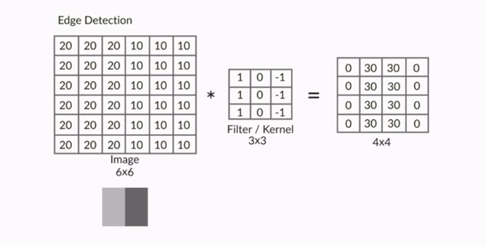

Note that each column of the 4 x 4 output matrix looks at exactly three columns of the input image. The values in the four columns represent the amount of change (or gradient) in the intensity of the corresponding columns in the input image along the horizontal direction.

For example the output is 0 (20 - 20 or 10 - 10) in the columns 1 and 4, denoting that there is no change in intensity in the first three and the last three columns of the input image respectively.

On the other hand, the output is 30 (20 - (-10)) in the columns 2 and 3, indicating that there is a gradient in the intensity of the corresponding columns of the input image.

### Horizontal Edge Detection
$\def\arraystretch{1.5}
   \begin{array}{c:c:c}
   -1 & -1 & -1 \\ \hline
   0 & 0 & 0 \\
   \hline
   1 & 1 & 1
\end{array}$

#### Convolution Example
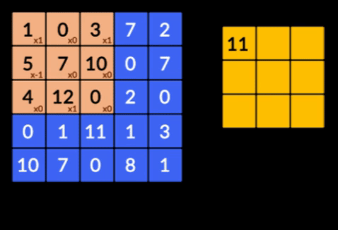

Although we have only seen very simple filters, one can design arbitrarily complex filters for detecting edges and other patterns. For example, the image below shows the Sobel filter which can detect both horizontal and vertical edges in complex images. 

### Sobel Filter
- can be used to detect both horizontal and vertical edges
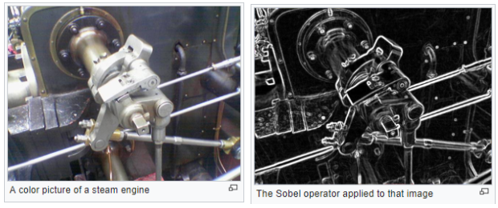

# Questions
**Given an input image of size (10,10) and a filter of size (4,4), what will be the size of the output size on convolving the image with the filter?**
- (7, 7)
- If we move (4,4) matrix on a matrix of size (10,10), there will be 7 vertical and 7 horizontal positions.

---

**Which of the following image approximately represents the given matrix?**

$\begin{bmatrix}0 & 0 & 0 & 0\\0 & 0 & 0 & 0\\100 & 100 & 100 & 100\\100&100&100&100\\50&50&50&50\\50&50&50&50\end{bmatrix}$

| Option                   | Yes/No |
|--------------------------|--------|
| 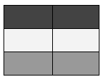 | Yes    |
| 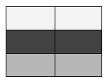 | No     |

- Lower value of pixel means lower intensity and higher value for high intensity. Like '0' for black and '255' for white. 

---

**Given an input image X, which of the following filters will detect an edge in the vertical direction?**

| Option                                               | Yes / No |
|------------------------------------------------------|----------|
| $\begin{bmatrix}1&0&-1\\1&0&-1\\1&0&-1\end{bmatrix}$ | Yes      |
| $\begin{bmatrix}-1&0&1\\-1&0&1\\-1&0&1\end{bmatrix}$ | Yes      |
| $\begin{bmatrix}1&0&1\\1&0&1\\1&0&1\end{bmatrix}$    | No       |
| $\begin{bmatrix}1&0&-1\\1&0&-3\\1&0&-1\end{bmatrix}$ | Yes      |

- Any matrix that takes the difference between the left and the right pixel can find the edge. 

---

**Which of the following filters can be used to detect a diagonal edge (an edge at an angle of 45 degrees from the x-axis) in an image? Choose all the correct options.**

| Option                                               | Yes / No |
|------------------------------------------------------|----------|
| $\begin{bmatrix}1&1&0\\1&0&-1\\0&-1&-1\end{bmatrix}$ | Yes      |
| $\begin{bmatrix}2&2&0\\2&0&-2\\0&-2&-2\end{bmatrix}$ | Yes      |
| $\begin{bmatrix}1&0&-1\\1&0&-1\\1&0&-1\end{bmatrix}$ | No       |
| $\begin{bmatrix}-1&0&1\\-1&0&1\\-1&0&1\end{bmatrix}$ | No       |

- A diagonal edge will have pixel values such that there is a gradient in the direction perpendicular to the 45-degree line, i.e. a gradient in pixel values from top-left to bottom-right. The filter should also have a gradient in this direction.

## Stride and Padding
- In the previous examples, while doing convolutions, each time we computed the element-wise product of the filter with the image, we had moved the filter by exactly one pixel (both horizontally and vertically). 
- But that is not the only way to do convolutions - you can move the filter by an arbitrary number of pixels. This is the concept of stride.
- There is nothing sacrosanct about the stride length 1. 
- If you think that you do not need many fine-grained features for your task, you can use a higher stride length (2 or more).

### Problem with Arbitrary Stride Length
- You cannot convolve all images with just any combination of filter and stride length. For example, you cannot convolve a (4, 4) image with a (3, 3) filter using a stride of 2. Similarly, you cannot convolve a (5, 5) image with a (2, 2) filter and a stride of 2 (try and convince yourself). 

### Padding
- To solve the above problem, you use the concept of padding.

The following are the two most common ways to do padding:
- Populating the dummy row/columns with the pixel values at the edges
- Populating the dummy row/columns with zeros (zero-padding)

  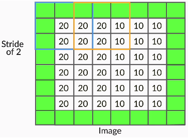

- Notation: Padding of 'x' means that 'x units' of rows/columns are added all around the image.

- An alternate (less commonly used) way to do convolution is to shrink the filter size as you hit the edges. 

- You may have noticed that when you convolve an image without padding (using any filter size), the output size is smaller than the image (i.e. the output 'shrinks'). For example. when you convolve a (6, 6) image with a (3, 3) filter and stride of 1, you get an output of (4, 4). 

- If you want to maintain the same size, you can use padding.

- Doing convolutions without padding reduces the output size. 
- It is important to note that only the width and height decrease (not the depth) when you convolve without padding. The depth of the output depends on the number of filters used 

### Why Padding is Necessary
- Doing convolutions without padding will 'shrink' the output. 
- For example, convolving a (6, 6) image with a (3, 3) filter and stride of 1 gives a (4, 4) output. 
- Further, convolving the (4, 4) output with a (3, 3) filter will give a (2, 2) output. 
- The size has reduced from (6, 6) to (2, 2) in just two convolutions. 
- Large CNNs have tens (or even hundreds) of such convolutional layers (recall VGGNet), so we will be incurring massive 'information loss' as we build deeper networks!
- This is one of the main reasons padding is important - it helps maintain the size of the output arrays and avoid information loss. 
- Of course, in many layers, you actually want to shrink the output (as shown below), but in many others, you maintain the size of the output.

# Questions
**Given an image of size (n, n), a kernel of size (3, 3), no padding, and a stride length of 1, the output size will be**
- (n-2, n-2)
- Try convolving (3, 3), (4, 4), (5, 5) etc. images - you will note a pattern. In general, an (n, n) image will produce an (n-2, n-2) output on convolving with a (3, 3) filter.

---

**Given an image of size 5x5, filter size 3x3, stride 2, what is the padding required (on either side) to make the output size same as input size?**
- 3 pixels of padding is required around each edge of the image to make the output size the same as the image size. 

---

**You saw that doing convolutions without padding reduces the output size (relative to the input which is being convolved). The main reason this is not always beneficial is that:**
- There will be heavy loss of information (especially in deep networks) if all the convolutional layers reduce the output size
- If all the layers keep shrinking the output size, by the time the information flows towards the end of the network, the output would have reduced to a very small size (say 2 x 2) - which will be insufficient to store information for complex tasks.

---

**Very often, you want to maintain the output size after convolution, i.e. if you have an (n, n) input, you want the output to be of size (n, n) as well. A general strategy to achieve this is:**

- Use padding of 1 pixel (on both sides), a (3, 3) filter, and stride length 1
- The output size is $\frac{n+2p+k}{s}+1$
- With p=1, k=3, s=1, the output will always be (n, n)

## Output Size of Convolved Image
- Image  - n x n
- Filter - k x k
- Padding - P
- Stride - S
Size of convolved image =  $(\frac{n+2P-k}{S}+1), (\frac{n+2P-k}{S}+1)$

# Questions
**Given an input image of size 224x224, a filter of size 5x5 and padding of 3, what are the possible values of stride S?**

| Option | Yes/No |
|--------|--------|
| 1      | Yes    |
| 2      | No     |
| 3      | Yes    |
| 4      | No     |

- (n+2P-k) should be divisible by stride 's'. So, (224+ 2x3 - 5) = 225. should be divisible by any possible values.  

---

**Given an input image of size 224x224, a filter of size 5x5 and stride of 2, what are the possible values of padding?**

- Not possible
- (n+2P-k) should be divisible by stride 's'. So, (224 + 2xPadding-5) should be divisible by 2. This is not possible for any value of padding. 

---

**Doing convolution without padding (assume that you are using a normal convolution with a k x k filter, where k>1, without shrinking it towards the edges etc.):**
- Always reduces the size of the output
- Doing convolutions without padding always reduces the output size. You can see that from the formula as well: (n - k)/s will be less than n for all positive values of k >1.

## Convolution in Color
- So far, we have been doing convolutions only on 2D arrays (images), say of size $6\times 6$. But most real images are coloured (RGB) images and are 3D arrays of size m x n x 3. Generally, we represent an image as a 3D matrix of size height x width x channels.
- To convolve such images, we simply use 3D filters. The basic idea of convolution is still the same - we take the element-wise product and sum up the values. The only difference is that now the filters will be 3-dimensional, For example: 3 x 3 x 3, or 5 x 5 x 3 (the last '3' represents the fact that the filter has as many channels as the image). 
- We use 3D filters to perform convolution on 3D images. For example: if we have an image of size (224, 224, 3), we can use filters of sizes (3, 3, 3), (5, 5, 3), (7, 7, 3) etc. (with appropriate padding etc.). We can use a filter of any size as long as the number of channels in the filter is the same as that in the input image.
- The filters are learnt during training (i.e. during backpropagation). Hence, the individual values of the filters are often called the weights of a CNN.
- Suppose we have an RGB image and a (2, 2, 3) filter as shown below. The filter has three channels, and each channel of the filter convolves the corresponding channel of the image. Thus, each step in the convolution involves the element-wise multiplication of 12 pairs of numbers and adding the resultant products to get a single scalar output.

  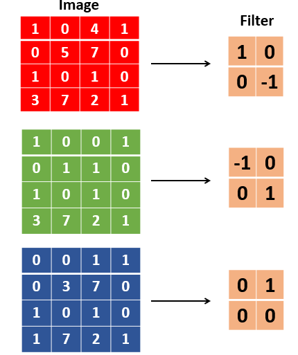
  - channels in image and their corresponding Filter

- The GIF below shows the convolution operation - note that in each step, a single scalar number is generated, and at the end of the convolution, a 2D array is generated:

  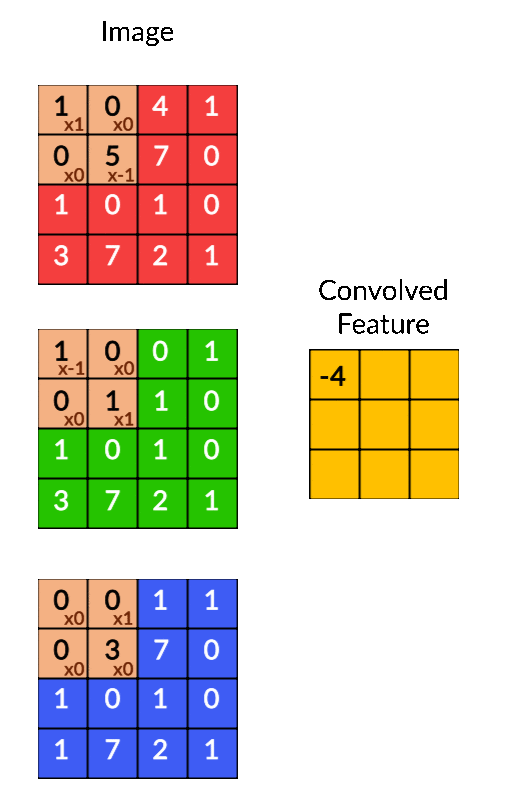

You can express the convolution operation as a dot product between the weights and the input image. If you treat the (2, 2, 3) filter as a vector $\vec w$ of length 12, and the 12 corresponding elements of the input image as the vector $\vec p$ (i.e. both unrolled to a 1D vector), each step of the convolution is simply the dot product of $w^T$ and $p$. The dot product is computed at every patch to get a (3, 3) output array, as shown above.

## Bias
- Apart from the weights, each filter can also have a bias. 
- In this case, the output of the convolutional operation is a (3, 3) array (or a vector of length 9). 
- So, the bias will be a vector of length 9. 
- However, a common practice in CNNs is that all the individual elements in the bias vector have the same value (called tied biases). 
- For example, a tied bias for the filter shown above can be represented as:

$w^T.x + b = \begin{bmatrix}
\sum w^T.p_{11}&\sum w^T.p_{12}&\sum w^T.p_{13}\\
\sum w^T.p_{21}&\sum w^T.p_{22}&\sum w^T.p_{23}\\
\sum w^T.p_{31}&\sum w^T.p_{32}&\sum w^T.p_{33}
\end{bmatrix} 
+ 
\begin{bmatrix}
b&b&b\\
b&b&b\\
b&b&b
\end{bmatrix}$

The other way is to use untied biases where all the elements in the bias vector are different, i.e. $b_{11}, b_{12}, \ldots, b_{mn}$, but that is much less common than using tied biases.

# Questions
**Given an image of size 128 x 128 x 3, a stride length of 1, padding of 1, and a kernel of size 3x3x3, what will be the output size?**
- $128\times 128$
- Though the input and filter are now 3D, the output of convolution will still be a 2D array. This is because, in each step of the convolution, the 9 elements of the filter will be 'dot product-ed' with the 9 elements of the 3D image, giving a single scalar number as the output.

---

**Suppose you train the same network (i.e. the same architecture) for two different multiclass classification problems (such as classification of mammals and classification of flowers). Will the two resultant sets of weights be the same?**
- Weights will be different since each network will learn weights which are appropriate for the respective classification task.

**What is the total number of trainable weights in a kernel/filter of size 3x3x3? Assume there are no biases.**
- 27
- There are 27 weights in a (3, 3, 3) filter, which are all learnt during training.

---

**What is the total number of trainable parameters in a kernel/filter of size 3x3x3? Assume that there is a single tied bias associated with the filter.**
- 28
- There are 27 weights and one bias in the (3, 3, 3) filter.

**Given an image of size 3x3 and a kernel of size 3x3, what will be the total number of multiplication and addition operations in convolution? Assume there is no padding and there are no biases (only weights). If there are m multiplication and n addition operations, the answer will be m+n.**
- There will be 3x3 multiplication operations and (3x3-1) addition operations (you need n-1 addition operations to add n numbers).

---

**Given an image of size 3x3x3, a kernel of size 3x3x3, padding of 1, and stride length of 1, what will be the total number of multiplication and addition operations in the convolution? Assume there are no biases (only weights). If there are m multiplication and n addition operations, the answer will be m+n.**
- 477
- The output will be of size (n + 2p - k + 1) = (3, 3). In each step of the convolution, the 3 x 3 x 3 filter will be dot product-ed with a 3 x 3 x 3 array. This dot product will involve 27 pair-wise multiplications and then 26 addition operations, or 27+26 = 53 total operations. Since this operation will happen for each of the 3 x 3 cells in the output, the total number of operations is 53 x 9 = 477.

---

# Feature Maps
- A neuron is basically a filter whose weights are learnt during training. For example, a (3, 3, 3) filter (or neuron) has 27 weights. Each neuron looks at a particular region in the input (i.e. its 'receptive field').
- A feature map is a collection of multiple neurons each of which looks at different regions of the input with the same weights. All neurons in a feature map extract the same feature (but from different regions of the input). It is called a 'feature map' because it is a mapping of where a certain feature is found in the image. 
- Weights for all the neurons in one feature map will be the same but bewteen feature maps the weights will be different. This is because different feature maps are extracting different features (one could be extracing edges, other could be extracting texture etc.)

The figure below shows two neurons in a feature map (the right slab) along with the regions in the input from which the neurons extract features. 

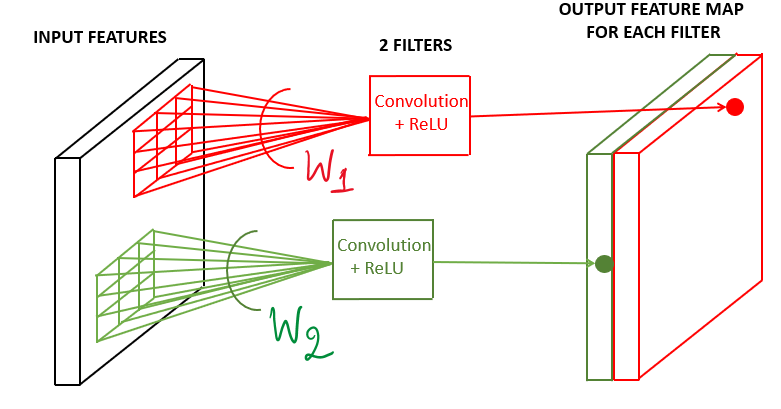

In the figure above, the two neurons produce two feature maps. You can have multiple such neurons convolve an image, each having a different set of weights, and each produces a feature map.

# Comprehension - Feature Maps
Consider the VGGNet architecture shown below. The first convolutional layer takes the input image of size (224, 224, 3), uses a (3, 3, 3) filter (with some padding), and produces an output of (224, 224). This (224, 224) output is then fed to a ReLU to generate a (224, 224) feature map. Note that the term 'feature map' refers to the (non-linear) output of the activation function, not what goes into the activation function (i.e. the output of the convolution).

Similarly, multiple other (224, 224) feature maps are generated using different (3, 3, 3) filters. In the case of VGGNet, 64 feature maps of size (224, 224) are generated, which are denoted in the figure below as the tensor 224 x 224 x 64. Each of the 64 feature maps try to identify certain features (such as edges, textures etc.) in the (224, 224, 3) input image.

The (224, 224, 64) tensor is the output of the first convolutional layer.  In other words, the first convolutional layer consists of 64 (3, 3, 3) filters, and hence contains 64 x 27 trainable weights (assuming there are no biases).
 
The 64 feature maps, or the (224, 224, 64) tensor, is then fed to a pooling layer. You will study the pooling layer in the next segment.

# Questions
**If we use 32 filters (or kernels) of size 3x3x3 to convolve an image of size 128x128x3, how many feature maps will be created after the convolution?**
- We have already seen that each kernel of 3x3x3 will produce 1 feature map on an input of size 224x224x3. With 32 kernels, we will get 32 feature maps.

---

**Given an image of size 128x128x3, a stride of 1, padding of 1, what will be the size of the output if we use 32 kernels of size 3x3x3?**
- $128\times 128\times 32$
- Each filter will produce a feature map of size 128x128 (with stride and padding of 1).  Thus, 32  filters will produce 32 feature maps of size 128x128.
- Each filter will produce a feature map of size 128x128 (with stride and padding of 1).  Thus, 32  filters will produce 32 feature maps of size 128x128.

---

**Given an image of size 128x128x3, a stride of 1, zero padding, what will be the size of the output if we use 32 kernels of size 3x3x3?**
- The output of one kernel will be (128 - 3 +1) = 126 x 126, and thus, the output of 32 kernels will be 126 x 126 x 32.

---

**FIll in the blank: The values in a feature map are ____ related to the weights of the filter generating the map.**

- Non-linearly
- Feature map is the output from the activation function, which is usually non-linear (such as ReLU). That is, for a patch vector p and weight vector w, the values in the feature map will be $f(w^T.p)$ where $f$ is a non-linear activation function.

# Pooling
- Role of a individual pixel is not clear w.r.t to the larger image (other than basic things like intensity & color)
- The strength of the response (of the retinal neurons) is proportional to the summation over the excitatory region. 
- After extracting features (as feature maps), CNNs typically aggregate these features using the pooling layer. 
- Pooling tries to figure out whether a particular region in the image has the feature we are interested in or not. It essentially looks at larger regions (having multiple patches) of the image and captures an aggregate statistic (max, average etc.) of each region. In other words, it makes the network invariant to local transformations.
- Examples of local transformations: face location is different, eyes are closed vs open, smiling vs frowning etc.
- It reduces the height and width of each feature map, but the number of feature maps remains constant.
- Pooling has the advantage of making the representation more compact by reducing the spatial size (height and width) of the feature maps, thereby reducing the number of parameters to be learnt. 
- On the other hand, it also loses a lot of information, which is often considered a potential disadvantage. Having said that, pooling has empirically proven to improve the performance of most deep CNNs.
- Capsule networks were designed to address some of these potential drawbacks of the conventional CNN architecture.

The two most popular aggregate functions used in pooling are 'max' and 'average'. The intuition behind these are as follows:

- Max pooling: If any one of the patches says something strongly about the presence of a certain feature, then the pooling layer counts that feature as 'detected'.

  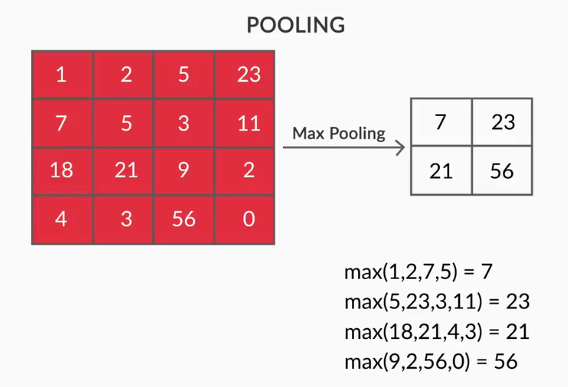

- Average pooling: If one patch says something very firmly but the other ones disagree,  the pooling layer takes the average to find out.

# Questions

**Which of the following statements related to pooling are correct?**

| Option                                                                                                                 | True / False |
|------------------------------------------------------------------------------------------------------------------------|--------------|
| It makes the network invariant to local transformations.                                                               | True         |
| It makes the representation of the feature map more compact, thereby reducing the number of parameters in the network. | True         |
| It reduces the width, height and depth of the input.                                                                   | False        |
| It reduces only the width and the height.                                                                              | True         |

- Since it takes an average, max or some other operation over group of pixel, it does not look at an individual pixel, making network invariant to local transformation.  
- It decreases the height and width, which reduces the number of parameters in a feature map. 

---

**How many trainable parameters are there in the pooling layer?**
- Zero
- There are no parameters in pooling. The pooling layer just computes the aggregate of the input. For e.g. in max pooling, it takes max over group of pixels. We do not need to adjust any parameter to take max. 

---

**Find the output of the 'average pooling' in the following matrix X with a stride length of 2.**

$X = \begin{bmatrix}
1&6&12&9\\
3&9&0&5\\
3&5&1&7\\
6&4&0&1
\end{bmatrix}$

- Output of Average Pooling: $\begin{bmatrix}
4.75&6.5\\
4.5&2.25
\end{bmatrix}$

# CNN Unit

To summarise, a typical CNN layer (or unit) involves the following two components in sequence:
- We start with an original image and do convolutions using multiple filters to get multiple feature maps.
- A pooling layer takes the statistical aggregate of the feature maps

# Deep CNNs
Typically, deep CNNs have multiple such CNN units (i.e. feature map-pooling pairs) arranged sequentially. 

To summarise, a typical CNN has the following sequence of CNN layers:

- We have an input image which is convolved using multiple filters to create multiple feature maps
- Each feature map, of size (c, c), is pooled to generate a (c/2, c/2) output (for a standard 2 x 2 pooling). 
- The above pattern is called a CNN layer or unit. Multiple such CNN layers are stacked on top of one another to create deep CNN networks.

Note that pooling reduces only the height and the width of a feature map, not the depth (i.e. the number of channels). For example, if you have m feature maps each of size (c, c), the pooling operation will produce m outputs each of size (c/2, c/2).

# Questions
**Given an input of size 224x224x3 and stride of 2 and filter size of 2x2, what will be the output after the pooling operation?**
- 112x112x3

---

**What does a typical CNN 'unit' (also called a CNN 'layer') comprise of?**
- A collection of feature maps followed by a pooling operation
- What we refer to as a CNN layer or unit is a collection of m feature maps each of which is pooled to generate m outputs. Typically, the output of pooling reduces the size to half, since the most common form of pooling is with a stride of 2.

---

**In a typical deep CNN, the size of each subsequent feature map reduces with the depth of the network. The size reduction is typically done in two ways  - 1) convolution without padding or 2) by pooling.**

**What is the main reason we prefer a lower dimensional output of an image from the network?**

- We want a compact representation of the image as the output, one which preferably captures only the useful features in the image
- The reason we want a compact representation of the image is to get rid of all the redundancies in the image. For e.g. all the 224 x 224 x 3 pixels may not be required to do a classification or object detection task, just a smaller vector (say of length 5000) may be enough.

# Summary
We learnt the basics of convolutional neural networks and their common applications in computer vision such as image classification, object detection, etc. You also learnt that CNNs are not limited to images but can be extended to videos, text, audio etc. 

The design of CNNs uses many observations from the animal visual system, such as each retinal neuron looks at its own (identical) receptive field, some neurons respond proportionally to the summation over excitatory regions (pooling), the images are perceived in a hierarchical manner, etc.

You learned that images are naturally represented in the form of arrays of numbers. Greyscale images have a single channel while colour images have three channels (Red Green Blue). The number of channels or the 'depth' of the image can vary depending on how we represent the image. Each channel of a pixel, usually between 0-255, indicates the 'intensity' of a certain colour.

You saw that specialised filters, or kernels can be designed to extract specific features from an image (such as vertical edges). A filter convolves an image and extracts features from each 'patch'. Multiple filters are used to extract different features from the image. Convolutions can be done using various strides and paddings.

The formula to calculate the output shape after convolution is given by:

$\displaystyle (\frac{n+2P-k}{S}+1), (\frac{n+2P-k}{S}+1)$, where
- The image is of size n x n
- The filter is k x k
- Padding is P
- Stride is S

The filters are learned during training (backpropagation). Each filter (consisting of weights and biases) is called a neuron. Multiple neurons are used to convolve an image (or feature maps from the previous layers) to generate new feature maps.  The feature maps contain the output of convolution + non-linear activation operations on the input. 

A typical CNN unit (or layer) in a large CNN-based network comprises multiple filters (or neurons), followed by non-linear activations, and then a pooling layer. The pooling layer computes a statistical aggregate (max, sum etc.) over various regions of the input and reduces sensitivity to minor, local variations in the image.  Multiple such CNN units are stacked together, finally followed by some fully connected layers, to form deep convolutional networks.

# Questions
**What is the range of possible values of each channel of a pixel if we represent each pixel with 5 bits?**
- Since we are representing each pixel by 5 bits, the total pixels will be 2^5 = 32. So the range is 0-31

---

**Suppose we want to take the average over a (3, 3) patch in an image using a filter. Can you represent the 'average filter'?**
- $\frac{1}{9}\begin{bmatrix}
1&1&1\\
1&1&1\\
1&1&1
\end{bmatrix}$
- The convolution operation in this case should produce an expression like 1/n(x1+x2+x3...xn). In this case 1/n = 1/9 which is the correct factor as the average of 9 numbers will be computed by this filter at one time. Also since all the entries are 1, the convolution operation of this filter over a patch of 9*9 input will produce the sum of 9 numbers.

---

**Suppose we convolve an image X of size 4x4 with filter Y. We use 'zero-padding' of 1 (i.e. adding zeros around each edge of the image) and a stride length of 1. Find the output of the convolution X*Y.**

$X = \begin{bmatrix}
1&0&0&1\\
-1&2&1&0\\
0&1&0&0\\
0&0&1&-3
\end{bmatrix}, Y = \begin{bmatrix}
0&1&0\\
0&0&0\\
0&1&0
\end{bmatrix}$

- $\begin{bmatrix}
-1&2&1&0\\
1&1&0&1\\
-1&2&2&-3\\
0&1&0&0
\end{bmatrix}$

---

**Which layers contain trainable parameters in CNN?**
- The pooling layer does not contain any trainable parameters, Convolution and fully connected layers do. 
- We learn the value of those parameters during backpropagation. 
- Since pooling is just taking aggregate, there are no parameters involved in it. 
- Say, we want to take an average of 4 numbers, we will just do (1/4) ( 4 numbers). 
- There are no parameters that need to be learned.  
- Fully connected layer obviously has weights, we already know that from multilayer perceptron. 

---

**What are some properties of filters?**
- If a filter is extracting a particular feature at one spatial location (x,y), it must be extracting the same feature at some other spatial location (x2,y2).
- Multiple different filters extract a variety of features from the same patch in an image.

---

**What is the advantage of padding other than to keep the spatial dimension (width and height) of the output constant?**
- If we don’t do padding then the information at the borders would be “washed away” too quickly.
- Padding helps to preserve the information at the edges, otherwise, the convolution operation would extract information only from the central regions of the image. 

---

**Which of the following statements related to pooling are correct? More than one options may be correct.**

| Statement                                                                                                                                              | True / False |
|--------------------------------------------------------------------------------------------------------------------------------------------------------|--------------|
| Pooling reduces the width and height of the output, thereby reducing the number of parameters and the amount of computation being done in the network. | True         |
| Since it reduces the number of parameters in the network, it also helps control overfitting.                                                           | True         |
| Pooling does not help control overfitting.                                                                                                             | False        |
| Pooling makes the network invariant to certain local transformations.                                                                                  | True         |

- Pooling reduces the width and height, thereby reducing the number of parameters and the amount of computation (since with less number of parameters there will be fewer computations involved in feedforward/backpropagation etc.). 
- Pooling reduces the number of parameters and computation, it also controls overfitting.
- Since pooling takes a statistical aggregate over multiple regions of an image, it makes the network invariant to 'local transformations' (such as the face being tilted a little, or an object being located in a different region than what the training data had seen).

# References
- [Research Paper - Receptive field for single neurons in the cat's striate cortex](https://www.ncbi.nlm.nih.gov/pmc/articles/PMC1363130/pdf/jphysiol01298-0128.pdf)
- [Deep Learning - Cheatsheet](https://stanford.edu/~shervine/teaching/cs-229/cheatsheet-deep-learning)
- [Deep Learning - Stanford](https://stanford.edu/~shervine/teaching/cs-230/)
- [CNN Explained](https://towardsdatascience.com/convolutional-neural-networks-explained-9cc5188c4939)
- [Capsule Networks](http://arxiv.org/pdf/1710.09829.pdf)
