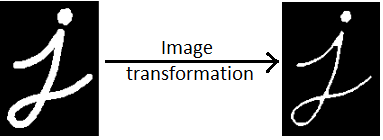
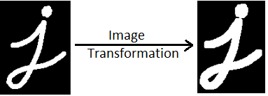
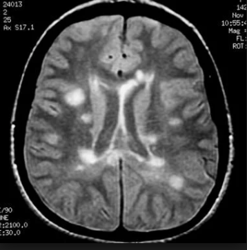
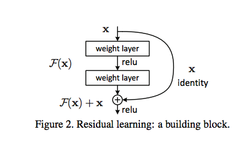
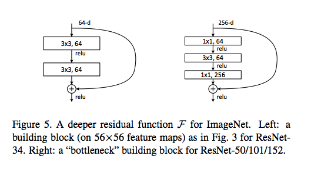

<!-- vim-markdown-toc GFM -->

* [Neural networks in industry applications](#neural-networks-in-industry-applications)
* [Data Preprocessing: Shape, Size and Form](#data-preprocessing-shape-size-and-form)
  * [Images - Channels and sizes](#images---channels-and-sizes)
    * [Question](#question)
  * [Images - Transformations](#images---transformations)
    * [Morphological Transformations](#morphological-transformations)
      * [Thresholding](#thresholding)
      * [Erosion and Dilation](#erosion-and-dilation)
      * [Opening and Closing](#opening-and-closing)
    * [Questions](#questions)
* [Normalization](#normalization)
  * [Why Normalisation](#why-normalisation)
  * [Outliers](#outliers)
    * [Question](#question-1)
* [Augmentation](#augmentation)
  * [Reasons](#reasons)
  * [Types of Augmentation](#types-of-augmentation)
    * [Linear transformations](#linear-transformations)
    * [Affine transformations](#affine-transformations)
    * [Questions](#questions-1)
* [Resnet](#resnet)
* [Ablation](#ablation)
* [Overfitting](#overfitting)
* [Reasons why learning may not happen](#reasons-why-learning-may-not-happen)
    * [Question](#question-2)
* [Hyperparameter Tuning](#hyperparameter-tuning)
  * [Parameters to tune](#parameters-to-tune)
* [Summary](#summary)
  * [Data preprocessing](#data-preprocessing)
  * [Network building](#network-building)
    * [Questions](#questions-2)
* [Weighted cross-entropy](#weighted-cross-entropy)
* [References](#references)

<!-- vim-markdown-toc -->


# Neural networks in industry applications
Neural Networks have changed the face of image processing in the industry.

# Data Preprocessing: Shape, Size and Form

## Images - Channels and sizes
- Images come in different shapes and sizes. 
- They also come through different sources. 
- For example, some images are what we call “natural images”, which means they are taken in colour, in the real world. For example:
  - A picture of a flower is a natural image.
  - An X-ray image is not a natural image
- Taking all these variations into consideration, we need to perform some pre-processing on any image data.
- RGB is the most popular encoding format, and most "natural images" we encounter are in RGB.
- Also, among the first step of data pre-processing is to make the images of the same size. 

### Question
**In `imshow(:, :, c)`, what does `c` stand for?**
- Channel ID
- 0 for Red, 1 for Green, 2 for Blue

## Images - Transformations
### Morphological Transformations
 The term morphological transformation refers to any modification involving the shape and form of the images. These are very often used in image analysis tasks. Although they are used with all types of images, they are especially powerful for images that are not natural (come from a source other than a picture of the real world).

#### Thresholding
- Converting RGB image into greyscale
- Set threshold, intensity above is 1, intensity below is 0

#### Erosion and Dilation
**Erosion** shrinks bright regions and enlarges dark regions. **Dilation** on the other hand is exact opposite side - it shrinks dark regions and enlarges the bright regions. 

#### Opening and Closing
**Opening** is erosion followed by dilation. Opening can remove small bright spots (i.e. “salt”) and connect small dark cracks. This tends to “open” up (dark) gaps between (bright) features.

**Closing** is dilation followed by erosion. Closing can remove small dark spots (i.e. “pepper”) and connect small bright cracks. This tends to “close” up (dark) gaps between (bright) features.

All these can be done using the `skimage.morphology` module in Python. The basic idea is to have a **circular disk** of a certain size move around the image and apply these transformations using it.

In Python, Morphological transformations are applied using the basic structuring element called 'disk'.  A disk is defined with the code: 

```py heading="Morph"
# bin_image will be a (240, 320) True/False array
bin_image = image[:, :, 0] > 125
plot_image([image, bin_image], cmap='gray')


from skimage.morphology import binary_closing, binary_dilation, binary_erosion, binary_opening
from skimage.morphology import selem

# use a disk of radius 3
selem = selem.disk(3)

# oprning and closing
open_img = binary_opening(bin_image, selem)
close_img = binary_closing(bin_image, selem)

# erosion and dilation
eroded_img = binary_erosion(bin_image, selem)
dilated_img = binary_dilation(bin_image, selem)

plot_image([bin_image, open_img, close_img, eroded_img, dilated_img], cmap='gray')

```

### Questions

| Statement                                                | True / False |
|----------------------------------------------------------|--------------|
| Most natural images come in 2 channels                   | False        |
| Some images can be in only 1 channel                     | True         |
| RGB is the only encoding of images that exists           | False        |
| Image sizes don't matter while training a neural network | False        |

- 1 channel images: A prominent example is black-and-white images.
- Image sizes define input sizes of neural networks

**Which between opening and closing will remove dark spots?**
- Closing removes dark spots by performing Dilation followed by Erosion!

**Which between Dilation and Erosion will remove black spots?**
- Dilation shrinks dark spots, enlarges bright spots

**Identifying the technique used**


- Erosion shrinks bright spots, enlarges dark spots. 
- You can see that the width of the alphabet 'j' has been reduced.


- Dilation shrinks dark spots, enlarges bright spots.
- You can see that the width of the alphabet 'j' has been increased.

**Given below is the X-ray image of the brain. Which of the following transformations you will use to remove just the outer skull keeping the dimension of the brain same.**


- Here, Opening will be used. 
- First, erosion will be used to remove the white skull portion. 
- But this will also shrink the size of the brain. 
- To make the dimension of the brain same, dilation will be used.

# Normalization
- Normalisation makes the training process much smoother. 
- In backpropagation, the gradients are (directly or indirectly) related to the derivatives $f'(x)$ where $f$ is the activation function. In any activation function, if the value is too large, the gradient will be close to zero, and the weight updates cannot happen in the right direction.

## Why Normalisation
- Contrast and Lighting conditions: We need to account for variation in pictures, or different settings of machines taking images.
- Gradient Propagation: Normalized images make for much better gradient propagation

## Outliers
- To handle outliers, it is better to normalize using some percentile ranges rather than bounding by max and min otherwise the data might scale to small range between 0 to 0.1 while we ideally want it to be between 0 and 1.

```py heading="Normalization"
norm1_image = image/255 # works well with RGB images
norm2_image = (image - np.min(image))/(np.max(image) - np.min(image))
norm3_image = (image - np.percentile(image,5))/ (np.percentile(image,95) - np.percentile(image,5))

plot_image([image, norm1_image, norm2_image, norm3_image], cmap='gray')
```

### Question

**In which case should we go for max/min normalization instead of dividing by 255?**

- It finds better application in non-natural images
- Non-natural images are usually specific to the range of the values that they lie between - dividing by 255 distorts the data of this image (e.g. some MRI regions have pixels that never reach 255, and hence 255 is an arbitrary value.)

**Which between (0 to 1)  and (-1 to 1) is a more suitable range for input data in the case we use a neural network with ReLU activation?**
- 0 to 1 range is preferred in the case we use a neural network with ReLU activation as it discards the data below the value 0. 

**Which of the following are the suitable transformations in the case you have outliers in the input data?**

| Statement                                        | True / False |
|--------------------------------------------------|--------------|
| $\frac{(x-x_{min})}{x_{max}-x_{min}}$            | False        |
| $\frac{(x-x_{mean})}{\text{standard deviation}}$ | True         |
| $\frac{(x-x_{percentile(5)})}{x_{max}-x_{min}}$  | True         |

- Since we have outliers, we can normalize it by dividing it by percentile. 
- It is not preferred to take the difference between the max and min for the division as those values can take extreme values when compared to normal data points.  
- Percentile has to be selected such that the outliers are removed.  

# Augmentation
## Reasons
- Many times, the quantity of data that we have is not sufficient to perform the task of classification well enough. In such cases, we perform data augmentation.
  - As an example, if we are working with a dataset of classifying gemstones into their different types, we may not have enough number of images (since high-quality images are difficult to obtain). In this case, we can perform augmentation to increase the size of your dataset.
- Tackling Overfitting
  - scenario: If there is bright spot in center it is a rose, else it's a daisy. If we use augmentation, such kind of memorization can be avoided. If angle is different, it is still a rose.

- As you know that pooling increases the invariance. 
- If a picture of a dog is in the top left corner of an image, with pooling, you would be able to recognise if the dog is in little bit left/right/up/down around the top left corner. 
- But with training data consisting of data augmentation like flipping, rotation, cropping, translation, illumination, scaling, adding noise etc., the model learns all these variations. 
- This significantly boosts the accuracy of the model. 
- So, even if the dog is there at any corner of the image, the model will be able to recognise it with high accuracy

## Types of Augmentation
### Linear transformations
- multiply image with transformation matrix to get transformed image
- rotation
- flipping (vertical/horizontal)

```py heading="Linear Transformations"
from skimage import transform

# flip left-right, up-down
image_flipr = np.fliplr(image)
image_flipud = np.flipud(image)
```

### Affine transformations
- translations followed by linear transformation
- Suppose you want to rotate an image, you probably don't want to rotate about the top-left or bottom-left corner (where the origin generally is), but rather the center of the image. 
- Hence, first we will translate the origin to center, apply transformation, and then translate origin bacak to the original point.


```py heading="Affine"
shift_x, shift_y = image.shape[0]/2, image.shape[1]/2

# translation by certain units
matrix_to_topleft = transform.SimilarityTransform(translation=[-shift_x, -shift_y])
matrix_to_center = transform.SimilarityTransform(translation=[shift_x, shift_y])

# rotation
rot_transforms =  transform.AffineTransform(rotation=np.deg2rad(45))
rot_matrix = matrix_to_topleft + rot_transforms + matrix_to_center
rot_image = transform.warp(image, rot_matrix)

# scaling 
scale_transforms = transform.AffineTransform(scale=(2, 2))
scale_matrix = matrix_to_topleft + scale_transforms + matrix_to_center
scale_image_zoom_out = transform.warp(image, scale_matrix)

scale_transforms = transform.AffineTransform(scale=(0.5, 0.5))
scale_matrix = matrix_to_topleft + scale_transforms + matrix_to_center
scale_image_zoom_in = transform.warp(image, scale_matrix)

# translation
transaltion_transforms = transform.AffineTransform(translation=(5
```

```py heading="Shear"
# shear transforms
shear_transforms = transform.AffineTransform(shear=np.deg2rad(45))
shear_matrix = matrix_to_topleft + shear_transforms + matrix_to_center
shear_image = transform.warp(image, shear_matrix)

bright_jitter = image*0.999 + np.zeros_like(image)*0.001
```

- Note: Not all transformations are applicable to all images. Example chest x-ray can't have upside down flip. This choice is based on practical experience.

### Questions

**Where augmentation will not be used?**

| Statement                    | True / False |
|------------------------------|--------------|
| Increasing speed of training | True         |
| Lesser training data         | False        |
| Tackling overfitting         | False        |


**Which statements are True?**

| Statement                                                                                                     | True / False |
|---------------------------------------------------------------------------------------------------------------|--------------|
| More the training data, more effective the model                                                              | True         |
| Even if the data is of lower quality, data augmentation can boost the effectiveness of the model              | True         |
| Data augmentation reduces overfitting                                                                         | True         |
| Some of the data augmentation techniques are rotation, flipping, blurring, random cropping, shifting, zooming | True         |


**Suppose a city is hit by a cyclone and the insurance company wants to estimate the damage. They want to automate this process and gives you images of the houses captured by drones. Which of the following data augmentation technique you will apply while training a CNN model?**

| Technique    | True / False |
|--------------|--------------|
| Rotation     | False        |
| Translation  | True         |
| Flipping     | False        |
| Illumination | True         |


# Resnet
- The ResNet team argued that a net with $n + 1$ layers should perform at least as good as the one with $n$ layers. 
- This is because even if the additional layer simply lets the input pass through it (i.e. acts as an identity function $f(x) = x$), it will perform identically to the n-layered network. 
- In Resnet, instead of estimating $H(x)$, we estimate the residue $F(x) = H(x) - x$
- In extreme case if the unit simply lets the signal pass-through (i.e. $H(x) = x$) it would easier to push $F(x)$ to zero than to learn $H(x)$
- The units are therefore called "Residular Units"
- This facilitates "skip connections" or "shortcut connections"
- The connections don't add any extra parameter or complexity to the network, they simply add the input to the residual
- Resnet enabled very deep networks




- [Intuiton for bottleneck units](https://stats.stackexchange.com/questions/347280/regarding-the-understanding-of-bottleneck-unit-of-resnet)

# Ablation
- Before training the net on the entire dataset, you should always try to first run some experiments to check whether the net is fitting on a small dataset or not.
- Ablation run refers to a process where you take a small subset of your data, and try to build your model on it. Broadly, an ablation study is where you systematically remove parts of the input to see which parts of the input are relevant to the networks output.

# Overfitting
- Overfitting tell us that whether the network is capable of learning the patterns in the training set.
- A good test of any model is to check whether it can overfit on the training data (i.e. the training loss consistently reduces along epochs). 
- This technique is especially useful in deep learning because most deep learning models are trained on large datasets, and if they are unable to overfit a small version, then they are unlikely to learn from the larger version.

# Reasons why learning may not happen
1. Activation function not good enough
2. Learning rate not optimised
3. SGD Optimiser not used
4. Initialisation not done correctly
5. Problem with network architecture

- During training, sometimes you may get NaN as a loss instead of some finite number. This denotes that the output value predicted by the model is very high, which results in high loss value. This causes exploding gradient problem. 
- The problem could be a high learning rate and to overcome, you can use SGD Optimiser. 
- Although the adaptive methods (Adam, RMSProp etc.) have better training performance, they can generalise worse than SGD. 
- Furthermore, you can also play with some of the initialisation techniques like Xavier initialisation, He initialisation etc. and change the architecture of the network if the problem does not get solved. 

### Question

**Which activation is preferred in Deep Learning Architecture?**
- ReLU is preferred because it does not suffer from the issue of gradient explosion.

# Hyperparameter Tuning
The basic idea is to track the validation loss with increasing epochs for various values of a hyperparameter.

## Parameters to tune
- Learning Rate & Variation + Optimisers
  - You know that using a high learning rate such as $0.1$ for the entire training process is not a good idea since the loss may start to oscillate around the minima later. 
  - So, at the start of the training, we use a high learning rate for the model to learn fast, but as we train further and proceed towards the minima, we decrease the learning rate gradually. 
- Augmentation Techniques

# Summary

## Data preprocessing
- Morphological Transformations: This refers to changing the shape and size of images. The typical transformations are erosion, dilation, opening and closing. 
- Augmentation: Refers to making changes related to rotation, translation, shearing, etc. Augmentation is often used in image-based deep learning tasks to increase the amount and variance of training data. Augmentation should only be done on the training set, never on the validation set.
- Normalisation: Refers to rescaling the pixel values so that they lie within a confined range. One of the reasons to do this is to help with the issue of propagating gradients.

## Network building
- Choosing the architecture: The biggest of resnet is that the 'skip connections' mechanism allows very deep networks.
- Ablation Experiments: These refer to taking a small chunk of data and running your model on it - this helps in figuring out if the model is running at all.
- Overfitting on Training Data: This tells you whether the model is behaving as expected or not.
- Metrics: Depending on the situation, we choose the appropriate metrics. For binary classification problems, AUC is usually the best metric.
- Hyperparameter tuning: We tune hyperparameters such as the learning rate, augmentation of images, batch size, etc. Also, we only change the architecture of the network if we have already tried tuning all other hyperparameters.

### Questions

**Suppose you have data containing parameters of an engine of a vehicle and the company wants to predict whether the engine is good or faulty using some machine learning model. Some parameter of the faulty engine can also take extreme values. Given that you normalise the data before training, which normalisation technique you will use?**
- Subtract the percentile with a particular value from the parameters of the engine and then divide by difference of maximum and minimum percentile of the parameter. 

**Suppose that you have been given the task to identify posture of a person, whether the person is standing, sitting, bending at an angle of 30 degrees to the left or bending at an angle of 30 degrees to the right, If you are using data augmentation to increase the volume of data, which among "translation, flipping, zoom in/out and illumination" you will not apply?**
- Cannot do flipping as the model has to identify bending at an angle of 30 degrees to the left and bending at an angle of 30 degrees to the right differently. 

**Why do we prefer a gradual decrease in learning rate from a high value to low value during training?**
- If the decay rate is slow, a lot of time will be wasted bouncing around with little improvement in the loss. 
- If the decay rate is too high, the learning rate will decay soon to very less value and unable to reach best minima. 

**While calculating the initial learning rate during ablation experiment, how do we calculate the gradient?**
- The gradient of loss w.r.t the epoch

# Weighted cross-entropy
- A common solution to the low prevalence rate problem is using a weighted cross-entropy loss. The loss is modified such that misclassifications of the low-prevalence class are penalised more heavily than the other class.
- Therefore, every time the model makes an error on the abnormal class (in this case, ‘effusion’), we penalise it heavily by multiplying the loss by a high value of weights. This results in an increase in loss for misclassified classes and therefore the change in weights due to backpropagation is more. So, the learning curve for the weights responsible for misclassification is more. 

Let’s say “no finding” is class 0 and “effusion” is class 1.
- bin_weights[0,0]:  Actual class: 0, Predicted class: 0, so no penalty, just normal weight of 1. 
- bin_weights[1,1]:  Actual class: 1, Predicted class: 1, so no penalty, just normal weight of 1. 

In case of abnormality: 
- bin_weights[1,0] - Actual class is 1, Predicted class is 0, penalise by weight of 5.
- bin_weights[0,1] - Actual class is 0, Predicted class is 1, penalise by weight of 5.

```py heading="Weighted Cross Entropy"
def w_categorical_crossentropy(y_true, y_pred, weights):
    nb_cl = len(weights)
    final_mask = K.zeros_like(y_pred[:, 0])
    y_pred_max = K.max(y_pred, axis=1)
    y_pred_max = K.reshape(y_pred_max, (K.shape(y_pred)[0], 1))
    y_pred_max_mat = K.cast(K.equal(y_pred, y_pred_max), K.floatx())
    for c_p, c_t in product(range(nb_cl), range(nb_cl)):
        final_mask += (weights[c_t, c_p] * y_pred_max_mat[:, c_p] * y_true[:, c_t])
    cross_ent = K.categorical_crossentropy(y_true, y_pred, from_logits=False)
    return cross_ent * final_mask
```

---

# References
- [History of the first X-ray](https://www.the-scientist.com/foundations/the-first-x-ray-1895-42279)
- [Different kinds of Scans](https://www.medicalnewstoday.com/articles/154877)
- [Transformations with OpenCV](https://docs.opencv.org/trunk/d9/d61/tutorial_py_morphological_ops.html)
- [Natural Images - Statistical Definition](https://stats.stackexchange.com/questions/25737/definition-of-natural-images-in-the-context-of-machine-learning)
- [Research Paper - Resnet Original Architure](https://arxiv.org/abs/1512.03385)
- [Research Paper - Proposed ResNet Architecture](https://arxiv.org/pdf/1603.05027.pdf)
- [Resnet - Github](https://github.com/raghakot/keras-resnet)
- [Prevent overfitting - hackernoon](https://hackernoon.com/memorizing-is-not-learning-6-tricks-to-prevent-overfitting-in-machine-learning-820b091dc42)
- [Research Paper - Comparison between optimiser](https://arxiv.org/pdf/1705.08292.pdf)
- [Keras Callbacks](https://keras.io/callbacks/)
- [Reasons for Neural Networks not performing well](https://blog.slavv.com/37-reasons-why-your-neural-network-is-not-working-4020854bd607)
- [Morphological Transformations](https://www.mathworks.com/help/images/morphological-dilation-and-erosion.html)
