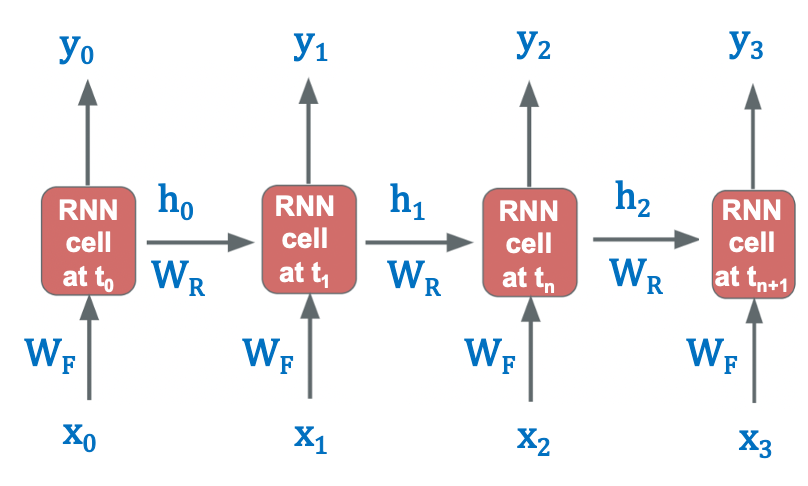

# Recurrent Neural Networks
- RNNs are specially designed to work with sequential data, i.e. data where there is a natural notion of a 'sequence' such as text (sequences of words, sentences etc.), videos (sequences of images), speech etc. 
- RNNs have been able to produce state-of-the-art results in fields such as natural language processing, computer vision, and time series analysis.
- One particular domain RNNs have revolutionised is natural language processing. 
- RNNs have given, and continue to give, state-of-the-art results in areas such as machine translation, sentiment analysis, question answering systems, speech recognition, text summarization, text generation, conversational agents, handwriting analysis and numerous other areas. 
- In computer vision, RNNs are being used in tandem with CNNs in applications such as image and video processing.
- Many RNN-based applications have already penetrated consumer products. Take, for example, the auto-reply feature which you see in many chat applications, as shown below:

**LinkedIn Auto Reply**
> 

**GMail Auto Reply**
> 

You may have noticed **auto-generated subtitles on YouTube** (and that it has surprisingly good accuracy). This is an example of automatic speech recognition (ASR) which is built using RNNs.
> 

- RNNs are also being used in applications other than NLP. 
- Recently, OpenAI, a non-profit artificial intelligence research company came really close to defeating the world champions of Dota 2, a popular and complex battle arena game. 
- The game was played between a team of five bots (from OpenAI) and a team of five players (world champions). 
- The bots were trained using reinforcement learning and recurrent neural networks.
- There are various companies who are generating music using RNNs. AIVA is one such company.
- There are many other problems which are yet to be solved, and RNNs look like a promising candidate to solve them.

# What are Sequences

Just like CNNs were specially designed to process images, Recurrent Neural Networks (RNNs) are specially designed to process sequential data. 

In sequential data, entities occur in a particular order. If you break the order, you don’t have a meaningful sequence anymore. For example,
- you could have a sequence of words which makes up a document. If you jumble the words, you will end up having a nonsensical document. 
- Similarly, you could have a sequence of images which makes up a video. If you shuffle the frames, you’ll end up having a different video. 
- Likewise, you could have a piece of music which comprises of a sequence of notes. If you change the notes, you’ll mess up the melody.

Recurrent neural networks are variants of the vanilla neural networks which are tailored to learn sequential patterns.

Normal Neural Networks can approximate any given function, while Recurrent Neural Networks can simulate any given algorithm

The state of the recurrent network updates itself as it sees new elements in the sequence. This is the core idea of an RNN - it updates what it has learnt as it sees new inputs in the sequence. The 'next state' is influenced by the previous one, and so it can learn the dependence between the subsequent states which is a characteristic of sequence problems. 

# RNN Formulation

The most basic form can be expressed as:

$a_{t+1}^{(l)} = g(a_{t}^{(l)}, z_{t+1}^{(l)})$

- The main different between normal neural nets and RNNs is that RNNs have two 'dimensions' - time $t$ (i.e. along the sequence length) and the depth $l$ (the usual layers). 
- The basic notation itself changes from $a^l$ to $a^l_t$. 
- In fact, in RNNs it is somewhat incomplete to say 'the output at layer $l$'; we rather say 'the output at _layer_ $l$ and _time_ $t$'
- One way to think about RNNs is that the network changes its state with time (as it sees new words in a sentence, new frames in a video etc.). 
- The output of layer $l$ at time $t+1$, $a^l_{t+1}$, depends on two things:
  1. The output of the previous layer at the same time step $a_{t+1}^{l+1}$ (this is the _depth_ dimension).
  2. Its own previous state $a_t^l$ (this is the _time_ dimension)

In other words, $a^l_{t+1}$ is a function of $a_{t+1}^{l-1}$ and $a_t^l$:  
$a_{t+1}^{(l)} = g(a_{t}^{(l)}, z_{t+1}^{(l)})$

We say that there is a recurrent relationship between $a^l_{t+1}$ and its previous state $a^l_t$, and hence the name Recurrent Neural Networks.

The feedforward equations are extensions of the vanilla neural nets - the only difference being that now there is a weight associated with both $a_{t+1}^{l+1}\; \text{and}\; a^l_t$.

$a^l_{t+1} = \sigma(W_F.a^{l-1}_{t+1} + W_R.a^l_t + b^l)$

The $W_F$'s are called the **feedforward weights** and the $W_R$'s are called the **recurrent weights**.

# Architecture of RNN

- The green layer is the input layer in which the $x_i$'s are elements in a sequence - words of a sentence, frames of a video, etc.
- The layers in red are the 'recurrent layers' - they represent the various states evolving over time as new inputs are seen by the network.
- The blue layer is the output layer where the $y_i$'s are the outputs emitted by the network at each time step.

For example, in a parts of speech (POS) tagging task (assigning tags such as noun, verb, adjective etc. to each word in a sentence), the $yi$'s will be the POS tags of the corresponding $x_{i}$'s. 

Note that in this figure, the input and output sequences are of equal lengths, but this is not necessary. For e.g. to classify a sentence as 'positive/negative' (sentiment-wise), the output layer will emit just one label (0/1) at the end of T timesteps

You can see that the layers of an RNN are similar to the vanilla neural nets (MLPs) - each layer has some neurons and is interconnected to the previous and the next layers. The only difference is that now each layer has a copy of itself along the time dimension (the various states of a layer, shown in red colour).  Thus, the layers along the time dimension have the same number of neurons (since they represent the various states of same $l_{th}$ layer over time). 

## The flow of information in RNNs is as follows
- each layer gets the input from two directions 
  - activations from the previous layer at the current timestep and 
  - activations from the current layer at the previous timestep. 
- Similarly, the activations (outputs from each layer) go in two directions 
  - towards the next layer at the current timestep (through $W_F$), and 
  - towards the next timestep in the same layer (through $W_R$).
- The 'depth' of an RNN refers to the number of layers in the RNN
- All the timesteps at a particular layer are virtual copies of the same layer. The only difference between different timesteps at a particular layer is their state.

### Example
The inputs going into the second layer at the 8th time step are:
- $a^1_8$: output from previous layer at current timestep
- $a^2_7$: output from current layer at previous timestep

The following outputs (activations) will necessarily have the same size:
- $a^4_3, a^4_5$, $a^2_2, a^2_6$
- This is because same layers are copied over at different timesteps
- The outputs of any layer at different steps will be of exactly the same size since they basically represent the output of the same layer evolving over time.

However, the same cannot be said for 
- $a^4_3, a^3_5$, $a^2_2, a^3_6$
- Since different layers (at each depth) can have different number of neurons

## Unrolled RNN

In the diagram given below, the input $(x_t)$ and hidden state $(h_t)$ are shown at each time step t, which are changing across time steps. 
Both $x_t$ and $h_t$ have their separate weights $W_F$ and $W_R$ respectively, which remain the same for each time step as depicted by just using $W_F$ and $W_R$ at each time step. 

## Rolled RNN

# Feeding Sequences to RNNs

- In the case of an RNN, each data point is a sequence.
- The individual sequences are assumed to be independently and identically distributed (I.I.D.), though the entities within a sequence may have a dependence on each other.
- As the network keeps ingesting new elements in the sequence it updates its current state (i.e. updates its activations after consuming each element in the sequence). 
- After the sequence is finished (say after T time steps), the output from the last layer of the network $a_T^L$ captures the representation of the entire sequence. 
- You can now do whatever you want with this output - use it to classify the sentence as correct/incorrect, feed it to a regression output, etc. 
- This is exactly analogous to the way CNNs are used to learn a representation of images, and one can use those representations for a variety of tasks.

## IID Data - Independently and Identically Distributed Data

- In a sentence classification task (grammatically correct/incorrect), the individual sentences used for training are IID
- In a video classification task (contains violence/does not contain violence), the individual videos are IID

### Question

**Consider a batch of 50 sequences. Suppose you have trained an RNN model with these sequences. Let’s call this model A. Now, suppose you want to train another model B which has the exact same architecture as model A. Assume that the training is not stochastic in nature (that is, all the seed values are same while initialising the network parameters). Which of the following actions will result in a different set of weights for model B after the training is done in the exact same fashion as done in case of model A?**

| Statement                                                  | True / False |
|------------------------------------------------------------|--------------|
| Shuffling the order of entities within each sequence.      | True         |
| Shuffling the order of the sequences in the training data. | False        |

- Since entities within a sequence are dependent on each other, changing the sequence will result in a different sequence altogether. 
- This will result in the RNN learning a different representation for the sequence and model B would eventually end up having different set of weights than model A.

# Sizes of Components of RNN

# RNNs: Simplified Notations

The RNN Feedforward equations are:
- $z^t_t = W^l_Fa^{l-1}_t + W^l_Ra^{l}_{t-1} + b^l$
- $a^l_t = f^l(z^l_t)$

The above equation can be written in the following matrix form:

- $z_t^l = \begin{bmatrix}W^l_F & W^l_R\end{bmatrix}\begin{bmatrix}a^{l-1}_t \\ a^l_{t-1}\end{bmatrix}+b^l$

We can now merge the two weight matrices into one to get the following notation:

- $z^l_t = W^l\begin{bmatrix}a_t^{l-1}, a_{t-1}^l\end{bmatrix} + b^l$

where $W^l$ denotes the feedforward + recurrent weights of layer $l$ formed by stacking (or concatenating) $W^l_F$ and $W_R^l$ side by side and $\begin{bmatrix}a^{l-1}_t,a^l_{t-1}\end{bmatrix}$ on top of each other.

This form is not only more concise but also more computationally efficient. Rather than doing two matrix multiplications and adding them, the network can do one large matrix multiplication. 

# Trainable Parameters
## Output Layer
- There is a dense connection between output layer and RNN Layer
- Number of output layer weights = Number of RNN units * Number of output nodes
- Number of biases = Number of output nodes

## RNN Unit Connections
- The hidden RNN layer constitutes connections across each of the RNN units as each of these units needs to know what is going inside the other unit for efficient results.

## Formula for Number of Parameters

Configurable parameters of a Simple RNN Layer
- No of Simple RNN units in a layer
- No of input streams fed into the network, acting as features

Parameters for different Layers
- Number of Input Weights = Number of input features * Number of RNN Units
- Number of Recurrent Weights = Number of RNN units * Number of RNN Units
- Number of Biases = Number of RNN Units

Total Parameters
- Total trainable parameters = Number of Input Weights + Number of Recurrent Weights + Number of Biases = (num_features*num_units)+(num_units*num_units)+num_units

## Question
**Assuming we have an RNN network with 4 input features, then 5 RNN units and then 3 output labels.** 

- Number of Input Weights = 4*5 = 20
- Number of Recurrent Weights = 5*5 = 25
- Number of Biases = Number of RNN Units = 5
- Number of Output Layer Weights = 5*3 = 15
- Number of Biases = Number of Output Nodes = 3
- Total Parameters = input parameters + recurrent parameters + output parameters = 20 + (25+5) + (15+3) = 68

Just like the ANNs, the dimensions of the weights and biases in RNNs will be dependent upon the number of input features, number of hidden RNN units and number of output nodes. In the network we used above, considering that each input will be a single numeric value hence overall dimensions (1x4), the input weights will be of dimension (4x5). Similarly the recurrent weights will have dimensions (5x5), the recurrent bias (1x5) and Output weight will be a matrix of dimension (5x3).

# Types of RNNs
## Many-to-one RNN
In this architecture, the input is a sequence while the output is a single element. We have already discussed an example of this type - classifying a sentence as grammatically correct/incorrect. The figure below shows the many-to-one architecture:

Note that each element of the input sequence $x_{i}$ is a numeric vector. For words in a sentence, you can use a one-hot encoded representation, use word embeddings etc.

Some other examples of many-to-one problems are:
- Predicting the sentiment score of a text (between -1 to 1). For e.g., you can train an RNN to assign sentiment scores to customer reviews etc. Note that this can be framed as either a regression problem (where the output is a continuous number) or a classification problem (e.g. when the sentiment is positive/neutral/negative)
- Classifying videos into categories. For example, say you want to classify YouTube videos into two categories 'contains violent content / does not contain violence'. The output can be a single softmax neuron which predicts the probability that a video is violent. 

Here, at the last layer, we only care about the activation coming from the last timestep i.e. activation after the full sequence has been pushed through the network.

### Loss
 In a many-to-one architecture (such as classifying a sentence as correct/incorrect), the loss is simply the difference between the predicted and the actual label. The loss is computed and backpropagated after the entire sequence has been digested by the network. 

## Many-to-many RNN: Equal input and output length 

In this type of RNN, the input (X) and output (Y) both are a sequence of multiple entities spread over timesteps.

In this architecture, the network spits out an output at each timestep. There is a one-to-one correspondence between the input and output at each timestep. You can use this architecture for various tasks.

Example: Part of Speech Tagger

## Many-to-many RNN: Unequal input and output lengths

In the previous many-to-many example of POS tagging, we had assumed that the lengths of the input and output sequences are equal. However, this is not always the case. There are many problems where the lengths of the input and output sequences are different. For example, consider the task of machine translation - the length of a Hindi sentence can be different from the corresponding English sentence. 

The encoder-decoder architecture is used in tasks where the input and output sequences are of different lengths.

The above architecture comprises of two components - an encoder and a decoder both of which are RNNs themselves. The output of the encoder, called the encoded vector (and sometimes also the 'context vector'), captures a representation of the input sequence. The encoded vector is then fed to the decoder RNN which produces the output sequence.

You can see that the input and output can now be of different lengths since there is no one-to-one correspondence between them anymore. This architecture gives the RNNs much-needed flexibility for real-world applications such as language translation.

### Loss
In a many-to-many architecture, the network emits an output at multiple time steps, and the loss is calculated at each time step. The total loss (= the sum of the losses at each time step) is propagated back into the network after the entire sequence has been ingested.

In encoder-decoder architecture, 
- The loss is backpropagated to the encoder through the decoder. Backpropagation starts from the output sequence of the decoder and ends at the input sequence.
- The loss is calculated after every timestep of a sequence.
- The loss corresponding to each element of the output sequence can be computed as they are being produced by the decoder. The loss corresponding to each output element can be computed on the fly as the outputs are being emitted by the decoder layer. They are added to get the total loss after all the time steps are over.
- The loss is backpropagated after the entire sequence (or a batch of sequences) has been ingested by the network. Backpropagation only starts when the total loss of a sequence is computed (in fact, only after the total loss for a batch of sequences is computed). 
- The total loss of a sequence is the sum of the losses of the individual output elements of the sequence

## One-to-many RNN

In this type of RNN, the input is a single entity, and output consists of a sequence. The following image shows such an architecture:

This architecture hasn’t been used in the fields of computer vision or natural language processing. Rather, it has been used by a wide variety of industries such as music and arts.

This type of architecture is generally used as a generative model. Among popular use of this architecture are applications such as generating music (given a genre, for example), generating landscape images given a keyword, generating text given an instruction/topic, etc.

# Loss

- Let the network have $T_1$ input time steps and $T_2$ output time steps.
- The input-output pairs are thus $(x_1, x_2, \ldots, x_{T_1})$ and $(y_1, y_2, \ldots, y_{T_2})$
- $T_1$ and $T_2$ can be unequal.

In many-to-one architectures, the output length $T_2=1$, i.e. there is only a single output $y_{out}$ for each sequence. If the actual correct label of the sequence is $y$, then the loss $L$ for each sequence is (assuming a cross-entropy loss):

$L = \text{cross-entropy}(y_{out}, y)$

In a many-to-many architecture, if the actual output is $(y_1, y_2, \ldots, y_{T_2})$ and the predicted output is $(y_1', y_2', ..., y'_{T_2})$, then the loss $L$ for each sequence is:

$l = \sum_{i=1}^{T_2}\text{cross-entropy}(y_{i}', y_{i}')$

We can now add the losses for all the sequences (i.e. for a batch of input sequences) and backpropagate the total loss into the network. 

# Quesions

**Suppose you have a corpus of English documents along with the summary of each document. You want to train an RNN model to build a document summarizer. Which of the following architectures is suited best for this problem?**
- The input comprises of a sequence, the document, which is greater in length than the length of the output sequence, the summary. Therefore an encoder-decoder architecture will be the most suitable of all the enlisted ones.

**Let’s say you want to predict whether a person will click on an advertisement link based on features such as browsing time on the website, timestamp, gender, age, occupation, ethnicity, etc. Which of the following RNN architectures will be most suitable for this kind of problem?**
- The problem is doesn’t involve any sequences. Therefore, an RNN won’t be suitable for this type of problem. A standard feedforward network more appropriate in this case.

**Let’s say you’re working for a company which wants to build an AI keyboard for smartphones. The aim of the company is to build such a keyboard which predicts the next word based on previous few words that the user has typed. For example, when someone types "Hey, I will be late to the ___", the network should predict the next word (say) "office".**
- The input is a sequence of words based on which the next word, a single entity, will be predicted. Hence, a many-to-one architecture will be most suitable in this case.

**Suppose you’re working for an online video streaming company that wants to caption each frame of the videos with the actor name that is present in each scene. What architecture do you think would be most suitable for this job?**
- The input is a video, which is nothing but a sequence of images, and the output is the actor’s name in the scene. Hence a standard many-to-many architecture will be suitable for this problem.
