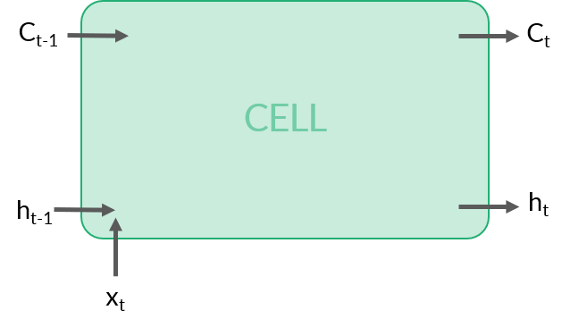
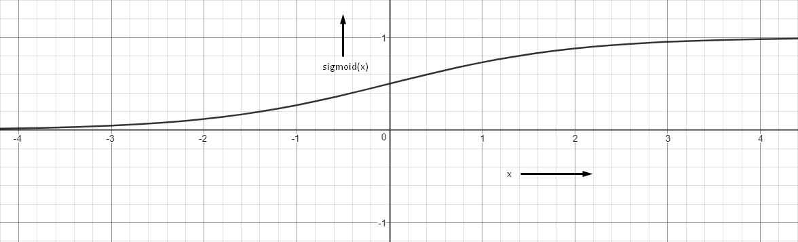
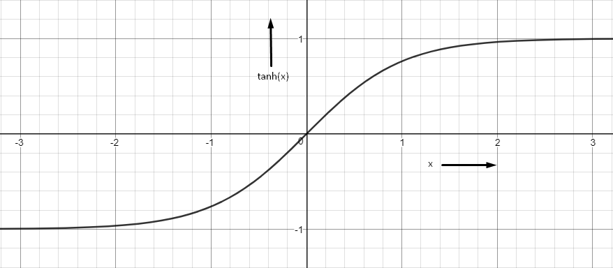
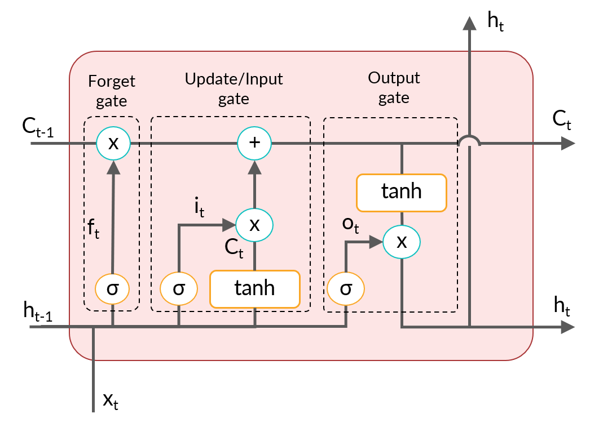
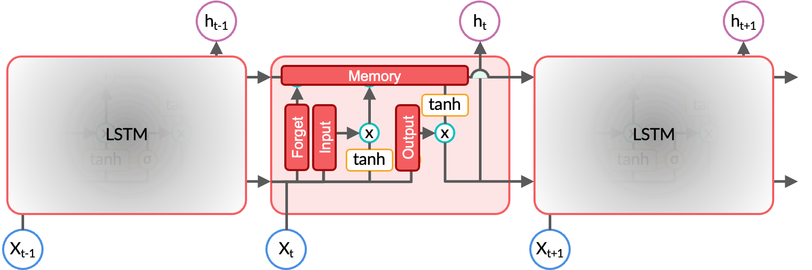
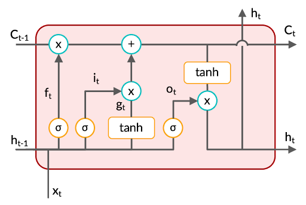
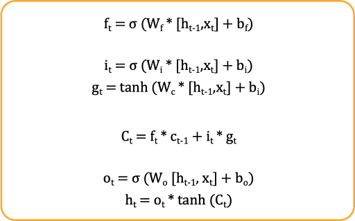
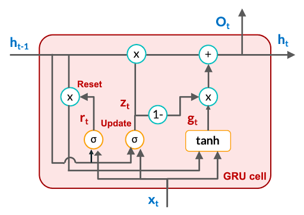

<!-- vim-markdown-toc GFM -->

* [Bi-Directional RNN](#bi-directional-rnn)
* [Problems with Vanilla RNNs](#problems-with-vanilla-rnns)
* [Long, Short-term Memory Networks](#long-short-term-memory-networks)
* [Characteristics of an LSTM Cell](#characteristics-of-an-lstm-cell)
* [LSTM Cell](#lstm-cell)
* [Common Activation Functions](#common-activation-functions)
  * [Sigmoid](#sigmoid)
  * [tanh](#tanh)
* [LSTM Cell Structure](#lstm-cell-structure)
* [Feedforward in LSTM](#feedforward-in-lstm)
* [Dimensions involved in LSTM](#dimensions-involved-in-lstm)
* [Trainable Parameters](#trainable-parameters)
* [RNN vs LSTM](#rnn-vs-lstm)
* [Gated Recurrent Unit (GRU)](#gated-recurrent-unit-gru)
* [Feedforward Equations of GRU](#feedforward-equations-of-gru)
* [GRU Training Parameters](#gru-training-parameters)
* [Training Time compared to LSTM](#training-time-compared-to-lstm)
* [GRU Key Aspects](#gru-key-aspects)
* [RNN vs LSTM vs GRU](#rnn-vs-lstm-vs-gru)
* [References](#references)

<!-- vim-markdown-toc -->

# Bi-Directional RNN
- In bidirectional RNN, the input stream goes from left-to-right as well as well right-to-left. This way, the network has context of the future, making it more robust.
- The bidirectional RNN is functionally exact same as RNN, except that it takes 2x the input. If the seqence length is $L$, then at t timestep, it gets input $w_t$ as well as $w_{L-t+1}$.
- It only works in case of offline tasks, where the whole sequence is avaiable beforehand such as for generating sentiment from online review, summarizing a document. 
- In online tasks, such as predictive text for a keyboard, this technique cannot work, since the future sequence is not known ahead of time.

# Problems with Vanilla RNNs
1. The problem of vanishing and exploding gradients
2. cannot learn long term dependencies (computational limitations)
3. Vanishing gradients don't allow learning to take place in the network
4. Vanilla RNNs are only able to learn short-term dependencies in practice 
5. Other simple alternatives are prsent to learn short-term dependencies

# Long, Short-term Memory Networks
To solve the vanishing gradients problem, many attempts have been made to tweak the vanilla RNNs such that the gradients don’t die when sequences get long. The most popular and successful of these attempts has been the long, short-term memory network, or the LSTM. LSTMs have proven to be so effective that they have almost replaced vanilla RNNs.

- The main drastic improvement that LSTMs have brought is because of a novel change in the structure of a neuron itself. In the case of LSTMs, the neurons are called cells, and an LSTM cell is different from a normal neuron in many ways.
- One of the fundamental differences between an RNN and an LSTM is that an LSTM has an explicit memory unit which stores information relevant for learning some task. 
- In the standard RNN, the only way the network remembers past information is through updating the hidden states over time, but it does not have an explicit memory to store information.
- On the other hand, in LSTMs, the memory units retain pieces of information even when the sequences get really long.

# Characteristics of an LSTM Cell
- The cells have an explicit 'memory'
- The gating mechanisms: regulate the information that the network stores (and passes on to the next layer) or forgets.
- Constant error carousel: allows an LSTM network to have a smooth and uninterrupted flow of gradients while backpropagating. it is a result of the first two characteristics of LSTM.

# LSTM Cell
- It is analogous to a neuron in an RNN
- each LSTM layer contains multiple LSTM cells
- The cell receives the following inputs:
  - The output of the previous time step $h_{t-1}$ (a vector)
  - The current input $x_t$ (a vector)
  - The previous cell state $c_{t-1}$ (usually a scalar)

The cell state, retains pieces of information even when the sequences get really long, thereby working as long-term memory, $c_t$
. In contrast, LSTM cells have a hidden state acting as short-term memory, $h_t$ to capture the most recent information. This is the reason why LSTM is called long short-term memory.

The cell produces two outputs:
- The current cell state $c_t$ (a scalar)
- The current state output $h_t$ (a scalar)

Each cell in the LSTM layer will produce an output $h_t$ which will then be combined to form a vector and fed to the next LSTM layer.

The current cell state $c_t$ is directly connected to the previous cell state $c_{t−1}$ which provides an uninterrupted flow of gradients. The connection between $c_t$ and $c_{t-1}$ provides a highway for the errors while backpropagating.

# Common Activation Functions
## Sigmoid

- outputs a value between 0 and 1

## tanh

- outputs a value between -1 and +1

# LSTM Cell Structure

There are 3 gates in the cell, namely
- forget gate
- update/input gate
- output gate

Let’s understand the intuition of each gate with a specific example. Let’s say you’re working on a video tagging problem where you need to tag the action that takes place in each frame of the video. Let’s look at the function of each gate in the context of this problem:

**Forget gate**: This gate controls how much information needs to be discarded from the previous cell state ($c_{t−1}$) depending on the new input. In the video tagging problem, whenever a new action takes place, this gate needs to decide how much information to retain from the previous frames. If the same action is happening over and over again, then very less information should be discarded. When the action changes, the forget gate 'forgets' a lot of information.

- The higher the value of sigmoid, the lesser the amount of memory that will be erased from the previous cell state.

**Update/Input gate**: This gate makes an update to the previous cell state by writing a new piece of information to it. Therefore it is also called an input gate. In the video tagging problem, when the action changes, this gate will update the cell state with information relevant to the new action. In case the action is the same as the previous frame, negligible information will be written to the cell state. If the scene changes drastically, the update will be drastic too.

 
The new cell state $c_t$ is the cumulative result of the information discarded from $c_{t−1}$ by the forget gate and the new information freshly updated to $c_{t−1}$ by the update gate.

- The sigmoid function decides how much information to write to the new cell state, while the tanh decides whether to increase or decrease the value of the next cell state.

**Output gate**: This gate controls how much information needs to be passed on to the next LSTM layer based on the current cell state.

- The higher the value of sigmoid, the higher the amount of information that will be transmitted to the next hidden state.
- When tanh is positive, the value of the next hidden state is increased
- The sigmoid function is applied on $h_{t−1}$ and is then multiplied with $\tanh(c_t)$. When $\tanh$ is positive, $h_t$ is increased from its current value.

The main idea is that gating mechanisms regulate the information that the network stores in memory (and passes on to the next layer) or forgets.

Each gate provides a way for the flow of gradients. However, the flow is maximum through the connection between $c_{t−1}$ and $c_t$ and minimal through the gates.

The gating mechanism in LSTM consists of three gates: the forget gate, the input gate and the output gate. You can consider each of these gates as a tool that can modify the cell state. The forget gate helps the model forget irrelevant information, the input gate helps in updating the cell state as per the current input, and the output gate helps in making effective predictions.

You learnt that LSTM has two types of memory - short-term memory $(h_t)$ and long-term memory $(C_t)$. Hence to make effective predictions through the output gate, LSTM uses both short-term information $(h_{t − 1})$ as well as long-term information $(C_t)$. The output $h_t$ is further treated as an updated short-term information.

# Feedforward in LSTM

In the set of equations given above, the first one is a part of the forget gate, the second and third equations depict the functionality of the input gate, and the last two equations represent the output gate. The third-last equation denotes the cell state update at time step ‘t’.

# Dimensions involved in LSTM

Before moving onto the training of LSTM models, you also need to understand the dimensions of various elements involved in LSTM architecture. Suppose you have an LSTM cell where input $(x_t)$ dimensions are 80x1 (80 features) and output $(o_t)$ dimensions are 12x1 (12 classes).

Now if the output dimension is 12x1, the hidden state will also have the same dimension 12x1 since output dimensions are directly corresponding to the hidden state. Similarly $C_t$ will also have dimensions (12x1). Further because of element wise multiplication all around both $f_t$ and $i_t$ will be of 12x1 dimension.

Now $W_{fF}$ will also be of dimension (12 x 80) so that it can be multiplied with $x_t$ and $W_fR$ will be of dimension (12 x 12) to get multiplied with $h_t$. Similarly all the forward weights will be of dimension (12x80) and all the recurrent weights will be of dimension (12x12). Whereas all the biases will be of dimension (12x1) since they are directly related to $f_t$, $i_t$, $C_t$, $h_t$ and $o_t$ all having the same dimensions.

Also note that these dimensions will be true for every time step, hence the time step doesn’t have any impact on the dimensions.

# Trainable Parameters

- Input Weights = Num Layers * Num Features * Num Units
- Recurrent Weights = Num Layers * Num Units * Num Units
- Biases = Num Layers * Num Units
- Total Parameters = Input Weights + Recurrent Weights + Biases
- Num Units implies Numbr of Outputs
- Num features implies Number of Inputs
- Num layers for LSTM will always be 4

# RNN vs LSTM

There are four sets of weights in LSTM, each corresponding to gates and cell state: Wf, Wi, Wo and Wc. Each cell has its own WF and WR, hence upscaling the number of parameters to four times that in RNN. The increased number of parameters leads to increased computational costs. For the same reason, LSTM is more likely to overfit the training data than a normal RNN.

Having said that, most real-life sequence problems such as speech recognition, translation, and video processing are complex enough to need LSTMs.

At the time of gradient calculation, the gradients depend on the derivation of Ct, which is a summation function. Therefore, however small the values become, they will have an addition (the plus sign while updating Ct) operation rather than a recursive multiplication, thus overcoming the vanishing gradient problem.

---

# Gated Recurrent Unit (GRU)

Sometimes, you may need a lighter architecture. Considering the computational expense and the problem of overfitting, researchers have tried to come up with alternative structures to the LSTM cell.

The most popular alternative is the gated recurrent unit (GRU), which was introduced in late 2014 by Kyunghyun Cho et al.

Like LSTM, GRU also has gates, but there is no external memory like cell state in the GRU architecture. GRU has two gates: the reset gate and the update gate.

The functionality of the reset gate is to decide the influence of the previous hidden state on the update of the current hidden state in combination with the current input.

The functionality of the update gate is similar to that of the input gate in LSTM in terms of updating the memory with both the current information and any relevant past information.

The major characteristics of the gating mechanism of GRU is that the gates (reset and update) operate on the hidden state, and not on the cell state, which is not even present in GRU. This makes the GRU model lighter than the LSTM model.

You can easily observe that in GRU, one less gate than LSTM results in fewer sets of weights, $W_z$, $W_r$, $W_h$, and each of these weights contain two types of weights, $W_F$ and $W_R$.

There are only three sets of weights in GRU, whereas in RNN, you have just one set of weights. Therefore, the number of parameters in GRU will be three times that in RNN.

While backpropagating through the hidden state, you can observe that ht is a summation function. Therefore, the values might get smaller, but the summation operator will ensure that we have a significant value of gradients even for longer dependencies.
 
In practice, LSTMs and GRUs have replaced the standard RNNs most of the time because they are more effective and faster to train than vanilla RNNs (despite the larger number of parameters). In most sequence problems, the problem of vanishing gradient is far more severe than training time, which explains the more common use of advanced architectures such as GRU and LSTM.

# Feedforward Equations of GRU

# GRU Training Parameters
- Input Weights = Num Layers * Num Features * Num Units
- Recurrent Weights = Num Layers * Num Units * Num Units
- Biases = Num Layers * Num Units
- Total Parameters = Input Weights + Recurrent Weights + Biases
- Num Units implies Numbr of Outputs
- Num features implies Number of Inputs
- Num layers for GRU will always be 3

- Biases of GRU cell in keras = num layers * (2*num units)

# Training Time compared to LSTM
- Number of trainable parameters are not very different between LSTM and GRU
- But computations are less in GRU
- Because GRPU has less number of weights compared to LSTM
- Hence GRU Training Time is less than LSTM

# GRU Key Aspects
- GRU is a simplified version of LSTM and also performs well especially if long sequences need not be remembered
- Both types of states (short and long-term) are merged into one ($h_t$)
- A single gate controller ($z_t$) controls both - erasing and writing the state
- Thus, data in $h_{t-1}$ is erased first before storing a new value in $h_t$
- If the new input is ignored the previous state itself will be given as output. Outliers are treated this way.
- Full state vector is output at every timestep

# RNN vs LSTM vs GRU
- Standard RNN suffers from vanishing and exploding gradient problems
- GRU has only one activation function ($\tanh$) whereas LSTM has two. GRU takes less time in training as well inference.
- GRU also has less number of weights for a given configuration compared to LSTM
- So, GRU is fater to train compared to LSTM
- LSTM is suited for analyzing longer sequences and larger datasets compared to GRU
- Long-term dependencies handled well by LSTM

- When dependencies are very small, RNN might be a good option. This is because GRU has a lesser number of parameters to train.

- If you want better results for longer dependency and have a requirement of training time, then GRU will be a good option.

- When dependencies are longer and training speed is not a bottleneck, LSTM is a decent choice.

Note that if the data set is small and dependencies are longer, GRU may even outperform LSTM, as LSTM requires more data for training and is harder to train than GRU. Otherwise, a tuned LSTM model will almost always outperform RNN and GRU.

# References
- [Research Paper - Speech Recognition with Deep RNN](https://arxiv.org/pdf/1303.5778.pdf)
- [Understanding LSTM](https://colah.github.io/posts/2015-08-Understanding-LSTMs/)
