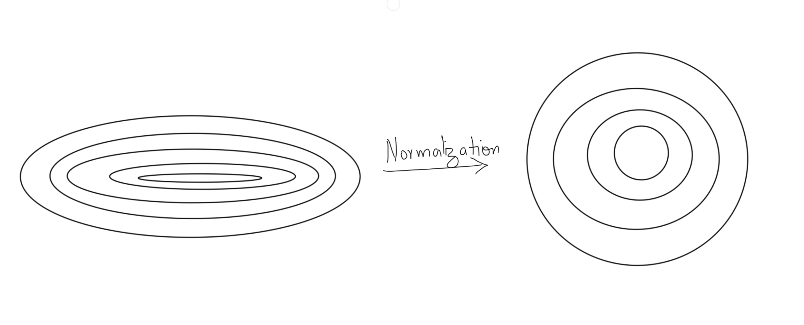

# Purpose
Deep Learning is a subset of machine learning and hence it borrows a lot of common use cases from it. Here we will be looking at the following techniques:
- Regularization
- Dropouts
- Batch Normalization

# Regularization
## Problem
- Any model, be it linear regression, logistic regression, SVM from the ML Domain or CNN, RNN from the Deep Learning domain has the tendency to overfit on the data that it is being trained on. 
- This happens because the model tries to minimize the loss function, i.e. the difference between the actual and predicted value. Of course, the best answer for this problem would be to have 0 loss, which means the model is able to perfectly predict everything as far as the training dataset/data points are concerned. 
- However, this is also where the problem lies. The model isn't actually "predicting" anything. It has just memorized the data points exactly. It knows what output it should give for any data point in the training set, but anything remotely out of that comes up, and the model will fail miserably. In other words, the model has failed to generalize, it has failed to obtain abstract patterns, it has failed to gather knowledge. 
- The model has become too complex. It has tuned it's parameters in such a way that it will always perform good on training data but never on validation data.
## Solution
- Since we know that the model has become to complex, we need to reduce the complexity by applying some penalty on the weights that the model is updating during the training. This process is called `Regularization`.
- Objective function = Loss Function (Error term) + Regularization term
- Recall that the bias of a model represents the amount of error the model will commit on a given dataset, while the variance of the model measures how much the model changes when trained on a different dataset. Here with use of regularization, we can decide on the tradeoff between the two. 
- The two most common regularization techniques, common across the whole ML Domain, are $L1$ and $L2$ Regularizations, also known as Lasso and Ridge Regularization respectively. 

### L1 Regularization - Lasso 
- Applies penalty on sum of absolute weights
- $\sum_{i=1}^{N}|w_i|$ should be less than threshold value
- It has the bonus effect of creating spare matrices by reducing the value to zero for some of the weights.
- This function is hard to differentiate and it is not straightforward to use it in backpropagation
- Keras has an implementation for Lasso Regularization
- Dropouts tend to create a similar effect as Lasso Regularization, and hence they supersede this technique

### L2 Regularization - Ridge
- Applies penalty on squared sum of weights
- $\sum_{i=1}^{N}(w_i^2)$ should be less than threshold value
- It does not create sparse matrix
- This function is easy to differentiate due to it's square nature
- It is more common in Deep Learning domain due to being easily differentiable
- Keras has an implementation for Ridge Regularization

# Dropouts
- This is a common technique used in Deep Learning domain to handle the problem of overfitting i.e. it is a regularization technique.
- Here we random disable some of the neurons from being active during the feedforward / backpropagation operation. 
- Each batch / iteration has different disabled neurons depending on the $\alpha$ matrix generated at that iteration.
- The same neurons will be disabled during backpropagation which have been disabled during feedforward.

The dropout operation is performed by multiplying the weight matrix $W^l$ with an $\alpha$ mask vector. ($W^l.\alpha$). The $\alpha$ vector dimensions are (number of neurons in layer l-1, 1).

- Dropouts can be applied only to some layers of the network (in fact, that is a common practice - you choose some layer arbitrarily to apply dropouts to)
- The mask $\alpha$ is generated independently for each layer during feedforward, and the same mask is used in backpropagation
- The mask changes with each minibatch/iteration, are randomly generated in each iteration (sampled from a Bernoulli with some $p(1) = q$)

Why the dropout strategy works well is explained through the notion of a manifold. Manifold captures the observation that in high dimensional spaces, the data points often actually lie in a lower-dimensional manifold. This is observed experimentally and can be understood intuitively as well. 

For example, in a 50-dimensional space $R^50$, it is likely that the data points actually lie in a much lower dimensional subspace (manifold). The dropout strategy uses this fact to find a lower-dimensional solution to the problem.

The dropout technique ensures that each neuron is learning a general pattern and not looking for a specific feature, since any neuron can be disabled randomly.

Dropouts help in symmetry breaking as well. There is every possibility of the creation of communities within neurons which restricts them from learning independently. Hence, by setting some random set of the weights to zero in every iteration, this community/symmetry is broken. Note that a different mini batch is processed in every iteration in an epoch, and dropouts are applied to each mini batch.

```py heading="Dropouts using Keras"
# dropping out 20% neurons in a layer in Keras 
model.add(Dropout(0.2)
```

Please note that '0.2' here is the probability of zeros and not ones. This is also one of the hyperparameters. Also, note that you do not apply dropout to the output layer. The mask used here is a matrix. Also, the dropout is applied only during training, not at test time.

# Batch Normalization
## Problem
The feed forward equations for a single data point are given below:

- $h^1 = \sigma(W^1.x + b)$
- $h^2 = \sigma(W^2.h^1 + b^2) = \sigma(W^2.(\sigma(W^1.x+b^1))+b^2)$

and so on, where $\sigma$ is the activation function of the layer.

You can see that $h^4$ is a composite function of all the weights and biases from the previous layers, i.e. the output of subsequent layers depend on the previous weight matrices. Also, we can see that the interactions between the different weight matrices are non-linear. However, during backpropagation, the weights of various layers are updated independently of each other. 

This is a problem because when we update the weights (say) $W^4$, it affects the output $h^4$, which in turn affects the gradient $\frac{\partial L}{\partial W^5}$. Thus, strictly, speaking, the updates made to $W^5$ should not get affected by the updates made to $W^4$.

## Solution
Batch normalisation is performed on the output of the layers of each batch, $H^l$. It is essentially normalising the matrix $H^l$ across all data points in the batch. Each vector in $H^l$ is normalized by the mean vector $\mu$ and the standard deviation vector $\hat\sigma$ computed across a batch.

The following image dhows the batch normalisation process for a layer $l$. Each column in the matrix $H^l$ represents the output vector of layer $l$, $h^l$, for each of the $m$ data points in the batch. We compute the $\mu$ and the $\hat\sigma$ vectors which represent the "mean output from layer $l$ across all points in the batch". We then normalise each column of the matrix $H^l$ using $\mu$ and $\hat\sigma$


Hence, if a particular layer $l$ has 5 neurons, we will have $H^l$ of the shape $(5, m)$ where $m$ is the batch size and $\mu$ and $\hat\sigma$ vectors of shape $(5, 1)$. The first element of $\mu$ ($\mu_1$) is the mean of the outputs of the first neuron for all the "m" data points, the second element $\mu_2$ is the mean of the outputs of the second neuron for all the "$m$" data points and so on. Similarly, we get a vector $\hat\sigma$ as the standard deviation of the outputs of the five neurons across the m points. The normalisation step is then:

$H^l = \frac{H^l-\mu}{\hat\sigma}$

This step is performed by broadcasting $\mu$ and $\hat\sigma$. The final $H^l$ after batch normalisation is shown on the left side of the image above.

Batch normalisation is usually done for all the layer outputs except the output layer.

During test time, average $\mu$ and $\hat\sigma$ are used.

To get an intuition behind how batch normalisation solves the problem of decoupling the weight interactions and improve the training procedure, let's reiterate why normalisation of the input data works at the first place. The answer is that the loss function contours change after normalisation, as shown in the figure below, and that it is easier to find the minimum of the right contours compared to the contours on the left. 



Libraries such as Keras use a slightly different form of batch normalisation. We transform the above equations as:

$H^l = \frac{H^l-\mu}{\hat\sigma} = \frac{H^l-\mu}{\sqrt{\hat\sigma^2+\epsilon}} = \gamma H^l + \beta$, where the constant $\epsilon_{}$ ensures the denominator doesn't become zero (when the variance is 0). The constants $\gamma$, $\beta$ are hyperparameters. In Keras, implementation of batch normalisation is done as follows:

```py heading="Batch Normalization in Keras"
model.add(BatchNormalization(axis=-1, epsilon=0.001, 
                         beta_initializer='zeros', 
                         gamma_initializer='ones'))
```
The 'axis= -1' specifies that the normalisation should happen across the rows.

# References
- [Intuition of Manifold](https://datascience.stackexchange.com/questions/5694/dimensionality-and-manifold)
- [Deep Learning Book](https://www.deeplearningbook.org/)
