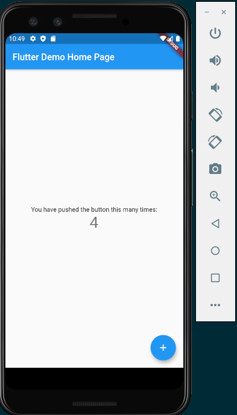

# Flutter
Flutter is a multi-platform framework, which was released on Dec 2018, and currently supports mobile, web, desktop and embedded platforms.
- Free and Open-source project by Google
- DART programming language - supports Ahead of Time (AOT) compilation
- fast, smooth and capable of running apps in 120fps
- highly customizable due to it's own widgets
- one code will work for different platforms. 
- doesn't use a Javascript bridge making code execution faster
- supports hot reload (like modern web apps)
- supports Windows, Mac, Linux

# Flutter Driver
- Flutter driver helps to test applications developed in flutter on both real devices and emulators
- It also uses DART programming language to write scenarios
- It it like Selenium WebDriver
- It is faster, easy to work with
- It comes along with Flutter (no explicit installer)

# Installation
- Install [Flutter](https://flutter.dev/docs/get-started/install)
- Android Studio and SDK should be present
- Flutter path should be set
- Run `flutter doctor` and resolve the issues if there are any

# Creating first flutter app
- In VS Code, press "Ctrl-Shift-p"
- type flutter
- choose new flutter app
- select folder and name of app
- start a virtual device from Android Studio 
- press '<F5>' to build and run the app
- it will take some time, but if everything goes well, the demo app will be launched on the emulated device

- read the main.dart file to understand how the code works
- You can make changes in the main.dart and app should reload on save. If it doesn't press 'r' in the terminal to hot-reload the app.
- Refer [this video](https://www.youtube.com/watch?v=OfPCCw3ct-k&list=PL6tu16kXT9PrzZbUTUscEYOHHTVEKPLha&index=2)

# Finding UI Emements 
We can use the following 4 ways to identify elements
- bySemanticsLabel
- byTooltip
- byType
- byValueKey

Note: This is an exhaustive list. The flutter driver only supports these 4 ways, which may not be sufficient for some cases.

# References
- [Flutter Automation Playlist](https://www.youtube.com/watch?v=9wNa48EiksM&list=PL6tu16kXT9PrzZbUTUscEYOHHTVEKPLha&index=1)
- [Introduction to Integration Testing in Flutter](https://flutter.dev/docs/cookbook/testing/integration/introduction)
- [Flutter Gherkin](https://pub.dev/packages/flutter_gherkin)
- [Dart Language - Learn by Example](https://dart.dev/samples)
- [Dart - Language Tour](https://dart.dev/guides/language/language-tour)
