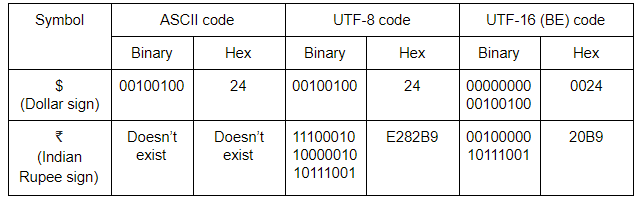

# Preface
Natural language processing, also referred to as text analytics, plays a very vital role in today’s era because of the sheer volume of text data that users generate around the world on digital channels such as social media apps, e-commerce websites, blog posts, etc.

# Areas of Application
1. Social media analytics: Political parties, Influencers etc. are interested in understanding what public is saying on social media about them.
2. Banking and loan processing
3. Insurance claim processing
4. Customer relationship processing
5. Security and counter-terroism
6. Computation social science
7. E-commerce
8. Psychology and cognitive science

To do any NLP task, your system should be able to take the raw unprocessed data shown above, break the analysis down into smaller sequential problems (a pipeline), and solve each of those problems individually. The individual problems could be as simple as breaking the data into sentences, words etc. to something as complex as understanding what a word means, based on the words in its “neighbourhood”.

# Understanding Text
1. **Lexical Processing**: First, you will just convert the raw text into words and, depending on your application's needs, into sentences or paragraphs as well.
- For example, if an email contains words such as lottery, prize and luck, then the email is represented by these words, and it is likely to be a spam email.
- Hence, in general, the group of words contained in a sentence gives us a pretty good idea of what that sentence means. Many more processing steps are usually undertaken in order to make this group more representative of the sentence, for example, cat and cats are considered to be the same word. In general, we can consider all plural words to be equivalent to the singular form.
- For a simple application like spam detection, lexical processing works just fine, but it is usually not enough in more complex applications, like, say, machine translation. For example, the sentences “My cat ate its third meal” and “My third cat ate its meal”, have very different meanings. However, lexical processing will treat the two sentences as equal, as the “group of words” in both sentences is the same. Hence, we clearly need a more advanced system of analysis.

2. **Syntactic Processing**: So, the next step after lexical analysis is where we try to extract more meaning from the sentence, by using its syntax this time. Instead of only looking at the words, we look at the syntactic structures, i.e., the grammar of the language to understand what the meaning is.
- One example is differentiating between the subject and the object of the sentence, i.e., identifying who is performing the action and who is the person affected by it. For example, “Ram thanked Shyam” and “Shyam thanked Ram” are sentences with different meanings from each other because in the first instance, the action of ‘thanking’ is done by Ram and affects Shyam, whereas, in the other one, it is done by Shyam and affects Ram. Hence, a syntactic analysis that is based on a sentence’s subjects and objects, will be able to make this distinction.
- There are various other ways in which these syntactic analyses can help us enhance our understanding. For example, a question answering system that is asked the question “Who is the Prime Minister of India?”, will perform much better, if it can understand that the words “Prime Minister” are related to “India”. It can then look up in its database, and provide the answer.

3. **Semantic Processing**: Lexical and syntactic processing don't suffice when it comes to building advanced NLP applications such as language translation, chatbots etc.. The machine, after the two steps given above, will still be incapable of actually understanding the meaning of the text. Such an incapability can be a problem for, say, a question answering system, as it may be unable to understand that PM and Prime Minister mean the same thing. Hence, when somebody asks it the question, “Who is the PM of India?”, it may not even be able to give an answer unless it has a separate database for PMs, as it won’t understand that the words PM and Prime Minister are the same. You could store the answer separately for both the variants of the meaning (PM and Prime Minister), but how many of these meanings are you going to store manually? At some point, your machine should be able to identify synonyms, antonyms, etc. on its own.
- This is typically done by inferring the word’s meaning to the collection of words that usually occur around it. So, if the words, PM and Prime Minister occur very frequently around similar words, then you can assume that the meanings of the two words are similar as well.
- In fact, this way, the machine should also be able to understand other semantic relations. For example, it should be able to understand that the words “King” and “Queen” are related to each other and that the word “Queen” is simply the female version of the word “King”. Also, both of these words can be clubbed under the word “Monarch”. You can probably save these relations manually, but it will help you a lot more, if you can train your machine to look for the relations on its own, and learn them. 

Once you have the meaning of the words, obtained via semantic analysis, you can use it for a variety of applications. Machine translation, chatbots and many other applications require a complete understanding of the text, right from the lexical level to the understanding of syntax to that of meaning. Hence, in most of these applications, lexical and semantic processing simply form the “pre-processing” layer of the overall process. In some simpler applications, only lexical processing is also enough as the pre-processing part.

# Text Encoding
Character Encoding: A unique code assinged to a character, based on the encoding standard, to represent it on a computer.

It is not necessary that when you work with text, you’ll get to work with the English language. With so many languages in the world and internet being accessed by many countries, there is a lot of text in non-English languages. For you to work with non-English text, you need to understand how all the other characters are stored.
 
Computers could handle numbers directly and store them on registers (the smallest unit of memory on a computer). But they couldn’t store the non-numeric characters as is. The alphabets and special characters were to be converted to a numeric value first before they could be stored.

Hence, the concept of encoding came into existence. All the non-numeric characters were encoded to a number using a code. Also, the encoding techniques had to be standardised so that different computer manufacturers won’t use different encoding techniques.

The first encoding standard that came into existence was the ASCII (American Standard Code for Information Interchange) standard, in 1960. ASCII standard assigned a unique code to each character of the keyboard which was known as  ASCII code. For example, the ASCII code of the alphabet ‘A’ is 65 and that of the digit zero is 48. Since then, there have been several revisions made to the codes to incorporate new characters that came into existence after the initial encoding.

When ASCII was built, English alphabets were the only alphabets that were present on the keyboard. With time, new languages began to show up on keyboard sets which brought new characters. ASCII became outdated and couldn’t incorporate so many languages. A new standard has come into existence in recent years - the Unicode standard. It supports all the languages in the world - both modern and the older ones.

For someone working on text processing, knowing how to handle encodings becomes crucial. Before even beginning with any text processing, you need to know what kind of encoding the text has and if required, modify it to another encoding format.

## Encoding Standard
1. Each character has a unique representation code on computers
2. ASCII (American Standard Code for Information Interchange) was a widely popular standard that mostly ecodes all English characters
3. The Unicode Standard helps represent text in almost all the languages of the world
  - UTF-16: Encodes each character with a 16-bit code. It is a multiligual plane. It uses 2-bytes per character.
  - UTF-8: Encodes each English character with an 8-bit code and each non-English character with a 32-bit code. First 8-bits use same representation as ASCII. It uses 1-byte per character.

Let’s look at the relation between ASCII, UTF-8 and UTF-16 through an example. The table below shows the ASCII, UTF-8 and UTF-16 codes for two symbols - the dollar sign and the Indian rupee symbol.



As you can see, UTF-8 offers a big advantage in cases when the character is an English character or a character from the ASCII character set. Also, while UTF-8 uses only 8 bits to store the character, UTF-16 (BE) uses 16 bits to store it, which looks like a waste of memory.

However, in the second case, a symbol is used which doesn’t appear in the ASCII character set. For this case, UTF-8 uses 24 bits, whereas UTF-16 (BE) only uses 16. Hence the storage advantages offered by UTF-8 is reversed and actually becomes a disadvantage here. Also, the advantage UTF-8 offered previously by being same as the ASCII code is also not of use here, as ASCII code doesn’t even exist for this case.

The default encoding for strings in python is Unicode UTF-8. You can also look at [this](https://mothereff.in/utf-8) UTF-8 encoder-decoder to look how a string is stored. Note that, the online tool gives you the hexadecimal codes of a given string.

```py heading="Encoding in Python"
# create a string
amount = u"₹50"
print('Default string: ', amount, '\n', 'Type of string', type(amount), '\n')

# encode to UTF-8 byte format
amount_encoded = amount.encode('utf-8')
print('Encoded to UTF-8: ', amount_encoded, '\n', 'Type of string', type(amount_encoded), '\n')


# sometime later in another computer...
# decode from UTF-8 byte format
amount_decoded = amount_encoded.decode('utf-8')
print('Decoded from UTF-8: ', amount_decoded, '\n', 'Type of string', type(amount_decoded), '\n')
```

# Regular Expressions
Regular expressions, also called regex, are very powerful programming tools that are used for a variety of purposes such as feature extraction from text, string replacement and other string manipulations. For someone to become a master at text analytics, being proficient with regular expressions is a must-have skill.

A regular expression is a set of characters, or a pattern, which is used to find substrings in a given string. 

Let’s say you want to extract all the hashtags from a tweet. A hashtag has a fixed pattern to it, i.e. a pound (‘#’) character followed by a string. Some example hashtags are - #mumbai, #bangalore, #upgrad. You could easily achieve this task by providing this pattern and the tweet that you want to extract the pattern from (in this case, the pattern is - any string starting with #). Another example is to extract all the phone numbers from a large piece of textual data.

In short, if there’s a pattern in any string, you can easily extract, substitute and do all kinds of other string manipulation operations using regular expressions.

Learning regular expressions basically means learning how to identify and define these patterns.

Regulars expressions are a language in itself since they have their own compilers. Almost all popular programming languages support working with regexes and so does Python.

## Quantifiers
Quantifiers allow you to mention and have control over how many times you want the character(s) in your pattern to occur.

Let’s take an example. Suppose you have some data which have the word ‘awesome’ in it. The list might look like - [‘awesome’, ‘awesomeeee’, ‘awesomee’]. You decide to extract only those elements which have more than one ‘e’ at the end of the word ‘awesome’. This is where quantifiers come into picture. They let you handle these tasks.

There are 4 common quantifiers:
1. The ‘?’ operator
    - The ‘?’  can be used where you want the preceding character of your pattern to be an optional character in the string. 
    - It matches either 0 or 1 character at most.
    - For example, if you want to write a regex that matches both ‘car’ and ‘cars’, the corresponding regex will be ’cars?’. ‘S’ followed by ‘?’ means that ‘s’ can be absent or present, i.e. it can be present zero or one time.
1. The ‘*’ operator
    - A ‘*’ quantifier matches the preceding character any number of times. 
    - It matches 0 or more than 0 characters.
1. The ‘+’ operator
    - The ‘+’ quantifier matches the preceding character one or more times. 
    - That means the preceding character has to be present at least once for the pattern to match the string.
    - The only difference between '+' and '*' is that the '+' needs a character to be present at least once, while the '*' does not.
1. The ‘{m, n}’ operator
    - To specify occurrences of the preceding character a fixed number of times.
    - `{m, n}`: Matches the preceding character ‘m’ times to ‘n’ times.
    - `{m, }`: Matches the preceding character ‘m’ times to infinite times, i.e. there is no upper limit to the occurrence of the preceding character.
    - `{, n}`: Matches the preceding character from zero to ‘n’ times, i.e. the upper limit is fixed regarding the occurrence of the preceding character.
    - `{n}`: Matches if the preceding character occurs exactly ‘n’ number of times. 
    - Note that while specifying the {m,n} notation, avoid using a space after the comma, i.e. use {m,n} rather than {m, n}.
    - '?' is equivalent to zero or once, or {0, 1}
    - '*' is equivalent to zero or more times, or {0, }
    - '+' is equivalent to one or more times, or {1, }

## White Space
A whitespace comprises of a single space, multiple spaces, tab space or a newline character (also known as a vertical space). You can learn about multiple spaces in a computer here. Turns out, you can use these spaces in your regular expression normally.

These whitespaces will match the corresponding spaces in the string. For example, the pattern ‘ +’, i.e. a space followed by a plus sign will match one or more spaces. Similarly, you could use spaces with other characters inside the pattern. The pattern, ‘James Allen’ will allow you to look for the name ‘James Allen’ in any given string.

## Parentheses
We have used quantifiers preceded by a single character which meant that the character preceded by the quantifier can repeat a specified number of times. If you put the parentheses around some characters, the quantifier will look for repetition of the group of characters rather than just looking for repetitions of the preceding character. This concept is called grouping in regular expression jargon. For example, the pattern ‘(abc){1, 3}’ will match the following strings:

- abc
- abcabc
- abcabcabc

Similarly, the pattern (010)+ will match:

- 010
- 010010
- 010010010, and so on.

## Pipe
It’s notated by ‘|’. The pipe operator is used as an OR operator. You need to use it inside the parentheses. For example, the pattern ‘(d|g)one’ will match both the strings - ‘done’ and ‘gone’. The pipe operator tells that the place inside the parentheses can be either ‘d’ or ‘g’.

Similarly, the pattern ‘(ICICI|HDFC) Bank’ will match the strings ‘ICICI Bank’ and ‘HDFC Bank’. You can also use quantifiers after the parentheses as usual even when there is a pipe operator inside. Not only that, there can be an infinite number of pipe operators inside the parentheses. The pattern ‘(0|1|2){2} means 'exactly two occurrences of either of 0, 1 or 2', and it will match these strings - ‘00’, ‘01’, ‘02’, ‘10’, ‘11’, ‘12’, ‘20’, ‘21’ and ‘22’.

## Special Characters
Lastly, you will often find yourself in situations where you will need to mention characters such as ‘?’, ‘*’, ‘+’, ‘(‘, ‘)’, ‘{‘, etc. in your regular expressions. These are called special characters since they have special meanings when they appear inside a  regex pattern (as you have already seen).

Suppose you want to extract all the questions from a document, and you assume that all questions end with a question mark - ‘?’. So you would need to use the ‘?’ in the regular expression. Now, you already know that ‘?’ has a special meaning in regular expressions. So, how do you tell regular expression engine that you want to match the question mark literally in the sentence, rather than as a special character (which it is by default)? 

In situations such as these, you’ll need to use escape sequences. The escape sequence, denoted by a backslash ‘\’, is used to escape the special meaning of the special characters. To match a question mark literally, you need to use '\?' (this is called escaping the character).

Let's take another example - if you want to match the addition symbol in a string, you can’t use the pattern ‘+’. You need to escape the ‘+’ operator and the pattern that you’re going to use in this case is ‘\+’. 

Now, let’s say we have this string - ‘Dravid, who scored 56(78), was bowled by Brett Lee after lunchtime’. Suppose, we want to extract ‘(78)’ from the given string. To do that, we can’t use the pattern ‘(78)’. If we use it, we’ll get ‘78’ instead of ‘(78)’. What we really want is the substring ‘(78)’. Therefore, we need to escape the special meaning of the parentheses in this case. The pattern that we’re going to use is ‘\(78\)’. The special character is preceded by the escape character that you want to escape.

Note: The '\' itself is a special character, and to match the ‘\’ character literally, you need to escape it too. You can use the pattern ‘\\’ to escape the backslash.

## Flags

Now, there are something called as regex flags. A flag has a special meaning. For example, if you want your regex to ignore the case of the text then you can pass the 're.I' flag. Similarly, you can have have a flag with the syntax re.M that enables you to search in multiple lines (in case the input text has multiple lines). You can pass all these flags in the re.search() function. The syntax to pass multiple flags is:

```py heading='Regex Flags in Python'
import re

pattern = 'hey'
string = 'HEY'
re.search(pattern, string, flags=re.I | re.M)
```

Last, you need to know about the re.compile() function. This function stores the regular expression pattern in the cache memory and is said to result in a little faster searches. You need to pass the regex pattern to re.compile() function. The following piece of code shows the difference between searching with the compile function and without the compile function.

```py heading="re.complie"
import re

# without re.compile() function
result = re.search("a+", "abc")

# using the re.compile() function
pattern = re.compile("a+")
result = pattern.search("abc")
```

## Anchors
Anchors are used to specify the start and end of the string. 

- `^`: The ‘^’ specifies the start of the string. The character followed by the ‘^’ in the pattern should be the first character of the string in order for a string to match the pattern. `^` can also be used in a character set to specify complement set.

- `$`: Similarly, the $ specifies the end of the string. The character that precedes the ‘$’ in the pattern should be the last character in the string in order for the string to match the pattern.

Both the anchors can be specified in a single regular expression itself. For example, the regular expression pattern `^01*0$` will match any string that starts and end with zeroes with any number of 1s between them. It will match ‘010’, ‘0110’, ‘01111111110’ and even ‘00’ (‘*’ matches zero or more 1s). But it will not match the string ‘0’ because there is only one zero in this string and in the pattern we have specified that there needs to be two 0s, one at the start and one at the end.

## Wildcard

- `.`: There is one special character in regular expressions that acts as a placeholder and can match any character (literally!) in the given input string. It’s the ‘.’ (dot) character is also called the wildcard character. 

For example, the pattern ‘hur{2,}ay’ matches ‘hurray’, ‘hurrray’, ‘hurrrray’ and so on. Here, we had specified that the letter ‘r’ should be present two or more times. But you don’t always know the letter that you want to repeat. In such situations, you’ll need to use the wildcard instead. 

The wildcard comes handy in many situations. It can be followed by a quantifier which specifies that any character is present a specified number of times.

For example, if you’re asked to write a regex pattern that should match a string that starts with four characters, followed by three 0s and two 1s, followed by any two characters. The valid strings can be abcd00011ft, jkds00011hf, etc. The pattern that satisfies this kind of condition would be ‘.{4}0{3}1{2}.{2}’. You can also use ‘....00011..’ where the dot acts as a placeholder which means anything can sit on the place of the dot. Both are correct regex patterns.

## Characters Sets

For example, say you want to match phone numbers in a large document. You know that the numbers may contain hyphens, plus symbol etc. (e.g. +91-9930839123) , but it will not have any alphabet. You need to somehow specify that you are looking only for numerics and some other symbols, but avoid alphabets.

To handle such situations, you can use what are called character sets in regular expression jargon.

Character sets provide lot more flexibility than just typing a wildcard or the literal characters. Character sets can be specified with or without a quantifier. When no quantifier succeeds the character set, it matches only one character and the match is successful only if the character in the string is one of the characters present inside the character set. For example, the pattern ‘[a-z]ed’ will match strings such as ‘ted’, ‘bed’, ‘red’ and so on because the first character of each string - ‘t’, ‘b’ and ‘r’ - is present inside the range of the character set.

On the other hand, when we use a character set with a quantifier, such as in this case - ‘[a-z]+ed’, it will match any word that ends with ‘ed’ such as ‘watched’, ‘baked’, ‘jammed’, ‘educated’ and so on. In this way, a character set is similar to a wildcard because it can also be used with or without a quantifier. It’s just that a character set gives you more power and flexibility!

Note that a quantifier loses its special meaning when it’s present inside the character set. Inside square brackets, it is treated as any other character. 

You can also mention a whitespace character inside a character set to specify one or more whitespaces inside the string. The pattern [A-z ] can be used to match the full name of a person. It includes a space, so it can match the full name which includes the first name, a space, and the last name of the person.

But what if you want to match every other character other than the one mentioned inside the character set. You can use the caret operator to do this. 

The ‘^’ has two use cases. You already know that it can be used outside a character set to specify the start of a string. Here, it is known as an anchor.

It’s another use is inside a character set. When used inside a character set, it acts as a complement operator, i.e. it specifies that it will match any character other than the ones mentioned inside the character set.

The pattern [0-9] matches any single digit number. On the other hand, the pattern `[^0-9]` matches any single digit character that is not a digit.

## Meta Sequences

When you work with regular expressions, you’ll find yourself using characters often. You’ll commonly use sets to match only digits, only alphabets, only alphanumeric characters, only whitespaces, etc.

Therefore, there is a shorthand way to write commonly used character sets in regular expressions. These are called meta-sequences.

You can use meta-sequences in two ways:
- You can either use them without the square brackets. For example, the pattern ‘\w+’ will match any alphanumeric character.
- Or you can them it inside the square brackets. For example, the pattern ‘[\w]+’ is same as ‘\w+’. But when you use meta-sequences inside a square bracket, they’re commonly used along with other meta-sequences. For example, the ‘[\w\s]+’ matches both alphanumeric characters and whitespaces. The square brackets are used to group these two meta-sequences into one.

## Greedy versus Non-greedy Search

When you use a regular expression to match a string, the regex greedily tries to look for the longest pattern possible in the string. For example, when you specify the pattern 'ab{2,5}' to match the string 'abbbbb', it will look for the maximum number of occurrences of 'b' (in this case 5).

This is called a 'greedy approach'. By default, a regular expression is greedy in nature.

There is another approach called the non-greedy approach, also called the lazy approach, where the regex stops looking for the pattern once a particular condition is satisfied.

`?` can be placed at the end of a regex to convert the greedy approach (default) to non-greedy. Non-greedy means that the regex will only return minimum match (if found).

```py heading='Greedy vs Non-Greedy'
import re

# greedy
print(re.search("<.*>", "<HTML><TITLE>My Page</TITLE><HTML>"))

# non-greedy
print(re.search("<.*?>", "<HTML><TITLE>My Page</TITLE><HTML>"))
```

Let’s understand the non-greedy or the lazy approach with another example. Suppose, you have the string ‘3000’. Now, if you use the regular expression ‘30+’, it means that you want to look for a string which starts with ‘3’ and then has one or more '0's followed by it. This pattern will match the entire string, i.e. ‘3000’. This is the greedy way. But if you use the non-greedy technique, it will only match ‘30’ because it still satisfies the pattern ‘30+’ but stops as soon as it matches the given pattern.

It is important to not confuse the greedy approach with matching multiple strings in a large piece of text - these are different use cases. Similarly,  the lazy approach is different from matching only the first match.

For example, take the string ‘One batsman among many batsmen.’. If you run the patterns ‘bat*’ and ‘bat*?’ on this text, the pattern ‘bat*’ will match the substring ‘bat’ in ‘batsman’ and ‘bat’ in ‘batsmen’ while the pattern ‘bat*?’ will match the substring ‘ba’ in batsman and ‘ba’ in ‘batsmen’. The pattern ‘bat*’ means look for the term ‘ba’ followed by zero or more ‘t’s so it greedily looks for as many ‘t’s as possible and the search ends at the substring ‘bat’. On the other hand, the pattern ‘bat*?’ will look for as few ‘t’s as possible. Since ‘*’ indicates zero or more, the lazy approach stops the search at ‘ba’.

To use a pattern in a non-greedy way, you can just put a question mark at the end of any of the following quantifiers. Example of lazy quantifiers:
- *?
- +?
- ??
- {m, n}?
- {m,}?
- {, n}?
- {n}?

## Commonly Used Regex Functions
- `re.match()`: determine if the RE matches at the beginning of the string
- `re.search()`: scan through a string, looking for any location where this RE matches
- `findall()`: find all substings where the RE matches, and returns them as a list
- `finditer()`: find all substrings where the RE matches, and returns them as an iterator
- `sub()`: find all sbstrings where the RE matches, and substitute them with the given string
    - Regular expression patterns can help you find the substring in a given corpus of text that you want to substitute with another string. 
    - For example, you might want to replace the American spelling ‘color’ with the British spelling ‘colour’. 
    - Similarly, the re.sub() function is very useful in text cleaning. 
    - It can be used to replace all the special characters in a given string for example, remove '$','@' and '*' in the string '$hello @wo*rld'.

```py heading='re.sub'
import re

pattern = "\d"
replacement = "X"
string = "My address is 13B, Baker Street"

print(re.sub(pattern, replacement, string))
```

The match and search command return only one match. But you often need to extract all the matches rather than only the first match, and that's when you use the other methods.

Suppose, in a huge corpus of text, you want to extract all the dates, in that case you can use the finditer() function or the findall() function to extract the results. The result of the findall() function is a list of all the matches and the finditer() function is used in a 'for' loop to iterate through each separate match one by one.

## Grouping
Sometimes you need to extract sub-patterns out of a larger pattern. This can be done by using grouping. Suppose you have textual data with dates in it and you want to extract only the year. from the dates. You can use a regular expression pattern with grouping to match dates and then you can extract the component elements such as the day, month or the year from the date.

Grouping is achieved using the parenthesis operators. Let’s understand grouping using an example.

Let’s say the source string is: “Kartik’s birthday is on 15/03/1995”. To extract the date from this string you can use the pattern - “\d{1,2}\/\d{1,2}\/\d{4}”.

Now to extract the year, you can put parentheses around the year part of the pattern. The pattern is: “^\d{1,2}/\d{1,2}/(\d{4})$”.

## Use Cases

```py heading='File Search'
# items contains all the files and folders of current directory
items = ['photos', 'documents', 'videos', 'image001.jpg','image002.jpg','image005.jpg', 'wallpaper.jpg',
         'flower.jpg', 'earth.jpg', 'monkey.jpg', 'image002.png']

# create an empty list to store resultant files
images = []

# regex pattern to extract files that end with '.jpg'
pattern = ".*\.jpg$"

for item in items:
    if re.search(pattern, item):
        images.append(item)

# print result
print(images)


# The above code extracts only those documents which have ‘.jpg’ extension. 
# The pattern ‘.*\.jpg$’ is pretty self-explanatory. 
# The important thing here is the use of backslash. 
# If you don’t escape the dot operator with a backslash, you won’t get the results you want
# Try to run the code without the escape sequence.
```

You saw how to search for specific file names using regular expressions. Similarly, they can be used to extract features from text such as the ones listed below:
- Extracting dates
- Extracting emails
- Extracting phone numbers, and other patterns.

Along with the applications in NLP, regular expressions are extensively used by software engineers in various applications such as checking if a new password meets the minimum criteria or not, checking if a new username meets the minimum criteria or not, and so on.

# Questions

**The __ and __ operator match the start and end of the string.**
- `^` and `$`

**Which function returns a None (that is, no match) if the pattern is not present at the very beginning of a given string:**
- `re.match()`

**The ‘*’ quantifier equivalent to which of the quantifiers?**
- `{0,}`

**The correct syntax of the re.sub() function is:**
- `re.sub(pattern, replacement, string)`

**Which meta-sequence is used to match all the whitespaces in a given pattern?**
- `\s`

**Which character is used to escape the meaning of a character that has special meaning in regular expressions?**
- `\`

**Which of the following regular expression patterns is equivalent to this pattern - `[\d\s]{2, }`?**

| Pattern | Equivalent (Y/N) |
|---------|------------------|
| [\d\s]* | N                |
| [\d\s]? | N                |
| [\d\s]+ | N                |

---

# References
- [Computational Social Science](https://www.youtube.com/watch?v=kyZkptxlSA8)
- [Understanding Text using Cognitive Services](https://www.youtube.com/watch?v=hmUOr_i7NY4&t=42s)
- [Basics of HTML](https://html.com/)
- [regex101](https://regex101.com/)
- [regexone](https://regexone.com/)
- [regex cheat-sheet](https://pycon2016.regex.training/cheat-sheet)
