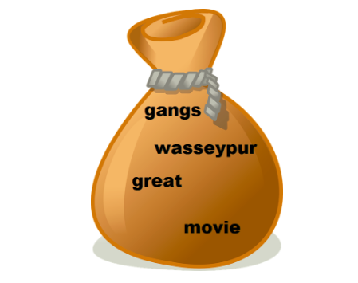

<!-- vim-markdown-toc GFM -->

* [Preface](#preface)
* [Word Frequencies and Stop Words](#word-frequencies-and-stop-words)
* [Tokenisation](#tokenisation)
* [Bag-of-Words Representation](#bag-of-words-representation)
* [Stemming and Lemmatization](#stemming-and-lemmatization)
    * [Stemming](#stemming)
    * [Lemmatization](#lemmatization)
* [TF-IDF Representation](#tf-idf-representation)
* [Summary](#summary)

<!-- vim-markdown-toc -->

# Preface
Before performing any text analysis, we must perform some pre-processing steps. This post will look at some of those, namely:
- Tokenisation
- Stop words removal
- Stemming
- Lemmatization

# Word Frequencies and Stop Words
While working with any kind of data, the first step that you usually do is to explore and understand it better. In order to explore text data, you need to do some basic preprocessing steps. In the next few segments, you will learn some basic preprocessing and exploratory steps applicable to almost all types of textual data.

Now, a text is made of characters, words, sentences and paragraphs. The most basic statistical analysis you can do is to look at the word frequency distribution, i.e. visualising the word frequencies of a given text corpus.

It turns out that there is a common pattern you see when you plot word frequencies in a fairly large corpus of text, such as a corpus of news articles, user reviews, Wikipedia articles, etc. 

Zipf's law (discovered by the linguist-statistician George Zipf) states that the frequency of a word is inversely proportional to the rank of the word, where rank 1 is given to the most frequent word, 2 to the second most frequent and so on. This is also called the power law distribution.

The Zipf's law helps us form the basic intuition for stopwords - these are the words having the highest frequencies (or lowest ranks) in the text, and are typically of limited 'importance'.

Broadly, there are three kinds of words present in any text corpus:
- Highly frequent words, called stop words, such as ‘is’, ‘an’, ‘the’, etc.
- Significant words, which are typically more important to understand the text
- Rarely occurring words, which are again less important than significant words

Generally speaking, stopwords are removed from the text for two reasons:
- They provide no useful information, especially in applications such as spam detector or search engine. Therefore, you’re going to remove stopwords from the spam dataset.
- Since the frequency of words is very high, removing stopwords results in a much smaller data as far as the size of data is concerned. Reduced size results in faster computation on text data. There’s also the advantage of less number of features to deal with if stopwords are removed.

However, there are exceptions when these words should not be removed. There are concepts such as POS (parts of speech) tagging and parsing where stopwords are preserved because they provide meaningful (grammatical) information in those applications. Generally, stopwords are removed unless they prove to be very helpful in your application or analysis.

On the other hand, you’re not going to remove the rarely occurring words because they might provide useful information in spam detection. Also, removing them provides no added efficiency in computation since their frequency is so low.

# Tokenisation
There is a lot of noise in the data. Noise is in the form of non-uniform cases, punctuations, spelling errors. These are exactly the things that make it hard for anyone to work on text data.

There is another thing to think about - how to extract features from the messages so that they could be used to build a classifier. When you create any machine learning model such as a spam detector, you will need to feed in features related to each message that the machine learning algorithm can take in and build the model. And as you know, machine learning works on numeric data, not text.

To deal with this problem, you will extract features from the messages. From each message you’ll extract each word by breaking each message into separate words or 'tokens'. This technique is called tokenisation - a technique that’s used to split the text into smaller elements. These elements can be characters, words, sentences, or even paragraphs depending on the application you’re working on.

There are multiple ways of doing a particular thing in Python. To tokenise words, you can use the split() method that just splits text on white spaces, by default. This method doesn't always give good results. You are better off using NLTK's tokeniser which handles various complexities of text. One of them is that it handles contractions such as “can’t”, “hasn't”, “wouldn't”, and other contraction words and splits these up although there is no space between them. On the other hand, it is smart enough to not split words such as “o’clock” which is not a contraction word.

In NLTK, you also have different types of tokenisers present that you can use in different applications. The most popular tokenisers are:

- Word tokeniser splits text into different words.
- Sentence tokeniser splits text in different sentence.
- Tweet tokeniser handles emojis and hashtags that you see in social media texts
- Regex tokeniser lets you build your own custom tokeniser using regex patterns of your choice.

# Bag-of-Words Representation

You need to perform some more steps after tokenisation and stop words before you can feed the data into a Machine Learning model.

The most common and most popular approach is to create a bag-of-words representation of the text data that you have. The central idea is that any given piece of text, i.e., tweets, articles, messages, emails etc., can be “represented” by a list of all the words that occur in it (after removing the stopwords), where the sequence of occurrence does not matter. You can visualise it as the “bag” of all “words” that occur in it. For example, consider the messages:

"Gangs of Wasseypur is a great movie"

The bag of words representation for this message would be:



This way, you can create “bags” for representing each of the messages in your training and test data set. But how do you go from these bags to building a spam classifier?

Let’s say the bags, for most of the spam messages, contain words such as prize, lottery etc., and most of the ham bags don’t. Now, whenever you run into a new message, just look at its “bag-of-words” representation. Does the bag for this message resemble that of messages you already know as spam, or does it not resemble them? Based on the answer to the previous question, you can then classify the message.

Now, the next question is, how do you get a machine to do all of that? Well, turns out that for doing that, you need to represent all the bags in a matrix format, after which you can use ML algorithms such as naive Bayes, logistic regression, SVM etc., to do the final classification.

To represent the text in matrix form, each document sits on a separate row and each word of the vocabulary has a its own column. These vocabulary words are also called as features of the text.

The bag-of-words representation is also called bag-of-words model but this is not to be confused with a machine learning model. A bag-of-words model is just the matrix that you get from text data.

Another thing to note is that the values inside any cell can be filled in two ways - 1) you can either fill the cell with the frequency of a word (i.e. a cell can have a value of 0 or more), or 2) fill the cell with either 0, in case the word is not present or 1, in case the word is present (binary format).

Both approaches work fine and don’t usually result in a big difference. The frequency approach is slightly more popular and the NLTK library in Python also fills the bag-of-words model with word frequencies rather than binary 0 or 1 values.

To build a bag-of-words model in Python, you can use the scikit-learn library. As you saw, you get lots of redundant features after building the model. There can be features such as ‘get’ and ‘getting’, ‘goes’ and ‘going’, ‘see’ and ‘seeing’ and along with a lot of other duplicate features. They are not exactly duplicates but they’re redundant in the sense that they’re not giving you any extra information about the message. In fact, the words ‘winner’ and ‘win’ are equivalent when your goal is to detect whether a message is spam or not.

Hence, keeping the two separate is actually going to hinder the performance of the machine learning algorithm since it is redundant information. Also, this redundancy is going to increase the number of features due to which the classifier can face the curse of dimensionality (error increases with the increase in number of features). To get rid of this problem, we can use stemming and lemmatization.

# Stemming and Lemmatization
Stemming makes sure that different variations of a word, say ‘warm’, warmer’, ‘warming’ and ‘warmed,’ are represented by a single token - ‘warm’, because they all represent the same information (represented by the 'stem' of the word).

Another similar preprocessing step (and an alternative to stemming) is lemmatisation.

## Stemming
It is a rule-based technique that just chops off the suffix of a word to get its root form, which is called the ‘stem’. For example, if you use a stemmer to stem the words of the string - "The driver is racing in his boss’ car", the words ‘driver’ and ‘racing’ will be converted to their root form by just chopping of the suffixes ‘er’ and ‘ing’. So, ‘driver’ will be converted to ‘driv’ and ‘racing’ will be converted to ‘rac’.

You might think that the root forms (or stems) don’t resemble the root words - ‘drive’ and ‘race’. You don’t have to worry about this because the stemmer will convert all the variants of ‘drive’ and ‘racing’ to those root forms only. So, it will convert ‘drive’, ‘driving’, etc. to ‘driv’, and ‘race’, ‘racer’, etc. to ‘rac’. This gives us satisfactory results in most cases.

There are two popular stemmers:
- Porter stemmer: This was developed in 1980 and works only on English words. You can find all the detailed rules of this stemmer [here](http://snowball.tartarus.org/algorithms/porter/stemmer.html).
- Snowball stemmer: This is a more versatile stemmer that not only works on English words but also on words of other languages such as French, German, Italian, Finnish, Russian, and many more languages. You can learn more about this stemmer [here](http://snowball.tartarus.org/).

## Lemmatization
This is a more sophisticated technique (and perhaps more 'intelligent') in the sense that it doesn't just chop off the suffix of a word. Instead, it takes an input word and searches for its base word by going recursively through all the variations of dictionary words. The base word in this case is called the lemma. Words such as ‘feet’, ‘drove’, ‘arose’, ‘bought’, etc. can’t be reduced to their correct base form using a stemmer. But a lemmatizer can reduce them to their correct base form. The most popular lemmatizer is the WordNet lemmatizer created by a team of researchers at the Princeton university. You can read more about it [here](https://wordnet.princeton.edu/).

Nevertheless, you may sometimes find yourself confused in whether to use a stemmer or a lemmatizer in your application. The following points might help you make the decision:
1. A stemmer is a rule based technique, and hence, it is much faster than the lemmatizer (which searches the dictionary to look for the lemma of a word). On the other hand, a stemmer typically gives less accurate results than a lemmatizer.
2. A lemmatizer is slower because of the dictionary lookup but gives better results than a stemmer. Now, as a side note, it is important to know that for a lemmatizer to perform accurately, you need to provide the part-of-speech tag of the input word (noun, verb, adjective etc.). It would suffice to know that there are often cases when the POS tagger itself is quite inaccurate on your text, and that will worsen the performance of the lemmatizer as well. In short, you may want to consider a stemmer rather than a lemmatiser if you notice that POS tagging is inaccurate.

Lemmatization expected the POS tag of the word to be passed along with the word. 

Lemmatization only works on correctly spelt words. Since there are a lot of misspelt words in the dataset, lemmatization makes no changes to them.

In general, you can try both and see if its worth using a lemmatizer over a stemmer. If a stemmer is giving you almost same results with increased efficiency than choose a stemmer, otherwise use a lemmatizer.

# TF-IDF Representation

The bag of words representation, while effective, is a very naive way of representing text. It relies on just the word frequencies of the words of a document. But don’t you think word representation shouldn’t solely rely on the word frequency? There is another way to represent documents in a matrix format which represents a word in a smarter way. It’s called the TF-IDF representation and it is the one that is often preferred by most data scientists.

The term TF stands for term frequency, and the term IDF stands for inverse document frequency.

The TF-IDF representation, also called the TF-IDF model, takes into the account the importance of each word. In the bag-of-words model, each word is assumed to be equally important, which is of course not correct.

The formula to calculate TF-IDF weight of a term in a document is:

$tf_{t,d} = \frac{\text{frequency of term 't' in document 'd'}}{\text{total terms in document 'd'}}$

$idf_t = \log\frac{\text{total number of documents}}{\text{total documents that have the term 't'}}$

The log in the above formula is with base 10. Now, the tf-idf score for any term in a document is just the product of these two terms:

$tf-idf = tf_{t,d}*idf_t$

Higher weights are assigned to terms that are present frequently in a document and which are rare among all documents. On the other hand, a low score is assigned to terms which are common across all documents.

```py heading='TF-IDF in Py'
# calculate tf-idf

import math
from  nltk.corpus import stopwords
from nltk.tokenize import word_tokenize

# term frequency
def tf(term, document):
    freq_term = document.count(term)
    freq_doc = len(document)
    print(freq_term, freq_doc)
    print(freq_term / float(freq_doc))
    return freq_term / float(freq_doc)

def idf(term, documents):
    freq_term = 0
    for doc in documents:
        if term in doc:
            freq_term += 1
    print(len(documents), freq_term)
    print(math.log(len(documents) / float(freq_term), 10))
    return math.log(len(documents) / float(freq_term), 10)

def tf_idf(term, document, documents):
    tf_idf_val = tf(term, document) * idf(term, documents)
    print(f'TF-IDF: [{term} :: {documents}] = {tf_idf_val}')
    return tf_idf_val

d1 = "Vapour, Bangalore has a really great terrace seating and an awesome view of the Bangalore skyline"
d2 = "The beer at Vapour, Bangalore was amazing. My favourites are the wheat beer and the ale beer."
d3 = "Vapour, Bangalore has the best view in Bangalore"

# remove stop words and punctuation
stop_words = set(stopwords.words('english'))
punctuation = set(['.', ',', '"', "'", '?', '!', ':', ';', '(', ')', '[', ']', '{', '}', '-', '_', '+', '=', '*', '&', '^', '%', '$', '#', '@', '<', '>', '/', '\\', '|', '~', '`', '``', '\'\'', '``', '--', '---', '...'])

d1 = [word for word in word_tokenize(d1.lower()) if word not in stop_words and word not in punctuation]

d2 = [word for word in word_tokenize(d2.lower()) if word not in stop_words and word not in punctuation]

d3 = [word for word in word_tokenize(d3.lower()) if word not in stop_words and word not in punctuation]

docs = [d1, d2, d3]

print(docs)

term = 'bangalore'
doc = d1

# print(tf_idf(term, doc, docs))

# print(tf_idf('beer', d2, docs))

print(tf_idf('vapour', d2, docs))
print(tf_idf('bangalore', d2, docs))
```

# Summary
In this session, you learnt a lot of essential preprocessing steps that you would need to apply when you’re working with a corpus of text. First, you learnt about word frequencies. You learnt how to plot word frequencies on a given piece of corpus. Then you learnt about stop words which are words that add no information in applications such as the spam detector. You also learnt how to remove English stopwords using the NLTK’s list of stopwords.

Next, you went through the process of tokenising a document. You learnt that a document can be tokenised based on word, sentences, paragraphs, or even using your own custom regular expression.

Then you learnt about the importance of removing redundant words from the corpus by using two techniques - stemming and lemmatization. You learnt that stemming converts a word to its root from by chopping off its suffix. While lemmatization reduces a word to its base form, called the lemma, by going through the WordNet library. You also learnt the advantages and disadvantages of each technique.

Then you created a model from the text corpus that could be used to train a classifier, called the bag-of-words model. On similar lines, you also learnt about the more advanced tf-idf model, which is a more robust representation of the text than the bag-of-words model.
