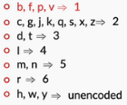

# Purpose
Even after basic lexical processing a couple of issues need to be addressed.
1. Spellings of same words can be different either due to different pronunciations, mistakes or usage differences (ex: Bangalore, Bengaluru, lol)
2. Combination of words can represent a single token (ex: Hong Kong, Indian Institute of Information and Technology)

To resolve these issues, we will take a look at the following techniques:
- Phonetic hashing and the Soundex algorithm to handle different pronunciations of a word
- The minimum-edit-distance algorithm and building a spell corrector 
- Pointwise mutual information (PMI) score to preserve terms that comprise of more than one word

# Canonicalisation
- Canonicalisation means to reduce a word to its base form
- Stemming and Lemmatization are examples

There are some cases that can’t be handled either by stemming nor lemmatization. You need another preprocessing method in order to stem or lemmatize the words efficiently.

Suppose, you are working on a text corpus which contains misspelt words. Suppose, the corpus contains two misspelt versions of the word ‘disappearing’ - ‘dissappearng’  and ’disapearing’. After you stem these words, you’ll have two different stems - ‘dissappear’ and ‘disapear’. You still have the problem of redundant tokens. On the other hand, lemmatization won’t even work on these two words and will return the same words if it is applied because it only works on correct dictionary spelling.

To deal with misspellings, you’ll need to canonicalise it by correcting the spelling of the word. Then you can perform either stemming or lemmatization. You’ll learn the concept of edit distance which can then be used to build a spell corrector to rectify the spelling errors in the text that you’re working with.

A similar problem is that of pronunciation which has to do with different dialects present in the same language. For example, the word ‘colour’ is used in British English, while ‘color’ is used in American English. Both are correct spellings, but they have the exact same problem -  ‘colouring’ and ‘coloring’ will result in different stems and lemma.

To deal with different spellings that occur due to different pronunciations, you’ll learn the concept of phonetic hashing which will help you canonicalise different versions of the same word to a base word.

## Phonetic Hashing
There are certain words which have different pronunciations in different languages. As a result, they end up being spelt differently. Examples of such words include names of people, city names, names of dishes, etc. Take, for example, the capital of India - New Delhi. Delhi is also pronounced as Dilli in Hindi. Hence, it is not surprising to find both variants in an uncleaned text corpus. Similarly, the surname ‘Agrawal’ has various spellings and pronunciations. Performing stemming or lemmatization to these words will not help us as much because the problem of redundant tokens will still be present. Hence, we need to reduce all the variations of a particular word to a common word.

To achieve this, you’ll need to know about what is called as the phonetic hashing technique.

Phonetic hashing buckets all the similar phonemes (words with similar sound or pronunciation) into a single bucket and gives all these variations a single hash code. Hence, the word ‘Dilli’ and ‘Delhi’ will have the same code.

Now, let’s arrive at the Soundex of the word ‘Mississippi’. To calculate the hash code, you’ll make changes to the same word, in-place, as follows:

1. Phonetic hashing is a four-letter code. The first letter of the code is the first letter of the input word. Hence it is retained as is. The first character of the phonetic hash is ‘M’. Now, we need to make changes to the rest of the letters of the word.

2. Now, we need to map all the consonant letters (except the first letter). All the vowels are written as is and ‘H’s, ‘Y’s and ‘W’s remain unencoded (unencoded means they are removed from the word). After mapping the consonants, the code becomes MI22I22I11I.

3. The third step is to remove all the vowels. ‘I’ is the only vowel. After removing all the ‘I’s, we get the code M222211. Now, you would need to merge all the consecutive duplicate numbers into a single unique number. All the ‘2’s are merged into a single ‘2’. Similarly, all the ‘1’s are merged into a single ‘1’. The code that we get is M21.

4. The fourth step is to force the code to make it a four-letter code. You either need to pad it with zeroes in case it is less than four characters in length. Or you need to truncate it from the right side in case it is more than four characters in length. Since the code is less than four characters in length, you’ll pad it with one ‘0’ at the end. The final code is M210.

## Edit Distance
An edit distance is the number of edits that are needed to convert a source string to a target string.

Now, the question that comes to the mind is - what’s an edit? An edit operation can be one of the following:

- Insertion of a letter in the source string. To convert ‘color’ to ‘colour’, you need to insert the letter ‘u’ in the source string.
- Deletion of a letter from the source string. To convert ‘Matt’ to ‘Mat’, you need to delete one of the ‘t’s from the source string.
- Substitution of a letter in the source string. To convert ‘Iran’ to ‘Iraq’, you need to substitute ‘n’ with ‘q’

Now, it is easy to tell the edit distance between two relatively small strings. You can probably tell the number of edits that are needed in the string ‘applaud’ to ‘apple’. Did you guess how many? You need three edits. Substitution of ‘a’ to ‘e’ in a single edit. Then you require two deletions - deletion of the letters ‘u’ and ‘d’. Hence, you need a total of three edit operations in this case. But, this was a fairly simple example. It would become difficult when the two strings are relatively large and complex. Try calculating the edit distance between ‘deleterious’ and ‘deletion’. It’s not obvious in the first look. Hence, we need to learn how to calculate edit distance between any two given strings, however long and complex they might be.

More importantly, we need an algorithm to compute the edit distance between two words. Levenshtein edit distance is one such algorithm.

Levenshtein Distance allows the following operations:
- insertion of character
- deletion of character
- substitution of character

While Damerau–Levenshtein distance allows the following operations
- insertion of character
- deletion of character
- substitution of character
- swapping (transposition) of characters

The Damerau–Levenshtein distance, apart from allowing the three edit operations, also allows the swap (transposition) operation between two adjacent characters which costs only one edit instead of two.

This edit operation was introduced because swapping is a very common mistake. For example, while typing, people mistype ‘relief’ to ‘releif’. This has to be accounted as a single mistake (one edit distance), not two.

# Spell Corrector
A spell corrector is a widely used application that you would see almost everywhere on the internet. If you have the autocorrect feature enabled on your phone, the incorrect spellings get replaced by the correct ones. Another example is when you use a search engine such as Google to search anything and mistype a word, it suggests the correct word.

Spell correction is an important part of lexical processing. In many applications, spell correction forms an initial preprocessing layer. For example, if you are making a chatbot to book flights, and you get the user request 'Book a flight from Mumbai to Bangalor', you want to gracefully handle that spelling error and return relevant results.

Now, people have made various attempts to make spell correctors using different techniques. Some are very basic and elementary which use lexical processing, while others are state-of-the-art performers which use deep learning architectures.

One of the good performing spell correctors is Norvig’s spell corrector.

# Pointwise Mutual Information
Till now you have learnt about reducing words to their base form. But there is another common scenario that you’ll encounter while working with text. Suppose there is an article titled “Higher Technical Education in India” which talks about the state of Indian education system in engineering space. Let’s say, it contains names of various Indian colleges such as ‘International Institute of Information Technology, Bangalore’, ‘Indian Institute of Technology, Mumbai’, ‘National Institute of Technology, Kurukshetra’ and many other colleges. Now, when you tokenise this document, all these college names will be broken into individual words such as ‘Indian’, ‘Institute’, ‘International’, ‘National’, ‘Technology’ and so on. But you don’t want this. You want an entire college name to be represented by one token.

To solve this issue, you could either replace these college names by a single term. So, ‘International Institute of Information Technology, Bangalore’ could be replaced by ‘IIITB’. But this seems like a really manual process. To replace words in such manner, you would need to read the entire corpus and look for such terms.

Turns out that there is a metric called the pointwise mutual information, also called the PMI. You can calculate the PMI score of each of these terms. PMI score of terms such as ‘International Institute of Information Technology, Bangalore’ will be much higher than other terms. If the PMI score is more than a certain threshold then you can choose to replace these terms with a single term such as ‘International_Institute_of_Information_Technology_Bangalore’.

You saw how to calculate PMI of a term that has two words. The PMI score for such term is:

$PMI(x, y) = log ( P(x, y)/P(x)P(y))$

For terms with three words, the formula becomes:

$PMI(z, y, x) = log [(P(z,y,x))/(P(z)P(y)P(x))] = log[(P(z|y, x)*P(y|x))*P(x)/(P(z)P(y)P(x))] = log [(P(z|y, x)*P(y|x))/([P(z)P(y))]$

Till now, to calculate the probability of your word you chose words as the occurrence context. But you could also choose a sentence or even a paragraph as the occurrence context.

If we choose words as the occurrence context, then the probability of a word is:

P(w) = Number of times given word ‘w’ appears in the text corpus/ Total number of words in the corpus

Similarly, if a sentence is the occurrence context, then the probability of a word is given by:

P(w) = Number of sentences that contain ‘w’ / Total number of sentences in the corpus

Similarly, you could calculate the probability of a word with paragraphs as occurrence context.

Once you have the probabilities, you can simply plug in the values and have the PMI score.

In practical settings, calculating PMI for terms whose length is more than two is still very costly for any relatively large corpus of text. You can either go for calculating it only for a two-word term or choose to skip it if you know that there are only a few occurrences of such terms.

You can also refer to [Palmetto](https://palmetto.demos.dice-research.org/) tool (In case this link does not work, please refer to [this](https://en.cs.uni-paderborn.de/ds/news-single/palmetto-a-quality-measuring-tool-for-topics) blog for more information about this tool) for calculating PMIs. 

After calculating the PMI score, you can compare it with a cutoff value and see if PMI is larger or smaller than the cutoff value. A good cutoff value is zero. Terms with PMI larger than zero are valid terms, i.e. they don’t need to be tokenised into different words. You can replace these terms with a single-word term that has an underscore present between different words of the term. For example, the term ‘New Delhi’ has a PMI greater than zero. It can be replaced with ‘New_Delhi’. This way, it won’t be tokenised while using the NLTK tokeniser.

# Summary
To handle words that have different spellings due to different pronunciations, you learnt the concept of phonetic hashing. Phonetic hashing is used to bucket words with similar pronunciation to the same hash code. To hash words, you used the Soundex algorithm. The American Soundex algorithm maps the letters of a word in such a way that words are reduced to a four-character long code. Words with the same Soundex code can be replaced by a common spelling of the word. This way, you learnt how to get rid of different variations in spellings of a word.

The next thing that you learnt about was the Levenshtein edit distance and spell corrector. You learnt that an edit distance is the number of edits that are needed to convert a source string to a target string. In a single edit operation, you can either insert, delete or substitute a letter. You also learnt a different variant of edit distance - the Damerau–Levenshtein distance. It lets you swap two adjacent letters in a single edit operation.

With the help of the edit distance, one can create a spell corrector. You could use that spell corrector to rectify the spelling of incorrect words in your corpus.

Lastly, you learnt about the pointwise mutual information (PMI) score. You saw how you can calculate PMI of terms with two or more words. You learnt about the concept of occurrence context. After choosing the occurrence context, you can calculate the PMI of a term and choose whether it is a valid term or not based on the cutoff value. A good cutoff value is zero. Terms that have PMI higher than zero can be replaced by a single term by simply attaching the multiple words using an underscore.
