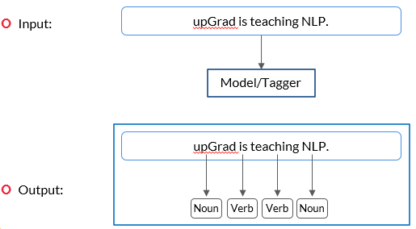
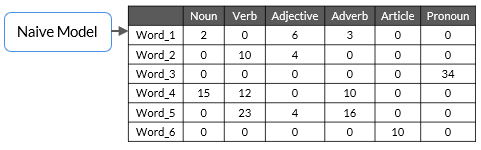
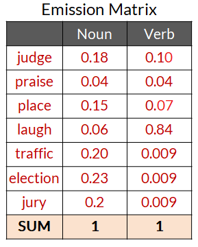
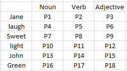
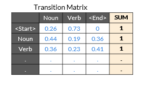
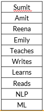
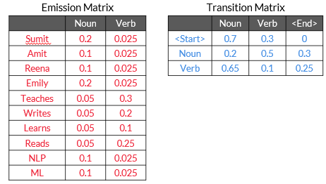

# Preface

We will learn about the algorithms and techniques that are used to analyse the syntax or the grammatical structure of sentences.

- PoS tags and PoS tagging techniques, in which you will learn algorithms such as Hidden Markov Models (HMMs) to build PoS taggers, 
- Parsing techniques and the types of parsing such as constituency parsing and dependency parsing, and
- Code demonstrations of PoS tagging and parsing techniques using the SpaCy library in Python.
- Name Entity Recognition (NER) and custom NER using Conditional Random Fields (CRF) and its python demonstration.

Let’s take a look at the sentences given below.
- ‘Is EdTech upGrad company an.’
- ‘EdTech is an company upGrad.’
- ‘upGrad is an EdTech company.’

All of these sentences have the same set of words, but only the third one is syntactically or grammatically correct and comprehensible. 

One of the most important things that you need to understand here is that in lexical processing, all of the three sentences provided above are similar to analyse because all of them contain exactly the same tokens, and when you perform lexical processing steps such as stop words removal, stemming, lemmatization and TF-IDF or CountVectorizer creation, you get the same result for all of the three sentences. The basic lexical processing techniques would not be able to identify the difference between the three sentences. Therefore, more sophisticated syntactic processing techniques are required to understand the relationship between individual words in a sentence.

# Syntactic Processing
- Arrangement of words in a sentence plays a crucial role in better understanding the meaning of the sentence. These arrangements are governed by a set of rules that we refer to as ‘syntax’, and the process by which a machine understands the syntax is referred to as syntactic processing.
- `Syntax`: A set of rules that govern the arrangement of words and phrases to form a meaningful and well-formed sentence
- `Syntactic processing`: A subset of NLP that deals with the syntax of the language.

## Applications
- Conversational systems such as Alexa, Siri etc.
- Chatbots on websites and apps (HDFC Bank, Swiggy)
- Grammar checking apps such as Grammarly

## Lexical Processing vs Syntactic Processing

| Lexical Processing                                                                                                             | Syntactic Processing                                                                                                                                                            |
|--------------------------------------------------------------------------------------------------------------------------------|---------------------------------------------------------------------------------------------------------------------------------------------------------------------------------|
| Lexical analysis is the data pre-processing and feature extraction step. It involves analysis at word level.                   | Syntactical analysis aims at finding structural relationships among the words of a sentence.                                                                                    |
| Performing text cleaning steps such as stop words removal and tokenisation of documents and then performing feature extraction | Creating parse trees for checking structural dependencies in a sentence                                                                                                         |
| does not look at word order and meaning                                                                                        | Syntactic analysis aims to find how words are dependent on each other. Changing the word order will make it difficult to comprehend a sentence.                                 |
| does not incorporating stop words to analyse the grammatical structure of sentences                                            | Removing stop words can altogether change the meaning of a sentence; hence, syntactic processing analyses the grammatical structure of a sentence by incorporating stop words.  |
| does not identifying the parts-of-speech words in a sentence                                                                   | Identifying the correct part of speech of a word is important. `Example: 'cuts and bruises on his face' (Here, 'cuts' is a noun.) 'he cuts an apple' (Here, 'cuts' is a verb.)` |
| Stemming, Stop words removal is done here                                                                                      | PoS tagging, Dependency parsing is done here                                                                                                                                    |

# POS Tagging
Let’s start with the first level of syntactic analysis: PoS (Parts of Speech) tagging. To understand PoS tagging, you first need to understand what parts of speech are. 


Let’s consider a simple example given below.
- ‘You are learning NLP at upGrad.’

From your knowledge of the English language, you are aware that in this sentence, ‘NLP’ and ‘upGrad’ are nouns, the word ‘learning’ is a verb and ‘You’ is a pronoun. 

These are called the parts of speech tags of the respective words in the sentence. 

A word can be tagged as a noun, verb, adjective, adverb, preposition, etc., depending upon its role in the sentence. These tags are called the PoS tags. 

Assigning the correct tag, such as noun, verb and adjective, is one of the most fundamental tasks in syntactic analysis.


Suppose you ask your smart home device the following question. 
- ‘Ok Google, where can I get the permit to work in Australia?’ 

The word 'permit' can potentially have two PoS tags: noun or a verb. 

In the phrase 'I need a work permit', the correct tag of 'permit' is 'noun'. 

On the other hand, in the phrase 'Please permit me to take the exam', the word 'permit' is a 'verb'.

`Parts of speech (PoS)` are the groups or classes of words that have similar grammatical properties and play similar roles in a sentence. They are defined based on how they relate to the neighbouring words.

Assigning the correct PoS tags helps us better understand the intended meaning of a phrase or a sentence and is thus a crucial part of syntactic processing. In fact, all the subsequent parsing techniques (constituency parsing, dependency parsing, etc.) use the part-of-speech tags to parse the sentence. 

A PoS tag can be classified in two ways: open class and closed class. 

## Open Class
Open class refers to tags that are evolving over time and where new words are being added for the PoS tag.
- Noun
- Verb
- Adjective
- Adverb
- Interjection

Some useful examples of open class PoS tags are as follows:

- Name of the person
- Words that can be added or taken from another language such as words taken from the Sanskrit language such as ‘Yoga’ or ‘Karma’ 
- Words that are nouns but can be used as verbs such as ‘Google’
- Words that are formed by a combination of two words such as football, full moon and washing machine

## Closed Class
Closed class refers to tags that are fixed and do not change with time.
- Prepositions
- Pronouns
- Conjunctions
- Articles
- Determiners
- Numerals

Some examples of closed-class PoS tags are as follows:
- Articles: a, an, the 
- Pronouns: you and I 

You can take a look at the universal tagsets used by the spaCy toolkit [here](https://universaldependencies.org/docs/u/pos/).


```py heading="Using spacy to generate POS Tags"
# https://stackoverflow.com/questions/54334304/spacy-cant-find-model-en-core-web-sm-on-windows-10-and-python-3-5-3-anacon
import spacy
nlp = spacy.load("en_core_web_sm")
doc = nlp("upGrad is teaching Data Science courses to the working professionals.")
print("Text : POS : TAG\n---")
for token in doc:
    print(token.text, ":", token.pos_, ":", token.tag_)
```

## POS Tagging Model

A PoS tagger is a model/algorithm that automatically assigns a PoS tag to each word of a sentence.



In this example, the input is 'upGrad is teaching NLP.'. When you put this sentence into a model or tagger, it will result in the output with respective PoS tags assigned to each word of the sentence such as ‘upGrad’ (noun), ‘is’ (verb), ‘teaching’ (verb) and ‘NLP’ (noun).

Let’s take a look at another example given below.

- Tagger input: ‘She sells seashells on the seashore.’
- Tagger output: ‘She(PRON) sells (VERB) seashells(NOUN) on(SCONJ) the(DET) seashore(NOUN).’

Now, let’s try to understand how one can build a simple rule-based PoS tagger to assign PoS tags to individual words in a sentence. 

Suppose you have been given a training dataset that comprises words and their respective PoS tags’ count. This is visually demonstrated in tabular format below. 



In this table, the word ‘Word_1’ occurs as a noun two times, and as an adjective, it occurs six times and so on in the training dataset.

The identification of PoS tags in the training dataset is done manually to predict the PoS tags of the test data.

In the table provided above, ‘Word_1’ appears as a noun two times, and as an adjective, it appears three times and so on. 

Now, suppose, you are given the following sentence (S).

S: “Word_4  Word_1  Word_3.”

The PoS tags of the words of the sentence S will be as follows:
- Word_4: Noun
- Word_1: Adjective
- Word_3: Pronoun

You assign the most frequent PoS tags that appear in the training data to the test dataset, and you realise that rule based tagger gives good results most of the time.

But, sometimes, it does not give satisfactory results because it does not incorporate the context of the word.
 
Let’s take the following example.

Consider the word ‘race’ in both the sentences given below:

‘The tortoise won the race.’
‘Due to the injury, the horse will not be able to race today.’

In the first sentence, the word ‘race’ is used as a noun, but, in the second sentence, it is used as a verb. However, using the simple frequency-based PoS tagger, you cannot distinguish its PoS tags in different situations.

### Example
In the sentence given below, A and B are the PoS tags for the word 'wound'. Which of the following options is correct? 

The bandage was wound/A around the wound/B.

| Option           | Yes/No |
|------------------|--------|
| A: Verb, B: Verb | No     |
| A: Noun, B: Verb | No     |
| A: Noun, B: Noun | No     |
| A: Verb, B: Noun | Yes    |

The first mention of 'wound' represents the injury/cut, and the second represents the act of 'winding' the bandage.

# Hidden Markov Model
In the previous segment, you learnt about PoS tagging based on the frequency of tags alone, which seems inefficient when words are used in different contexts. So, to improve this model, in this segment, you will learn about the Hidden Markov Model, which performs better and uses the context of the previous word to decide the PoS tag of the current word.

Let’s consider the following example; what does your mind process when you see the blank space at the end of this sentence?

'Rahul is driving to _____.'

Don’t you think that the blank space should be the name of a place?

How do you manage to identify that the blank space would be a name of the place? 

Try to analyse your thoughts after reading this statement, when you see the word ‘Rahul’ who is driving to some place and hence, you reach to a conclusion that the blank space should be the name of a place (noun).

This means that you have sequentially looked at the entire sentence and concluded that the blank space should be the name of a place. 

Now, what if we build an algorithm that can work sequentially to identify the PoS tags of the words based on the PoS tag of the previous word? 

## HMM

`Sequence labelling` is the task of assigning the respective PoS tags of the words in the sentence using the PoS tag of the previous word in the sentence.

Hidden Markov Model can be used to do sequence labelling, which means that it takes input of words in a sequence and assigns the PoS tags to each word based on the PoS tag of the previous word. 

Example: ‘The tortoise won the race’

In the example, to decide the PoS tag of ‘race’, the model uses the PoS tag of the previous word, i.e., ‘the’, which is an article. 

Now, let’s take a look at the following points and try to understand why Hidden Markov Model is called ‘Hidden’:

- When you observe (read/listen) a sentence, you only observe the words in the sentence and not their PoS tags; thus, PoS tags are hidden.
- You must infer these hidden tags from your observations, and that's why Hidden Markov Model is called Hidden.
 
There are majorly two assumptions that HMM follows, which are as follows:
- The PoS tag of the next word is dependent only on the PoS tag of the current word.
- The probability of the next word depends on the PoS tag of the next word. 

Before learning about HMM, you need to understand the two most important types of matrices, i.e., emission and transition matrices. In the next video, let’s take a look at an example of how you can build these matrices.

To build any machine learning model, you first need to train that model using some training data, and then, you need to use that model to predict the output on the test data.

Here, the train data is the corpus of sentences, and you need to perform some manual tasks to assign the PoS tags to each word in the corpus. Once you manually assign the PoS tags to each word in the training corpus, you create two important matrices using the training dataset, which are as follows:

### Emission matrix

This matrix contains all words of the corpus as row labels; the PoS tag is a column header, and the values are the conditional probability values.



For example, in a sample corpus, whenever a noun appears in the training corpus, there is an 18% chance that it will be the word ‘judge’. Similarly, whenever a verb appears in the training corpus, there is an 84% chance that it will be the word ‘laugh’.

So, here, 0.18 is the probability of occurrence of the word ‘judge’ given that there will be a noun at that place. In a similar way, 0.10 is the probability of occurrence of the word ‘judge’ given that there will be a verb at that place.


#### Example

Suppose you have been given the following table in which there are a total of six words and their counts in the training corpus. You are also given information regarding how many times each word appears as a noun, verb or adjective. From this table, you compute the following emission matrix.



What is the meaning of the value P11 in this table?

- It is the value of conditional probability that if there is a verb at any place in the training corpus, then the probability that it will be the word ‘light’ is equal to P11. 

### Transition matrix

This matrix contains PoS tags in the column and row headers. Let’s try to understand the conditional probability values that have been given in the following table.



Let’s take a look at the first row of the table; it represents that 0.26 is the probability of occurrence of a noun at the start of the sentence in the training dataset. In the same way, 0.73 is the probability of occurrence of a verb at the start of the sentence in the training dataset.

If you take a look at the second row, then you will see that 0.44 is the probability of occurrence of noun just after a noun in the training dataset, and similarly, 0.19 is the probability of occurrence of a verb just after a noun in the training dataset.

Essentially, the transition matrix gives the information of the next PoS tag considering the current PoS tag of the word.


## Assigning POS Tag using HMM

In HMM, you understood that transition and emission matrices specify the probabilities of transition between tags and the emission of the word from the tag, respectively. 

Suppose you have the following corpus of the training dataset.



The emission and transition matrices of this corpus are as follows:



Suppose you have been given the following test sentence to predict the correct PoS tags of the words.

S: 'Sumit teaches NLP.'

As of now, we are only considering the two PoS tags, i.e., noun (N) and verb (V).

There are many combinations of PoS tags possible for the sentence ‘S’ such as NVN, NNN, VVV and VVN or NNV.

If you calculate the total number of combinations for this example, then you will see that there are only noun and verb tags; hence, 2^3 will be the total number of combinations possible.

Let’s consider the two sequences as of now, which are NNN and NVN.

Calculate the score for the NNN sequence.

Score of NNN: 

$[P(\text{Start-Noun}) * P(\text{Sumit|Noun})] * [P(\text{Noun-Noun})*P(\text{teaches|Noun})] * [P(\text{Noun-Noun}) * P(\text{NLP|Noun})] = (0.7*0.2) *  (0.2*0.05)  * (0.2*0.1) = 0.000028$

Score of NVN:

$[P(\text{Start-Noun})*P(\text{Sumit|Noun})] * [P(\text{Noun-Verb})*P(\text{teaches|Verb})] * [P(\text{Verb-Noun}) * P(\text{NLP|Noun})] = (0.7*0.2) * (0.5*0.3) * (0.65*0.1) = 0.001365$

You get the maximum score for the NVN sequence; hence the model assigns the noun to ‘Sumit’, the verb to ‘teaches’ and another noun to ‘NLP’ in the test sentence.

### Note
In practice, you do not have to calculate these scores from scratch. You will be using an already prepared toolkit to implement HMM, but it is important to be aware of the basic techniques used in PoS tagging. 

Although you are not going to implement these PoS tagging techniques in the real-life scenario, you are going to use the SpaCy library to tag the correct PoS tags that are based on the neural network models. It is important to have an intuitive understanding of these techniques, including the rule-based tagger and HMM, to understand how a PoS tagger works.

# References
- [pos tags](https://universaldependencies.org/docs/u/pos/)
- [spacy](https://spacy.io/)
- [penn treebank pos tags](https://www.ling.upenn.edu/courses/Fall_2003/ling001/penn_treebank_pos.html)
