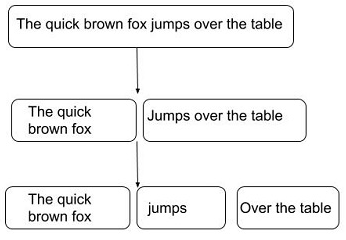
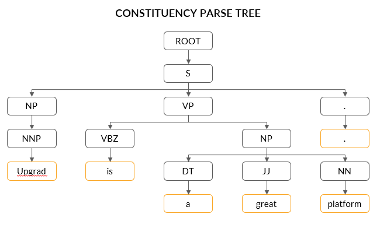
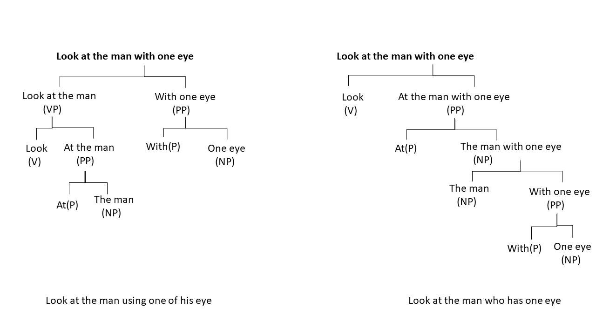
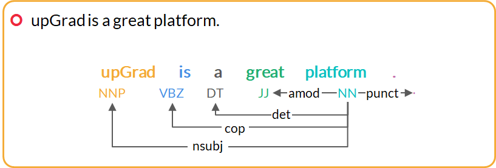
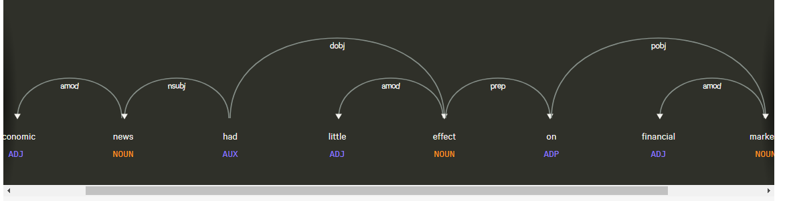

<!-- vim-markdown-toc GFM -->

* [Preface](#preface)
* [Constituency Parsing](#constituency-parsing)
        * [Question](#question)
* [Dependency Parsing](#dependency-parsing)
* [References](#references)

<!-- vim-markdown-toc -->

# Preface

A key task in syntactic processing is parsing. It means to break down a given sentence into its 'grammatical constituents'. Parsing is an important step in many applications that helps us better understand the linguistic structure of sentences.

You need to learn techniques that can help you understand the grammatical structures of complex sentences. Constituency parsing and dependency parsing can help you achieve that.

Let’s understand parsing through an example. Suppose you ask a question answering (QA) system, such as Amazon's Alexa or Apple's Siri, the following question. 

"Who won the FIFA World Cup in 2014?"

The QA system can respond meaningfully only if it understands that the phrase ‘FIFA World Cup' is related to the phrase 'in 2014'. The phrase 'in 2014' refers to a specific time frame and thus modifies the question significantly. Finding such dependencies or relations between the phrases of a sentence can be achieved using parsing techniques.

Let's take another example sentence to understand how a parsed sentence looks like. 

"The quick brown fox jumps over the table." 

The figure given below shows the three main constituents of this sentence. 



This structure divides the sentence into the following three main constituents:
- 'The quick brown fox', which is a noun phrase 
- 'jumps', which is a verb phrase
- 'over the table', which is a prepositional phrase

# Constituency Parsing
Constituency parsing is the process of identifying the constituents in a sentence and the relation between them.

For example, “upGrad is a great platform.”

Here, ‘upGrad’ is the noun phrase, and ‘is a great platform’ is the verb phrase.

The figure shown below represents the parse tree that shows how parsers implement parsing based on grammar.



To summarise the chart given above, a constituent parse tree can be divided into three levels, which are as follows: 

1. Sentence constituent:
    - S (upGrad is a great platform)
    - NP: Noun phrase (upGrad) 
    - VP: Verb phrase (is a great platform) 
2. Sentence words:  ‘upGrad’, ‘is’, ‘a’, ‘great’, ‘platform’
3. Part-of-speech tags: NNP, VBZ, NP, DT, JJ, NN 

A constituency parse tree always contains the words of a sentence as its terminal nodes. Usually, each word has a parent node containing its part-of-speech tag (noun, adjective, verb, etc.).

All the other non-terminal nodes represent the constituents of the sentence and are usually one of verb phrases, noun phrases or prepositional phrases (PP).

In this example, at the first level below the root, the sentence has been split into a noun phrase, made up of the single word “upGrad” and a verb phrase “is a great platform”. This means that grammar contains a rule such as S -> NP VP, meaning that a sentence can be created with the concatenation of a noun phrase and a verb phrase.

Similarly, the noun phrase is divided into a determiner, adjective and noun.

To summarise, constituency parsing creates trees containing a syntactical representation of a sentence according to a context-free grammar rule. This representation is highly hierarchical and divides the sentences into its single phrasal constituents.

Constituency parsing has been used in word processing software, grammar checking software, question answering system, etc.

The example ‘We saw the Statue of Liberty flying over New York.’ Although having the same arrangement of words, the sentence can be interpreted in the following two ways:
- Person saw that the ‘Statue of Liberty’ was flying. 
- A person is flying over New York he/she saw ‘Statue of Liberty’ from the top.

To understand ambiguity with a parse tree, let’s consider the following sentence.

 “Look at the man with one eye.”

This sentence may have the following two meanings: 
- Look at the man using only one of his eyes.
- Look at the man who has one eye.

Their respective parse trees are shown in the figure given below.



There are two parse trees possible for this sentence; if we are able to identify the relationship among the words instead of looking at individual constituents or PoS tags, then understanding each word with other words will be easier, and the machine will be able to understand the syntax or meaning of the sentence better. This relationship structure can be drawn using the dependency parsing technique.

In general, since natural languages are inherently ambiguous (at least for computers to understand), there are often cases where multiple parse trees are possible, such as those in the example provided above. So, to understand the relationship between different words, you need to use dependency parsing.

### Question

**Which of the following statements about constituency parsing is not true?**

| Statement                                                                             | True / False |
|---------------------------------------------------------------------------------------|--------------|
| It organises words into nested constituents such as noun phrase and verb phrase.      | True         |
| It always contains the PoS tags of the words of a sentence as its terminal nodes.     | False        |
| It checks whether a sentence is semantically correct, i.e., whether it is meaningful. | False        |

- Constituency parsing segregates sentences into constituents of the same paradigm.
- Words of a sentence are present as the terminal node of the constituency parse tree.
- Constituency parsing finds structural dependencies in a sentence.


# Dependency Parsing
Until now, we discussed constituency parsing where groups of words or constituencies form the basic structure of a parse tree. In this segment, we will introduce an alternate paradigm of grammar called dependency grammar and related dependency parsing techniques.

In dependency parsing, we do not form constituencies (such as noun phrase and verb phrase) but rather establish a dependency between the words themselves.

Dependency parsing identifies the relation between words and produces a concise representation of these dependencies. 

In the example ‘upGrad is a great platform’, constituency parsing fails to explain how ‘great’ is related to the two nouns of the sentence ‘upGrad’ and ‘platform’. Is ‘great’ related more to ‘upGrad’ than to ‘platform’? Whereas, dependency parsing tells us that ‘great’ is a modifier of ‘platform’. Similarly for the two nouns, ‘upGrad’ is the subject of another noun ‘platform’.



Now, let’s take another example of the dependency parse tree. It is as follows:

Sentence: “Economic news had little effect on financial markets.”


You can visualise the dependency parse of this sentence [here](https://explosion.ai/demos/displacy?text=Economic%20news%20had%20little%20effect%20on%20financial%20markets&model=en_core_web_sm&cpu=0&cph=0). Also, in the diagram shown below, we have merged the phrases such as 'Economic news' and 'little effect'.



Let’s identify the role of each word one by one, starting with the root verb.

- The word 'had' is the root. 
- The phrase ‘Economic news’ is the nominal subject (nsubj).
- The phrase 'little effect' is the direct object (dobj) of the verb 'had'.
- The word 'on' is a preposition associated with 'little effect'.
- The noun phrase 'financial markets' is the object of 'on'.

Now, let’s take a look at the role of each word in the parse. 

- The word 'Economic' is the modifier of ‘news’. 
    - news -> amod -> economic
- The words ‘financial’ and ‘little’ modify the words 'markets' and 'effect', respectively.
    - effect -> amod -> little
    - markets -> amod -> financial
- The two words ‘on’ and ‘markets’ have no incoming arcs. The word ‘on’ is dependent on the word ‘effect’ as a nominal modifier.
    - effect -> prep -> on
- The word ‘markets’ is an object of the word ‘on’.
    - on -> pobj -> markets

Moving further, you need to keep the following points in mind while understanding the dependency parse model:
- Each word is a node in a parse tree.
- There is exactly one node with no incoming arc (root).
- Each non-root node has exactly one incoming arc.
- There is a unique path from the root node to each non-root node.

In this way, dependency parsers relate words to each other.

```py heading='Visualize dependency parsing tree using spaCy'
import spacy
from spacy import displacy
nlp = spacy.load("en_core_web_sm")

# Define active and passive sentences.
active = ['Hens lay eggs.',
         'Birds build nests.',
         'The batter hit the ball.',
         'The computer transmitted a copy of the manual']
passive = ['Eggs are laid by hens',
           'Nests are built by birds',
           'The ball was hit by the batter',
           'A copy of the manual was transmitted by the computer.']

# Visualise the parse tree of all the active sentences.
for sent in active:
    doc = nlp(sent)
    displacy.render(doc, style="dep")

# Visualise the parse tree of all the active sentences.
for sent in passive:
    doc = nlp(sent)
    displacy.render(doc, style="dep")
```

Please note that the number of arrows emitting from a particular word of a sentence in the dependency parse tree are called the ‘children’ of that word.

The root word in any dependency parse tree does not have any parent. It will however have children.

# References
- [Universal Dependency Tags](https://universaldependencies.org/docs/en/dep/)
- [Dependency Parsing - Visualization](https://explosion.ai/demos/displacy?text=I%20prefer%20morning%20flights&model=en_core_web_sm&cpu=0&cph=0)
- [spaCy - Matcher](https://spacy.io/api/matcher)
- [spaCy - Rule Based Matching](https://spacy.io/usage/rule-based-matching)
