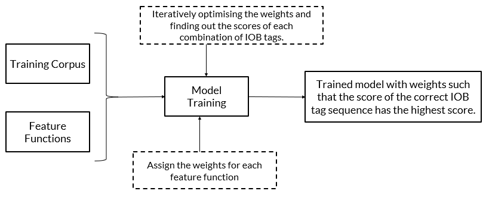
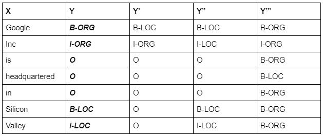
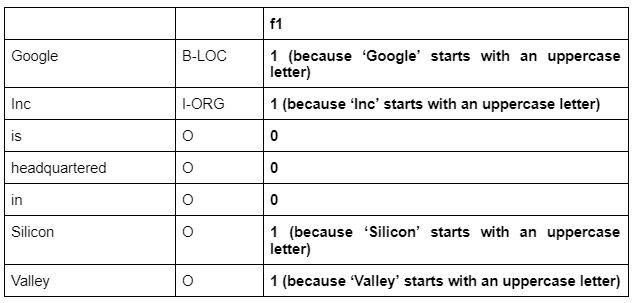
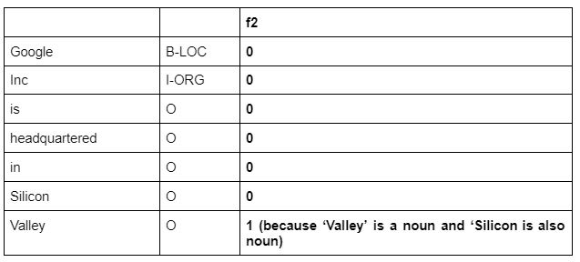
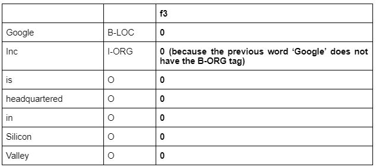
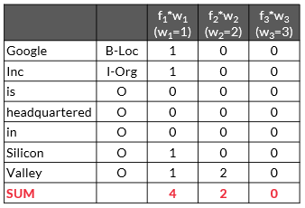
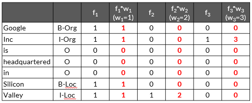
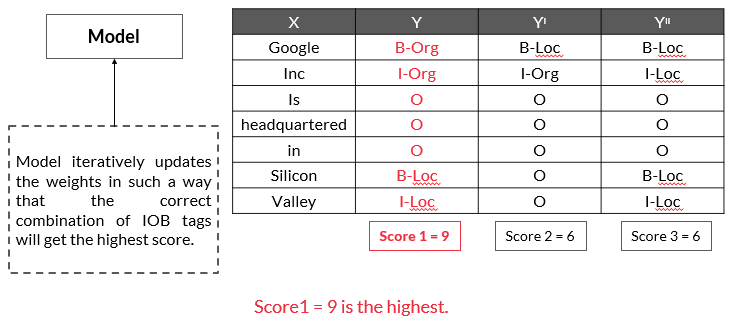
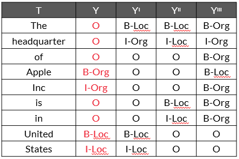

# Preface
As you already know, with the help of PoS tagging and parsing techniques, you can determine the relationship between the words in a sentence. Now, the next step of understanding the text is Named Entity Recognition (NER).

Consider the following two representations of the given sentence:

‘John bought 300 shares of Apple in 2006’

Representation 1:  John[NOUN] bought 300 shares  of Apple[NOUN] in 2006[NUMBER]

Representation 2:  John[PERSON] bought 300 shares of Apple[ORGANISATION] in 2006[DATE]

As you can see, Representation 1 has tagged the words ‘John’ and ‘Apple’ as nouns and ‘2006’ as a number. 

On the other hand, Representation 2 indicates the entity of the words like ‘John’ is tagged as ‘PERSON’ and ‘Apple’ as ‘ORGANISATION’, which provides information about the entities present in the sentence. This output can be achieved by using NER techniques. Essentially, with the help of NER, you will be able to find what the word is referring to like ‘John’ is a person and ‘Apple’ is an organisation.

# Named Entity Recognition
Named Entity Recognition (NER) enables you to easily identify the key elements in a piece of text, such as a person’s name, locations, brands, monetary values, dates and so on. NER techniques are applied in various fields such as search engine, chatbot and mainly in entity extraction in the long texts such as reviews, books, blogs and comments.

Some example sentences with their named-entity recognition are as follows:

Note that GPE is short for the geopolitical entity, ORG is short for organisation and PER is short for a person.

- S: ‘Why is Australia burning?’
    - NER:   ‘Why is Australia[GPE] burning?’

- S: ‘UK exits EU’
    - NER:  ‘UK[GPE] exits EU[ORG]’
 
- S: ‘Joe Biden intends to create easier immigration systems to dismantle Trump's legacy’
    - NER: ‘Joe Biden[PER] intends to create easier immigration systems to dismantle Trump's[PER] legacy’
 
- S: ‘First quarter GDP contracts by 23.9%’
    - NER: ‘First quarter[DATE] GDP contracts by 23.9%[PERCENT]’

Some commonly used entity types are as follows:
- PER: Name of a person (John, James, Sachin Tendulkar)
- GPE: Geopolitical entity (Europe, India, China)
- ORG: Organisation (WHO, upGrad, Google)
- LOC: Location (River, forest, country name)

Most named entities are Nouns.

## Noun POS Tags
Noun PoS tags: Most entities are noun PoS tags. However, extracting noun PoS tags is not enough because in some cases, this technique provides ambiguous results. 

Let’s consider the following two sentences:
- ‘Java is an Island in Indonesia.’
- ‘Java is a programming language.’

PoS tagging only identifies ‘Java’ as a noun in both these sentences and fails to indicate that in the first case, ‘Java’ signifies a location and in the second case, it signifies a programming language.

A similar example can be ‘Apple’. PoS tagging fails to identify that ‘Apple’ could either be an organisation or a fruit.

Let’s take a look at a simple rule-based NER tagger.

## Simple rule-based NER tagger
Simple rule-based NER tagger: This is another approach to building an NER system. It involves defining simple rules such as identification of faculty entities by searching ‘PhD’ in the prefix of a person's name.

However, such rules are not complete by themselves because they only work on selected use cases. There will always be some ambiguity in such rules. 

Therefore, to overcome these two issues, Machine Learning techniques can be used in detecting named entities in text.

The following techniques can be used to extract named entities:
- Extracting nouns from the text as a named entity
    - Most of the time, noun PoS tags help in finding named entities.
- Using machine learning to find a named entity
    - ML algorithm can be used to train a model from a labelled data set and to predict the named entities present in the given text.
- Creating rules for all the possible cases to find a named entity
    - A rule-based approach can find a named entity, but sometimes it can be difficult to create complete rules.

# IOB Labelling
IOB (inside-outside-beginning) labelling is one of many popular formats in which the training data for creating a custom NER is stored. IOB labels are manually generated.

This helps to identify entities that are made of a combination of words like ‘Indian Institute of Technology’, ‘New York’ and ‘Mohandas KaramChand Gandhi’.

Suppose you want your system to read words such as ‘Mohandas Karamchand Gandhi', ‘American Express’ and ‘New Delhi’ as single entities. For this, you need to identify each word of the entire name as the PER (person) entity type in the case of, say, ‘Mohandas Karamchand Gandhi'. However, since there are three words in this name, you will need to differentiate them using IOB tags.

The IOB format tags each token in the sentence with one of the following three labels: I - inside (the entity), O - outside (the entity) and B - at the beginning (of entity). IOB labelling can be especially helpful when the entities contain multiple words. 

So, in the case of ‘Mohandas Karamchand Gandhi', the system will tag ‘Mohandas’ as B-PER, ‘Karamchand’ as I-PER and ‘Gandhi' as I-PER. Also, the words outside the entity ‘Mohandas Karamchand Gandhi' will be tagged as ‘O’.

Consider the following example for IOB labelling:
Sentence: ‘Donald Trump visit New Delhi on February 25, 2020 ”

| Donald   | Trump    | visit | New   | Delhi | on | February | 25     | ,      | 2020   |
|----------|----------|-------|-------|-------|----|----------|--------|--------|--------|
| B-Person | I-Person | O     | B-GPE | I-GPE | O  | B-Date   | I-Date | I-Date | I-Date |

In the example above, the first word of more than one-word entities starts with a B label, and the next words of that entity are labelled as I, and other words are labelled as O.

Note that you will not always find the IOB format only in all applications. You may encounter some other labelling methods as well. So, the type of labelling method to be used depends on the scenario. Let's take a look at an example of a healthcare data set where the labelling contains 'D', 'T', and 'O', which stand for disease, treatment and others, respectively.

S: ‘In[O] the[O] initial[O] stage[O], Cancer[D] can[O] be[O] treated[O] using[O] Chemotherapy[T]’

```py heading="Named Entity Recognition using spacy"
import spacy 
model = spacy.load("en_core_web_sm")
doc = "Any sentence"
 
processed_doc = model(doc)
for ent in processed_doc.ents:
  print(ent.text, " -- ", ent.start_char, " -- ", ent.end_char, " -- ", ent.label_)
```

# Sequence Labelling

Consider the following two sentences:
- ‘I drove away in my Jaguar.’
- ‘The deer ran away seeing the Jaguar.’

The word ‘Jaguar’ in the first sentence refers to a car manufacturing company, and in the second sentence, it refers to a species of animal.

You can not perform Named Entity Recognition using a predefined model in spaCy all the time because you may get the wrong result

Can you recall the PoS tagging using the HMM model approach, which is based on the sequence labelling technique?
 
The same approach of sequence labelling can be used to perform Name Entity Recognition tasks. 

The Conditional Random Field (CRF) can be used as a sequence labelling technique for performing NER tagging. CRF is used to perform custom NER.

# Conditional Random Field
Conditional Random Fields are the class of probabilistic models. There are two terms in the CRF nomenclature that you need to keep in mind, which are as follows:
- Random fields: These indicate that the CRF is probability a distribution-based machine learning model.
- Conditional: This indicates that the probabilities are conditional probabilities.



In most of the machine learning model building exercises, you need to build the model using a training data set. Once your model is ready, you test the accuracy of the model or evaluate its performance using the test data set or, in other words, you perform the prediction using the test data set. Similarly, you will train the CRF model using the train data set and get the predictions using the already trained model.

## CRF Training
In order to train or build the model, consider the following sentences as the training corpus:
- X1= ‘Google Inc. is headquartered in Silicon Valley.’
- X2= ‘I went to New York.’

In the training data set, the NER tags such as IOB tags are assigned manually, as shown below.
- X1= Google (B-ORG) Inc (I-ORG) is (O) headquartered (O) in (O) Silicon (B-LOC) Valley (I-LOC). 
- X2= I (O) went (O) to (O) New (B-LOC) York (I-LOC).

Where,
ORG and LOC stand for organisation and location, respectively.

For a better understanding of the end-to-end process of training the model, we are considering only two IOB tags, ORG (organisation) and LOC (location).

To simplify, let’s consider only sentence ‘X1’ in the training corpus. For O, ORG and LOC, there can be multiple combinations of IOB tags possible for the model for sentence ‘X1’. Some of them can be written as shown in the table below.

Note that for ‘X1’, we will be using ‘X’ in further discussions.



So, for the input sentence ‘X’, there can be multiple combinations of IOB tags possible, and some of them are shown in the above table. The highlighted one is the correct combination, which is tagged manually in the training data set The model needs to train itself or assign the weights in such a way that it assigns the highest score to the correct combination.

Now, apart from the training data set, you require features and their values to train a machine learning model. Here, the training corpus is nothing but the text data. You need to create features out of this text data, which you can feed into the model.

In any machine learning model building task, you need to define the features you want to feed into the model. In custom NER applications, you can define the features using the CRF technique. After defining the features and obtaining their numerical values, you will understand how the model calculates weights and scores. 

## CRF Training - Custom Features
Some commonly used features in the CRF technique for NER applications are as follows:
- You can build logic on the input word ‘xi’ and on the surrounding words, which could be ‘xi-1’ or ‘xi+1’.
- The PoS tag of the word ‘xi’ and surrounding words.
- Is a particular word present in a dictionary (dictionary of common names, dictionary of organic chemicals, etc.)
- Word shapes:
    - 26-03-2021 => dd-dd-dddd
    - 26 Mar 2021 => dd Xxx dddd
    - W.H.O => X.X.X
- Presence of prefix and suffixes 

So, we defined three feature functions for this example, which are as follows:
- f1 (X, xi, xi-1, i) = 1 if xi= Xx+; otherwise, 0 (Words starting with an uppercase letter)
- f2 (X, xi, xi-1, i) = 1 if xi= Noun and xi-1 is Noun; otherwise, 0 (Continuous entity)
- f3 (X, xi, xi-1, i) = 1 if xi = Inc and xi-1 = B-Org; otherwise, 0 (Company names often end with Inc.)

We can elaborate the definition of the feature functions as follows:
- The f1 feature indicates that if a particular word in the given sentence starts with an uppercase letter, then assign 1 as the value of f1; otherwise, assign 0 as the value of f1 to this word. 
- The f2 feature indicates that if a particular word in the given sentence has a PoS tag of noun and the word before it also has a PoS tag of noun, then assign 1 as the value of f2 as to this word; otherwise, assign 0 as the value of f2 to this word.
- The f3 feature indicates that if a particular word in the given sentence is ‘Inc’ and the word before it has the NER tag of B-ORG, then assign 1 the value of f3 to this word; otherwise, assign 0 as the value of f3 to this word.
 
So, the model considers all the possible combinations of IOB tags of the given training example and calculates the scores of each combination using the weights corresponding to each feature function. The model starts the computation by taking any random initial weights for each feature function and iteratively modifies the weights until it reaches a stage where the score of the correct IOB tag sequence is the highest.

Let’s consider the weights as w1, w2 and w3, corresponding to the features f1, f2 and f3, respectively.

Let’s first calculate the values of all three features for the Y’ combination of IOB tags. 

X = Google (B-LOC) Inc (I-ORG) is (O) headquartered (O) in (O) Silicon (O) Valley (O). 

**F1 Output**

f1 (X, xi, xi-1, i) = 1 if xi= Xx+; otherwise, 0 (words starting with an uppercase letter)



**F2 Output**

f2 (X, xi, xi-1, i) = 1 if xi= Noun and xi-1 is Noun; otherwise, 0 (Continuous entity)



**F3 Output**

f3 (X, xi, xi-1, i) = 1 if xi = Inc and xi-1 = B-Org; otherwise, 0 (Company names often end with Inc)



## CRF Training - Score calculation using weights
Let’s consider the final optimised weights calculated by the model after many iterations are w1, w2 and w3, corresponding to the features f1, f2 and f3, respectively, and the values of optimised w1, w2 and w3 are 1, 2 and 3, respectively.

We will calculate the values of scores corresponding to each of the combinations of NER tags after the model has iteratively optimised the weights as w1 = 1, w2 = 2 and w3 = 3, corresponding to the features f1, f2 and f3, respectively.

Let’s consider the Y’ combination of the NER tags for the given training data set.



As we have already discussed, the model optimises the weights corresponding to each of the features f1, f2 and f3, and the values of optimised w1, w2 and w3 are 1, 2 and 3, respectively.

So, the value of the score for this combination of NER tags will be 4+2+0 = 6, which you will obtain after multiplying each feature function values with their corresponding weights, as shown in the table above. 

Similarly, we will calculate score for all combinations.



We can see that the maximum score is 4+2+3 = 9, which will be the considered the correct NER Tag sequence.

To understand the CRF intuitively, we are considering the values of w1, w2 and w3 as 1, 2 and 3, respectively. We arrived at these values after optimising the weights. Using these weights, our model obtains the maximum score of 9 for the correct NER tag sequence.

It is important to note that the model finally calculates the scores for all the combinations, and the weights are chosen in such a way that the model calculates the highest score for the correct labelling sequence.

As a summary point you can keep the following image:



## CRF Predictions
To understand the prediction part, let’s consider the following test sentence ‘T’:

T= ‘The headquarter of Apple Inc is in United States.’

The correct NER tags for this sentence will be as follows:

T= ‘The (O) headquarter (O) of (O) Apple (B-ORG) Inc (I-ORG) is (O) in (O) United (B-LOC) States (I-LOC).’

Ideally, the pre-trained CRF model should predict these correct NER tags. As you already know, the model will have many possible combinations for this test sentence. Some of the possible combinations are given in the table given below.



Where, The red values represent the correct combinations for ‘T’.

So, the model calculates the scores for each possible combination of NER tags for a given input ‘T’ using the already trained weights and provides the output with an NER sequence that has the highest score.

This is how the model predicts the sequence of NER tags for a given input. If the model calculates the highest score for a different incorrect combination of NER sequence, then it will predict that incorrect sequence as the output, and the model will throw an error.

If our model is trained correctly, then it should generate the highest score for the correct NER sequence using the trained weights.
