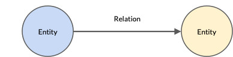
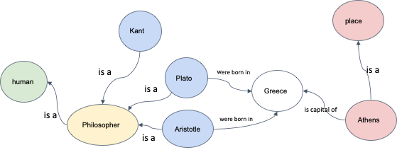

<!-- vim-markdown-toc GFM -->

* [Preface](#preface)
* [Knowledge Graphs](#knowledge-graphs)
* [Types of Relationships](#types-of-relationships)
* [Word Sense Disambiguation](#word-sense-disambiguation)
* [References](#references)

<!-- vim-markdown-toc -->

# Preface

Syntactic processing involved the study of grammar to understand the meaning of sentences. However, there is no single encompassing rule book that defines grammar because language is always evolving. On the other hand, the text data that is generated is mostly grammatically incorrect. 

However, we do not rely on grammar to understand the language. Remember when you were a child, you had no idea about grammar but still could understand the language easily. 

Example: ‘I is a data scientist’. Although this is grammatically incorrect, we can understand it perfectly. 

In ‘Semantic Processing’,we learn about techniques and algorithms to infer the meaning of a given piece of text.

Semantic processing is probably the most challenging area in the field of NLP partly because the concept of 'meaning' itself is quite wide and because it is difficult to make machines understand the text the same way as we do–inferring the intent of a statement, the meanings of ambiguous words, dealing with synonyms, detecting sarcasm, etc.

However, we rely on the meaning and context of the words to understand the language; hence, we need semantic processing. 

# Knowledge Graphs

A graph data structure consists of a finite set of vertices (also called nodes or points), where some pairs are connected through edges.

In the case of semantic processing, the text data is aggregated on the graph-based data structure. In the knowledge graph, entities are represented by nodes, where some pairs of the entities are related in some sense. These relations are represented by edges.

These graphs contain the semantic information of different entities. An example of a knowledge graph is given below.

You can see the different types of entities, which are human, occupation, names of people and names of places.

The different types of relationships are ‘is a’, ‘was born in’ and ‘is capital of’. 

This is a simple representation of graphs however, graphs are generally very complex structures. 

The different types of knowledge graphs are as follows:
- [WordNet](https://wordnet.princeton.edu/): This is a lexical database of semantic relations between words. It is developed by Princeton University.
- [ConceptNet](https://conceptnet.io/): This is a freely available semantic network that is designed to help computers understand the meanings of words that people use. It is developed by MIT.
- Unified Medical Language System (UMLS): It is a set of files and software that brings together many health and biomedical vocabularies and standards to enable interoperability between computer systems.
    [concept_net](concept_net.png)

Suppose you need to understand the text data that is related to the medical field. If you use WordNet or ConceptNet, you will have words that do not have relevance, and the results will be inaccurate. Hence, you require domain-specific knowledge graphs.

We know the famous knowledge graph called Google Search.

Although these are openly available knowledge graphs, many companies create their own knowledge graphs according to their company requirements.
- Microsoft uses knowledge graphs for the Bing search engine, LinkedIn data and academics.
- Facebook develops connections between people, events and ideas, focusing mainly on news, people and events related to the social network.
- IBM provides a framework for other companies and/or industries to develop internal knowledge graphs.
- eBay is currently developing a knowledge graph that functions to provide connections between users and the products present on the website.

Watson is a question answering computer system that can answer questions posed in natural language. It is based on knowledge graphs. You can watch Watson winning the famous game of jeopardy [here](https://www.youtube.com/watch?v=P18EdAKuC1U).

# Types of Relationships
The types of relationship between different words can be grouped as follows:

- Synonym: A relation between two similar concepts
    - Example: Large is a synonym of big.

- Antonym: A relation between two opposite concepts
    - Example: Large is an antonym of small.

- Hypernym: A relation between a concept and its superordinate. A superordinate is all-encompassing.
    - Example: Fruits is the hypernym of mango.

- Hyponym: A relation between a concept and its subordinate
    - Example: Apple is the hyponym of fruits.

- Holonym: A relation between a whole and its parts
    - Example: Face is the holonym of eyes.
    - Term ‘A’ is said to be a holonym of a term ‘B’  if A has several parts and B is one of them.

- Meronym: A relation between a part and its whole.
    - Example: Eyes is the meronym of human body

WordNet contains word senses for each word, and these senses are related through different relations.

# Word Sense Disambiguation

Homonymy is when a word has multiple (entirely different) meanings. For example, consider the word ‘pupil’. It can either refer to students or eye pupils depending on the context in which it is used. 

Suppose you are searching for the word ‘pupil’. The search engines sometimes give data relevant to the context and sometimes give irrelevant data. Such things happen because the query may contain words whose meaning is ambiguous or those having several possible meanings.

To solve this ambiguity problem, the Lesk algorithm is used.

You can consider the definitions corresponding to the different senses of the ambiguous word and determine the definition that overlaps the maximum with the neighbouring words of the ambiguous word. The sense that has the maximum overlap with the surrounding words is then chosen as the ‘correct sense’.

# References
- [snomed - online browser](https://browser.ihtsdotools.org/)
- [WordNet](https://wordnet.princeton.edu/)
- [Word Senses and WordNet](https://web.stanford.edu/~jurafsky/slp3/18.pdf)
