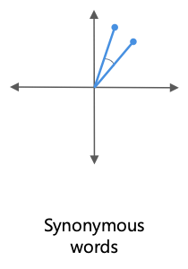
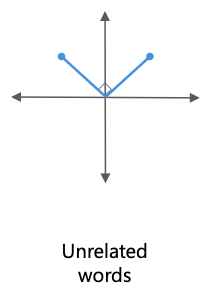
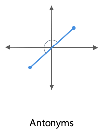

<!-- vim-markdown-toc GFM -->

* [Preface](#preface)
* [Distributional Semantics](#distributional-semantics)
* [Geometric Representation](#geometric-representation)
    * [Cosine Similarity](#cosine-similarity)
* [Machine Learning Approach](#machine-learning-approach)
    * [Types of Models](#types-of-models)
* [Binary Classification](#binary-classification)
* [Embeddings](#embeddings)
* [References](#references)

<!-- vim-markdown-toc -->

# Preface
From a technical point of view, grammar is a set of rules that need to be followed while constructing a sentence. However, several sentences are bound by the rules of grammar yet are gibberish. For example, take a look at the following sentence by Norm Chomsky who is an American linguist.

“Colorless green ideas sleep furiously.”

This sentence is structured correctly from a grammatical point of view. The noun (ideas) is described by an adjective (green) and followed by a verb (sleep). Yet, the meaning of the sentence is ambiguous. 

Additionally, since language is an evolving concept, grammar keeps changing to match the needs of the era. Most of the communication done nowadays is via text or social media. Here, a more relaxed and informal tone of writing is used yet, it is still packed with information. 

In both these cases, one needs to stop relying on syntactic processing and use semantic processing. 

# Distributional Semantics
What do you do first when you come across a word you are unfamiliar with? 

The dictionary definitions are not quite straightforward. Understanding a definition refers to understanding all the words within the definition of the word. However, we do not rely on a dictionary every time we don’t understand the meaning of a word.

You understand the meaning of the word from the overall context of the surrounding words. For example, let us assume that one does not know the meaning of the word ‘credit”. 

After reading the sentence ‘The money was credited to my bank account’, one can easily infer that the word ‘credit’ is related to the exchange of currency. The words ‘money’ and ‘account’ set a context to the sentence that implies the predicted meaning. Through intelligent predictions such as this one, the meaning of words in a sentence becomes quite intuitive.

Hence, it was rightly said by the English linguist John Firth in 1957 -

 “You shall know a word by the company it keeps.”

Distributional semantics creates word vectors such that the word’s meaning is captured from its context.

# Geometric Representation 

- Words can be represented as vectors
    - King - Man + Woman = Queen

## Cosine Similarity
The fundamental way of measuring the similarity between two vectors is the cosine similarity.

$\cos \theta = \frac{x.y}{|x||y|}$

According to the value of cosine similarity, one can infer several factors about a relations between words:

- For smaller $\theta$, the cosine value is close to 1. Such words are called synonymous words.

    

- For $\theta = 90$ and $\cos\theta = 0$ corresponds to unrelated words.
 
    

- For $\theta$ values where cosine value is negative, words are called antonyms.

    

# Machine Learning Approach
1. Train a model to predict words that will appear in blanks for sentences such as "All that ___ is not gold". Essentially, we build a neural network that predicts a word, give_3n the nearby (surrounding) words.
2. We train the model such that it starts predicting well enough.
3. We are not interested in the output of the neural network, but rather the weights which the network has learned. These contain the semantic information, known as "Word Embeddings".

## Types of Models
1. CBoW - Continuous Bag of Words
2. Skip Gram

| CBoW                                        | Skip Gram                                   |
|---------------------------------------------|---------------------------------------------|
| predict middle word given surrounding words | predict surrounding words given middle word |

My experience with upGrad has been great.

| Model     | X(input)    | Y(output)   |
|-----------|-------------|-------------|
| CBOW      | [with, has] | upGrad      |
| Skip-Gram | upGrad      | [with, has] |

# Binary Classification
- The traditional CBOW and Skip Gram models have an output layer which contains 500 thousand words and hence it is computationally expensive to train the model (predicting softmax for each output neuron).
- Moreover, the weights dimension cannot be reduced as we need all those embeddings to understand the corpus during prediction.
- To simplify the problem, we will predict whether given a set of words, they appear in the same context or not. When we do this, it simply becomes a zero or one (i.e. binary classification) problem.

To perform 2-class classification, you need a positive and a negative class.

To generate positive class, we can pick a window size and just slide it over the text as the words within the same window are bound to be in the context of each other.

To generate negative class,
- When parsing the corpus, pick a word as a context word.
- Pick a random, infrequent word from the vocabulary as the target word.
- Label this pair as a negative sample.

# Embeddings
1. Convert sentence to tokens
2. Convert tokens to numbers
3. Convert sentence to array based on above generated token indexes
4. Convert array to embedding such that each word in a sentence is represented as a matrix
5. Convert embedding to a fixed dimension irrespective of sentence size (number of words in sentence) using Average Pooling. This gives one vector for each sentence / document in the corpus.

Do note that when sentences of shorter lengths appear, we need to add padding to them. This way, all the corpus documents have same length when converted to an embedding to maintain consistency. 

The sentence with the longest length in the corpus is taken as the max length and any sentence shorter than that will undergo padding to reach to that length. We add 0s in padding, and digits starting from 1 are used for labelling words in the corpus.

# References
- [Word Embeddings](https://embeddings.macheads101.com/word?word=football)
