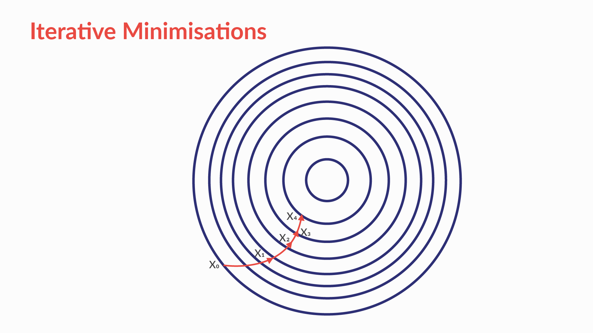
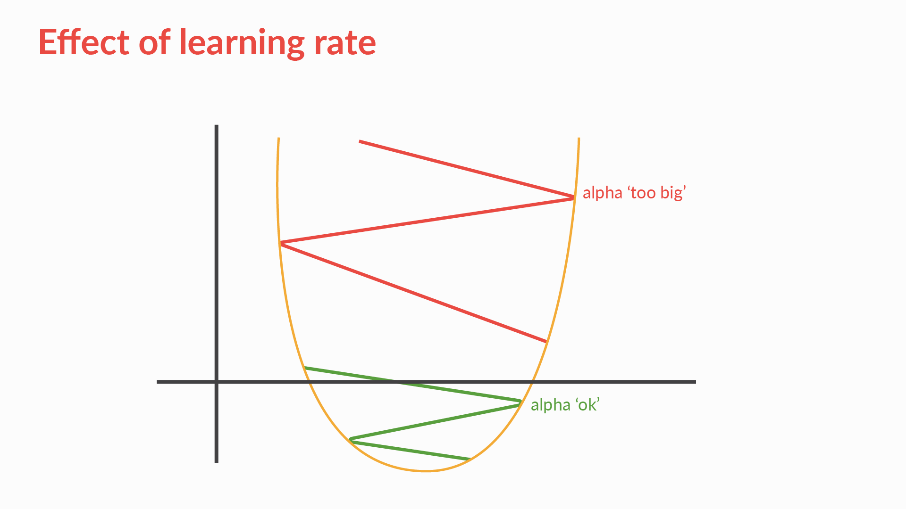
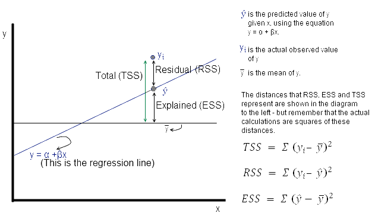
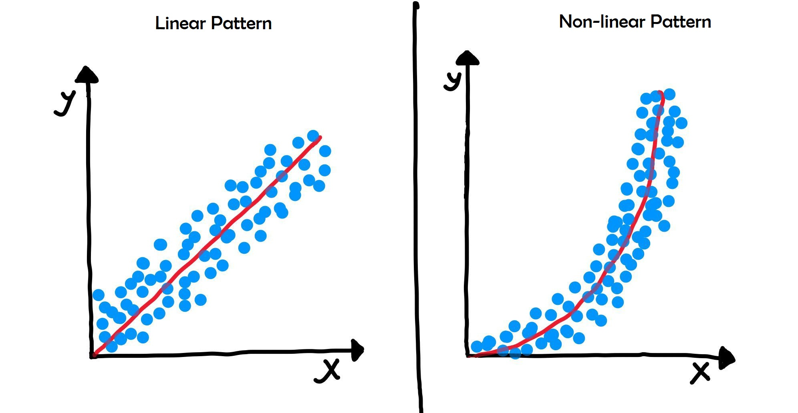
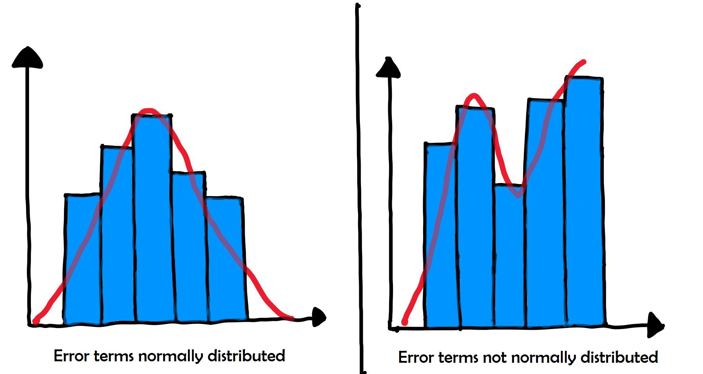
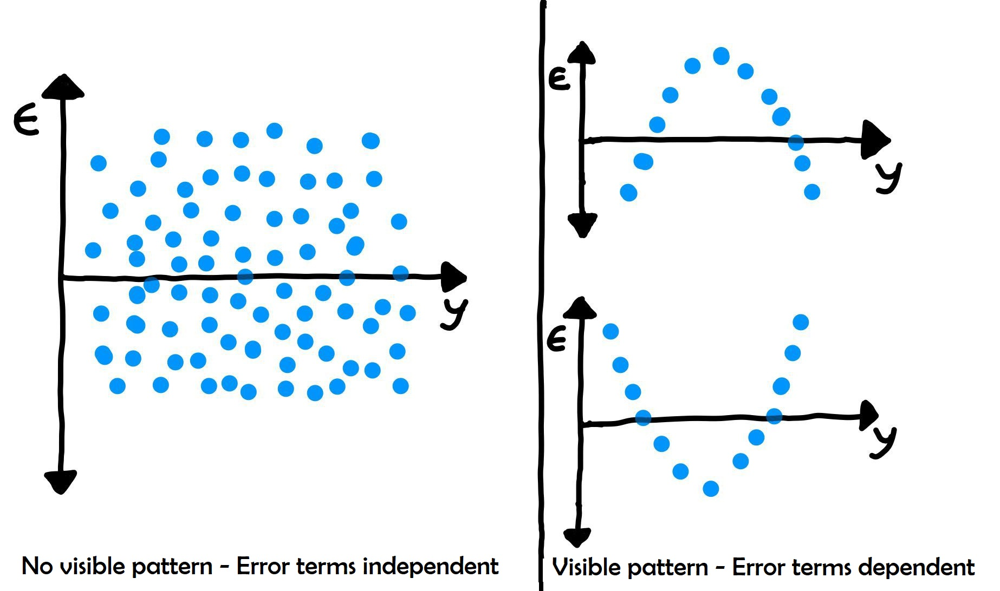
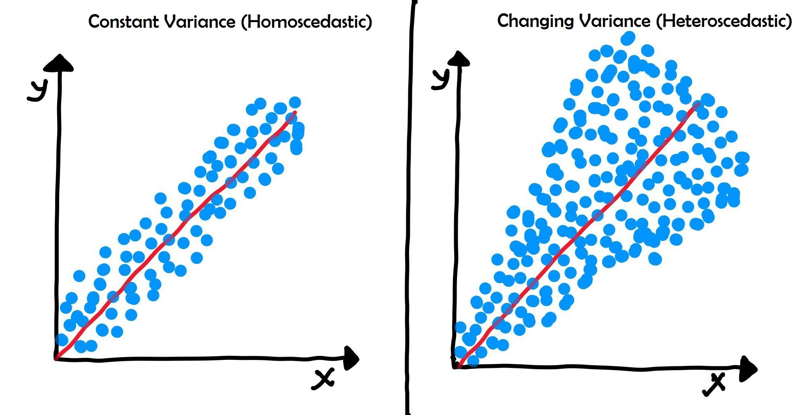

# Table of Contents

- [Table of Contents](#table-of-contents)
- [Purpose](#purpose)
    - [What are some examples of Machine Learning](#what-are-some-examples-of-machine-learning)
    - [Model](#model)
    - [Types of Models](#types-of-models)
    - [Supervised vs Unsupervised Learning](#supervised-vs-unsupervised-learning)
    - [Which learning method will you use](#which-learning-method-will-you-use)
    - [Training Data vs Testing Data](#training-data-vs-testing-data)
- [Regression Line](#regression-line)
    - [Types](#types)
- [Simple Linear Regression](#simple-linear-regression)
    - [Best Fit Line](#best-fit-line)
    - [Residual](#residual)
    - [Ordinary Least Squares Method](#ordinary-least-squares-method)
- [Cost Function](#cost-function)
    - [Differentiation](#differentiation)
    - [Minimise or Maximize a cost function](#minimise-or-maximize-a-cost-function)
    - [Unconstrained and Constrained Minimization](#unconstrained-and-constrained-minimization)
- [Solving Unconstrained Minimization Problems](#solving-unconstrained-minimization-problems)
    - [Closed form method](#closed-form-method)
    - [Iterative Method](#iterative-method)
- [Gradient Descent](#gradient-descent)
    - [Effect of Learning Rate](#effect-of-learning-rate)
- [Stats that Explain Variance of a Model](#stats-that-explain-variance-of-a-model)
    - [Total Sum of Squares](#total-sum-of-squares)
    - [Residual Sum of Squares](#residual-sum-of-squares)
    - [R Squared](#r-squared)
    - [Residual Square Error](#residual-square-error)
    - [Note](#note)
- [Summary](#summary)
- [Takeaways](#takeaways)
    - [Additional Information](#additional-information)
    - [Questions](#questions)
- [Assumptions for Linear Regression](#assumptions-for-linear-regression)
- [Hypothesis Testing in Linear Regression](#hypothesis-testing-in-linear-regression)
- [F Statistic](#f-statistic)
- [Residual Analysis](#residual-analysis)
- [Root Mean Squared Error](#root-mean-squared-error)
- [R-squared Model Comparison](#r-squared-model-comparison)
- [Fit a line](#fit-a-line)
    - [sklearn](#sklearn)
    - [statsmodel](#statsmodel)
- [Prediction](#prediction)
- [Takeaways](#takeaways-1)
- [Questions](#questions-1)
- [References](#references)

<!-- vim-markdown-toc -->


# Purpose
An Introduction to Machine Learning, especially focusing on Linear Regression

## What are some examples of Machine Learning
- You speak to your phone, and your phone understands the command. This is called speech recognition. The underlying technique used for this is Machine Learning.
- Recognizing objects from image / video data
- Predicting requirement of emergency service
- Find out which customer can default - credit risk modelling

## Model
Modeling uses machine learning algorithms, in which the machine learns from the data just like humans learn from their experiences.

## Types of Models
- Regression
    - What score will student get in 12th if we know their marks in 10th
    - Output variable to be predicted is a continuous/numeric variable
    - Email is Spam or Ham
    - Output is categories
- Clustering
    - Segment customers into different categories and give discount
    - No predefined notion of a label is allocated to groups/clusters formed

| Classification        | Clustering                                                                            |
|-----------------------|---------------------------------------------------------------------------------------|
| Labels are predefined | We discover what clusters will form, IT is not known what clusters will form a priori |


## Supervised vs Unsupervised Learning
| Supervised                                           | Unsupervised                                    |
|------------------------------------------------------|-------------------------------------------------|
| Regression - Continuous label                         | Clustering                                      |
| Classification - Categorical Label                   |                                                 |
| Past data with labels is used for building the model | No pre-defined labels are assigned to past data |

## Which learning method will you use
Q1: You have the past data of two cricket teams on the performance of the teams based on different parameters and the match results. You have to predict which team will win.

A1: You have the data of the past few years to train your model on. Since you know the results of different games based on different performance parameters, it would be a supervised learning problem — more specifically, a classification problem since your output variable (i.e. the name of the team) is categorical.

Q2: You feed a large collection of spam emails to the learning model to identify the different sub-groups of these spam mails. No labels are presents in the data set.

A2: This can be addressed using unsupervised learning as there are no labels assigned to your data set and they need to be identified.

Q3: Consider a large data set of the medical profiles of cancer patients. This data contains no labels for the medical profiles of the cancer patients. The model has to learn whether there might be different groups of such patients for which separate treatments might be tailored.

A3: This can be addressed using an unsupervised learning algorithm, in which you group patients into different clusters.

## Training Data vs Testing Data
Model is built using training data and predictions are mode on the test data

---

# Regression Line
x-axis - Independent Variable - Predictor Variable  
y-axis - Dependent Variable - Output Variable

## Types
1. Simple Linear Regression - Model with only 1 independent variable
2. Multiple Linear Regression - Model with more than 1 independent variable

# Simple Linear Regression
- Fit a straight line on the data
- Equation of Straight Line: `y = mx + c`
    - Slope: How much will y increase if x increases 
        - m = tan(theta)
    - Intercept: Value of y when x is 0
        - c = intercept
- The slope (m) of any straight line can be calculated by (y₂ - y₁)/(x₂ - x₁), where (x₁, y₁) and (x₂, y₂) are any two points through which the given line passes.

## Best Fit Line

## Residual
- Residuals are defined as the difference between the y-coordinates of actual data and the y-coordinates of predicted data.
- Measured Value - Predicted Value
- `ei = yi - ypred`

## Ordinary Least Squares Method
- The coefficients of the least squares regression line are determined by the Ordinary Least Squares method — which basically means minimising the sum of the squares of the y-coordinates of actual data - y-coordinates of predicted data.  
- The Ordinary Least Squares method has the criterion of the minimisation of the sum of squares of residuals. 
- Residual sum of all squares (e1^2 + e2^2 + ... + en^2)

Q: What is the main criterion used to determine the best-fitting regression line?  
A: The line that minimises the sum of squares of distances of points from the regression line

Q: Does changing units change the RSS (Residual Sum of Squares)  
A: Yes, changing units will change RSS  

**Explanation**  
The RSS for any regression line is given by this expression: $\sum(y_{i}−y_{i}pred)^2$. RSS is the sum of the squared difference between the actual and the predicted values, and its value will change if the units change since it has units of $y^2$. For example, (140 rupees - 70 rupees)^2 = 4900, whereas (2 USD - 1 USD)^2 = 1. So value of RSS is different in both the cases because of different units.

---

# Cost Function
- Helps us reach the optimal solution
- minimize error

## Differentiation
| Equation | Derivative (dy/dx) |
|----------|--------------------|
| $ax^b$   | $bxax^t; t=b-1$    |
| $sinx$   | $cosx$             |
| $cosx$   | $-sinx$            |
| $e^x$    | $e^x$              |
| $ln(x)$  | $1/x; if x > 0$    |

## Minimise or Maximize a cost function
- Differentiate the function w.r.t the parameter and equate to 0.
- For Minimisation 
    - the function value of the double differential should be greater than 0.
- For Maximisation 
    - the function value of the double differential should be less than 0.

## Unconstrained and Constrained Minimization
| Unconstrained                          | Constrained                                                   |
|----------------------------------------|---------------------------------------------------------------|
| x can take any value.                  | the minimum value of x is given                               |
| solution can be obtained equating to 0 | solution can be obtained by considering the constraints given |
| no constraint on value of m & c        |                                                               |

# Solving Unconstrained Minimization Problems
## Closed form method
- The function to be minimised is simply differentiated and equated to 0 to achieve a solution.   
- The solution is also double differentiated to check if the solution is greater than 0.

**Steps:**
- The equation to be differentiated will look something like this:  
       > $ \sum_{n=1}^{N} (y_{i} - (mx_{i}+c))^2 $
- Differentiate it w.r.t to m, and w.r.t to c
- Equate both with 0
- Solve the two equations obtained for m an c

## Iterative Method
- First Order (Gradient Descent) - $\frac{\partial}{\partial \theta} J(\theta)$

- Second Order (Newton's method) - $\frac{\partial^2}{\partial \theta^2} J(\theta)$

# Gradient Descent
- Gradient Descent is an optimisation algorithm which optimises the objective function (for linear regression it's cost function) to reach to the optimal solution.
- To find a local minimum of a function using gradient descent, one takes steps proportional to the negative of the gradient of the function at the current point.
- It is an iterative minimisation method which reaches the minima step by step (as shown in the figure below). 
    - You start with an initial assumed value of the parameter. This initial assumed value can be anything (say $X_{0}$). 
    - Then you assume $\alpha$ which is rate of learning. For that value ($X_{0}$), you calculate the output of the differentiated function which we denote as $f^{'}(x)$. 
    -  Then the new value of the parameter becomes $x -f^{'}(x)*\alpha$.
    -  You continue the process untill the algorithm reaches an optimum point ($X_{4}$); i.e the value of the parameter does not change effectively after this point. 

Gradient descent is an iterative method of optimising an objective function, in our case the cost function, by moving toward the negative of the gradient.
To compute $\theta_{1}$, the equation looks like this, 
> $\theta^{1} = \theta^0 - \eta \frac{\partial}{\partial \theta}J(\theta)$  
 
Where $\eta$ is known as the learning rate, which defines the speed at which we want to move towards negative of the gradient.



The parameter $\alpha$ is the learning rate and its magnitude decides the magnitude of the iterative steps (refer to the figure below). The range of α is (0,1] however large values of $\alpha$ for example, $\alpha > 0.5$ are not preferred as the algorithm might miss the minima. As you can see in the figure below, if the alpha value is too large then the gradient descent algorithm might miss the minima and start the iterative search again.


## Effect of Learning Rate
If the learning late is large, it may result in oscillation and we may miss the minima



# Stats that Explain Variance of a Model



## Total Sum of Squares
It is calculated by subtracting $y_{actual} - y_{mean}$ value for each of the data points and taking a sum of it.  
Formula: $\sum_{i=1}^{N} (y_{i}-\bar y)^2$

## Residual Sum of Squares
Formula: $\sum_{i=1}^{N}(y_{i}−y_{i}pred)^2$

## R Squared
$R^2 = \frac{variability\;in\;Y\;explained\;by\;model}{Total\;variability\;in\;Y} = \frac{Explained\;Sum\;of\;Squares}{Total\;Sum\;of\;Squares} = \frac{ESS}{TSS} = \frac{TSS - RSS}{TSS} = 1 - \frac{RSS}{TSS} = 1 - \frac{Residual\;Sum\;of\;Squares}{Total\;Sum\;of\;Squares} $

Note: ESS or Explained Sum of Squares is also called as MSS or Model Sum of Squares 

It measures the strength of the best fit line  
$Higher \;R^2 \implies \;higher \;strength$

If model is worse than average model, then $R^2$ will be negative because RSS will be &gt; TSS.

## Residual Square Error
$RSE = \sqrt{\frac{RSS}{df}}; \;df = n-2;\;$ where n = number of data points

## Note
Both RSE & RSS are absolute quantities and hence are affected by units. Hence, it is better to use $R^2$ which is a relative quantity

# Summary
1. Machine learning models can be classified into following two categories on the basis of learning algorithm:
    1. Supervised learning method: Past data with labels is available to build the model
        1. Regression: The output variable is continuous in nature
        2. Classification: The output variable is categorical in nature
    2. Unsupervised learning method: Past data with labels are not available
        1. Clustering: No pre-defined notion of labels is there
2. Past data set is divided into two parts during supervised learning method: 
    1. Training data  is used for the model to learn during modelling
    2. Testing data is used by the trained model for prediction and model evaluation
3. Linear regression models can be classified into two types depending upon the number of independent variables: 
    1. Simple linear regression: When the number of independent variables is 1
    2. Multiple linear regression: When the number of independent variables is more than 1
4. The equation of the best fit regression line Y = β₀ + β₁X can be found by minimising the cost function (RSS in this case, using the Ordinary Least Squares method) which is done using the following two methods:
    1. Differentiation
    2. Gradient descent method
5. The strength of a linear regression model is mainly explained by R²,  where R² = 1 - (RSS / TSS)
    1. RSS: Residual Sum of Squares
    2. TSS: Total Sum of Squares

# Takeaways
- Regression is a supervised learning method in Machine Learning
- Linear Regression is the most common method of solving a regression problem, where our model is simply a straight line $Y = \beta_{0} + \beta_{1}X + \epsilon$
- To test the strength of our model, we can calculate R^2 which is a relative term
- Predicting the value of y for new value of x: $\hat{y} = \hat{\beta_{0}} + \hat{\beta_{1}}x\;where\;\hat{\;} \implies estimate$

## Additional Information
- The value of the correlation coefficient will always be between -1 to 1, where a negative value implies a negative correlation, a positive value shows a positive correlation, and a zero value shows no correlation.
- The value of R-squared lies between 0 and 1, where 1 implies that the variance in the data is being explained by the model, and 0 implies that none of the variance values is being explained by the model. Obviously, it is very difficult to achieve either of the extreme values.

## Questions
1. A Singapore-based startup Healin launched an app called JustShakeIt, which enables a user to send an emergency alert to emergency contacts and/or caregivers simply by shaking the phone with one hand. The program uses a machine learning algorithm to distinguish between actual emergency shakes and everyday jostling, using data with labels.
    - The algorithm has to distinguish between actual emergency shakes and everyday jostling. Here, your output variable has predefined labels (shake/jostle), which are categorical in nature. So, this is a supervised learning-classification problem.

2. The independent variable X from a linear regression is measured in miles. If you convert it to kilometres (keeping the unit of the dependent variable Y the same), how will the slope coefficient change? (Note: 1 mile = 1.6 km)
    - In the linear regression equation, X gets multiplied by 1.6 with no change in Y. So, the slope will be divided by 1.6.

---

# Assumptions for Linear Regression

The image shows:
- Error terms are normally distributed
- Error terms have mean 0
- Error terms have constant variance

Assumptions:
- There are no assumptions on distributions on X and Y
- Linear Relation ship between X and Y




- Error terms are normally distributed



- Error terms are independent of each other



- Error terms have constant variance (homoscedasticity)



<br><br>
To read more about the assumptions and why they are important [visit this page](https://people.duke.edu/~rnau/testing.htm).

# Hypothesis Testing in Linear Regression
To test the significance of $\beta_{1}$, we can perform hypothesis testing.
Here, the null hypothesis ($H_{0}$) will be that $\beta_{1}$ is 0  
$H_{0}: \beta_{1} = 0$  
$H_{a}: \beta_{1} \neq 0$  

- If we fail to reject the Null hypothesis, $\beta_{1}$ and thus, the independent variable it is associated with is insignificant in the prediction of the dependent variable. 
- The t-statistic along with the t-distribution table is used to determine the p-value of the coefficient.
-  t-score for $\beta_{1}$ is given as $\frac{\beta_{1}}{Standard\;Error(\beta_{1})}$

# F Statistic
- It helps in determining the significance of the whole model i.e. whether the line fit was by coincidence or not.  
    - If probability of f-statistic is low, then we can say that the overall model fit is significant.  
    - If probability of f-statistic is greater than 0.05, then review the model as the fit might be by chance, i.e. the line may have just luckily fit the data.  
- This parameter is examined because many a times it happens that even though all of the betas are significant, the overall model fit happened just by chance.

- The basic idea behind the F-test is that it is a relative comparison between the model that you've built and the model without any of the coefficients except for $β_{0}$. 
- If the value of the F-statistic is high, it would mean that the Prob(F) would be low and hence, you can conclude that the model is significant. 
- On the other hand, if the value of F-statistic is low, it might lead to the value of Prob(F) being higher than the significance level (taken 0.05, usually) which in turn would conclude that the overall model fit is insignificant and the intercept-only model can provide a better fit.
- $H_{0}: Model = Average Model$
- $H_{1}: Model \neq Average Model$
- p-value (F-stats) &lt; 0.05 - accept the alternate hypothesis - it is preferred that this is the outcome
- p-value (F-stats) &gt; 0.05 - fail to reject the null hypothesis

# Residual Analysis
Plotting a Histogram of the residues helps us analyze whether
- error terms are normally distributed
- error terms are centered around zero

# Root Mean Squared Error
It is a metric that tells you the deviation of the predicted values by a model from the actual observed values. So, since it is a sort of error term, it is better to have a low RMSE.

# R-squared Model Comparison
When comparing different models, we can use R-squared to determine whether model is generalizing the information well or not.  
Check the R-squared on train and test set. If the R-squared value drops significantly between training and test set, we can say that the model is not generalizing well.

# Fit a line 
## sklearn
```py heading='Linear Regression Model using sklearn'
from sklearn.linear_model import LinearRegression

lm = LinearRegression()   # Create a linear regression object
lm.fit(X_train, y_train)
```

- `lm.coeff_` gives you the value of $\beta_{1}$ which is the slope of the fitted line.
- lm.intercept_ gives you the value of $c$ which is the intercept of the fitted line.

## statsmodel
In statsmodel, one can use the Ordinary Least Squares (OLS) module to fit a line. 

```py heading="Linear Regression Model using OLS"
import statsmodel.api as sm
lr = sm.OLS(X_train, y_train).fit()
```
- `lr.params` gives coefficient and intercept
- one has to add constant using `sm.add_constant(X_train)` to get intercept
- `lr.summary()` gives summary statistics such as $R^2$, $Prob(F-statistic)$, $p-value$ etc.

# Prediction
To predict values, use `lr.predict()` function

# Takeaways
1. For linear regression predictions, certain assumptions need to be met. 
    - X and y should be linearly related
    - Error terms should be normally distributed, have constant variance, have mean 0, and be independent of each other
2. The null hypothesis for Linear Regression states that beta (coefficient) has no impact on prediction.
    - we can use f-statistic, r-squared and t-test to determine the strength of line
3. sklearn and statsmodel can be used for generating linear regression model. 
    - sklearn is quicker to implement
    - statsmodel gives detailed statistics

# Questions

Q: Why is $R^2$ called $R-Squared$?  
A: It is the literal square of the correlation coefficient (Pearson's R)

```py
corrs = np.corrcoef(X_train, y_train)
print(corrs)

print(corrs[0,1]**2)
```

Q: What is a good RMSE value?  
A: RSME depends on units of Y variable and it is not a normalized value. Hence, there is no notion of standard/good RMSE. However, it can help in comparison (Lower RSME => Better model).

Q: What is the effect of scaling?  
A: The coefficients will change, but the r-squared, f-statistic, t-value and p-value will remain the same. The goodness of fit remains unchanged. Faster convergence of gradient descent is also seen due to scaling.

Q: What should be the ideal value of the sum of residuals?  
A: As per assumptions of linear regression model, the residuals are normally distributed around zero, i.e. their mean is equal to zero. Hence, the sum of residuals should also be zero.

# References
- https://www.mathsisfun.com/equation_of_line.html
- https://www.youtube.com/watch?v=euhATa4wgzo&list=PLNlkREaquqc6WUPMRicPbEvLyZe-7b-GT
- https://towardsdatascience.com/implement-gradient-descent-in-python-9b93ed7108d1
- https://www.khanacademy.org/math/multivariable-calculus/multivariable-derivatives/gradient-and-directional-derivatives/v/why-the-gradient-is-the-direction-of-steepest-ascent
- https://github.com/kirtiraj23/Machine_Learning
- https://reliawiki.org/index.php/Simple_Linear_Regression_Analysis
- https://people.duke.edu/~rnau/testing.htm
- https://tex.stackexchange.com/questions/63781/how-to-write-a-not-equal-to-sign-in-latex-pseudocode?newreg=befc856dd6494d82a2d5e72299f80008
- https://www.youtube.com/watch?v=78YNvrsRzVw&t=269s
- https://en.wikipedia.org/wiki/F-test
- https://docs.scipy.org/doc/scipy/reference/generated/scipy.stats.linregress.html
- https://www.riskprep.com/component/exam/?view=exam&layout=detail&id=131
