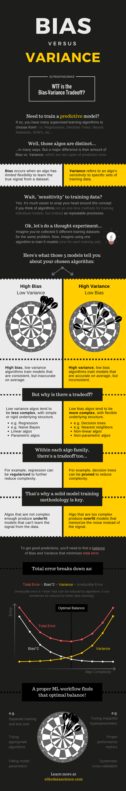

<!-- vim-markdown-toc GFM -->

* [Purpose](#purpose)
* [Effect of adding more variables on $R^2$](#effect-of-adding-more-variables-on-r2)
* [Formulation of Multiple Linear Regression](#formulation-of-multiple-linear-regression)
* [Interpretation of the coefficients](#interpretation-of-the-coefficients)
* [Some aspects of MLR are similar to Simple Linear Regression](#some-aspects-of-mlr-are-similar-to-simple-linear-regression)
* [New considerations when moving from SLR to MLR](#new-considerations-when-moving-from-slr-to-mlr)
* [MLR vs SLR](#mlr-vs-slr)
* [Bias vs Variance - Infographic](#bias-vs-variance---infographic)
* [Multicollinearity](#multicollinearity)
    * [Multicollinearity affects](#multicollinearity-affects)
    * [Multicollinearity does not affect](#multicollinearity-does-not-affect)
* [How to detect Multicollinearity](#how-to-detect-multicollinearity)
    * [Detecting Multicollinearity = Detecting association in predictors](#detecting-multicollinearity--detecting-association-in-predictors)
    * [Variance Inflation Factor (VIF)](#variance-inflation-factor-vif)
    * [Dealing with multicollinearity](#dealing-with-multicollinearity)
* [Dealing with Categorical Variables](#dealing-with-categorical-variables)
* [Feature Scaling](#feature-scaling)
    * [Effect of scaling](#effect-of-scaling)
    * [MinMaxScaling or Normalization](#minmaxscaling-or-normalization)
    * [Standardization](#standardization)
* [Note](#note)
    * [Scaling Categorical Variables](#scaling-categorical-variables)
* [Model Assessment and Comparison - Selecting the best model](#model-assessment-and-comparison---selecting-the-best-model)
    * [$Adjusted\;R^2$](#adjustedr2)
    * [$Akaike\;Information\;Criterion $](#akaikeinformationcriterion-)
    * [Others](#others)
    * [Adjusted $R^2$ vs $R^2$](#adjusted-r2-vs-r2)
* [Feature Selection](#feature-selection)
    * [Recursive Feature Elimination](#recursive-feature-elimination)
    * [Stability Selection](#stability-selection)
* [Summary](#summary)
* [Takeways](#takeways)
* [Questions](#questions)
* [References](#references)

<!-- vim-markdown-toc -->

# Purpose
Notes on Multiple Linear Regression

# Effect of adding more variables on $R^2$
The R-squared will always either increase or remain the same when you add more variables. Because you already have the predictive power of the previous variable so the R-squared value can definitely not go down. And a new variable, no matter how insignificant it might be, cannot decrease the value of R-squared.

# Formulation of Multiple Linear Regression
$Y = \beta_{0} + \beta_{1}X_{1} + \beta_{2}X_{2} + ... + \beta_{p}X_{p}$

# Interpretation of the coefficients
Change in mean response, E(Y), per unit change in the variable when other predictors are held constant

# Some aspects of MLR are similar to Simple Linear Regression
- The model now fits a `hyperplane` instead of a line
- Coefficients are still obtained by minimising the sum of squared errors, the least squares criteria
- For inference, the assumptions from simple linear regression still hold - zero-mean, independent and normally distributed error terms with constant variance

# New considerations when moving from SLR to MLR
1. Overfitting
    - As you keep adding the variables, the model may become far too complex
    - It may end up memorising the training data and will fail to generalise
    - A model is generally said to overfit when the training accuracy is high while the test accuracy is very low
    - Refer [this article](https://elitedatascience.com/overfitting-in-machine-learning) for more details.
2. Multicollinearity
    - Associations between predictor variables
3. Feature selection
    - Selecting the optimal set from a pool of given features, many of which might be redundant becomes an important task

# MLR vs SLR
| Unchanged                    | Changed                        |
|------------------------------|--------------------------------|
| Asummptions on residuals     | Interpretation of coefficients |
| Arriving at coefficients     | Multicollinearity              |
| Hypothesis Testing Framework | Model Complexity               |
|                              | Feature Selection              |

# Bias vs Variance - Infographic

Source: https://elitedatascience.com/bias-variance-tradeoff

# Multicollinearity
Multicollinearity refers to the phenomenon of having related predictor variables in the input dataset. In simple terms, in a model which has been built using several independent variables, some of these variables might be interrelated, due to which the presence of that variable in the model is redundant. You drop some of these related independent variables as a way of dealing with multicollinearity.

## Multicollinearity affects
1. Interpretation:
    - Does “change in Y, when all others are held constant” apply?
2. Inference: 
    - Coefficients swing wildly, signs can invert
    - p-values are, therefore, not reliable

## Multicollinearity does not affect
1. the predictions, precisions of the predictions
2. goodness-of-fit statistics

# How to detect Multicollinearity
## Detecting Multicollinearity = Detecting association in predictors
- Scatter plots to visually inspect
- Correlations to quantify the linear association

## Variance Inflation Factor (VIF)
- Pairwise correlations may not be enough: A variable could be associated with multiple variables together
- Idea: Build a model to explain the `predictor` using the `other predictors`
- How well a predictor variable is correlated with all the other variables, excluding the target variable
- Formula: $VIF_{i} = \frac{1}{1-R_{i}^2}$ where 'i' refers to the i-th variable which is being represented as a linear combination of rest of the independent variables.
- Common heuristic: 
    - &gt; 10:  Definitely high VIF value and the variable should be eliminated.
    - &gt; 5:  Can be okay, but it is worth inspecting.
    - &lt; 5: Good VIF value. No need to eliminate this variable.

## Dealing with multicollinearity

- Dropping variables
    - Drop the variable that is highly correlated with others
    - Pick the business interpretable variable (if interpretation and explicability important)

- Create new variable using the interactions of the older variables
    - Add interaction features, drop original features
- Variable transformations:
    - PCA: Principal Component Analysis
    - PLS: Partial Least Squares

# Dealing with Categorical Variables
- Few Levels: Create 'dummy'/indicator variables
- Good for interpretation (effect of state vs base state)
- When you have a categorical variable with say 'n' levels, the idea of dummy variable creation is to build 'n-1' variables, indicating the levels. 
- Dummy variables can be created by `pd.get_dummies()` which will give one hot encoding data. To get n-1 variables, pass `drop_first=True`.

    | Value  | Indicator Variable |
    |--------|--------------------|
    | Gender | **Female**         |
    | Male   | 0                  |
    | Female | 1                  |

    | Value             | Indicator Variable |                    |
    |-------------------|--------------------|--------------------|
    | Furnishing Status | **furninshed**     | **semi-furnished** |
    | furnished         | 0                  | 0                  |
    | semi-furnished    | 1                  | 0                  |
    | unfurnished       | 0                  | 0                  |

# Feature Scaling
1. Ease of interpretation
2. Faster convergence for gradient descent methods

## Effect of scaling
| Statistic      | Change |
|----------------|--------|
| p-values       | No     |
| Model Accuracy | No     |
| F-statistic    | No     |
| R-squared      | No     |
| Coefficients   | Yes    |

- If target variable is scaled then in final prediction, it should be rescaled for interpretation

## MinMaxScaling or Normalization
- Normalization is generally used when you know that the distribution of your data does not follow a Gaussian distribution. This can be useful in algorithms that do not assume any distribution of the data like K-Nearest Neighbors and Neural Networks. It rescales the values into a range of [0,1]
- get the values between 0 and 1
- $X_{changed} = \frac{X-X_{min}}{X_{max}-X_{min}}$

## Standardization
- Standardization, on the other hand, can be helpful in cases where the data follows a Gaussian distribution. However, this does not have to be necessarily true. Also, unlike normalization, standardization does not have a bounding range. So, even if you have outliers in your data, they will not be affected by standardization. It rescales data to have a mean of 0 and a standard deviation of 1
- also called Z-score Normalization
- subtracting the mean and dividing by standard deviation such that the variable is centered at zero and the standard deviation is 1
- Formula: $X_{changed} = \frac{X-\mu}{\sigma}$
- Generally Standard Scaling is preferred when there are outliers in the data

# Note
Although normalization via min-max scaling is a commonly used technique that is useful when we need values in a bounded interval, standardization can be more practical for many machine learning algorithms. The reason is that many linear models, such as the logistic regression and SVM, [...] initialize the weights to 0 or small random values close to 0. Using standardization, we center the feature columns at mean 0 with standard deviation 1 so that the feature columns take the form of a normal distribution, which makes it easier to learn the weights. Furthermore, standardization maintains useful information about outliers and makes the algorithm less sensitive to them in contrast to min-max scaling, which scales the data to a limited range of values.

## Scaling Categorical Variables 
For categorical variables, in general, it is better to not perform any scaling especially if we want to interpret the data since the values are already between 0 and 1.

# Model Assessment and Comparison - Selecting the best model
- Trade off between explaining highest variable and keeping it simple [<a href="#bias-vs-variance---infographic">Bias vs Variance Tradeoff</a>]
- Penalize models for using higher number of predictors

## $Adjusted\;R^2$
- $Adj\;R^2= 1 - \frac{(1-R^2)(N-1)}{N-p-1}$; where n = sample size, p = number of predictors

## $Akaike\;Information\;Criterion $
- $AIC = n*\log(\frac{RSS}{n})+2p$; where n = sample size, RSS = Residual Sum of Squares

## Others
- $BIC = Bayesian\;Information\;Criterion$
- $Mallow's\;Cp$

## Adjusted $R^2$ vs $R^2$
The major difference between R-squared and Adjusted R-squared is that R-squared doesn't penalise the model for having more number of variables. Thus, if you keep on adding variables to the model, the R-squared will always increase (or remain the same in the case when the value of correlation between that variable and the dependent variable is zero). Thus, R-squared assumes that any variable added to the model will increase the predictive power.

Adjusted R-squared on the other hand, penalises models based on the number of variables present in it. So if you add a variable and the Adjusted R-squared drops, you can be certain that that variable is insignificant to the model and shouldn't be used. So in the case of multiple linear regression, you should always look at the adjusted R-squared value in order to keep redundant variables out from your regression model.

<a href="../01-Linear-Regression/#r-squared" target="_blank">Read more about $R^2$</Link>

# Feature Selection
Try all possible combinations? 
- $2^p$ models for p features
- not a good approach

Manual feature elimination:
- Build model
- Drop features that are least helpful in prediction (high p-value)
- Drop features that are redundant (using correlations, VIF)
- Rebuild model and repeat

Automated approach - Rules
- Top 'n' features: RFE (Recursive Feature Elimination)
- Forward / Backward / Stepwise selection: based on AIC
- Regularization (Lasso)

A balanced approach: use a combination of automated (coarse tuning) + manual (fine tuning) selection.

## Recursive Feature Elimination
- Start with all the features
- Compute coefficients for each feature based on model such as SVM, Regression etc.
- Remove feature which has the least significance
- Repeat the process on pruned data set until there are desired number of features

Q: Suppose you have to build five multiple linear regression models for five different datasets. You're planning to use about 10 variables for each of these models. The number of potential variables in each of these datasets are 15, 30, 65, 10, and 100. In which of these cases you would definitely need to use RFE?

A: Though you might be thinking that while you would definitely need RFE in the 3rd and 5th cases, feature elimination in the 2nd dataset can be performed manually. But please note that while performing a manual elimination, you need to drop features one by one and bringing down the number from 30 to 10 can be very time-consuming. So it might be a good idea a perform an RFE to bring the number down to, say, 15, and then perform a manual feature elimination.

## Stability Selection
Stability selection is a relatively novel method for feature selection, based on subsampling in combination with selection algorithms (which could be regression, SVMs or other similar method). The high level idea is to apply a feature selection algorithm on different subsets of data and with different subsets of features. After repeating the process a number of times, the selection results can be aggregated, for example by checking how many times a feature ended up being selected as important when it was in an inspected feature subset. We can expect strong features to have scores close to 100%, since they are always selected when possible. Weaker, but still relevant features will also have non-zero scores, since they would be selected when stronger features are not present in the currently selected subset, while irrelevant features would have scores (close to) zero, since they would never be among selected features.

# Summary
1. When one variable might not be enough
    1. A lot of variance isn’t explained by just one feature
    2. Inaccurate predictions
2. Formulation of MLR: MLR  helps us to understand how much will the dependent variable change when we change the independent variables.
3. New considerations to be made when moving from SLR to MLR
    1. Overfitting - When the model becomes complex and gives very good results in training data and fails in the testing data.
    2. Multicollinearity - To identify if there is any dependency within the pool of independent variables to remove redundancy.
    3. Feature selection - Out of the pool of many features what features are considered to be most important. We drop the redundant features and those features that are not helpful in prediction. 
4. Dealing with categorical variables
    1. Dummy variables - USed when there are fewer levels. You learnt about it using the marital status example.
5. Feature Scaling
    1. Standardisation - Method used to make sure that data is internally consistent.
    2. MinMax scaling - Method used to make sure that data is internally consistent.
    3. Scaling for categorical variables - Categorical variables cannot used as they are so they are converted to numeric format.
6. Model Assessment and Comparison
    1. Adjusted R-squared - The adjusted R-squared value increases only if the new term improves the model more than would be expected by chance.
    2. AIC, BIC - Various types of criteria used for automatic feature selection 
7. Feature Selection
    1. Manual feature selection - A very tedious task in order to select the correct set of features.
    2. Automated feature selection - The three step process is involved.
        1. Select top 'n' features
        2. Forward/backward/Stepwise selection based on AIC
        3. Regularization  
    3. Finding a balance between the two - A balance of both manual and automatic feature selection is required to attain the features.

# Takeways
- In many ways, MLR is just an extension of SLR. For instance, assumptions for MLR are similar to SLR.
- Penalizing models for using high number of predictor variables will help in getting a better model both in terms of reduced number of predictors and in terms of generalization.
- In model building process, the initial steps are what one can call "Exploratory Data Analysis". Here we find out if any data is missing, any null value analysis is required, if any variables have high correlation, the distribution of the data etc. It is preferred that the scatter plot of some independent variables has linear relation with the predicted variable.
- Categorical variables should be dummy or label encoded so that Linear Regression can work on it. It is a requirement for linear regression that all data be of numeric type.
- Using p-value and VIF, one can determine which of the variables are important for our model. 

# Questions
Q: What is the effect of number of data points on Overfitting?
- Overfitting is the condition wherein the model is so complex that it ends up memorising almost all the data points on the train set. Hence, this condition is more probable if the number of data points is less since the model passing through almost every point becomes easier.
  

Q: What is the effect of adding more variables on $R^2$ and Adjusted $R^2$
 
- The R-squared value will either increase or remain the same
- The Adjusted R-squared value may increase or decrease
  

Q: Suppose you were predicting the sales of a company using two variables 'Social Media Marketing' and 'TV Marketing'. You found out that the correlation between 'Social Media Marketing' and 'TV Marketing' is 0.9. What will be the approximate value of VIF for either of them?

- Formula for VIF: $VIF = \frac{1}{1-R^2}$
- The R-squared variable will simply be the correlation coefficient squared since we have only 2 variables i.e $R^2 = 0.9^2 = 0.81$
- VIF will therefore by $\frac{1}{1-0.81} = 5.26$
  

Q: Suppose you have 'n' categorical variables, each with 'm' levels. How many dummy variables would you need to represent all the levels of all the categorical variables?
- Each of the dummy variables has 'm' levels. So to represent one categorical variable, you would require (m-1) levels. Hence, to represent 'n' categorical variables, you would need `(m-1)*n` dummy variables.
  

Q: After performing inferences on a linear model built with several variables, you concluded that the variable ‘r’ was almost being described by other feature variables. This meant that the variable ‘r’:

  | Option             | Y/N |
  |--------------------|-----|
  | Had a high p-value | No  |
  | Had a low p-value  | No  |
  | Had a high VIF     | Yes |
  | Had a low VIF      | No  |
If the feature variable A is being well explained by the other feature variables, this would mean that A has a high VIF. This is also evident from the formula for VIF: $\frac{1}{1 − R^2_{i}}$. 
Now, if A is being explained by some of the other feature variables, this would mean that the R-squared value is pretty high, which would make the denominator which is $1-R^2_{i}$ very low, which again, in turn, would make the VIF value high. 
  

Q: If  $β_{1} = β_{2} = 0$ holds and $β_{3} = 0$ fails to hold, then what can you conclude?
- Since, $β_{3}=0$ fails to hold, this means that $x_{3}$ is a significant variable in this linear regression model. Thus, we can say that there is a linear relationship between the outcome variable(Y) and $x_{3}$
  

Q: An analyst observes a positive relationship between digital marketing expenses and online sales for a firm. However, she intuitively feels that she should add an additional predictor variable, one which has a high correlation with marketing expenses. If the analyst adds this independent variable to the model, which of the following could happen? More than one choices could be correct.

| Option                                                                          | Y/N |
|---------------------------------------------------------------------------------|-----|
| The model's R-squared will decrease                                             | N   |
| The model's adjusted R-squared could decrease                                   | Y   |
| The Beta-coefficient for predictor - digital marketing expense will remain same | N   |
| The relationship between marketing expenses and sales can become insignificant  | Y   |
 

Q: Given different Rsq values of linear regression models on the same dataset, which model would you choose as the best predictor?
- Rsq values alone are insufficient to answer this question. 
- Rsq values are sometimes too high even due to overfitting. You cannot compare models with a different number of features/predictors without the rsq adjusted value.
  

Q: Why p-value has higher importance than VIF?
- p-value tells us whether a variable is significant or not. If a variable is not significant (p>0.05), then there no point of checking multicollinearity (VIF) against other variables.
- Process
    - p-value > 0.05 - drop column
    - p-value < 0.05 - check the VIF
        - if VIF > 5 (i.e. $R^2 > 0.8$) - drop
        - if VIF < 5 - keep
  

Q: What is the use of Effect Encoding?  
- Effect encoding is used when different weightage is to be given for categorical variables (dummies).
  

Q: When will you use Label Encoding?
- If categorical variable has order associated with it, we will use Label Encoding. 

    | Column | Label |
    |--------|-------|
    | Gold   | 1     |
    | Silver | 2     |
    | Bronze | 3     |

- If variables don't have an inherent order, for example Month (each month is equally important), then we cannot use label encoding. We can use one-hot encoding or dummy encoding in such a case.
  

Q: After you performed binary encoding of the variable ‘MaritalStatus’ with, ‘Married’ corresponding to 1 and ‘Unmarried’ corresponding to 0, you found out that the mean of the variable ‘MaritalStatus’ was 0.6. What does this statement indicate?
- Notice that when you perform a binary encoding, the only values present in the variable are 0 and 1. So if you calculate the mean, it is only the 1s which will contribute towards it. Since the value '1' corresponds to 'Married', a mean of 0.6 indicates that 60% of the people in the list are married.
  

Q: If there is no change in $R^2$ how does Adjusted\;R^2 change when adding more variables?
- Adjusted $R^2$ will decrease as model will be penalized due to addition of parameter
  

Q: In regression analysis, which of the statements is true?

| Option                                                | Y/N |
|-------------------------------------------------------|-----|
| The mean of residuals is always equal to zero.        | Y   |
| The mean of residuals is less than zero at all times. | N   |
| The sum of residuals is more than zero at all times.  | N   |
| The sum of residuals is always equal to zero.         | Y   |

Q: Suppose you're trying to predict the gross collection of a movie based on the following five factors: 'Budget', 'Average Critic Score', 'Facebook Likes', 'Number of Tweets', and 'Number of Screens'.

You obtained the following p-values for the five variables after fitting a regression line. Assuming you're only using p-value as a criteria to drop the variables and a p-value > 0.05 is not acceptable, which of these variables do you think is not significant in the prediction of gross collections and should be definitely dropped? Only one option is correct.

| Variable              | p-value |
|-----------------------|---------|
| Budget                | 0.03    |
| Average Critic Review | 0.21    |
| Facebook Likes        | 0.11    |
| Number of Tweets      | 0.32    |
| Number of Screens     | 0.01    |

As you can see, the p-value of 'Number of Tweets' is very high and thus, this variable is insignificant. Now, there are other variables in the list which also have a high p-value but we don't drop these simultaneously as it might happen that dropping 'Number of Tweets' might reduce the p-value of the other variables and make them significant.
  

Q: Should scaling be performed before the train-test split or after?
- Scaling should always be done after the test-train split since you don't want the test dataset to learn anything from the train data. So if you're performing the test-train split earlier, the test data will then have information regarding the data like the minimum and maximum values, etc.
  

Q: Which option between Standard Scaling and MinMax Scaling is better when dealing with dummy variables? (Which of these will affect the value of the dummy variables)
- MinMax scaling scales in such a way that all the values lie between 0 and 1 using the formula:
> $X_{changed} = \frac{X-X_{min}}{X_{max}-X_{min}}$
- So if you have dummy variables, which can only take the values 0 and 1, you can notice that for the case of zero, the variable remains zero and for the case of 1, the variable remains 1.
- On the other hand, the standard scaler scales in such a way that the mean of the dataset becomes zero and standard deviation becomes one. So this will clearly distort the values of the dummy variables since some of the variables will become negative.
  

Q: Consider you are performing multiple linear regression where X1 and X2 are independent variables and Y is the dependent variable. What can you say about the coefficient of X1 and value of y in the regression equation?   
$y = \beta_{0} + \beta_{1}*X_{1} + \beta_{2}*X_{2}$
- The predicted value of Y increases by $β_{1}$ for a unit increase in X1, given X2 does not change.

# References
- https://elitedatascience.com/overfitting-in-machine-learning
- https://elitedatascience.com/bias-variance-tradeoff
- https://simple.wikipedia.org/wiki/Occam%27s_razor
- https://www.stevesque.com/symbols/
- https://support.minitab.com/en-us/minitab/18/help-and-how-to/modeling-statistics/regression/supporting-topics/partial-least-squares-regression/what-is-partial-least-squares-regression/
- https://stats.idre.ucla.edu/other/mult-pkg/faq/general/faqwhat-is-dummy-coding/
- https://stats.stackexchange.com/questions/89533/convert-a-categorical-variable-to-a-numerical-variable-prior-to-regression
- https://stackoverflow.com/questions/32108179/linear-regression-normalization-vs-standardization
- https://en.wikipedia.org/wiki/Feature_scaling
- https://stats.idre.ucla.edu/other/mult-pkg/faq/general/faqwhat-is-effect-coding/
- https://en.wikipedia.org/wiki/Akaike_information_criterion
- https://en.wikipedia.org/wiki/Bayesian_information_criterion
- https://en.wikipedia.org/wiki/Mallows%27s_Cp
- https://scikit-learn.org/stable/modules/generated/sklearn.feature_selection.RFE.html
- https://blog.datadive.net/selecting-good-features-part-iv-stability-selection-rfe-and-everything-side-by-side/
- https://statisticsbyjim.com/regression/multicollinearity-in-regression-analysis/
- https://www.kaggle.com/shrutimechlearn/step-by-step-assumptions-linear-regression
- https://jeffmacaluso.github.io/post/LinearRegressionAssumptions/
