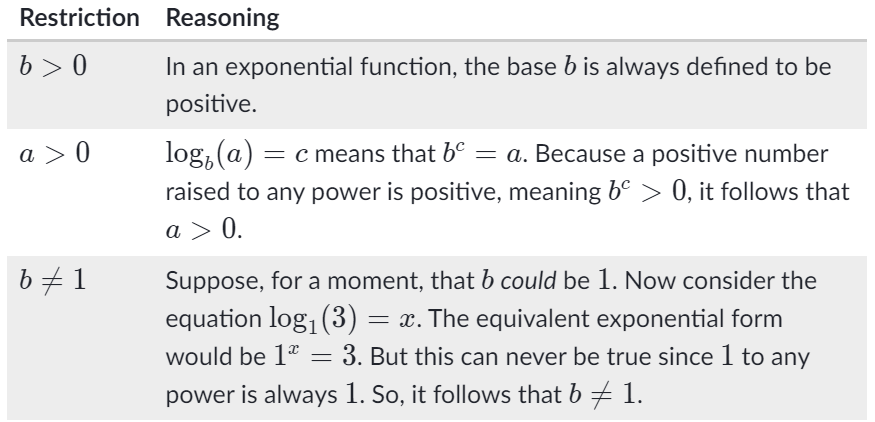

# Purpose
My notes on Logistic Regression

# Exponential Functions
## Laws of Exponents
- $x^a.x^b = x^{a+b}$
- $(xy)^a=x^a.y^a$
- $\frac{x^a}{x^b}=x^{a−b}; x \neq 0$
- $(\frac{x}{y})^a=\frac{x^a}{y^a}; y \neq 0$
- $x^0 = 1; x \neq 0$
- $\frac{1}{x^a}=x^{-a}; x \neq 0$
- $(x^a)^b = x^{a*b}$

---

# Logarithm Property

Logarithm helps us redefine exponents.
$\log_{b}a$ means what power does b have to be raised to, to get a.

$log_{b}(a) = c \Leftrightarrow b^c = a;$ where 
- b is base
- c is exponent 
- a is argument



## Note
When rewriting an exponential equation in log form or a log equation in exponential form, it is helpful to remember that the base of the logarithm is the same as the base of the exponent.

Read more about logarithms [here](https://www.mathplanet.com/education/algebra-2/exponential-and-logarithmic-functions/logarithm-and-logarithm-functions) and [here](https://www.khanacademy.org/math/algebra2/x2ec2f6f830c9fb89:logs/x2ec2f6f830c9fb89:log-intro/v/logarithms?modal=1)

## Solving Equations containing exponents  
**Q: $6^x = 20$**
- $6 = 10^{log6}$
- $20 = 10^{log20}$
- $(10^{log6})^x = 10^{log20}$
- $10^{log6.x} = 10^{log20}$
- $x.\log6 = \log20$
- $x=\frac{log20}{log6} \approx 1.67$

## Properties of Logarithms
#### Product Property
**$\log_{b}ac = \log_{b}a + log_{b}c;$**
where a,b,c are positive numbers, $b \neq 1$

#### Quotient Property
**$\log_{b}\frac{a}{c} = \log_{b}a - log_{b}c;$** 
where a,b,c are positive numbers, $b \neq 1$

#### Power Property
**$\log_{b}a^c = c.\log_{b}a$**
where c is a real number, a and b are positive numbers, $b \neq 1$

#### More Rules
$\log_{b}c = \frac{log_{z}c}{log_{z}b}$

---

# Linear Regression vs Logistic Regression

| Linear Regression | Logistic Regression |
|-------------------|---------------------|
| numeric output    | categorical output  |

# Examples of Logistic Regression
1. Finance Company want sto know whether a customer will default or not
2. Predicting an email is spam or not
3. Categorizing email into promotional, personal and official

# Binary classification
1. Two possible outputs
2. Examples:
    - customer will default or not
    - email spam or not
    - a user is a robot or not

# Sigmoid function
sigmoid curve has all the properties you would want in a binary classification problem and hence it's good for such models.
- extremely low values in the start
- extremely high values in the end
- intermediate values in the middle 

## Formula
$y = prob(x) = \frac{1}{1+e^{(-\beta_{0} + \beta_{1}x)}}$

## Best fit Sigmoid Curve
**Likelihood function**
Product of $(1-P_{ineg})(P_{ipos})$ for i = 1 to N, is called the Likelihood function


# Building a logistic regression model in Python
We can use `statsmodel` to build a logistic regression model

```py heading="Logistic Regression using statsmodel"
import statsmodel.api as sm
logm1 = sm.GLM(y,(sm.add_constant(X)), family = sm.families.Binomial())
logm1.fit().summary()
```

The `coef` column gives us the value of $\beta_{0}$ and $\beta_{1}$

# Odds and Log Odds
This equation: $P = \frac{1}{1+e^{(-\beta_{0} + \beta_{1}x)}}$ is difficult to interpet.  
We can simplify it by using `Odds` which is given as:  
> $\frac{P}{1-P} = e^{\beta_{0} + \beta_{1}x}$  

We interpret odds as:  

$\newline P(EventHappens) = Odds*P(EventDoesNotHappen)\newline or\;P = Odds*(1-P)$

The `Log Odds` can then be obtained by applying $\ln$ (i.e. natural log or log with base e or $\log_{e}$)  
> $\ln{\frac{P}{1-P}} = \beta_{0} + \beta_{1}x$

As we can see the RHS is the equation of a straight line, hence Log Odds follows a linear relationship w.r.t X.

# Summary
- Simply boundary decision approach is not good for classification problems
- Sigmoid function gives us a good approximation of the probability of one of the classes being selected based on the input
- The process where you vary the betas until you find the best fit curve for the probability of an event occuring, is called logistic regression.
- The equation for likelihood is complex, and hard to interpret, hence we use Odds $(\frac{1}{1-P})$
and Log Odds $(\ln\frac{1}{1-P})$
- The Log Odds vs X graph is linear in nature as it follows the equation of a straight line

# References
- https://www.mathplanet.com/education/algebra-1/exponents-and-exponential-functions/properties-of-exponents
- https://www.mathplanet.com/education/algebra-2/exponential-and-logarithmic-functions/logarithm-property
- https://www.rapidtables.com/math/algebra/Logarithm.html
- https://www.khanacademy.org/math/algebra2/x2ec2f6f830c9fb89:logs/x2ec2f6f830c9fb89:log-intro/v/logarithms?modal=1
