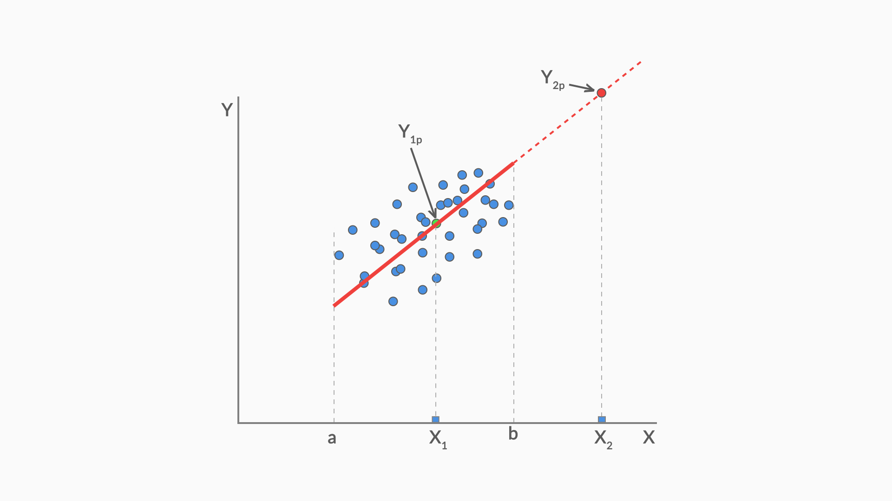

# Purpose
Understanding the use of Linear Regression in the Industry / Real World

# Uses
1. Forecasting
2. Prediction

Linear Regression 
- can show interpolation but not extrapolation
- Shows correlation, not causation
- Parametric Regression

| Parametric                                                                                                                                                                                | Non Parametric                                                              |
|-------------------------------------------------------------------------------------------------------------------------------------------------------------------------------------------|-----------------------------------------------------------------------------|
| Data follows fixed parameters                                                                                                                                                             | Data does not follow fixed parameters                                       |
|                                                                                                                                                                                           | Dynamic in nature                                                           |
| a parametric model can be described using a finite number of parameters.                                                                                                                  | do not have a finite set of parameters which completely describe the model. |
| Ex: a linear regression model built using n independent variables will have exactly n ‘parameters’ (i.e. the n coefficients). The entire model can be described using these n parameters. | Ex: decision trees                                                          | 

| Interpolation                                                                                                                          | Extrapolation                                                                                                             |
|----------------------------------------------------------------------------------------------------------------------------------------|---------------------------------------------------------------------------------------------------------------------------|
| using the model to predict the value of a dependent variable on independent values that lie within the range of data you already have. | predicting the dependent variable on the independent values that lie outside the range of the data the model was built on |


Here, $Y_{1p}$ in interpolation while $Y_{2p}$ is extrapolation

# Question

| Statement                                                                                                                                                                                                     | Linear Regression Applicable |
|---------------------------------------------------------------------------------------------------------------------------------------------------------------------------------------------------------------|------------------------------|
| An organisation's revenue assurance and business planning team wants to prepare weekly revenue forecast based on previous week/month/year's performance.                                                      | Yes                          |
| A media company launched a new show which had > 1 million views every day. They expected higher view during weekend, but the views decreased. Why?                                                            | Yes                          |
| A company has a set marketing budget, and various marketing channels - TV, social media, newsprints, radio, other digital platforms. What is the ROI from each channel? How to allocate the budget optimally? | Yes                          |
| A telecom company realises that 30% of the current active customer base has significantly reduced its internet usage on mobile data. Who else may follow the same behavior?                                   | No                           |
| An e-commerce platform is launching a new technology driven product line. How to identify the target customers to send email notifications to visit this new product page?                                       | No                           |
| Emaar wants to forecast how many low-income, mid-income, high-come and ultra-luxury income housing they should plan for King Abdulla Economic city.                                                           | No                           |

| Purpose                     | Prediction                                                                                   | Projection                                   |
|-----------------------------|----------------------------------------------------------------------------------------------|----------------------------------------------|
| Importance of Outcome       | Focus: Identifying the driver variables and measuring their impact of on dependent variables | Final projected result/forecasted value      |
| Assumption                  | No specific assumption is considered                                                         | Assumes everything remains the same as today |
| Complexity/Accuracy of model | Simple models are better than complex models                                                 | Choose accuracy over explanation             |

# Error Terms
If the errors (the differences between the actual views and the views predicted by the model) are randomly distributed, it confirms that there are no variables that could have helped explain the model better. 

A non-random error pattern, on the other hand, would mean that the errors are capturing some patterns, thus indicating that the model could have been better. A non-random error pattern indicates that there are certain systematic unexplained aspects in the outcomes that are being captured in the error. This pattern in the errors could probably have been explained by some explanatory variable which is missing from the model. So, the idea is that a model should explain everything that is possible, such that only the random errors are left.

# Assessing stability of Model
1. Data set is small
- not advisable to separate testing and training sets

2. Use bootstrapping
- Choose 10-20% of sample randomly
- Opt for multiple iterations with replacement
- Train model on "in-sample" group
- Test on "out-sample" group

3. Model is stable when $R^2$ is similar

# Tip
- A good model tells a good story. 
- It is not important that you base your story entirely on a single model. 

# Summary
- It is important to understand if a linear regression modelling will be applicable to the problem you are trying to solve. E.g. linear regression can’t help you decide if a customer will opt out of a subscription, as this is a classification problem.
- Linear regression guarantees interpolation but not extrapolation.
- While linear regression can be used for both projection and prediction, there is a difference between the two. In prediction, the goal is to identify the most important variables that explain the outcome in a simpler way. In projection, the goal is to accurately forecast the outcome, no matter how complex the model gets.
- The business goal is crucial and will decide what path the modelling process should take.
- In the industry, variables that are actionable are valued over others. E.g. given two quite similar variables, “Views to the platform” and “Visitors to the platform”, the latter is more actionable, as it is easier to get viewers to the platform than forcing anybody to watch the shows.
- You don’t end the modelling process until you are sure that no more significant variables could be added to explain the outcome. Thus, you check for randomness of errors, which could indicate if any KPI that could have helped explain the outcome was left out.

# Takeaways
1. We should perform some EDA to understand the data trends
2. We can start building model with the first most important variable and then keep on adding one varaible after the other (forward selection).
3. R^2 value of 60% is good when it comes to the industry, but we should investigate all data that we have. 
4. We can get inference from multiple models and not just one. 

# Questions

**Create feature based called BMI_group which groups people based on their BMI. The groups should be as follows:**
- **Underweight: BMI is less than 18.5.**
- **Normal: BMI is 18.5 to 24.9.**
- **Overweight: BMI is 25 to 29.9.**
- **Obese: BMI is 30 or more.**

```py heading="Create new binned column"
import pandas as pd 
df=pd.read_csv("https://media-doselect.s3.amazonaws.com/generic/OzvzVqK4pgg4x7qEadoZMRyVR/insurance.csv")

df['BMI_group'] = pd.cut(df['bmi'], [0, 18.5, 24.9, 29.9, 1000], labels=['Underweight', 'Normal', 'Overweight', 'Obese'])

print(df.head())
```

**Encode Categorical Variables**
```py heading="Encode Categorical Varibles using LabelEncoder"
import pandas as pd 
from sklearn.preprocessing import LabelEncoder
pd.set_option('display.max_columns', 500)
df=pd.read_csv("https://media-doselect.s3.amazonaws.com/generic/831JKKEkW7kqd5M4evNva9LyB/insurance_grouped.csv")
le = LabelEncoder()

df['BMI_group'] = pd.cut(df['bmi'],[0, 18.5, 24.9, 29.9, 1000], labels=['Underweight', 'Normal', 'Overweight', 'Obese'])

df['sex'] = le.fit_transform(df['sex'])
df['BMI_group'] = le.fit_transform(df['BMI_group'])
df['smoker'] = le.fit_transform(df['smoker'])
df['region'] = le.fit_transform(df['region'])

print(df.head())
```

**Find Correlation between Values**
```py heading='Correlation among variables using df.corr()'
import pandas as pd 
df=pd.read_csv("https://media-doselect.s3.amazonaws.com/generic/B5yO4wkEbQk4dVGn8140yV1bx/insurance_encoded.csv")
print("{:0.4f}".format(round(df['smoker'].corr(df['bmi']), 4)))
print("{:0.4f}".format(round(df['smoker'].corr(df['age']), 4)))
print("{:0.4f}".format(round(df['smoker'].corr(df['charges']), 4)))
```

# Questions

**Q1. What is linear regression?**

In simple terms, linear regression is a method of finding the best straight line fitting to the given data, i.e. finding the best linear relationship between the independent and dependent variables.

In technical terms, linear regression is a machine learning algorithm that finds the best linear-fit relationship on any given data, between independent and dependent variables. It is mostly done by the Sum of Squared Residuals Method.

--- 

**Q2. What are assumptions in a linear regression model?**

The assumptions of linear regression are:

1. The assumption about the form of the model: It is assumed that there is a linear relationship between the dependent and independent variables. It is known as the ‘linearity assumption’.
2. Assumptions about the residuals:
- Normality assumption: It is assumed that the error terms, ε(i), are normally distributed.
- Zero mean assumption: It is assumed that the residuals have a mean value of zero, i.e., the error terms are normally distributed around zero.
- Constant variance assumption: It is assumed that the residual terms have the same (but unknown) variance, σ2 . This assumption is also known as the assumption of homogeneity or homoscedasticity.
- Independent error assumption: It is assumed that the residual terms are independent of each other, i.e. their pair-wise covariance is zero.
3. Assumptions about the estimators:
- The independent variables are measured without error.
- The independent variables are linearly independent of each other, i.e. there is no multicollinearity in the data.

Explanations:
- If the residuals are not normally distributed, their randomness is lost, which implies that the model is not able to explain the relation in the data. 
- If the expectation(mean) of residuals, E(ε(i)), is zero, the expectations of the target variable and the model become the same, which is one of the targets of the model.
- The residuals (also known as error terms) should be independent. This means that there is no correlation between the residuals and the predicted values, or among the residuals themselves. If some correlation is present, it implies that there is some relation that the regression model is not able to identify.
- If the independent variables are not linearly independent of each other, the uniqueness of the least squares solution (or normal equation solution) is lost.
 
---

**Q3. What is heteroscedasticity? What are the consequences, and how can you overcome it?**

A random variable is said to be heteroscedastic when different subpopulations have different variabilities (standard deviation).

The existence of heteroscedasticity gives rise to certain problems in the regression analysis as the assumption says that error terms are uncorrelated and, hence, the variance is constant. The presence of heteroscedasticity can often be seen in the form of a cone-like scatter plot for residual vs fitted values.

One of the basic assumptions of linear regression is that the data should be homoscedastic, i.e., heteroscedasticity is not present in the data. Due to the violation of assumptions, the Ordinary Least Squares (OLS) estimators are not the Best Linear Unbiased Estimators (BLUE). Hence, they do not give the least variance than other Linear Unbiased Estimators (LUEs).

There is no fixed procedure to overcome heteroscedasticity. However, there are some ways that may lead to a reduction of heteroscedasticity. They are —

1. Logarithmising the data: A series that is increasing exponentially often results in increased variability. This can be overcome using the log transformation.
2. Using weighted linear regression: Here, the OLS method is applied to the weighted values of X and Y. One way is to attach weights directly related to the magnitude of the dependent variable.

---

**Q4. How do you know that linear regression is suitable for any given data?**

To see if linear regression is suitable for any given data, a scatter plot can be used. If the relationship looks linear, we can go for a linear model. But if it is not the case, we have to apply some transformations to make the relationship linear. Plotting the scatter plots is easy in case of simple or univariate linear regression. But in the case of multivariate linear regression, two-dimensional pairwise scatter plots, rotating plots, and dynamic graphs can be plotted.

--- 

**Q5. How is hypothesis testing used in linear regression?**

Hypothesis testing can be carried out in linear regression for the following purposes:

To check whether a predictor is significant for the prediction of the target variable. Two common methods for this are —

- By the use of p-values: If the p-value of a variable is greater than a certain limit (usually 0.05), the variable is insignificant in the prediction of the target variable.
- By checking the values of the regression coefficient: If the value of the regression coefficient corresponding to a predictor is zero, that variable is insignificant in the prediction of the target variable and has no linear relationship with it.
- To check whether the calculated regression coefficients are good estimators of the actual coefficients.
- The Null and Alternate Hypothesis used in the case of linear regression, respectively, are:
    - $β_1 = 0$
    - $β_1 ≠ 0$
 
Thus, if we reject the Null hypothesis, we can say that the coefficient $\beta_1$ is not equal to zero and hence, is significant for the model. On the other hand, if we fail to reject the Null hypothesis, it is concluded that the coefficient is insignificant and should be dropped from the model.

---
 
**Q6. How do you interpret a linear regression model?**

A linear regression model is quite easy to interpret. The model is of the following form:

$y = β_0 + β_1X_1 + β_2X_2 + \ldots  + β_nX_n$

The significance of this model lies in the fact that one can easily interpret and understand the marginal changes and their consequences. For example, if the value of x0 increases by 1 unit, keeping other variables constant, the total increase in the value of y will be βi. Mathematically, the intercept term (β0) is the response when all the predictor terms are set to zero or not considered.
 
---

**Q7. What are the shortcomings of linear regression?**

You should never just run a regression without having a good look at your data because simple linear regression has quite a few shortcomings:

- It is sensitive to outliers
- It models the linear relationships only
- A few assumptions are required to make the inference

--- 

**Q8. What parameters are used to check the significance of the model and the goodness of fit?**

To check if the overall model fit is significant or not, the primary parameter to be looked at is the F-statistic. While the t-test along with the p-values for betas test if each coefficient is significant or not individually, the F-statistic is a measure that can determine whether the overall model fit with all the coefficients is significant or not. 

The basic idea behind the F-test is that it is a relative comparison between the model that you've built and the model without any of the coefficients except for $β_0$. If the value of the F-statistic is high, it would mean that the Prob(F) would be low and hence, you can conclude that the model is significant. On the other hand, if the value of F-statistic is low, it might lead to the value of Prob(F) being higher than the significance level (taken 0.05, usually) which in turn would conclude that the overall model fit is insignificant and the intercept-only model can provide a better fit.

Apart from that, to test the goodness or the extent of fit, we look at a parameter called R-squared (for simple linear regression models) or Adjusted R-squared (for multiple linear regression models). If your overall model fit is deemed to be significant by the F-test, you can go ahead and look at the value of R-squared. This value lies between 0 and 1, with 1 meaning a perfect fit. A higher value of R-squared is indicative of the model being good with much of the variance in the data being explained by the straight line fitted. For example, an R-squared value of 0.75 means that 75% of the variance in the data is being explained by the model. But it is important to remember than R-squared only tells the extent of the fit and should not be used to determine whether the model fit is significant or not.

---

**Q9. If two variables are correlated, is it necessary that they have a linear relationship?**

No, not necessarily. If two variables are correlated, it is very much possible that they have some other sort of relationship and not just a linear one.

But the important point to note here is that there are two correlation coefficients that are widely used in regression. One is the Pearson's R correlation coefficient which is the correlation coefficient you've studied in the linear regression model. This correlation coefficient is designed for linear relationships and it might not be a good measure for if the relationship between the variables is non-linear. The other correlation coefficient is Spearman's R which is used to determine the correlation if the relationship between the variables is not linear. So even though, Pearson's R might give a correlation coefficient for non-linear relationships, it might not be reliable. For example, the correlation coefficients as given by both the techniques for the relationship $y = X^3$ for 100 equally separated values between 1 and 100 were found out to be:

- Pearson′s R ≈ 0.91
- Spearman′s R ≈ 1

And as we keep on increasing the power, the Pearson's R value consistently drop whereas the Spearman's R remains robust at 1. For example, for the relationship $y = X^10$ for the same data points, the coefficients were:
- Pearson′s R ≈ 0.66
- Spearman′s R ≈ 1

So the takeaway here is that if you have some sense of the relationship being non-linear, you should look at Spearman's R instead of Pearson's R. It might happen that even for a non-linear relationship, the Pearson's R value might be high, but it is simply not reliable. 

---

**Q10. What is the difference between Least Square Error and Mean Square Error?**

| Least Square Error                                                                                                                     | Mean Square Error                                                                                                                                              |
|----------------------------------------------------------------------------------------------------------------------------------------|----------------------------------------------------------------------------------------------------------------------------------------------------------------|
| It is the method used to find the best-fit line through a set of data points.                                                          | It is used once you have fitted the model and want to evaluate it.                                                                                             |
| The idea behind the least squared error method is to minimize the square of errors between the actual data points and the line fitted. | It finds out the average of the difference between the actual and predicted values and hence, is a good parameter to compare various models on the same data set. |


Thus, LSE is a method used to minimise the sum of squares and is used during model fitting, and MSE is a metric used to evaluate the model after fitting based on the average squared errors.

---

# References
- https://stats.stackexchange.com/questions/268638/confusion-about-parametric-and-non-parametric-model
- https://machinelearningmastery.com/parametric-and-nonparametric-machine-learning-algorithms/
- https://rstudio-pubs-static.s3.amazonaws.com/24365_2803ab8299934e888a60e7b16113f619.html
- https://scikit-learn.org/stable/modules/generated/sklearn.preprocessing.LabelEncoder.html
- https://towardsdatascience.com/categorical-encoding-using-label-encoding-and-one-hot-encoder-911ef77fb5bd
