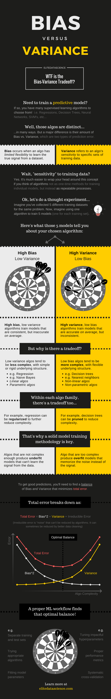

<!-- vim-markdown-toc GFM -->

* [Purpose](#purpose)
* [Choice of Model Selection](#choice-of-model-selection)
    * [Practical Issues](#practical-issues)
    * [Domain Knowledge](#domain-knowledge)
    * [Class of Models](#class-of-models)
* [Occams Razor](#occams-razor)
* [Which model should be picked](#which-model-should-be-picked)
    * [Example](#example)
    * [Question](#question)
* [System](#system)
    * [Example](#example-1)
* [Model](#model)
    * [Example](#example-2)
    * [Relation between learning algorithm and model](#relation-between-learning-algorithm-and-model)
* [Hypothesis Class](#hypothesis-class)
    * [Example](#example-3)
* [Model complexity](#model-complexity)
* [Advantages of Simplicity](#advantages-of-simplicity)
    * [Ways of measuring simplicity](#ways-of-measuring-simplicity)
* [Overfitting](#overfitting)
    * [Example](#example-4)
* [Bias vs Variance Tradeoff](#bias-vs-variance-tradeoff)
    * [Variance](#variance)
    * [Bias](#bias)
    * [Example](#example-5)
* [Regularization](#regularization)
* [Takeaways](#takeaways)
* [Model Evaluation](#model-evaluation)
* [Hyperparameters](#hyperparameters)
    * [Regression](#regression)
    * [Polynomial Regression](#polynomial-regression)
    * [Tuning Hyperparameters](#tuning-hyperparameters)
    * [Hold-Out Strategy](#hold-out-strategy)
* [Cross-Validation](#cross-validation)
    * [K-Folds Cross-Validation](#k-folds-cross-validation)
    * [Grid Search Cross-Validation](#grid-search-cross-validation)
* [Takeaways](#takeaways-1)
* [Questions](#questions)

<!-- vim-markdown-toc -->

# Purpose
The central issue in all of machine learning is how do we extrapolate learnings from a finite amount of available data to all possible inputs ‘of the same kind’? Training data is always finite, and yet, the model is supposed to learn all about the task at hand from it and perform well on unseen data. 

# Choice of Model Selection
- Trial and Error
- Domain Knowledge

## Practical Issues
1. Type of Data
2. Data Quality
3. Dimensionality of data

## Domain Knowledge
Knowledge about the particular business domain of which you are trying to solve a particular problem. 

It influences 
- model selection
- model evaluation
- model comparison

## Class of Models
Different Models can have properties to deal with the following different kinds of data:

1. High dimensional data
2. Noisy Data
3. Real time data
4. Large amount data
5. Missing data

# Occams Razor 
- Making your model is as simple as possible but no simpler than that or, in other words, a model should be as simple as possible but robust.
- When in doubt, choose a simpler model
- Occam’s razor does not suggest that a model should be unjustly simplified until no further simplification is possible. It suggests that when faced with a trade-off between a complex and a simple model, with all other things being roughly equal, you are better off choosing the simpler one.

# Which model should be picked
We must never use training data for evaluation
## Example
Learning to Drive

## Question
Which of these is the simplest regression model

| Model                  | Simplicity Level |
|------------------------|------------------|
| $Y = 3x + 0.005z + w$  | 2                |
| $Y = x = 58z + \log w$ | 3                |
| $Y = x + 3w$           | 0                |
| $Y = 2x + e^2$         | 1                |


# System
- Existing way of doing things 
## Example
- Manual selection of spam emails by a team of technicians

# Model
- Input => Model => Output
- tries to mimic the system, such that it is no longer required
## Example
- Naive Bayes classifier to identify Spam and Ham emails

## Relation between learning algorithm and model
- A learning algorithm learns from training data and produces a model.


# Hypothesis Class
Class of models that a learning algorithm with produce.

## Example 
- Random Forest will always produce Decision Tress 
- SVM will always produce Linear Model.

# Model complexity
1. Simpler models are usually more 'generic'
    - Simple models can work on unseen data
    - Example: Studying for exams vs Understanding principles

2. Simpler models require fewer training samples
    - Example: Studying for exams vs Understanding principles
    - usually data available is limited 

3. Simpler models are more robust
    - Example: Change of exam pattern
    - small changes in training data will not make too much difference

4. Simpler models make more errors in training
    - Example: Competitive Exams
    - simpler model will outperform on test set because of overfitting

# Advantages of Simplicity
- generalisability
- robustness
- requirement of fewer assumptions
- less data required for learning

## Ways of measuring simplicity
- choice of simpler functions
- fewer model parameters
- usage of lower degree polynomials


# Overfitting
- Model does very well on training data but fails or performs poorly on testing data
- Memorizing the training data completely instead of generating an abstract pattern. Essentially, it is learning from the noise in the data as well.
- It is a consequence of high model complexity

## Example
- Studying for exams (pattern specific, complex) vs Understanding principles (first principle, simple)
- $R^2$ value will be $0.8$ on training but $0.3$ on test set.

# Bias vs Variance Tradeoff
- Bias and Variance are properties of model


## Variance
- How sensitive is the model to input data
- High Complexity => High Variance
- Consistency of Mode
- Variance refers to changes in the model as a whole when trained on a different data set rather than the variance in the predicted values of a single model
- Variance measures how flexible the model is with respect to changes in the training data.
- High Variance -> Model will fail on test data
- High Variance -> Overfitting

## Bias 
- How much error the model is likely to make on (future) test data
- Low Complexity => High Bias (or Simple Model => High Bias)
- High Complexity => Low Bias
- Correctness of Model
- Bias measures how accurately a model can describe the actual task at hand.
- High Bias means $y_{pred} - y_{actual}$ will be high
- When complexity is high, the bias is the least and the variance is high. Hence the model must have identified all the patterns present in the data including the noise.
- High Bias -> Model will fail on training data
- High Bias -> Underfitting

A balance is required between Bias and Variance
- Model should be simple enough to be generalizable
- Model should be complex enough to make fewer errors
- Correctness vs Consistency trade-off
- We want both Bias and Variance to be low, however, decreasing bias increases variance and vice-versa.
- Bias of a model represents the amount of error the model will commit on a given dataset, while the variance of the model measures how much the model changes when trained on a different dataset

## Example
- Cracking competitive exam
    - you need to know the fundamentals, but you also require some level of memorization


# Regularization
- Steps to reduce model complexity
- It is part of the learning algorithm
- Regularization is the process of deliberately simplifying models to achieve the correct balance between keeping the model simple and not too naive.
- Performed when the learning algorithm uses the training data to produce a model
- Regularization discourages the model from becoming highly complex even if it explains the (training) observations better. 

# Takeaways
1. `Occam’s Razor` concept should be used when selecting a model. When everything else is the same, a simpler model should be preferred. However, we should make model so simple that it fails to make any worthwhile predictions.
2. `Bias Vs Variance`: The aim is to have low bias as well as low variance, however, decreasing bias leads to increasing variance. Hence, a trade-off is required. Low Bias leads to correctness, while low variance leads to consistency.
3. `Regularization` techniques are part of the learning algorithms and they have the objective to simplify model to achieve the optimal point where model is simple but not too naive.
4. `Overfitting` is a problem where model does well on training data but performs poorly on test data. This happens because model has learned from signal as well as noise i.e. model is too complex. Hence, we should prefer simpler models to avoid this problem.

---

# Model Evaluation
- Meaning and use of hyperparameters
- Meaning and use of validation data

# Hyperparameters 
- Parameters that we pass on to the learning algorithm to control the complexity of the final model
- They are choices that the algorithm designer makes to ‘tune’ the behaviour of the learning algorithm. 
- The choice of hyperparameters has a lot of bearing on the final model produced by the learning algorithm.
- Part of most learning algorithms that are used for training and regularization.

## Regression
$\displaystyle \sum_{i=1}^n(y_i-ax_i-b)^2 + \lambda(a^2+b^2)$

- Error Term: $(y_i-ax_i-b)^2$
- Hyper parameter: $\lambda$
- Regularization: $(a^2+b^2)$

## Polynomial Regression
Fitting a polynomial to the data is called polynomial regression.
- Equation: $y = \beta_0 + \beta_1x_1 + \beta_2x_1^2 \ldots \beta_nx_1^n$

If we want to minimize error term, we will decrease $\lambda$ while if we want reduce complexity we will increase $\lambda$
- To reduce error Term: $\lambda \downarrow$
- To reduce complexity: $\lambda \uparrow$

Learning Algorithms take `hyperparameters` as input and produce model parameters (and class of models) as output.

## Tuning Hyperparameters
**Problems**
1. Split into train and test sets: Tuning a hyperparameter makes the model 'see' the test data. Also, the results are dependent on the specific train-test split.
2. Split into train, validation and test sets: The validation data would eat into the training set.

**Solution: Cross-Validation**

In cross-validation, you split the data into train and test sets and train multiple models by sampling the train set. Finally, you only use the test set to test the hyperparameter once.

## Hold-Out Strategy
- Keep some data hidden for testing after model training is complete by performing train-test split.
- training - used for training
- validation - used for tuning hyperparameters
- test - used for testing

# Cross-Validation
If data is limited, doing a train-test split might hamper the model. Some important information might be missed because the test set eats up crucial data.

**Strategy**

- Split the data into multiple training and test sets 
- Build model on each split
- Choose the model which has the best score

**Advantages**

- You don't need validation set, hence you have more data for training.
- We are not doing any cheating as we are looking at different test sets in each iteration.

## K-Folds Cross-Validation
In each iteration, you keep one fold as the test set and the remaining you use for training.
```py k-folds cross-validation
from sklearn.model_selection import cross_val_score
scores = cross_val_score(lm, X_train, y_train, scoring='neg_mean_squared_error', cv=5)
```


## Grid Search Cross-Validation


The following three key steps are to be taken while tuning the hyperparameters in Python:  

1. Create a cross-validation scheme: For example, the number of splits that you want to set
2. Specify the range of hyperparameters to tune
3. Perform a grid search on the set range

```py heading='Grid Search Cross-Validation'
from sklearn.model_selection import KFold
from sklearn.linear_model import LinearRegression
from sklearn.feature_selection import RFE
from sklearn.model_selection import GridSearchCV

# step-1: create a cross-validation scheme
folds = KFold(n_splits = 5, shuffle = True, random_state = 100)

# step-2: specify range of hyperparameters to tune
hyper_params = [{'n_features_to_select': list(range(1, 14))}]


# step-3: perform grid search
# 3.1 specify model
lm = LinearRegression()
lm.fit(X_train, y_train)
rfe = RFE(lm)             

# 3.2 call GridSearchCV()
model_cv = GridSearchCV(estimator = rfe, 
                        param_grid = hyper_params, 
                        scoring = 'r2', 
                        cv = folds, 
                        verbose = 1,
                        return_train_score=True)      

# fit the model
model_cv.fit(X_train, y_train)     
```

# Takeaways
1. Hyper Parameters such as number of features to select are used to tune the learning algorithm such that a good model which performs well on both training and test set can be found. 
2. In tuning hyperparameters, if we use the regular train-test split strategy, we are essentially cheating, as in a way, the model is the test data to tune the parameters. To resolve the issue, we can either keep a validation set, or (more commonly), use the cross-validation strategy.
3. Cross Validation is a process where we create multiple train test splits such that in each split, the model only sees that split's test data once. We then take the average of the test scores of each of the splits to decide which model (or hyperparameter), we are going to pick. Grid Search Cross Validation is the most commonly used technique for Cross Validation.

# Questions

**Why should we have disjoint training and test data sets? (This means that a model should not be tested with data on which it is trained.)**
- Any model needs to be tested on how well it would work in the proverbial ‘real’ world because once a model has seen the data, it can attempt to ‘memorise’ it, and once that is done, testing it on the same data set will not help in determining its performance on unseen data. In an ideal scenario wherein we have plenty of data, we should divide the data into three sets. The first one would be the training data on which we shall train the model. The second one would be the validation data on which we shall test the model and tune the hyperparameters. The third one would be the test data that we will use for assessing our model.

---

**Among Weak Learners and Strong Learners, which are more likely to have a low variance?**
- Weak Learners: Weak learners create simpler models that have a lower variance. They are not able to model complex relationships and, hence, create a more generic model.

---

**Suppose two linear regression models are provided on the same data set with 100 attributes. Model A has 10 attributes, whereas model B has 90 attributes. What can you say about the two models?**
- Model B has tried to memorise the data, and when the training data changes slightly, the expected results will change.
    - Model B has many attributes and is probably overfitted.
- Model B will have a much higher variance than model A.
    - Model B is memorising the data or overfitting and, hence, would have a higher variance. 
- Model A will have a higher bias.
    - Model A has made numerous assumptions about the data to keep the model simple, leading to a high bias.

---

**Suppose data is generated via a polynomial equation of degree 4 (i.e., the said polynomial equation will perfectly fit the given data). Which of the following statements is true in this case?**
- Linear regression will have a high bias and a low variance.
    - Linear regression would create a degree-1 polynomial that would be less complex than the degree-4 polynomial and, hence, would have a higher bias. Since the model is less complex and will not overfit, it would have a low variance.
- A polynomial equation of degree 4 will have a low bias and a low variance.
    - Since the equation fits the data perfectly, both bias and variance will be low.

---

**How do you measure the variance of a model?**
- By measuring how much does the estimates of the model change on the test data on changing the training data
    - Variance measures the extent of change in a model with respect to the training data.

---

**Is it always possible, in principle, to reduce the training error to zero?**
- Yes, you could always make the model memorise the entire training data set.

---

**What is regularization?**
- It is a technique that is used to strike a balance between model complexity and model accuracy on training data.
    - Regularization does not improve accuracy; it improves the balance between accuracy and complexity.

---

**Which of the following statements is correct with respect to k-fold cross validation?**

| Statement                                                                            | T/F |
|--------------------------------------------------------------------------------------|-----|
| With a higher number of folds, the estimated error, on an average, is usually lower. | T   |
| As k increases, the training time for k-fold cross validation increases.             | T   | 
- Training happens for k times, and a higher k would imply a higher run time for training with k-fold cross validation. 
- Also, a higher k implies that the training set is bigger and is a better representation of the actual data each time.

---

**Which of the following about k-fold cross validation is not true?**

| Statement                                                        | T/F |
|------------------------------------------------------------------|-----|
| You repeat the cross validation process ‘k’ times.               | T   |
| Each ‘kth’ fold is used as the validation data once.             | T   |
| You repeat the process k-1 times.                                | F   |
| A model trained with k-fold cross validation will never overfit. | F   | 

- With k-fold cross validation, training happens k times while each sample is used as validation data at least once.
- Overfitting is possible with cross validation. Cross-validation does not prevent overfitting by itself, but it may help in identifying a case of overfitting.

---

**Choosing between Regression and Classification**
- Target is continuous then use regression
- Target is 0/1 then use classification

---
