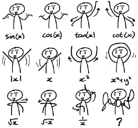

<!-- vim-markdown-toc GFM -->

* [Constrained Minimization](#constrained-minimization)
* [Ridge and Lasso Regression](#ridge-and-lasso-regression)
    * [Signature of overfitting in Polynomial Regression](#signature-of-overfitting-in-polynomial-regression)
    * [Ridge](#ridge)
    * [Lasso](#lasso)
* [Unconstrained Minimization](#unconstrained-minimization)
* [Closed form](#closed-form)
* [Gradient Descent](#gradient-descent)
    * [1D Gradient Descent](#1d-gradient-descent)
    * [2D Gradient Descent](#2d-gradient-descent)
* [Metrics](#metrics)
    * [RSS](#rss)
    * [Mean Square Error](#mean-square-error)
    * [Root Mean Square Error](#root-mean-square-error)
* [SLR](#slr)
* [Benefits of Using Matrices](#benefits-of-using-matrices)
    * [SLR Equation in Matrix Form](#slr-equation-in-matrix-form)
* [MLR](#mlr)
* [Questions](#questions)
* [Identifying Non-Linearity in Data](#identifying-non-linearity-in-data)
* [Handling Non-Linear Data](#handling-non-linear-data)
* [Polynomial Regression](#polynomial-regression)
* [Questions](#questions-1)
* [Data Transformation](#data-transformation)
    * [When to do transformation](#when-to-do-transformation)
* [Questions](#questions-2)
* [Pit Falls of Linear Regression](#pit-falls-of-linear-regression)
    * [Non-constant variance](#non-constant-variance)
    * [Autocorrelation](#autocorrelation)
    * [Multicollinearity](#multicollinearity)
    * [Overfitting](#overfitting)
    * [Extrapolation](#extrapolation)
* [References](#references)

<!-- vim-markdown-toc -->

# Constrained Minimization

Constrained minimisation is a process in which we try to optimise an objective function with respect to some variables in the presence of the constraints on the variables or the function. In our case, the objective function is a cost function.

- Ridge/Lasso Regression and SVM use Constrained Minimization
- The solution to the overall minimisation problem is the point where the error is minimum while satisfying the additional constraint.

# Ridge and Lasso Regression

- Adding constraints over the weights is called regularization and ridge and lasso are two common techniques used for this purpose.

## Signature of overfitting in Polynomial Regression

- The weights of the coefficients are very large
- In regularization, we combat overfitting by controlling the model's complexity, i.e. by introducing an additional term in our cost function in-order to penalize large weights. This biases our model to be simpler, where simpler is weights of smaller magnitude (or even zero). We want to make the weights smaller because complex models and overfitting are characterized by large weights.
- Adding constraints over the weights / coefficients is called regularization and it helps in resolving overfitting issue because having large weights is one of the signs off overfitting so if we put a constraint over weights, that will make sure large weights are not assigned and hence model does not overfit.

## Ridge

- Constraint over sum of squared weights ($\sum w_i^2$ &lt; $r^2$)
- represents a region bounded by a circle in 2D space
- Ordinary least squares with L2 regularisation is known as Ridge Regression.
- In L2 regularisation, large weights are being penalized much more
- Ex: $\displaystyle \sum_{i=1}^{9}w_i^2 \leq 1000$

## Lasso

- Constraint over sum of absolute weights ($\sum |w_i|$ &lt; $r^k$)
- represents a region bounded by a square in 2D space
- Gives sparse solution
- In L1 regularization the model's parameters become sparse during optimization, i.e. it promotes a larger number of parameters w to be zero. This is because smaller weights are equally penalized as larger weights
- This sparse property is often quite useful. For example, it might help us identify which features are more important for making predictions, or it might help us reduce the size of a model (the zero values don't need to be stored).
- Ex: $\displaystyle \sum_{i=1}^{9}|w_i| \leq 100$

# Unconstrained Minimization

Unconstrained minimisation, on the other hand, is a process in which we try to optimise the objective function with respect to some variables without any constraints on those variables.

- Linear Regression and Logistic Regression use Unconstrained Minimization
- There is no explicit condition on the parameters but they are in turn calculated with the condition that the cost function needs to be minimized.
- Gradient Descent is one way of solving unconstrained minimisation

$J(\theta) = 1.2(\theta - 2)^2 + 3.2$

# Closed form

$J'(\theta) = 0 \implies 2.4(\theta - 2) \implies \theta_{opt} = 2$

# Gradient Descent

## 1D Gradient Descent

$\displaystyle \theta_{new} = \theta_{old} - \eta\frac{\partial J}{\partial \theta}|_{\theta = \theta_{old}}$

$\displaystyle \theta_{new} = \theta_{old} - \eta(2.4){(\theta_{old}-2)}$

Let's assume the following starting conditions:

- $\theta = 1$
- $\eta = 0.1$

Substituting,

- $\theta_{new} = 1 - 0.1(2.4)(-1) = 1.24$
- $\theta_{new} = 1.24 - 0.1(2.4)(-0.76) = 1.42$

In gradient descent, you start with some initial value and then gradually approach the optimal solution.

Steps of Gradient Descent

1. We try to find the optimal minima by using Gradient Descent algorithm
2. Choose the values of eta (learning rate) and initial theta (optimal value to be obtained)
3. Use the formula
   - $\displaystyle \theta_{new} = \theta_{old} - \text{learning rate}*(\text{partial derivative of cost function over } \theta_{old})$
4. Continue substituting new value to old value till the value becomes similar over several iterations

In other words,

1. Choose a starting point $X_0$
2. Beginning at $X_0$, generate a sequence of iterates $X^{inf}_{k=o}$ with respect to a cost function (f) value which has to be minimized until a solution with sufficient accuracy is found or until no further progress can be made.(inf=infinity)

## 2D Gradient Descent

$\displaystyle \triangledown J(\theta_{1}, \theta_2) = 0$

$\displaystyle \triangledown J = 
\begin{bmatrix}
\frac{\partial J}{\partial \theta_1} \\ 
\\
\frac{\partial J}{\partial \theta_2} \\
\end{bmatrix}
\begin{matrix}
= 0 \\
\\
= 0
\end{matrix} \implies
\begin{bmatrix}
\theta_1^{new} \\ 
\\
\theta_2^{new}
\end{bmatrix}
$=$
\begin{bmatrix} 
\theta_1^{old}
\\
\\
\theta_2^{old}
\end{bmatrix}
$
$-\eta 
\begin{bmatrix}
\frac{\partial J}{\partial \theta_1}
\\ 
\\
\frac{\partial J}{\partial \theta_2} \\ 
\end{bmatrix}_{\theta=\theta^{old}}
$

**For the case of Linear Regression**

$\displaystyle J(m,c) = \sum_{i=1}^{n}(y_i-(mx_i+c))^2$

$
\begin{bmatrix}
m \\ 
\\
c
\end{bmatrix}^{new}
$=$
\begin{bmatrix} 
m
\\
\\
c
\end{bmatrix}^{old}
$
$-\eta 
\begin{bmatrix}
\frac{\partial J}{\partial m}
\\ 
\\
\frac{\partial J}{\partial c} \\ 
\end{bmatrix}_{\begin{bmatrix}m\\c\end{bmatrix}^{old}}
$

$\displaystyle \frac{\partial J}{\partial m} = 2\sum_{i=1}^{n}(y_i-(mx_i+c))(-x_i)$

$\displaystyle \frac{\partial J}{\partial c} = 2\sum_{i=1}^{n}(y_i-(mx_i+c))(-1)$

# Metrics

- Overall sense of error of the model
- Smaller the RSS, closer is the model fit

## RSS

$\displaystyle y_i = \beta_0 + \beta_1x_{i} + \epsilon_i$

$\displaystyle \hat y_i = \beta_0 + \beta_1x_{i}$

$RSS = \displaystyle \sum_{i=1}^{N}\epsilon_i^2 = \sum_{i=1}^{N}(y_i - \hat y_i)^2 = \sum_{i=1}^{N}(y_i - bo - b_1x_i)^2$

```py heading="RSS in Python"
import numpy as np
rss = np.sum(np.square(y-y_pred))
print(rss)
```

$\displaystyle \frac{\partial (RSS)}{\partial \beta_0} \implies \beta_0 = \bar y - \beta_1 \bar x$

$\displaystyle \frac{\partial (RSS)}{\partial \beta_1} \implies \beta_1 = \frac{\sum_{i=1}^{N}(x-\bar x)(y - \bar y)}{\sum_{i=1}^{N}(x-\bar x)^2}$

## Mean Square Error

$\displaystyle MSE = \frac{RSS}{n}$

```py heading="MSE in Python"
from sklearn.metrics import mean_squared_error as mse

print(mse(y_actual, y_true))
```

## Root Mean Square Error

$\displaystyle RMSE = \sqrt{MSE}$

```py heading="RMSE in Python"
print(mse**0.5)
```

# SLR

for i = i to n,
$\displaystyle y_{i} = \beta_0 + \beta_1x_{i} + \epsilon_i$

for n observations, equations can be written as:

- $y_{1} = \beta_0 + \beta_1x_{1}$
- $y_{2} = \beta_0 + \beta_1x_{2}$
- $\ldots$
- $y_{n} = \beta_0 + \beta_1x_{n}$

This can be written more efficient in matrix notation:

$\displaystyle \begin{bmatrix}y_1\\y_2\\\ldots\\y_{n}\end{bmatrix} = 
\begin{bmatrix}1&x_1\\1&x_2\\\ldots&\ldots\\1&x_{n}\end{bmatrix}
\begin{bmatrix}\beta_0\\\beta_1\end{bmatrix} +
\begin{bmatrix}\epsilon_1\\\epsilon_2\\\ldots\\\epsilon_n\end{bmatrix}
$

In more concise form:

$\displaystyle Y = X\beta + \epsilon$

here,

- Y: Response Vector
- X: Design matrix
- $\beta$: Coefficient Vector
- $\epsilon$: Error Vector

# Benefits of Using Matrices

- Formulae become simpler, and more compact and readable.
- Code using matrices runs much faster than explicit ‘for’ loops.
- Python libraries, such as NumPy, help us build n-dimensional arrays, which occupy less memory than Python lists and computation is also faster.

## SLR Equation in Matrix Form

$\displaystyle \widehat{\beta}=(X^{T}.X)^{-1}.X^{T}.Y$

```py heading="Implementing equation in Python"
beta_hat = np.linalg.inv(X_mat.T.dot(X_mat)).dot(X_mat.T).dot(Y)
```

# MLR

for i = i to n,

- $\displaystyle y_{i} = \beta_0 + \beta_1x_{i,1} + \beta_2x_{i,2} + \ldots + \beta_kx_{i,k} + \epsilon_i$,
- where k is the number of variables in the model

Matrix Notation:

$\displaystyle \begin{bmatrix}y_1\\y_2\\\ldots\\y_{n}\end{bmatrix} = 
\begin{bmatrix}1&x_{1,1} & x_{1, 2}\ldots&x_{1,k}\\1
&x_{2,1} & x_{2, 2}\ldots&x_{2,k}\\ 
\ldots&\ldots\\1&
x_{n,1} & x_{n, 2}\ldots&x_{n,k}\\ 
\end{bmatrix}
\begin{bmatrix}\beta_0\\\beta_1\\\beta_2\\\ldots\\\beta_k\end{bmatrix} +
\begin{bmatrix}\epsilon_1\\\epsilon_2\\\ldots\\\epsilon_n\end{bmatrix}
$

Dimension: $\displaystyle Y(n,1) = X(n, k+1).\beta(k+1) + \epsilon(n,1)$

It can still be written as:

$\displaystyle Y = X\beta + \epsilon$

here,

- Y: Response Vector
- X: Design matrix
- $\beta$: Coefficient Vector
- $\epsilon$: Error Vector

Residual: $\displaystyle \Large \epsilon = \normalsize Y - X\beta$

# Questions

**How will you identify the presence of heteroscedasticity in the residuals?**

- Plot residuals vs the predicted values and see of there is a consistent change in the residuals as we move from left of the x axis to the right.

---

**How would you check for the assumptions of Linear Regression?**

- Scatter Plot of residuals vs y_pred
- Histogram Plot of residuals

---

# Identifying Non-Linearity in Data

- For SLR

  - scatter plot and check non-linear patterns

- For MLR
  - check residuals vs predictions plot for non-linearity
    - residuals are scattered randomly around 0
    - spread of residuals should be constant
    - no outliers in the data
  - If non-linearity is present, then we may need to plot each predictor against the residuals to identify which predictor is nonlinear.

# Handling Non-Linear Data

- Polynomial regression
- Data Transformation
- Non-Linear Regression
- Polynomial regression and data transformation allow to use the linear regression framework to estimate model coefficients

# Polynomial Regression

$\displaystyle \hat y = \beta_0 + \beta_1x_i + \beta_2x_{i}^{2}$

Substitute the variable $x_{i}$ as $x_1$ and $x_{i}^{2}$ as $x_2$

$\displaystyle \hat y = \beta_0 + \beta_1x_1 + \beta_2x_{2}$

This way, we can express non-linear data in linear regression model

---

The kth-order polynomial model in one variable is given by:

$y = β_0 + β_1x + β_2x^{2} + β_3x^3 + \ldots + β_kx^k + \epsilon$

If $x_j = x^j$ and j = 1, 2, ..., k, then the model is a multiple linear regression model with k predictor variables, $x_1, x_2, \ldots, x_k$. Thus, polynomial regression can be considered an extension of multiple linear regression and, hence, we can use the same technique used in multiple linear regression to estimate the model coefficients for polynomial regression.

# Questions

**On inspection of the relationship between one predictor variable (a) and the response variable (y), you identify that the two have a cubic relationship. In the final model, which predictors will you include?**

- $x, x^{2}, x^{3}$
- Since this is a cubic fit, we need to include third degree of the predictor. In polynomial regression, we need to include the lower degree polynomials in the model as well. Hence, we include all three predictors as mentioned in the answer.
- Model Equation: $y_{i} = \beta_0 + \beta_1x_{i} + \beta_2x^{2} + \beta_3x^{3} + \epsilon$

# Data Transformation

- both response and predictors can be transformed
- One can take a log transform over data if there is sharp upward trend which then normalizes

```py heading="Log Transform in Python"
import numpy as np
x = [1, 5, 9, 100, 200, 300, 400]
l = np.log(x)
print(l)
```

- $\displaystyle \hat y_{i} = \beta_0 + \beta_1x_{i}$
- After $\log$ transform: $\displaystyle \hat y_{i} = \beta_0 + \beta_1\log(x_{i})$

- There are other transformations one can perform. Refer [this article](https://www.mathsisfun.com/sets/functions-common.html) for more information.



## When to do transformation

- If there is a non-linear trend in the data, the first thing to do is transform the predictor values.
- When the problem is the non-normality of error terms and/or unequal variances are the problems, then consider transforming the response variable; this can also help with non-linearity.
- When the regression function is not linear and the error terms are not normal and have unequal variances, then transform both the response and the predictor.
- In short, generally:
  - Transforming the y values helps in handling issues with the error terms and may help with the non-linearity
  - Transforming the x values primarily corrects the non-linearity

# Questions

**What is the equation for exponential transformation?**

- $\displaystyle \hat y = \beta_0 + \beta_1e^{x_{i}} + \epsilon_i$

---

**Give Examples where Linear Regression (even with transformation) cannot be applied**

- $\displaystyle y = \beta_1x_1 + \beta_2e^{x_2+x_3}+\beta_3sin(\beta_4x_4)$
- $\displaystyle y_{i} = \frac{\beta_1}{1+e^{\beta_2+bet_3x_{i}}} + \epsilon_i$

---

**After transforming the data in case of nonlinear relationship between the predictor and response variable, how do we assess whether the data transformation was appropriate?**

- We assess this by checking the residual plots for any violation in assumptions.

---

# Pit Falls of Linear Regression

## Non-constant variance

Constant variance of error terms is one of the assumptions of linear regression. Unfortunately, many times, we observe non-constant error terms. As discussed earlier, as we move from left to right on the residual plots, the variances of the error terms may show a steady increase or decrease. This is also termed as heteroscedasticity.

When faced with this problem, one possible solution is to transform the response Y using a function such as log or the square root of the response value. Such a transformation results in a greater amount of shrinkage of the larger responses, leading to a reduction in heteroscedasticity.

## Autocorrelation

This happens when data is collected over time and the model fails to detect any time trends. Due to this, errors in the model are correlated positively over time, such that each error point is more similar to the previous error. This is known as autocorrelation, and it can sometimes be detected by plotting the model residuals versus time. Such correlations frequently occur in the context of time series data, which consists of observations for which measurements are obtained at discrete points in time.

In order to determine whether this is the case for a given data set, we can plot the residuals from our model as a function of time. If the errors are uncorrelated, then there should be no observable pattern. However, on the other hand, if the consecutive values appear to follow each other closely, then we may want to try an autoregression model.

## Multicollinearity

If two or more of the predictors are linearly related to each other when building a model, then these variables are considered multicollinear. A simple method to detect collinearity is to look at the correlation matrix of the predictors. In this correlation matrix, if we have a high absolute value for any two variables, then they can be considered highly correlated. A better method to detect multicollinearity is to calculate the variance inflation factor (VIF).

When faced with the problem of collinearity, we can try a few different approaches. One is to drop one of the problematic variables from the regression model. The other is to combine the collinear variables together into a single predictor. Regularization helps here as well.

## Overfitting

When a model is too complex, it may lead to overfitting. It means the model may produce good training results but would fail to perform well on the test data. One possible solution for overfitting is to increase the amount and diversity of the training data. Another solution is regularization.

## Extrapolation

Extrapolation occurs when we use a linear regression model to make predictions for predictor values that are not present in the range of data used to build the model. For instance, suppose we have built a model to predict the weight of a child given its height, which ranges from 3 to 5 feet. If we now make predictions for a child with height greater than 5 feet or less than 3 feet, then we may get incorrect predictions. The predictions are valid only within the range of values that are used for building the model. Hence, we should not extrapolate beyond the scope of the model.

# References

- [Plot best fit line - Libre Office](https://www.youtube.com/watch?v=f4_GwWdUNqI)
- [Constrained Optimisation](https://mat.gsia.cmu.edu/classes/QUANT/NOTES/chap4.pdf)
- [OLS for SLR](https://towardsdatascience.com/understanding-the-ols-method-for-simple-linear-regression-e0a4e8f692cc)
- [Matrix form of MLR](https://online.stat.psu.edu/stat462/node/132/)
- [Common Math Functions](https://www.mathsisfun.com/sets/functions-common.html)
- [Data Tranformations](https://online.stat.psu.edu/stat462/node/155/)
- [Nonlinear Regression](https://online.stat.psu.edu/stat462/node/204/)
