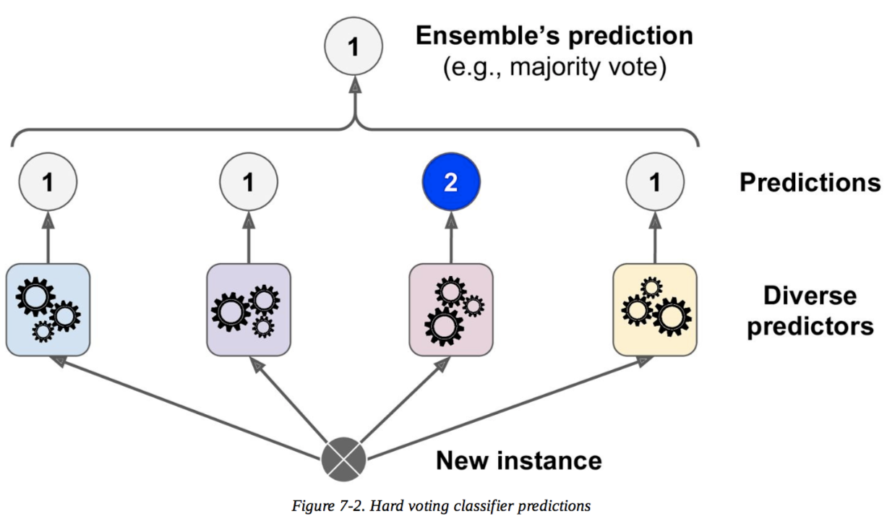
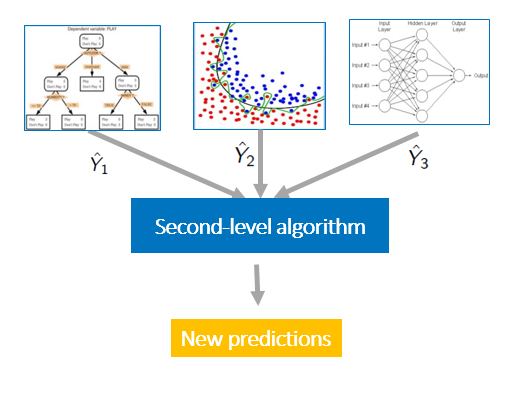
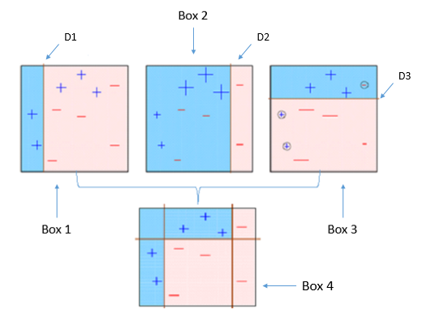
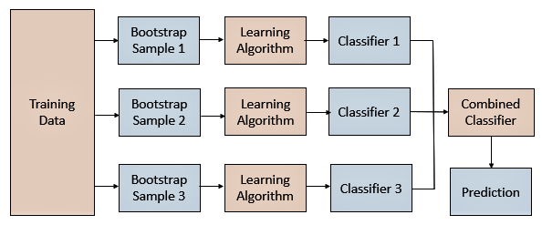

# Purpose
Notes on Random Forest and Ensembles
# Ensembles
- An ensemble refers to a group of things viewed as a whole rather than individually. 
- In an ensemble, a collection of models is used to make predictions, rather than individual models. 
- Arguably, the most popular in the family of ensemble models is the random forest, which is an ensemble made by the combination of a large number of decision trees.
- In principle, ensembles can be made by combining all types of models. An ensemble can have a logistic regression, a neural network, and a few decision trees working in unison.
- group collectively does better than individual models
- Ensembles of models are somewhat analogous to teams of individual players. If you were to choose a football team, you would take the following two steps:
    - Choose people with different skill sets, such as defenders, attackers and a goalkeeper, to ensure diversity
    - Choose good players, i.e., ensure that all players are acceptable from the point of view of their skill sets (and at least better than a regular person)

## Idea
- Individual Models have their individual strengths and weaknesses. 
- Idea is to combine models to reduce individual weakness.
- Collection of diverse and acceptable models

## Diversity
- Strengths and weaknesses of different models complement each other
- Ensures that the models serve complementary purposes, which means that the individual models make predictions independent of each other
- Ex: Building a committee
- Ex: a random forest is an ensemble with a large number of trees as individual models. Diversity ensures that even if some trees overfit, the other trees in the ensemble will neutralise the effect. The independence among the trees results in a lower variance of the ensemble compared to a single tree. Ensembles are more robust to the choice of the training data which makes them more stable and less prone to high variance and overfitting.

- Answers of different models are not correlated
- Agreement between answers of different models is coincidental

### Ways to achieve diversity
- different subsets of training data
    - train different models in each subset
- different training hyperparameters
- different types of classifiers
- different features

## Acceptability
- Model performs significantly better than random guessing
- P(correct prediction) > 0.5
- Ex: opinion of a person who has no domain knowledge won't have much impact as far as acceptability of the project is concerned
- Each model in ensemble should be better than random model

### Why ensembles work
- Ex: Think of loaded coins which have more probability of head than tail [P(H)>0.5] then if you toss coins multiple times the probability of overall heads will be larger.
- Multiple Models inside an ensemble help in derisking and we hope that the collection will do better.

#### Example
- Consider an ensemble with 100 models consisting of decision trees, logistic regression models, etc. Given a new data point, each model will predict an output 
y
 for this data point. If this is a binary classification, then you simply take the majority score. If more than 50% models say 
y
=
0
, you go with 0, and vice versa.

- Firstly, if each individual model is acceptable, i.e., if it is wrong with a probability of less than 50%, you can show that the probability of the ensemble being wrong (i.e., the majority vote going wrong) will be much less than that of any individual model. In this way your chance of getting the prediction correct will be higher as compared to the individual models in the ensemble as they pool the opinion of each weak learner. This is done by exploiting and leveraging the predictive power of these models to predict the final outcome.

- Also, the ensembles cannot be misled by the assumptions made by individual models. For example, ensembles (particularly random forests) successfully reduce the problem of overfitting. If a decision tree in an ensemble overfits, you let it. Chances are extremely low that more than 50% of the models are overfitted. Ensembles ensure that you do not put all your eggs in one basket.

- In a binary classification task, an ensemble makes decisions by considering the majority vote. This means that if there are n models in the ensemble and more than half of them give you the right answers, you will make the right decision. On the other hand, if more than half of the models give you the wrong answers, you will make a wrong decision. In the coin toss analogy, making a correct prediction corresponds to heads, whereas making an incorrect prediction corresponds to tails.

- If you can prove that the probability of more than half of the models making a wrong prediction is less than that of any of the individual models, you will know that the ensemble is a better choice than any of the individual models. 

##### Coin Toss Explanation
- let's assume heads is analogous to making a correct prediction and since it is a biased coin - P(Head) >> P(Tail). 
- Now, let's assume you have an ensemble of, say, 5 models, and let's take P(Head or Right Predicition) to be 0.6 and P(Tail or Wrong Prediction) to be 0.4 for each of the five models for the sake of demonstration. 
- The probability of making a right prediction for the ensemble then turns out to be approximately 68% (basically calculate P(Head >=3) for majority). 
- As you can see, this is higher (by ~8%) than any of the individual model's performance each of which only has a probability of 60% of being right.
- **It is important to remember that each model in an ensemble is acceptable, i.e., the probability of each model being wrong is less than 0.5 (as a random binary classification model is correct 50% of the time).**

# Voting
- Each classifier has equal say
- Voting combines the output of different algorithms by taking a vote. 
- In the case of a classification model, if the majority of the classifiers predict a particular class, then the output of the model would be the same class. 
- In the case of a regression problem, the model output is the average of all the predictions made by the individual models. 
- In this way, every classifier/regressor has an equal say in the final prediction.
 

# Stacking and Blending
- Add another layer in the model, which decides what should be the final output
- Another approach to carry out manual ensembling is to pass the outputs of the individual models to a level-2 classifier/regressor as derived meta features, which will decide what weights should be given to each of the model outputs in the final prediction. In this way, the outputs of the individual models are combined with different weightages in the final prediction. This is the high-level approach behind stacking and blending.

# Boosting
- Can be used with any technique
- create sequential models
- combines weak learners into stronger ones
- works best with weak models (ex: shallow decision trees)

## Aproaches
- Adaptive
- Gradient

## Adaptive Boosting

# Bagging - Boostrapped Aggregation
- creating subsets of data and train different models
- all hyperparameters remain same
- models remain same
- features remain same
- goal: reduce the variance of the algorithm
- Bagging creates different training subsets from the sample training data with replacement, and an algorithm with the same set of hyperparameters is built on these different subsets of data.
- In this way, the same algorithm with a similar set of hyperparameters is exposed to different parts of data, resulting in a slight difference between the individual models. 
- The predictions of these individual models are combined by taking the average of all the values for regression or a majority vote for a classification problem.

## Benefits
- works well with high variance algortihms like Decision trees, KNN, SVM, Neural Networks
- works best with strong and complex models (ex: fully developed decision trees)
- Easy to parallelize
- Fast

## Limitations of Bagging
- Loss of interpretability
    - you cannot really see the individual trees one by one and figure out what is going on behind the ensemble as it is a combination of n number of trees working together. 
- feature dominance
    - all the trees look similar and hence the property of diversity in ensembles is lost. 
- Sometimes bagging can be computationally expensive

## Methods
- When random subsets of the dataset are drawn as random subsets of the samples, then this algorithm is known as Pasting
- When samples are drawn with replacement, then the method is known as Bagging
- When random subsets of the dataset are drawn as random subsets of the features, then the method is known as Random Subspaces
- Finally, when base estimators are built on subsets of both samples and features, then the method is known as Random Patches

---

# Random Forests

- In the bagging type of ensembles, random forests are by far the most successful. 
- They are essentially ensembles of a number of decision trees. You can create a large number of models (say, 100 decision trees), each one on a different bootstrap sample from the training set. 
- To get the result, you can aggregate the decisions taken by all the trees in the ensemble. 
- Bagging chooses random samples of observations from a data set. Each of these samples is then used to train each tree in the forest. 

## Decision Trees
### Assumptions
- Data is in a tabular format
- Each row represents a data point
- Each column represents an attribute
### Building a Decision Tree
- Node represents a test on an attribute
- Leaves contain the predictions for the target column
- For every split at a node, training data homogeneity should increase
- We split on attributes which causes maximum homogeneity

# Building a Random Forest
- Decision Trees are created where we take a random sample and on each split we also take random sample of the features for choosing the best split.
- Random selection of features for splitting
- Not selection all the features
- We may not consider most prominent features for all nodes

- Bootstrapping refers to creating bootstrap samples from a given data set. A bootstrap sample is created by sampling the given data set uniformly and with replacement. A bootstrap sample typically contains about 40–70% data from the data set. Aggregation implies combining the results of different models present in the ensemble.

- Random forest selects a random sample of data points (bootstrap sample) to build each tree and a random sample of features while splitting a node. Randomly selecting features ensures that each tree is diverse and that some prominent features are dominating in all the trees making them somewhat similar.

##### Example
Suppose you want to build a random forest of 10 decision trees.
- First, you will create 10 bootstrap samples from the data, and then, you will train each tree on a different bootstrap sample
- In a decision tree every data point passes from the root node to the bottom until it is classified in a leaf node
- A similar process takes place in random forests as well while making predictions
- Each data point passes through different trees in the ensemble which are built on different training and feature subsets
- The final outcome of these trees are then combined either by taking the most frequent class prediction in case of a classification problem or average in case of a regression problem

# Question
**Consider the heart disease data set where a few attributes such as Thal, blood pressure, etc., are prominent predictors for the target variable. If you were to build multiple decision trees on this as a part of an ensemble, considering all the attributes for all the individual trees, which of these violations would occur and be significant?**
- The models will not be diverse enough
    - If a few variables are prominent, a large number of trees will have them as important nodes, and they will look similar. Similar trees violate the condition of diversity.

**What is the process of subsetting observations and features for each decision tree in a random forest?**
- A random subset of observations is chosen every time a new tree is built in a forest.
    - A different random subset of observations is chosen, which is called the bootstrap sample, for each tree that is to be built in the forest. This is called bootstrapping.
- A random subset of features is chosen every time a node is being split inside a tree.
    - After the bootstrap sample is selected, tree building starts, and a random subset of features is selected at each node in order to split it. This is what makes random forests better than a simple bagging algorithm.

# Advantages of Random Forest
1. It is diverse
    - More diversity = better results
    - Increase number of trees to make random forest stable
    - More the number of trees, more generalizable the model becomes
    - Diversity arises because each tree is created with a subset of the attributes/features/variables, i.e., not all the attributes are considered while making each tree; the choice of the attributes is random. This ensures that the trees are independent of each other.
2. Immune to the curse of dimensionality
    - Randomly picks a sample of features
    - Since each tree does not consider all the features, the feature space (the number of features that a model has to consider) reduces. This makes an algorithm immune to the curse of dimensionality. Also, a large feature space causes computational and complexity issues.
3. It is parallelizable
    - Independent trees can be built on different machines
    - You need a number of trees to make a forest. 
    - Since two trees are independently built on different data and attributes, they can be built separately. 
    - This implies that you can make full use of your multi-core CPU to build random forests. Suppose there are 4 cores and 100 trees to be built; each core can build 25 trees to make a forest.
4. No distinction between training and testing data is required
    - Every tree has been built from some part of the dataset
5. Stability
    - Stability arises because the answers given by a large number of trees average out. 
    - A random forest has a lower model variance than an ordinary individual tree.

  
## Out of Bag Error
- When I compute the test performance of the ensemble.
- I take every point in the entire dataset
- Look at all the trees which were built with datasets that did not include some point  
- You should always avoid violating the fundamental tenet of learning: 'Not testing a model on what it has been trained on’. 
- While building individual trees, you can choose a random subset of the observations to train them. 
- If you have 10,000 observations, each tree may only be built from 7,000 (70%) randomly chosen observations. 
- OOB is the mean prediction error on each training sample $x_{i},$ using only the trees that do not have $x_{i}$ in their bootstrap sample used for building the model. 
- This is very similar to a cross-validation (CV) error. In a CV error, you can measure the performance on the subset of data that the model has not seen before.
- In fact, it has been proven that using an OOB estimate is as accurate as using a test data set of a size equal to the training set.
- Thus, the OOB error omits the need for set-aside test data (though you can still work with test data like you have been doing, at the cost of eating into the training data).

##### Example
Suppose there are 
N = 100 observations with M = 15 features, and the outcome variable is a categorical variable Y. Also, you build a random forest with 50 trees. The OOB is calculated as follows:

For each observation $N_{i}, N_{i}$ is passed to all the trees that did not have it in their training. These trees then predict the class of $N_{i}$. The final prediction for $N_{i}$ is decided by a majority vote.

Now let’s apply this to $N_1$. Suppose 10 trees did not have $N_1$ in their training. So these 10 trees make their prediction for $N_1$. Let’s say four trees predicted 0, and the other six predicted 1 as the output. The final prediction for $N_1$ will be 1.

Next, we move on to $N_2$. Suppose 15 trees did not have $N_2$ in their training. So these 15 trees make their prediction for $N_2$. Let’s say 12 predicted 0, and the remaining three trees predicted 1 as the output. The final prediction for $N_2$ will be 0.

This is done for each observation in the training set. Once all the predictions for each observation are calculated, the OOB error is calculated as the number of observations predicted wrongly as a proportion of the total number of observations.

# Questions

**The core idea behind bagging is considering a majority score rather than committing to a set of assumptions made by a single model. Which of the following reasons is why the core idea is particularly successful in random forests?**
- Trees are typically unstable.
    - If you have only one tree, you have to rely on the decision that it makes. 
    - The decision made by a single tree (on unseen data) majorly depends upon the training data, as trees are unstable. 
    - On the other hand, in a forest, even if a few trees are unstable, averaging out their decisions ensures that you do not make mistakes because of the unstable behaviour of a few trees.

**In terms of accuracy, is a random forest always better than a decision tree?**
- No. While it is well known that random forests are better than a single decision tree in terms of accuracy, it cannot be said that they are better than every possible decision tree; the only issue is that it is more difficult to build a decision tree that is better than a random forest. In fact, there may be several trees that provide better predictions on unseen data. 

# References
- [Ensemble Methods](https://scikit-learn.org/stable/modules/ensemble.html)
- [Ensemble for Regression](https://www.mlsurveys.com/papers/80.pdf)
