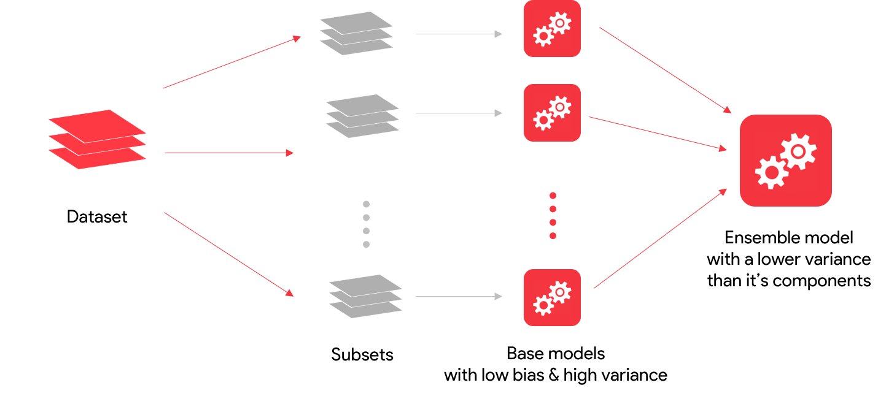
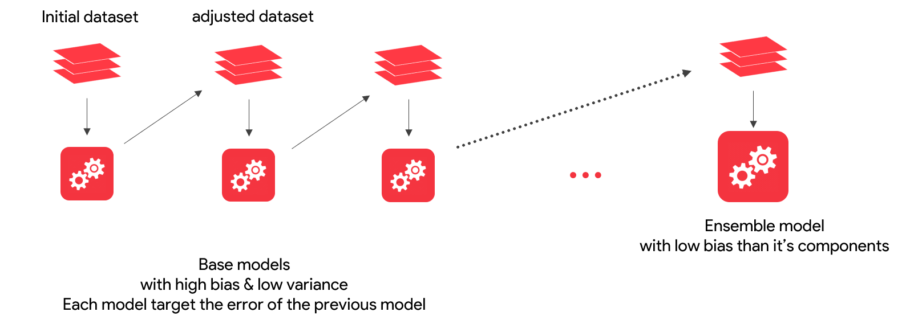
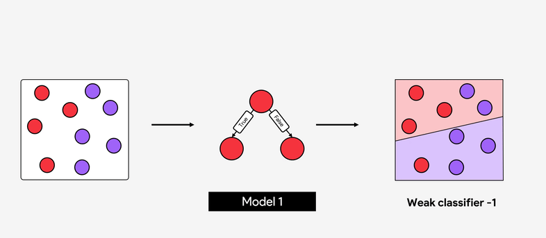
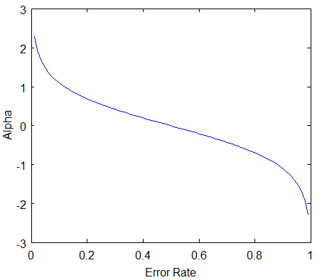
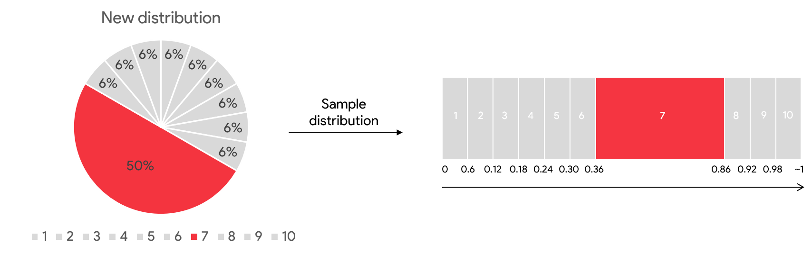
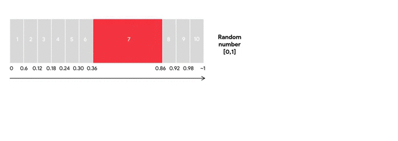
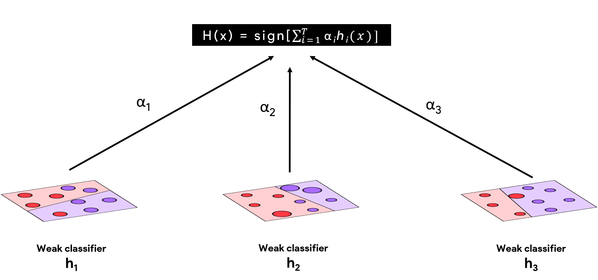

<!-- vim-markdown-toc GFM -->

* [Purpose](#purpose)
* [Bagging vs Boosting](#bagging-vs-boosting)
    * [Bagging](#bagging)
    * [Boosting](#boosting)
* [Question](#question)
* [Weak Learners](#weak-learners)
* [Question](#question-1)
* [AdaBoost](#adaboost)
    * [Steps](#steps)
        * [Question](#question-2)
    * [Amount of Say](#amount-of-say)
    * [Change of Weight](#change-of-weight)
    * [Normalized Weights](#normalized-weights)
        * [Question](#question-3)
    * [Resampling Data](#resampling-data)
    * [Prediction](#prediction)
        * [Question](#question-4)
    * [Algorithm](#algorithm)
* [Question](#question-5)
    * [Tip](#tip)
* [Summary](#summary)
* [References](#references)

<!-- vim-markdown-toc -->

# Purpose
Notes on Boosting

# Bagging vs Boosting
For a machine learning task (classification or regression), you need a model that identifies the necessary patterns in the data and does not overfit. In other words, ‘the models should not be so simple as to not be able to identify even the important patterns present in the data; on the other hand, they should not be so complex as to even learn the noise present in the data set’.

This solution can be arrived at either through a single model or an ensemble, i.e., a collection of models. By combining several models, ensemble learning methods create a strong learner, thus reducing the bias and/or variance of the individual models.

## Bagging
Bagging is one such ensemble model which creates different training subsets from the training data with replacement. Then, an algorithm with the same set of hyperparameters is built on these different subsets of data.

In this way, the same algorithm with a similar set of hyperparameters is exposed to different subsets of the training data, resulting in a slight difference between the individual models. The predictions of these individual models are combined by taking the average of all the values for regression or a majority vote for a classification problem. Random forest is an example of the bagging method.



Bagging works well when the algorithm used to build our model has high variance. This means the model built changes a lot even with slight changes in the data. As a result, these algorithms overfit easily if not controlled. Recall that decision trees are prone to overfitting if the hyperparameters are not tuned well. Bagging works very well for high-variance models like decision trees.

## Boosting
Boosting is another popular approach to ensembling. This technique combines individual models into a strong learner by creating sequential models such that the final model has a higher accuracy than the individual models. Let’s understand this.



These individual models are connected in such a way that the subsequent models are dependent on errors of the previous model and each subsequent model tries to correct the errors of the previous models.

# Question
**With respect to base models in Ensemble learning, which of the following statements is/are true?**

| Statement                                                                                                           | T/F |
|---------------------------------------------------------------------------------------------------------------------|-----|
| In boosting the base models are parallelly connected to reduce the overall bias of the resulting strong model.      | F   |
| In bagging the base models are sequentially connected to reduce the overall variance of the resulting strong model. | F   |
| In boosting the base models are sequentially connected to reduce the overall bias of the resulting strong model.    | T   |

# Weak Learners
Boosting is an approach where the individual models are connected in such a way that they correct the mistakes made by the previous models. Here, these individual models are called weak learners.

- refers to a simple model which performs at least better than a random guesser
- the error rate should be lesser than 0.5)
- primarily identifies only the prominent pattern(s) present in the data
- not capable of overfitting

In boosting, any model can be a weak learner – linear regression, decision tree or any other model, but more often than not, tree methods are used here.
Ex: Decision stump is one such weak learner when talking about a shallow decision tree having a depth of only 1.

- combine sequentially such that each subsequent model corrects the mistakes of the previous model, resulting in a strong overall model that gives good predictions.
- Reduce the variance of the final model, making it more robust (generalisable)
- Train the ensemble quickly resulting in faster computation time

# Question
**Boosting uses weak learners as classifiers because**

| Statement                                              | T/F |
|--------------------------------------------------------|-----|
| The error is greater than 0.5                          | F   |
| The error is lesser than 0.5                           | T   |
| Each weak learner is independent of the previous model | F   |
| Each weak learner is dependent on the previous model   | T   |

# AdaBoost
AdaBoost stands for adaptive boosting and was developed by Schapire and Freund.

## Steps
- AdaBoost starts with a uniform distribution of weights over training examples, i.e., it gives equal weights to all its observations. These weights tell the importance of each datapoint being considered.
- We start with a single weak learner to make the initial predictions.
- Once the initial predictions are made, patterns which were not captured by the previous weak learner are taken care of by the next weak learner by giving more weightage to the misclassified datapoints.
- Apart from giving weightage to each observation, the model also gives weightage to each weak learner. More the error in the weak learner, lesser is the weightage given to it. This helps when the ensembled model makes final predictions.
- After getting the two weights for the observations and the individual weak learners, the next weak learner in the sequence trains on the resampled data (data sampled according to the weights) to make the next prediction.
- The model will iteratively continue the steps mentioned above for a pre-specified number of weak learners.
- In the end, you need to take a weighted sum of the predictions from all these weak learners to get an overall strong learner.



### Question
**How do we calculate the final model in the Adaboost algorithm?**
- The final model is the weighted sum of the predictions from all these weak learners to get an overall strong learner.
- The final model tries to give importance to each weak learner depending on the error it made in predicting all the samples. So the final model is a weighted sum of all the weak learners

**How do we find the variable which will become the root node for the decision tree?**
- The variable having the highest Gini score is chosen as the root node.
    - Gini score = 1- Gini impurity. Therefore the higher the Gini impurity the lower is the score.
- The variable having the lowest Gini impurity is chosen as the root node.
    - Gini impurity is a measure of misclassification for a node. Lower the Gini Impurity, higher is the homogeneity of the node. For a pure node(i.e they belong to the same class), the Gini Impurity will be zero.

## Amount of Say
In AdaBoost, we start with a base model with equal weights given to every observation. In the next step, the observations which are incorrectly classified will be given a higher weight so that when a new weak learner is trained, it will give more attention to these misclassified observations.

In the end, you get a series of models that have a different say according to the predictions each weak model has made. If the model performs poorly and makes many incorrect predictions, it is given less importance, whereas if the model performs well and makes correct predictions most of the time, it is given more importance in the overall model.

The say/importance each weak learner has in the final classification depends on the total error it made.

$\alpha = 0.5\ln\frac{(1-\text{Total Error})}{\text{Total Error}}$

$\displaystyle \alpha \uparrow \implies \text{Error} \downarrow$

The value of the error rate lies between 0 and 1. So, let’s see how alpha and error is related.
- When the base model performs with less error overall, then, as you can see in the plot above, the α is a large positive value, which means that the weak learner will have a high say in the final model.
- If the error is 0.5, it means that it is not sure of the decision, then the α = 0, i.e., the weak learner will have no say or significance in the final model.
- If the model produces large errors (i.e., close to 1), then α is a large negative value, meaning that the predictions it makes are incorrect most of the time. Hence, this weak learner will have a very low say in the final model.




## Change of Weight
- The inital sample weight is same for all the data points for the first weak learner
- For subsequent learners,

| Correct Prediction                | Incorrect Prediction             |
|-----------------------------------|----------------------------------|
| $\text{old weight} * e^{-\alpha}$ | $\text{old weight} * e^{\alpha}$ |

## Normalized Weights
$\displaystyle \text{Normalized Weight} = \frac{p(x_{i})}{\sum_{i=1}^{N}p(x_{i})}$

### Question
**After each weak learner has been built and done their prediction, the weights of each sample are modified by a multiplicative factor, according to the total misclassification the weak learner has made.**
- The multiplicative factor is a growing weight for all the misclassified samples, therefore they will be given more importance next time.
- The multiplicative factor is a decaying weight for all the correctly classified samples, therefore they will be given less importance next time.

## Resampling Data
- Once we have identified the weights for each of the samples, we then resample the data by randomly selecting the data points from a range of values.
- For incorrectly classified values, the range of selection (within the random range of 0-1) will be higher
- This ensures that more number of incorrectly classified data points are selected

1. Whenever we start with a new model all the samples of the dataset need to have equal distribution (1/n) and of the same size.
2. Also, the new learner should focus more on the samples which are incorrectly classified at the previous iteration.

To handle both these bottlenecks, a new dataset will be created by randomly sampling the weighted observations.

We create a new and empty dataset that is the same size as the original one. Then we take the distribution of all the updated weights created by our first model. You can see the visualisation of the weights below.


To fill our new empty dataset, we select numbers between 0 and 1 at random. The position where the random number falls determine which observation we place in our new dataset.


Due to the weights given to each observation, the new data set will have a tendency to contain multiple copies of the observation(s) that were misclassified by the previous tree and may not contain all observations which were correctly classified.

After doing this, the initial weights for each observation will be 1/n, thus we can continue the same process as learnt earlier to build the next weak learner.

This will help the next weak learner give more importance to the incorrectly classified sample so that it can correct the mistake and correctly classify it now. This process will be repeated till a pre-specified number of trees are built, i.e., the ensemble is built.

## Prediction
The AdaBoost model makes predictions by having each tree in the ensemble classify the sample. Then, the trees are split into groups according to their decisions. For each group, the significance of every tree inside the group is added up. The final prediction made by the ensemble as a whole is determined by the sign of the weighted sum.

The final model is a strong learner made by the weighted sum of all the individual weak learners.

### Question
**Suppose you are performing a binary classification using Adaboost. There are total of 10 samples and the first tree that the model predicted has 2 misclassifications.With this understanding, what will be the say/importance of this tree**
- $0.5*\ln((1-0.2)/0.2) = 0.693$

**What will be the total updated weights of all incorrect predictions?**
- The new weights of incorrect predictions = $2*0.1 * e^{0.693} = 0.399$

## Algorithm

1. Initialize the probabilities of the distribution as $\frac{1}{n}$ where n is the number of data points
2. For t=0 to T, repeat the following (T is the total number of trees):

    1. Fit a tree $h_t$ on the training data using the respective probabilities
    2. Compute $\epsilon_t = \sum_{i=1}^{N}D_{i}[h_t(x_{i}) \neq y_{i}]$
    3. Compute $\alpha_t = \frac{1}{2}\ln(\frac{1-\epsilon_t}{\epsilon_t})$
    4. Update $\displaystyle D_{t+1}(i) = \frac{D_t(i)*e^{-\alpha_ty_ih_t(x_{i})}}{z_t} where, z_t = \sum_{i=1}^{N}D_i*e^{-\alpha_ty_{i}h_t(x_{i})}$
3. Final Model: $\displaystyle H(x) = sign(\sum_{t=1}^{T}\alpha_th_t(x))$

You can see here that with each new weak learner, the distribution of the data changes, i.e., the weight given to each observation changes.

- Observe the factor: $\displaystyle e^{-\alpha_ty_{i}h_t(x_{i})}$
- If there is a misclassification done by the model, then the product of $y_{i}*h_t(x_{i})=-1$
- So, the power of the exponential will be positive (growing exponential weight). This indicates that the weight will increase for all misclassified points.
- Otherwise, if it is correctly classified, then a product of $\displaystyle y_{i}*h_t(x_{i}) = 1$
- So, it will have a decaying weight because of the negative term in the power of the exponential term. This indicates that the weight will decrease for all correctly classified points.
- The point here is to force classifiers (weak learners) to concentrate on observations that are difficult to classify correctly.

# Question
**Why is the error $ϵ_t$ always less than 1/2 in AdaBoost?**
- The models used in Adaboost are weak learners but the prediction error they make is less than a random guess. A random guess error is 50% or 0.5. Hence, $ϵ_t$ &lt; $0.5$

## Tip
Before you apply the AdaBoost algorithm, you should remove the Outliers. Since AdaBoost tends to boost up the probabilities of misclassified points and there is a high chance that outliers will be misclassified, it will keep increasing the probability associated with the outliers and make the progress difficult. Some of the ways to identify outliers are:
- Boxplots
- Cook's distance
- Z-score.

```py heading="Adaboost in Python"
# scikit-learn has an implementation of adaboost ml model
from sklearn.ensemble import AdaBoostClassifier
adaboost =  AdaBoostClassifier(n_estimators=200, random_state=1)
adaboost.fit(X_train, y_train)
y_pred = adaboost.predict(X_test)
```

# Summary
- AdaBoost starts with a uniform distribution of weights over training examples.
- These weights give the importance of the datapoint being considered.
- You will first start with a weak learner h1(x) to create the initial prediction.
- Patterns which are not captured by previous models become the goal for the next model by giving more weightage.
- The next model (weak learner) trains on this resampled data to create the next prediction.
- This process will be repeated till a pre-specified number of trees/models are built.
- In the end, we take a weighted sum of all the weak classifiers to make a strong classifier.

# References
- [A short introduction to boosting](https://www.site.uottawa.ca/~stan/csi5387/boost-tut-ppr.pdf)
- [Adaboost Regressor Documentation](https://scikit-learn.org/stable/modules/generated/sklearn.ensemble.AdaBoostRegressor.html)
