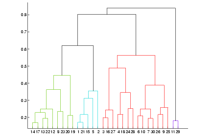
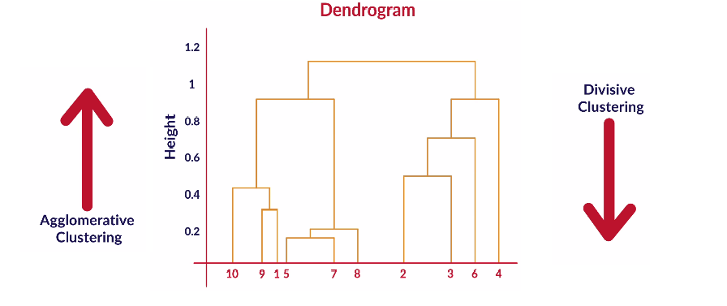

<!-- vim-markdown-toc GFM -->

* [Types of Learning](#types-of-learning)
* [Unsupervised Learning](#unsupervised-learning)
    * [Practical applications of Clustering](#practical-applications-of-clustering)
* [Clustering vs Segmentation](#clustering-vs-segmentation)
* [Segmentation Stability](#segmentation-stability)
    * [Inter and Intra cluster homogeneity](#inter-and-intra-cluster-homogeneity)
    * [Behavioral Segmentation](#behavioral-segmentation)
    * [Attitudinal Segmentation](#attitudinal-segmentation)
    * [Demographic Segmentation](#demographic-segmentation)
* [Questions](#questions)
* [K-Means Clustering](#k-means-clustering)
    * [Euclidean Distance Measure](#euclidean-distance-measure)
    * [Centroid](#centroid)
    * [Algorithm](#algorithm)
        * [Steps](#steps)
            * [Inner Loop](#inner-loop)
            * [Cost Function](#cost-function)
            * [Assigning clusters](#assigning-clusters)
            * [Optimisation](#optimisation)
        * [K-Means++ algorithm](#k-means-algorithm)
            * [Steps](#steps-1)
    * [Practical Considerations](#practical-considerations)
        * [Silhouette Coefficient](#silhouette-coefficient)
    * [Cluster Tendency](#cluster-tendency)
* [Summary](#summary)
* [Questions](#questions-1)
* [Hierarchical Clustering Algorithm](#hierarchical-clustering-algorithm)
    * [Linkage](#linkage)
        * [Types](#types)
    * [Steps](#steps-2)
    * [Dendrogram](#dendrogram)
* [Question](#question)
* [K-Mode Clustering](#k-mode-clustering)
* [K-Prototype](#k-prototype)
* [DB Scan Clustering](#db-scan-clustering)
    * [EPS](#eps)
    * [Min Samples](#min-samples)
* [Questions](#questions-2)
* [References](#references)

<!-- vim-markdown-toc -->

# Types of Learning

| Supervised Learning                                         | Unsupervised Learning                                                                                                                     |
|-------------------------------------------------------------|-------------------------------------------------------------------------------------------------------------------------------------------|
| Labels are known                                            | Labels are not known                                                                                                                      |
| Email - Spam, Ham                                           | grouping news articles into different categories (categories not known)                                                                   |
| Has distinction between independent and dependent variables | Group the data points into different categories based on the given set of attributes. There are no dependent and independent variables |

# Unsupervised Learning

## Practical applications of Clustering

- Customer Insight: Say, a retail chain with so many stores across locations wants to manage stores at best and increase the sales and performance. Cluster analysis can help the retail chain to get desired insights on customer demographics, purchase behaviour and demand patterns across locations. This will help the retail chain for assortment planning, planning promotional activities and store benchmarking for better performance and higher returns.
- Marketing: Cluster Analysis can help with In the field of marketing, Cluster Analysis can help in market segmentation and positioning, and to identify test markets for new product development.
- Social Media: In the areas of social networking and social media, Cluster Analysis is used to identify similar communities within larger groups.
- Medical: Cluster Analysis has also been widely used in the field of biology and medical science like human genetic clustering, sequencing into gene families, building groups of genes, and clustering of organisms at species. 
- Customer segmentation for targeted marketing is one of the most vital applications of the clustering algorithm. Here, as a manager of the online store, you would want to group the customers into different clusters, so that you can make a customised marketing campaign for each of the group. You do not have any label in mind, such as good customer or bad customer. You want to just look at patterns in customer data and then try and find segments. This is where clustering techniques can help you with segmenting the customers. Clustering techniques use the raw data to form clusters based on common factors among various data points. This is exactly what will also be done in segmentation, where various people or products will be grouped together on the basis of similarities and differences between them. As a manager, you would have to decide what the important business criteria are on which you would want to segregate the customers. So, you would need a method or an algorithm that itself decides which customers to group together based on this criteria.

# Clustering vs Segmentation
| Clustering          | Segmentation                  |
|---------------------|-------------------------------|
| Analytics Technique | Business Problem              |
|                     | Ex: People, Products, Markets |

# Segmentation Stability
- even if you run clustering exercise in quick peridocity, the people falling in same bucket should remain in that bucket
- there should be a time limit till which we can say segment will stay

## Inter and Intra cluster homogeneity
- Inter segment - there should be lot of difference between individuals
- Intra Segment - there should be almost no difference between individuals

## Behavioral Segmentation
- what the person, market exhibited through action
- data comes from internal CRM system
- ex: YouTube recommendations

## Attitudinal Segmentation
- what you want to behave like
- intent to purchase not actual purchase
- in survey person says they purchase branded clothes (attitudinal), while they actually end up purchasing discounted clothes (behavioural)

## Demographic Segmentation
- Gender
- Age
- Location
- Income
- Family Members

# Questions
**A telecom company classifies its prepaid mobile customers into three types mainly based on the number of times they recharge per month. What kind of segmentation this is?**
- Behavioral segmentation: Recharge is a behaviour which can be observed, opposed to attitude which resides in the mindset of the customer.

**An international foods and beverages company wants to look at what products it should launch in India. For that, it has first tried to segment the market. It is known that people living in the same area and having similar salaries will have similar eating habits. Then which of the following can be segmented in 1 group?**
A. High Earning Individual from Bengaluru  
B. Low Earning Individual from Rural Uttar Pradesh  
C. Mid Earning Individual from Mumbai  
D. High Earning Individual from Hyderabad  

- Segment can be formed like so: (A,D) - (B) - (C)

**You are an analyst at a global laptop manufacturer and are given the task of deciding whether the company should enter the Indian Market. You try to estimate the market size by first breaking the market by different types of people who use a laptop such as students, working professionals and their paying capacity to get an estimate of the total market size and the characteristics of each segment. In essence, you are doing?**
- Demographic Segmentation: Since you are looking at the income and the profession of people. Notice how this is much simpler than finding data about actual laptop purchasing history of customers and then trying to estimate the market size based on that.

---

# K-Means Clustering

## Euclidean Distance Measure
The algorithm needs to find data points whose values are similar to each other and therefore these points would then belong to the same cluster. The method in which any clustering algorithm goes about doing that is through the method of finding something called a “distance measure”. The distance measure that is used in K-means clustering is called the Euclidean Distance measure.

- $X = (X_1, X_2, \ldots, X_n)$
- $Y = (Y_1, Y_2, \ldots, Y_n)$

- It is the length of the straight line joining 2 points
- Formula: $D = \sqrt{(X_1-Y_1)^2 + (X_2-Y_2)^2 + \ldots + (X_n - Y_n)^2}$

- The idea of distance measure is quite intuitive. Essentially, the observations which are closer or more similar to each other would have a low Euclidean distance and the observations which are farther or less similar to each other would have a higher Euclidean distance. 

```py heading="Euclidean Distance in Python"
from math import sqrt

x = (7, 50)
y = (23, 34)
c = (12, 12)

squared_sum = 0
for i, j in zip(x, c):
    squared_sum += (i-j)**2

print(sqrt(squared_sum)) # x - c distance


squared_sum = 0
for i, j in zip(y, c):
    squared_sum += (i-j)**2

print(sqrt(squared_sum)) # y - c distance

# the point (among x, y) which has lower distance is closer to c
```

## Centroid
- If you remember your high school geometry, centroids are essentially the centre points of triangles. Similarly, in the case of clustering, centroids are the centre points of the clusters that are being formed.
- The cluster centers for a particular cluster that we compute in K-means Algorithm is given by the Centroid Value for those cluster points

```py heading='Centroid in Python'
x = [12, 31, 17, 19, 13]
y = [23, 31, 15, 27, 11]
z = [45, 31, 25, 45, 27]

centroid = (sum(x)/len(x),
            sum(y)/len(y),
            sum(z)/len(z))

print(centroid)
```

## Algorithm
- Maximizes the tightness/closeness of cluster
- Maximizes the distance between the clusters
- Each time the clusters are made, the centroid is updated. The updated centroid is the centre of all the points which fall in the cluster associated with the centroid. This process continues till the centroid no longer changes, i.e. the solution converges.
- K-means algorithm is a clustering algorithm that takes N data points and groups them into K clusters. 

### Steps
1. Start by choosing k initial centroids
2. Assign based on euclidean distance
3. Optimize centroid based on the grouping in step 2
4. Assign based on new distance
5. Repeat steps 3 and 4 until centroid no longer changes

#### Inner Loop
- Assign each observation $X_{i}$ to the closest cluster centroid $μ_k$
- Update each centroid to the mean of the points assigned to it.

#### Cost Function

$\displaystyle J = \sum_{i=1}^{N}||x_{i}-\mu_{k(i)}||^2 = \sum_{k=1}^{K}\sum_{i\in c_k}||x_{i}-\mu_{k}||^2$

#### Assigning clusters
$\displaystyle Z_{i} \leftarrow \text{argmin}||x_{i}-\mu_k||^2$
- compute distance from each cluster and assign the cluster which is the closest

#### Optimisation
$\boxed{ \displaystyle \mu_k = \frac{1}{n_k}\sum_{i:z_i=k}X_{i}}$

### K-Means++ algorithm
- K-means++ is just an initialisation procedure for K-means. 
- In K-means++ you pick the initial centroids using an algorithm that tries to initialise centroids that are far apart from each other.

#### Steps
- We choose one center as one of the data points at random.
- For each data point $X_{i}$, We compute the distance between $X_i$ and the nearest center that had already been chosen.
- Now, we choose the next cluster center using the weighted probability distribution where a point X is chosen with probability proportional to $d(X)^2$.
- Repeat Steps 2 and 3 until K centers have been chosen.

## Practical Considerations
- The number of clusters that you want to divide your data points into, i.e. the value of K has to be pre-determined.
    - try different choices and then see which makes business sense
- The choice of the initial cluster centres can have an impact on the final cluster formation.
    - can be solved by iterating multiple times
    - Since each run of K-means is independent, multiple runs can find different local optima, and this can help in choosing the global optimum value.
- The clustering process is very sensitive to the presence of outliers in the data.
    - treat outliers to resolve issues
- Since the distance metric used in the clustering process is the Euclidean distance. 
    - You need to bring all your attributes on the same scale. This can be achieved through standardisation.
    - business problem decides type of scaling
- The K-Means algorithm does not work with categorical data.
    - can be resolved via k-mode clustering
- The process may not converge in the given number of iterations. 
    - You should always check for convergence.

### Silhouette Coefficient
- Silhouette coefficient is a measure of how similar a data point is to its own cluster (cohesion) compared to other clusters (separation). 
- to compute silhouette metric, we need to compute two measures i.e. 
$a(i)$ and $b(i)$ where,
- $a(i)$ is the average distance from own cluster(Cohesion).
- $b(i)$ is the average distance from the nearest neighbour cluster(Separation). 
- $\displaystyle S(i) = \frac{b(i) - a(i)}{\max(b(i), a(i))}$
- $a(i) \ll b(i)$
- For every k, Average Silhouette Measure can be calculated as mean of S(i)
- Range of score is -1 to 1 where 1 is the best cluster while -1 is the worst cluster

```py heading='Silhoutte Score in Python'
from sklearn.metrics import silhouette_score
from sklearn.cluster import KMeans

range_n_clusters = [2, 3, 4, 5, 6, 7]
for num_clusters in range_n_clusters:
    kmeans = KMeans(n_clusters=num_clusters, max_iter=50)
    kmeans.fit(rfm_df_scaled)
    
    cluster_labels = kmeans.labels_
    
    silhoutte_avg = silhouette_score(rfm_df_scaled, cluster_labels)
    print(f'num_cluster {num_clusters} | silhoutte {silhoutte_avg}')
```

## Cluster Tendency
- Before we apply any clustering algorithm to the given data, it's important to check whether the given data has some meaningful clusters or not? which in general means the given data is not random. 
- The process to evaluate the data to check if the data is feasible for clustering or not is know as the clustering tendency.
- To check cluster tendency, we use Hopkins test. Hopkins test examines whether data points differ significantly from uniformly distributed data in the multidimensional space.

```py heading='Hopkins Test in Python'
from sklearn.neighbors import NearestNeighbors
from random import sample
from numpy.random import uniform
import numpy as np
from math import isnan
 
def hopkins(X):
    d = X.shape[1]
    #d = len(vars) # columns
    n = len(X) # rows
    m = int(0.1 * n) 
    nbrs = NearestNeighbors(n_neighbors=1).fit(X.values)
 
    rand_X = sample(range(0, n, 1), m)
 
    ujd = []
    wjd = []
    for j in range(0, m):
        u_dist, _ = nbrs.kneighbors(uniform(np.amin(X,axis=0),np.amax(X,axis=0),d).reshape(1, -1), 2, return_distance=True)
        ujd.append(u_dist[0][1])
        w_dist, _ = nbrs.kneighbors(X.iloc[rand_X[j]].values.reshape(1, -1), 2, return_distance=True)
        wjd.append(w_dist[0][1])
 
    H = sum(ujd) / (sum(ujd) + sum(wjd))
    if isnan(H):
        print(ujd, wjd)
        H = 0
 
    return H

print(hopkins(df))
```

# Summary
- K-means is a popular algorithm for clustering which uses euclidean distance to group data points together. it finds out cluster centers, assigns data points and finds clusters again on new grouping until centroids converge
- We should first check whether the data is cluster-able and then consider the practical points such as whether the data is categorical, if there are any outliers, if the data requires any scaling
- Initial points can be found out using k-mean++ algorithm which uses a measure proportional to distance squared for finding out cluster centers

# Questions


| Statement                                                                                           | T/F |
|-----------------------------------------------------------------------------------------------------|-----|
| The clusters formed by k-means algorithm do not depend on the initial selection of cluster centers. | F   |
| The results of k-means algorithm get impacted by outliers and range of the attributes.              | T   |
| KMeans algorithm can be applied to both categorical and numerical variables.                        | F   |
| KMeans clustering automatically selects the most optimum value of k                                 | F   |


---

# Hierarchical Clustering Algorithm
- One of the major considerations in using the K-means algorithm is deciding the value of K beforehand. The hierarchical clustering algorithm does not have this restriction.
- The output of the hierarchical clustering algorithm is quite different from the K-mean algorithm as well. It results in an inverted tree-shaped structure, called the dendrogram. An example of a dendrogram is shown below.


| K-Means                                                                             | Hierarchical                                                                                                                                                                 |
|-------------------------------------------------------------------------------------|------------------------------------------------------------------------------------------------------------------------------------------------------------------------------|
| divide the data in the first step itself.                                           | The data is not partitioned into a particular cluster in a single step.                                                                                                      |
| In the subsequent steps, you refined our clusters to get the most optimal grouping. | Instead, a series of partitions/merges take place, which may run from a single cluster containing all objects to n clusters that each contain a single object or vice-versa. |
| have to specify number of clusters before hand                                      | don’t have to specify the number of clusters beforehand.                                                                                                                     |
| good large data points                                                              | good for small data points                                                                                                                                                   |


## Linkage
- Measure of dissimilarity between clusters having multiple observations

### Types
- Single Linkage: Here, the distance between 2 clusters is defined as the shortest distance between points in the two clusters
    - will produce dendrograms which are not structured properly
- Complete Linkage: Here, the distance between 2 clusters is defined as the maximum distance between any 2 points in the clusters
    - will produce clusters which have a proper tree-like structure
- Average Linkage: Here, the distance between 2 clusters is defined as the average distance between every point of one cluster to every other point of the other cluster.
    - will produce clusters which have a proper tree-like structure

## Steps
Given a set of N items to be clustered, the steps in hierarchical clustering are:
1. Calculate the NxN distance (similarity) matrix, which calculates the distance of each data point from the other
2. Each item is first assigned to its own cluster, i.e. N clusters are formed
3. The clusters which are closest to each other are merged to form a single cluster
4. The same step of computing the distance and merging the closest clusters is repeated till all the points become part of a single cluster

## Dendrogram
- Height of the dendrogram represents the dissimilarity measure between different clusters
- Clusters that fuse together at the top are more dissimilar to each other than those at the bottom
- At each step of algorithm, we are reducing the number of clusters and building up a tree. This is why it's called Hierarchical Clustering Algorithm.




| Agglomerative Clustering                                                                                 | Divisive Clustering                                                                                                         |
|----------------------------------------------------------------------------------------------------------|-----------------------------------------------------------------------------------------------------------------------------|
| Bottom Up                                                                                                | Top Down                                                                                                                    |
| start with n distinct clusters and iteratively reach to a point where you have only 1 cluster in the end | start with 1 big cluster and subsequently keep on partitioning this cluster to reach n clusters, each containing 1 elementA |


```py heading='Hierarchical Clustering in Python'
from scipy.cluster.hierarchy import linkage
from scipy.cluster.hierarchy import dendrogram
from scipy.cluster.hierarchy import cut_tree

mergings = linkage(df, method='complete', metric='euclidean')
dendrogram(mergings)
plt.show()

cluster_labels = cut_tree(mergings, n_clusters=3).reshape(-1, )
```

# Question
**Can you use the dendrogram to make meaningful clusters? (By looking at which elements leave and join at what height)**
- Yes. It is a great tool. You can look at what stage an element is joining a cluster and hence see how similar or dissimilar it is to the rest of the cluster. If it joins at the higher height, it is quite different from the rest of the group. You can also see which elements are joining which cluster at what stage and can thus use business understanding to cut the dendrogram more accurately.

---

# K-Mode Clustering
| Step                       | K-Mean                                                                   | K-Mode                                                                     |
|----------------------------|--------------------------------------------------------------------------|----------------------------------------------------------------------------|
| Initialize cluster centers | K-Mean++                                                                 | Huang method, and Cao method are used                                      |
| Assignment step            | $z_{i} \leftarrow \text{arg min}(x_{i}, \mu_k)$ using euclidean distance | matching dissimilarity (how many attributes between X and Y are different)
| Optimization Step          | compute mean of set of points assigned to cluster K                      | compute mode of set of points assinged to cluster K                        |
| Usage                      | Used for numeric values                                                  | Used for categorical data                                                  |

```py heading='K-Modes in Python'
from kmodes.kmodes import KModes
from sklearn import preprocessing

le = preprocessing.LabelEncoder()
bank_cust = bank_cust.apply(le.fit_transform)

# cao initialization
km_cao = KModes(n_clusters=2, init = "Cao", n_init = 1, verbose=1)
fitClusters_cao = km_cao.fit_predict(bank_cust)

clusterCentroidsDf = pd.DataFrame(km_cao.cluster_centroids_)
clusterCentroidsDf.columns = bank_cust.columns

clusterCentroidsDf

# huang initilization
km_huang = KModes(n_clusters=2, init = "Huang", n_init = 1, verbose=1)
fitClusters_huang = km_huang.fit_predict(bank_cust)

# choosing K by comparing cost
cost = []
for num_clusters in list(range(1,5)):
    kmode = KModes(n_clusters=num_clusters, init = "Cao", n_init = 1, verbose=1)
    kmode.fit_predict(bank_cust)
    cost.append(kmode.cost_)

y = np.array([i for i in range(1,5,1)])
plt.plot(y,cost)
```


# K-Prototype
- Simple combination of K-Means and K-Modes in clustering mixed attributes.
- We combine K-means and K-Mode to handle both continuous and categorical data. For K-Prototype the distance function is as follows,
- $\displaystyle d(x, y) = \sum_{j=1}^{p}(X_j - Y_j)^2 + \gamma\sum_{j=p+1}^{M}\delta(X_j-Y_j)^2$
- Where $\gamma$ is the weighting factor that determines the relative importance of numerical categorical attributes.

```py heading='K-Prototype in Python'
from kmodes.kprototypes import KPrototypes

kproto = KPrototypes(n_clusters=5, init='Cao')
clusters = kproto.fit_predict(blood_matrix, categorical=[4])

kproto.cluster_centroids_
```

---

# DB Scan Clustering
- DBSCAN is a density-based clustering algorithm that divides a data set into subgroups of high-density regions. 
- DBSCAN groups together point that are close to each other based on a distance measurement (usually Euclidean distance) and a minimum number of points. 
- It also marks as outliers the points that are in low-density regions.
- The DBSCAN algorithm is used to find associations and structures in the data that are usually hard to find manually.

DBSCAN algorithm requires 2 parameters:
- Epsom or EPS
- MinPoints or MinSamples.

## EPS
- EPS is a distance parameter that defines the radius to search for nearby neighbours. 
- We can imagine each data point having a circle with radius EPS drawn around it. 
- The value of EPS taken to cluster the data has a significant impact on the results. 
- If the value of EPS is considered too small, decidedly fewer data points will be considered in one cluster, and a large part of the data will not be clustered. 
- The un-clustered data points will be considered as outliers because they don't satisfy the number of points to create a dense region.
- If the EPS value is chosen to be very high, no real clusters will be formed as all of them will merge in the same cluster. 
- The eps should be chosen based on the distance of the dataset (we can use a k-distance graph to find it), but in general small eps values are preferable.

## Min Samples
- Min Samples or Min Points are the number of minimum points to form a dense region or cluster. 
- For example, if we set the min_samples as 5, we need at least 5 points to form a dense cluster. 
- Minimum points can be selected from some dimensions (D) in the data set, as a general rule min points >=D+1. 

---

| Hard Clustering                                     | Soft Clustering                                                                                                             |
|-----------------------------------------------------|-----------------------------------------------------------------------------------------------------------------------------|
| every data point is assigned to one of the clusters | assignment of data point to a cluster is based on the probability or likelihood of that data point to exist in that cluster |
| ex: K-Means                                         | ex: Gaussian Mixture Models                                                                                                 |

---

# Questions
**Which method should be preferred in the case of K-mode or K-means clustering when both categorical and numerical variables are present in the dataset?**

| Method      | Can be used |
|-------------|-------------|
| K-Means     | No          |
| K-Mode      | No          |
| K-Prototype | Yes         |

**What is the advantage of hierarchical clustering over K-means clustering?**
- You don't have to assign the number of clusters from the beginning in the case of hierarchical clustering.

**In the silhouette score method, which point would be the most appropriate number of clusters for the K-means clustering algorithm?**
- Global maximum

**Which of the following approaches can be used in Hierarchical Clustering?**

| Method                   | Can be used |
|--------------------------|-------------|
| Agglomerative Clustering | T           |
| Divisive Clustering      | T           |

**What are the different proximity functions or distance metrics used for the K-means algorithm?**
- Euclidean: is the squared distance from a data point to the centroid. 
- Manhattan: is the absolute distance from a data point to the centroid.- Cosine: is the cosine distance from a data point to the cluster centroid. 
- Bregman divergence: is a class of distance metrics that includes Euclidean, Mahalanobis, and Cosine. Basically, Bregman divergence includes all those distance metrics for which the mean is a centroid.

**Explain the types of segmentation that can be considered while solving a business problem using Clustering.**
- behavioral segmentation: actual behavior of customer
- demographic segmentation: based on location
- attitudnal segmentation: what customer pretends to be like
- RFM analysis: recency frequency and monetary
- Psychographic segmentation: study of consumers based on their activities, interests, and opinions (AIOs). It goes beyond classifying people based on general demographic data, such as age, gender, or race. Psychographics seeks to understand the cognitive factors that drive consumer behaviors.


**What are the issues with random initialization of centroids in K-means algorithm and how to overcome it?**
- Initiation of the centroids in a cluster is one of the most important steps of the K-means algorithm.
- Many times, random selection of initial centroid does not lead to an optimal solution. 
- In order to overcome this problem, the algorithm is run multiple times with different random initialisations. 
- The sum of squared errors (SSE) are calculated for different initial centroids. The set of centroids with the minimum SSE is selected. Even though this is a very simple method, it is not foolproof. The results of multiple random cluster initialisations will depend on the dataset and the number of clusters selected, however, that still will not give an optimum output every time.
- The other method involves first selecting the centroid of all the data points. Then, for each successive initial centroid, select the point which is the farthest from the already selected centroid. This procedure will ensure that the selection is random, and the centroids are far apart. The disadvantage of this method is that calculating the farthest point will be expensive. In order to avoid this problem, initialisation is carried out on a subset of the dataset.

**How are outliers handled by the K-means algorithm?**
- Handling of outliers differs from case to case. 
- In some cases, it will provide very useful information, and in some cases, it will severely affect the results of the analysis. 
- Having said that, let’s learn about some of the issues that arise due to outliers in the K-means algorithm below.
- The centroids will not be a true representation of a cluster in the presence of outliers. 
- The sum of squared errors (SSE) will also be very high in the case of outliers. 
- Small clusters will bond with outliers, which may not be the true representation of the natural patterns of clusters in data. 
- Due to these reasons, outliers need to be removed before proceeding with clustering on the data.

**What is the objective function for measuring the quality of clustering in case of the K-means algorithm with Euclidean distance?**
- Sum of squared errors (SSE) is used as the objective function for K-means clustering with Euclidean distance. 
- The Euclidean distance is calculated from each data point to its nearest centroid. 
- These distances are squared and summed to obtain the SSE. 
- The aim of the algorithm is to minimize the SSE. Note that SSE considers all the clusters formed using the K-means algorithm.


**Is K-means clustering suitable for all shapes and sizes of clusters?**
- K-means is not suitable for all shapes, sizes, and densities of clusters. 
- If the natural clusters of a dataset are vastly different from a spherical shape, then K-means will face great difficulties in detecting it. 
- K-means will also fail if the sizes and densities of the clusters are different by a large margin. 
- This is mostly due to using SSE as the objective function, which is more suited for spherical shapes. 
- SSE is not suited for clusters with non-spherical shapes, varied cluster sizes, and densities.

**What are the disadvantages of agglomerative hierarchical clustering?**
- Objective function: SSE is the objective function for K-means. Likewise, there exists no global objective function for hierarchical clustering. It considers proximity locally before merging two clusters.
- Time and space complexity: The time and space complexity of agglomerative clustering is more than K-means clustering, and in some cases, it is prohibitive.
- Final merging decisions: The merging decisions, once given by the algorithm, cannot be undone at a later point in time. Due to this, a local optimisation criteria cannot become global criteria. Note that there are some advanced approaches available to overcome this problem.

**Is validation required for clustering? If yes, then why is it required?**
- Clustering algorithms have a tendency to cluster even when the data is random. 
- It is essential to validate if a non-random structure is present in the data. 
- It is also required to validate whether the number of clusters formed is appropriate or not. 
- Evaluation of clusters is done with or without external reference to check the fitness of the data. 
- Evaluation is also done to compare clusters and decide the better among them.


---

# References
- [10 interesting uses of k-means clustering](https://dzone.com/articles/10-interesting-use-cases-for-the-k-means-algorithm)
- [Euclidean Distance - Sentdex](https://www.youtube.com/watch?v=hl3bQySs8sM)
- [Centroid - Wikipedia](https://en.wikipedia.org/wiki/Centroid)
- [Clustering - Visualization](https://www.naftaliharris.com/blog/visualizing-k-means-clustering/)
- [K-Mode Clustering](https://shapeofdata.wordpress.com/2014/03/04/k-modes/)
- [Local Minima - Wikipedia](https://en.wikipedia.org/wiki/Local_optimum)
- [Hopkins Test](https://stats.stackexchange.com/questions/332651/validating-cluster-tendency-using-hopkins-statistic)
- [Methods for assessing clustering tendency](http://www.sthda.com/english/articles/29-cluster-validation-essentials/95-assessing-clustering-tendency-essentials/#methods-for-assessing-clustering-tendency)
- [Divisive Clustering - Stanford](https://nlp.stanford.edu/IR-book/html/htmledition/divisive-clustering-1.html)
- [Divisive Clustering - Notes](http://luthuli.cs.uiuc.edu/~daf/courses/probcourse/notesclustering.pdf)
- [Hierarchical Clustering - Linkage](http://www.saedsayad.com/clustering_hierarchical.htm)
- [Choosing the right Linkage - StackExchange](https://stats.stackexchange.com/questions/195446/choosing-the-right-linkage-method-for-hierarchical-clustering)
- [Hierarchical Clustering - Notes](http://www.stat.cmu.edu/~ryantibs/datamining/lectures/05-clus2.pdf)
- [Dendrogram](https://www.displayr.com/what-is-dendrogram/)
- [Visualize Clusters using Scatterplot](https://towardsdatascience.com/visualizing-clusters-with-pythons-matplolib-35ae03d87489)
- [Huang Initialization](https://pdfs.semanticscholar.org/d42b/b5ad2d03be6d8fefa63d25d02c0711d19728.pdf)
- [Cao Initialization](http://citeseerx.ist.psu.edu/viewdoc/download?doi=10.1.1.474.8181&rep=rep1&type=pdf)
- [K-Prototype](https://cse.hkust.edu.hk/~qyang/Teaching/537/Papers/huang98extensions.pdf)
- [DBSCAN Visualization](https://www.naftaliharris.com/blog/visualizing-dbscan-clustering/)
- [Application of DBSCAN at Netflix](https://medium.com/netflix-techblog/tracking-down-the-villains-outlier-detection-at-netflix-40360b31732)
- [Application of DBSCAN in Geolocated data](https://www.oreilly.com/ideas/clustering-geolocated-data-using-spark-and-dbscan)
- [Original Paper on DBSCAN posted on KDD by Martin Ester](https://www.aaai.org/Papers/KDD/1996/KDD96-037.pdf)
