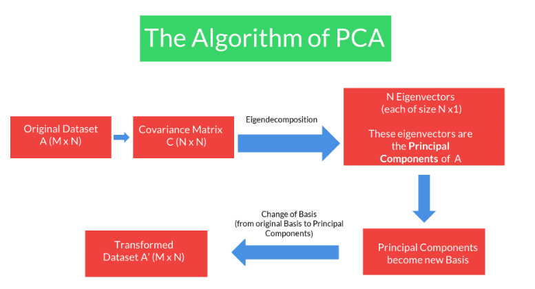
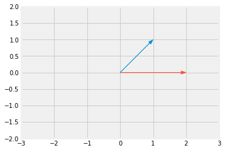

<!-- vim-markdown-toc GFM -->

* [Principal Component Analysis](#principal-component-analysis)
* [Problem with having a lot of features](#problem-with-having-a-lot-of-features)
* [Applications of PCA](#applications-of-pca)
* [Dimensionality Reduction](#dimensionality-reduction)
* [PCA Definition](#pca-definition)
* [PCA - Change of Basis](#pca---change-of-basis)
        * [Standard Basis](#standard-basis)
        * [Non-Standard Basis](#non-standard-basis)
* [Variance](#variance)
* [PCA Steps](#pca-steps)
* [PCA Usage](#pca-usage)
    * [Steps](#steps)
    * [Role](#role)
    * [Problems Solved via PCA](#problems-solved-via-pca)
    * [Practical Considerations](#practical-considerations)
    * [Shortcomings of PCA](#shortcomings-of-pca)
* [Covariance Matrix](#covariance-matrix)
    * [Diagonalisation](#diagonalisation)
        * [Usage](#usage)
            * [PCA](#pca)
* [Algorithm of PCA](#algorithm-of-pca)
    * [Eigendecomposition](#eigendecomposition)
        * [Eigendecomposition of Covariance Matrix](#eigendecomposition-of-covariance-matrix)
        * [Transformation Matrix](#transformation-matrix)
    * [Eigenvectors](#eigenvectors)
        * [Properties](#properties)
        * [Diagonalisation - Mathematical Equations](#diagonalisation---mathematical-equations)
* [Questions](#questions)
* [References](#references)

<!-- vim-markdown-toc -->

# Principal Component Analysis
- Principal component analysis (PCA) is one of the most commonly used dimensionality reduction techniques in the industry. 
- By converting large data sets into smaller ones containing fewer variables, it helps in improving model performance, visualising complex data sets, and in many more areas.
- It is an unsupervised learning algorithm

# Problem with having a lot of features
- The predictive model setup: Having a lot of correlated features lead to the multicollinearity problem. Iteratively removing features is time-consuming and also leads to some information loss.
- Data visualisation: It is not possible to visualise more than two variables at the same time using any 2-D plot. Therefore, finding relationships between the observations in a data set having several variables through visualisation is quite difficult. 

# Applications of PCA
- Dimensionality Reduction: convert m x n data to m x k columns where k &lt; n
- Data Visualization: High dimension data can be converted to 2 dimension data using PCA
- EDA
- Building Predictive Models
    - no multicollinearity (stable and robust model)
    - faster models (due to reduced dimensions)
- Finding Latent Themes: useful in Recommendation Systems
- Noise Reduction

# Dimensionality Reduction
- PCA is fundamentally a dimensionality reduction technique
- In simple terms, dimensionality reduction is the exercise of dropping the unnecessary variables, i.e., the ones that add no useful information. In EDA, we dropped columns that had a lot of nulls or duplicate values, and so on. 
- In linear and logistic regression, we dropped columns based on their p-values and VIF scores in the feature elimination step.
- Similarly, what PCA does is that it converts the data by creating new features from old ones, where it becomes easier to decide which features to consider and which not to. 

# PCA Definition
PCA is a statistical procedure to convert observations of possibly correlated variables to ‘principal components’ such that:
- They are uncorrelated with each other.
- They are linear combinations of the original variables.
- They help in capturing maximum information in the data set.

# PCA - Change of Basis
- We change the basis such that it is easy to identify key features
- Simply put you have the flexibility of choosing a different set of basis vectors apart from the standard basis vectors that are provided to you to represent your information. The information won't change, just the numbers representing the information would change.
- Mainly when we're moving between multiple basis vectors, it's important to know that the point's position in space doesn't change. The point's representation might be different in different basis vectors but it would be representing the same point.
- PCA finds new basis vectors for us. These new basis vectors are also known as Principal Components.
- We represent the data using these new Principal Components by performing the change of basis calculations.
- After doing the change of basis, we can perform dimensionality reduction. In fact, PCA finds new basis vectors in such a way that it becomes easier for us to discard a few of the features.

### Standard Basis
- It is the identify matrix for a particular dimension

$\begin{bmatrix}
1 && 0 \\
0 && 1
\end{bmatrix}$

### Non-Standard Basis
- Anything other than standard basis (filled with 1s and 0s) is not standard basis vector

$\begin{bmatrix}
3 & 0.5 \\
2 & 1
\end{bmatrix}$

- To convert a vector ($v_1$) from standard basis $B_1$ to non-standard basis $B_2$
    - Formula: $v_2 = B_2^{-1}.v_1$
- To convert a vector ($v_1$) from non-standard basis $B_1$ to standard basis $B_2$
    - Formula: $v_2 = B_1.v_1$
- To derive above forumulas, use the following equation: $B_1*v_1 = B_2*v_2$

# Variance
- $\displaystyle \sigma^2 = \frac{\sum(x-\mu)^2}{N}$
- High Variance $\implies$ More Information and vice-versa


- The red line on the Height and Weight axes show the spread of the projections of the vectors on those axes. 
- As you can see here, the spread of the line is quite good on the Weight axis as compared to the Height axis. 
- Hence you can say that Weight has more variance than Height. 
- This idea of the spread of the data being equivalent to the variance is quite an elegant way to distinguish the important directions from the non-important ones.

# PCA Steps
- First, it finds the basis vector which is along the best-fit line that maximises the variance. This is our first principal component or PC1.
- The second principal component is perpendicular to the first principal component and contains the next highest amount of variance in the dataset.
- This process continues iteratively, i.e. each new principal component is perpendicular to all the previous principal components and should explain the next highest amount of variance.
- If the dataset contains n independent features, then PCA will create n Principal components.
- Once the Principal Components are found out, PCA assigns a %age variance to each PC. Essentially it's the fraction of the total variance of the dataset explained by a particular PC. This helps in understanding which Principal Component is more important than the other and by how much. 

# PCA Usage
## Steps
The steps  of PCA as summarised in the above video are as follows:
- Find n new features - Choose a different set of n basis vectors (non-standard). These basis vectors are essentially the directions of maximum variance and are called Principal Components
- Express the original dataset using these new features
- Transform the dataset from the original basis to this PCA basis.
- Perform dimensionality reduction - Choose only a certain k (where k &lt; n) number of the PCs to represent the data.  Remove those PCs which have fewer variance (explain less information) than others.

## Role
- PCA's role in the ML pipeline almost solely exists as a dimensionality reduction tool. 
- Basically, you choose a fixed number of PCs that explained a certain threshold of variance that you have chosen and then uses only that many columns to represent the original dataset.
- This modified dataset is then passed on to the ML pipeline for further prediction algorithms to take place.
- PCA helps us in improving the model performance significantly and helps us in visualising higher-dimensional datasets as well.

```py heading='PCA in Python'
from sklearn.decomposition import PCA
pca = PCA(random_state=42)
pca.fit(x)
pca.components_
pca.explained_variance_ratio_

# using numpy we can get cumulative probability of explained variance
# scree plot
import numpy as np
import matplotlib as plt

var_cumu = np.cumsum(pca.explained_variance_ratio_)
plt.plot(range(1, len(var_cumu)+1), var_cumu)


# 2 components
pc = PCA(n_components, random_state=42)
newdata = pc.fit_transform(x) # find components, get inverse and apply on data
newdata.shape
```

## Problems Solved via PCA
- Multicollinearity among a large number of variables, which is not totally avoided even after reducing variables using RFE (or a similar technique)
- Need to use a lengthy iterative procedure, i.e. identifying collinear variables, using variable selection techniques, dropping insignificant ones etc.
- A potential loss of information due to dropping variables
- Model instability due to multicollinearity
- Speed of Model Building

## Practical Considerations
- Most software packages use SVD to compute the principal components and assume that the data is scaled and centred, so it is important to do standardisation/normalisation.
- PCA is a linear transformation method and works well in tandem with linear models such as linear regression, logistic regression, etc., though it can be used for computational efficiency with non-linear models as well.
- It should not be used forcefully to reduce dimensionality (when the features are not correlated).

## Shortcomings of PCA
- PCA is limited to linearity, though we can use non-linear techniques such as t-SNE as well.
- PCA needs the components to be perpendicular, though in some cases, that may not be the best solution. The alternative technique is to use Independent Components Analysis.
- PCA assumes that columns with low variance are not useful, which might not be true in prediction setups (especially classification problem with a high class imbalance).
- It can only be useful if the data is skewed in some direction
- Interpretability is somewhat lost after doing PCA because we change the basis of the data

---

# Covariance Matrix
- used to capture the covariance or the correlations between the columns
- For a matrix having N columns, the covariance matrix is an $N\times N$ matrix.
- $C = \begin{bmatrix}cov(x,x) & cov(x,y) & cov(x,z) \\ cov(y,x) & cov(y, y) & cov(y,z) \\ cov(z,x) & cov(z,y) & cov(z, z)\end{bmatrix}$
- cov(x,y) = cov(y,x): It is a symmetric matrix i.e. flipping values around diagonals will give the same matrix
- $cov(X,Y) = \frac{\sum(X_{i}-\bar X)(Y_{i}-\bar Y)}{N}$


```py heading='Covariance Matrix in Python'
import numpy as np
import pandas as pd

a = [[2,2], [3,4], [4,5], [5,7], [9,11]]
b = ['X', 'Y']
data = pd.DataFrame(a, columns = b)
print(data)

np.cov(data.T)
```

## Diagonalisation
- The process of converting the covariance matrix with only non-zero diagonal elements and 0 values everywhere else is also known as diagonalisation.
- It can be acheived by changing the basis vectors and representing the original information in the new basis.

### Usage
- Your new basis vectors are all uncorrelated and independent of each other.
- Since variance is now explained only by the new basis vectors themselves, you can find the directions of maximum variance by checking which value is higher than the rest numerically. There is no correlation to take into account this time. All the information in the dataset is explained by the columns themselves.
- So now, your new basis vectors are uncorrelated, hence linearly independent, and explain the directions of maximum variance. 

#### PCA
- These basis vectors are the Principal Components of the original matrix.
- The algorithm of PCA seeks to find those new basis vectors that diagonalise the covariance when the same data is represented on this new basis. 
- Then these vectors would have all the above properties that we require and therefore would help us in the process of dimensionality reduction.

# Algorithm of PCA
1. Construct Covariance Matrix
2. Perform Eigendecomposition of the Covariance Matrix


## Eigendecomposition
Basically, for any square matrix $\bold A$, its eigenvectors are all the vectors $\bold v$ which satisfy the following equation:
- $A\bold v = \lambda \bold v$; where $\lambda$ is a constant also known as eigenvalue for that vector 

Ex: For the following matrix, $\begin{bmatrix}2&0\\0&5\end{bmatrix}$, its eignenvectors and corresponding eigenvalues are given as:
- $\begin{bmatrix}2&0\\0&5\end{bmatrix}\begin{bmatrix}1\\0\end{bmatrix} = 2\begin{bmatrix}1\\0\end{bmatrix}$
- $\begin{bmatrix}2&0\\0&5\end{bmatrix}\begin{bmatrix}0\\1\end{bmatrix} = 5\begin{bmatrix}0\\1\end{bmatrix}$

Here $A$ has 2 sets of eignvectors/eignevalues:
- $v_{1} = \begin{bmatrix}1\\0\end{bmatrix}, \lambda_1=2$ and 
- $v_2 = \begin{bmatrix}0\\1\end{bmatrix}, \lambda_2=5$

The process of finding the eigenvalues and eignenvectors is known as eigendecomposition

### Eigendecomposition of Covariance Matrix
- We wanted to find a new set of basis vectors where the covariance matrix gets diagonalised.
- It turns out that these new set of basis vectors are in fact the eigenvectors of the Covariance Matrix. And therefore these eigenvectors are the Principal Components of our original dataset. 
- In other words, these eigenvectors are the directions that capture maximum variance.
- The eigenvalues are indicators of the variance explained by that particular direction or eigenvector. 
- So higher is the eigenvalue, higher is the variance explained by that eigenvector and hence that direction is more important for us.
 
### Transformation Matrix
- Matrix multiplication results into the rotation of the vector
- Suppose you have a vector: $x=\begin{bmatrix}1\\1\end{bmatrix}$
- Suppose the transformation matrix is $A=\begin{bmatrix}1&1\\-1&1\end{bmatrix}$

    - blue vector is x
    - red vector is Ax
- The new tranformed vector on the same plane will be: $Ax = \begin{bmatrix}2\\0\end{bmatrix}$
- If the matrix is not a diagonal matrix, then it performs both rotation as well as scaling. 
- If the matrix is a diagonal matrix, it will peform only scaling

## Eigenvectors
- Eigenvectors of any matrix are those vectors that do not shift from their span / rotate when that matrix is used as a transformation matrix
- Ex: for $A = \begin{bmatrix}3&1\\0&2\end{bmatrix}, x=\begin{bmatrix}-1\\1\end{bmatrix}$ is an eigenvector
- An eigenvector of a linear transformation (or a square matrix) is a non-zero vector that changes at most by a scalar factor when that linear transformation is applied to it. The corresponding eigenvalue is the factor by which the eigenvector is scaled.

### Properties
- Eigenvalues and eigenvectors of a given matrix always occur in pairs
- Eigenvalues and eigenvectors are defined only for square matrices, and it is not necessary that they will always exist. This means there could be cases where there are no eigenvectors and eigenvalues for a given matrix, or, in other words, there exist imaginary eigenvectors and eigenvalues.

### Diagonalisation - Mathematical Equations
- Suppose there is a matrix ‘A’, which has ‘v1’ and ‘v2’ eigenvectors, and ‘λ1’ and ‘λ2’ eigenvalues, as shown below:
    - $A = \begin{bmatrix}3&1\\0&2\end{bmatrix}$
    - Eigenvectors: $v_1 = \begin{bmatrix}1\\0\end{bmatrix}$ and $v_2 = \begin{bmatrix}-1\\1\end{bmatrix}$
    - Eigenvalues: $\lambda_1=3, \lambda_2=2$
- Let's define the eigenvector and eigenvalue matrix, '$V$' and '$\Lambda$', respectively, as shown below:
    - $V = \begin{bmatrix}1&-1\\0&1\end{bmatrix}$
    - $\Lambda = \begin{bmatrix}3&0\\0&2\end{bmatrix}$
- When you multiply matrix ‘A’ with matrix ‘V’, you get the same results as when you multiply matrix ‘V’ with matrix ‘Λ’:
    - $AV = VΛ$
- When you right multiply both sides of the equation above with inv(V), you will get the following result:
    - $A = VΛV^{-1}$
- Or when you left multiply both sides of that same equation, you get the following result.
    - $V^{-1}AV = Λ$

Now, if you see this equation, matrix ‘Λ’ is nothing but a diagonal matrix whose non-diagonal entries are simply 0.

So, based on the analysis above, you can state that:

Both A and $\Lambda$ represent the same linear transformation but in different basis vectors (i.e., original basis and eigenvector basis, respectively). 

# Questions

| Statement                                                                                                                                                                | True / False |
|--------------------------------------------------------------------------------------------------------------------------------------------------------------------------|--------------|
| The PCA algorithm needs the data to be highly correlated to work properly.                                                                                               | F            |
| The PCA algorithm does not need the data to be highly correlated to work properly, although PCA is necessary and becomes useful only when the data is highly correlated. | T            |

**You are given a data set that has 540 unique variables (n). Based on this information, which of the following options shows the correct number of principal components (k) that are chosen for the final model?**

| Option | Y/N |
|--------|-----|
| 539    | Y   |
| 345    | Y   |
| 565    | N   |

- Number of principal components (k) &lt;= Number of variables (n)

**Arrange the steps of PCA**

**a. Find the eigenvectors of the covariance matrix**

**b. Find the covariance matrix of the data set**

**c. Find the inverse of the eigenvector matrix**

**d. Normalize and standardise the data points**

**e. Arrange the eigenvectors in a matrix (eigenvector matrix) in decreasing order of the corresponding eigenvalues**

**f. Multiply each original data point with the inverse of the eigenvector matri.**

The correct order will be, 
- (d) Normalize and standardise the data points
- (b) Find the covariance matrix of the data set
- (a) Find the eigenvectors of the covariance matrix
- (e) Arrange the eigenvectors in a matrix (eigenvector matrix) in decreasing order of the corresponding eigenvalues
- \(c\) Find the inverse of the eigenvector matrix
- (f) Multiply each original data point with the inverse of the eigenvector matri.

---

# References
- [Essence of Linear Algebra - 3Blue1Brown](https://www.youtube.com/playlist?list=PLZHQObOWTQDPD3MizzM2xVFitgF8hE_ab)
- [Laurens van der Maaten's (creator of t-SNE) website](https://lvdmaaten.github.io/tsne/)
- [Visualising data using t-SNE: Journal of Machine Learning Research](http://www.jmlr.org/papers/volume9/vandermaaten08a/vandermaaten08a.pdf)
- [How to use t-SNE effectively](https://distill.pub/2016/misread-tsne/)
- [Independent Components Analysis](https://sgfin.github.io/files/notes/CS229_Lecture_Notes.pdf)
- [Covariance](https://corporatefinanceinstitute.com/resources/knowledge/finance/covariance/)
- [Eigenvectors - 3Blue1Brown](https://www.youtube.com/watch?v=PFDu9oVAE-g)
- [Singular Value Decomposition](https://medium.com/data-science-group-iitr/singular-value-decomposition-elucidated-e97005fb82fa)
- [Eigenvectors - Upgrad Chapter Link](https://learn.upgrad.com/course/1611/segment/9862/79382/237008/1245187)
- [Eigenvalue](https://www.mathsisfun.com/algebra/eigenvalue.html)
