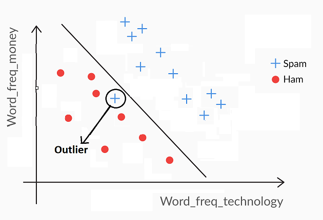

<!-- vim-markdown-toc GFM -->

* [Support Vector Machines](#support-vector-machines)
* [Maximal Marginal Classifier](#maximal-marginal-classifier)
* [Soft Margin Classifier](#soft-margin-classifier)
* [Summary](#summary)
* [Questions](#questions)

<!-- vim-markdown-toc -->

# Support Vector Machines
- These are models that help in separating points into different classes by creating hyperplanes.
- The hyperplanes are high dimensional planes that are hard to visualize but can be expressed using simple a simple equation: $ax_1 + bx_2 + cx_3 + dx_4 + constant = 0$ and so on.
- Any point whose value is greater than 0 (when put into the hyperplane equation) belongs to class one, while any point below will be marked as class two. 
- Any point that is equal to zero will lie perfectly on the hyperplane
- SVMs create planes such that the closest points of both classes from the hyperplane have equal distance. In other words, they create a margin so as to give some breathing room for both points to lie in a specified region.
- The SVMs are defined by the support vectors. Support Vectors are vectors formed on either side of the hyperplane using the closing points described in the previous point.

# Maximal Marginal Classifier
- It is a hard classifier
- The equation for the plane can be written as: $l.\overrightarrow{w}\overrightarrow{y} \ge 0$; where 
    - l is the label (-1/1)
    - w is the weights vector
    - y is the data points vectors
- We rescale the values of w such that the weights are normalized to write the equation in the above form.

# Soft Margin Classifier
The mathematical formulation for the Maximal Margin Classifier can be expressed as:
$\displaystyle l_{i}X(W.Y_{i})\ge M$ where 
- $l_{i}$ represents the label of the ith observation (such as spam(+1) and ham(-1));
- W represents the vector of the coefficients (or weights) of each attribute (for example, if you have 3 attributes, W = [w0, w1, w2, w3]).
- $Y_{i}$ represents the vector of the attribute values for the ith row, e.g. Y = [1,y1, y2, y3] for 3 attributes.

Thus, the dot product $W.Y_{i}$ is simply the value of the expression obtained by putting the ith data point in the hyperplane equation, i.e. $w_0 + w_1y_1 + r_2y_2 + w_3y_3$.

Thus, $W.Y_{i}$ is lesser than, equal to or greater than 0, depending on the location of the ith data point with respect to the hyperplane. Also, note that the value of $W.Y_{i}$ gives you the distance of the ith data point from the hyperplane.

- M represents the margin, i.e. the distance of the closest data point from the hyperplane.
 

If you impose the condition $\displaystyle l_{i}X(W.Y_{i})\ge M$ on the model, then you are implying that you want each point to be at least a distance M away from the hyperplane. But unfortunately, few real datasets will be so easily, perfectly separable. Thus, to relax the constraint, you include a ‘slack variable’ \epsilon_i for each data point i.

Thus, you modify the formulation to $\displaystyle l_{i}X(W.Y_{i})\ge M(1-\epsilon_i)$, where the slack variable ($\epsilon_i$) takes a value between 0 to infinity.

Depending on the value of $\epsilon_i$, the ith data point can now take any position - it can fall on the correct side of the margin (and a safe distance away), or inside the margin (but still correctly classified), or even stray on the wrong side of the hyperplane itself.

# Summary
- Maximal Margin Classifier has certain limitations. It will not find a separator if the classes are not linearly separable (as shown below).

- The Soft Margin Classifier overcomes the drawbacks of the Maximal Margin Classifier by allowing certain points to be misclassified. 
- You control the amount of misclassifications using the cost of misclassification 'C', where C is the maximum value of the summation of the slack variable epsilon(ϵ), i.e. $\sum \epsilon_i \le C$.
- If C is high, a higher number of points are allowed to be misclassified or violate the margin. In this case, the model is flexible, more generalisable, and less likely to overfit. In other words, it has a high bias. 
- On the other hand, if C is low, a lesser numer of points are allowed to be misclassified or violate the margin. In this case, the model is less flexible, less generalisable, and more likely to overfit. In other words, it has a high variance.
- So, C represents the 'liberty of misclassification' that you provide to the model.
- Note that the C defined above and the parameter C used in the SVC() function in python are the inverse of each other. In SVC(), C represents the 'penalty for misclassification'. 

# Questions
**The data points on the edge of the ‘band’, around the separator that makes all the data points outside the band redundant, are called**
- Support vectors: Support vectors are the data points that lie close to the Support Vector Classifier; they are the only data points used for constructing the classifier.

**For two classes, i.e. class A and class B, If the number of data points that are misclassified is more for class A than that for class B, then for a cost-sensitive SVM model, decreasing the value of C should**
- Shift the separator towards class B: According to SVM formulation, if C has a high value, it will allow misclassifications. However, a low value of C will not allow any points to be misclassified. So with the cost being high for class A, the separator would be shifted towards B.
