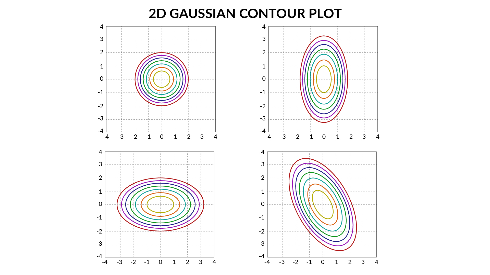

<!-- vim-markdown-toc GFM -->

* [Purpose](#purpose)
* [Limitations of K-Means](#limitations-of-k-means)
* [Advantages of GMMs over K-Means](#advantages-of-gmms-over-k-means)
* [Limitations of Fitting the Data using a Single Gaussian](#limitations-of-fitting-the-data-using-a-single-gaussian)
* [1D Gaussian vs Mixture of Gaussians](#1d-gaussian-vs-mixture-of-gaussians)
* [1D Gaussian vs 2D Gaussian](#1d-gaussian-vs-2d-gaussian)
* [K-Means vs GMMs Cluster formation Steps](#k-means-vs-gmms-cluster-formation-steps)
* [Expectation Step](#expectation-step)
* [Minimization Step](#minimization-step)
* [Steps for GMM](#steps-for-gmm)
* [References](#references)

<!-- vim-markdown-toc -->

# Purpose
Notes on GMMs

# Limitations of K-Means
- K-Means is a hard clustering algorithm
- can't handle data points that are in overlapping region
- K-Means can't accommodate mixed membership of the data points to clusters, in general, K-Means performs hard cluster assignment. In kmeans, a point belongs to one and only one cluster.
- there can be lot of variation within a cluster but K-Means doesn't tell us about the shape or spread of the data within a cluster

# Advantages of GMMs over K-Means
1. GMM is a lot more flexible in terms of cluster covariance:
    - K-Means is actually a special case of GMM in which each cluster’s covariance along all dimensions approaches 0. 
    - This implies that a point will get assigned only to the cluster closest to it. 
    - With GMM, each cluster can have unconstrained covariance structure. 
    - Think of rotated and/or elongated distribution of points in a cluster, instead of spherical as in kmeans. 
    - As a result, cluster assignment is much more flexible in GMM than in k-means.
2. GMM model accommodates mixed membership:
    - Another implication of its covariance structure is that GMM allows for mixed membership of points to clusters. 
    - In kmeans, a point belongs to one and only one cluster, whereas in GMM a point belongs to each cluster to a different degree. 
    - The degree is based on the probability of the point being generated from each cluster’s (multivariate) normal distribution, with cluster center as the distribution’s mean and cluster covariance as its covariance. 
    - Depending on the task, mixed membership may be more appropriate (e.g. news articles can belong to multiple topic clusters) or not (e.g. organisms can belong to only one species).
3. If the model has some hidden, not observable parameters, then you should use GMM. 
    - This is because, this algorithm is assigning a probability to each point to belong to the certain cluster, instead of assigning a flag that the point belongs to the certain cluster as in the classical k-Means.
    - Then, GMM is producing non-convex clusters, which can be controlled with the variance of the distribution. 
    - In fact, k-Means is a special case of GMM, such that the probability of one point to belong to a certain cluster is 1, and all other probabilities are 0, and the variance is 1, which a reason why k-Means produces only spherical clusters.

# Limitations of Fitting the Data using a Single Gaussian
- The fitted guassian may not correctly represent the actual data
- Say one of your classes has 2 modes, then fitting two gaussians for that class will make more sense
- better approximation might be mixture of gaussians given as:
    - $p(x) = \prod_1N(\mu_1, \sigma_1^2) + \prod_2N(\mu_2, \sigma_2^2)$
    - mixing the two guassians in proportion of $\prod_1$ and $\prod_2$
- Speech Recognition is a case where we need to fit multiple gaussians

# 1D Gaussian vs Mixture of Gaussians

| 1D Gaussian               | Mixture of Gaussians                               |
|---------------------------|----------------------------------------------------|
| $p(x) = N(\mu, \sigma^2)$ | $p(x) = \sum_{i=1}^{N}\prod_iN(\mu_i, \sigma_i^2)$ |

# 1D Gaussian vs 2D Gaussian

| 1D Gaussian                                         | 2D Gaussian                                                                              |
|-----------------------------------------------------|------------------------------------------------------------------------------------------|
| $\mu$ represents mean                               | $\mu$ represents mean                                                                    |
| $\sigma^2$ represents the sharpness of distribution | $\sum$ i.e. covariance matrix can represent different shapes (like circle, ellipse etc.) |
| $p(x) = N(\mu, \sigma^2)$                           | $p(x) = \sum_{k=1}^{K}\prod_kN(\mu_k, \sum_k)$                                           |

- 2D Gaussian Contours

# K-Means vs GMMs Cluster formation Steps

| K-Means                                                                          | GMMs                                           |
|----------------------------------------------------------------------------------|------------------------------------------------|
| Initialize cluster center                                                        | Initialize parameters                          |
| Assignment Step - assign a cluster                                               | Expectation Step                               |
| Optimization Step - change cluster center                                        | Maximization Step                              |
| Example responsibility for 2 clusters $r_{ik} = \begin{bmatrix}1&0\end{bmatrix}$ | $r_{ik} = \begin{bmatrix}0.7&0.3\end{bmatrix}$ |

# Expectation Step
- To initilise the GMMs algorithm we can use K-Means to compute $μ_1$ and $μ_2$. 
- We can give equal weight to the Gaussians say $π_1 = 0.5$ and $π_2 = 0.5$, and then 
- We can compute responsibilities that a cluster takes for each data points. 
- Expectation steps assign each data point with a probability know as the soft assignment which is also known as the responsibility $r_{ik}$ that a cluster takes for each data point.

# Minimization Step
- Cluster Centers are computed
- $\displaystyle \mu_k=\frac{\sum_{i=1}^{N}r_{ik}x_i}{\sum_{i=1}^{N}r_{ik}}$

# Steps for GMM
For GMMs, 
- We initialise the parameters (by using K-Means or randomly) and then 
- For expectation step we compute the responsibilities for every data point that a cluster takes and then lastly 
- In the Maximisation step we recompute the parameters
- We keep doing this iteratively until convergence

# References
- [Gaussian Mixture Models](https://brilliant.org/wiki/gaussian-mixture-model/)
