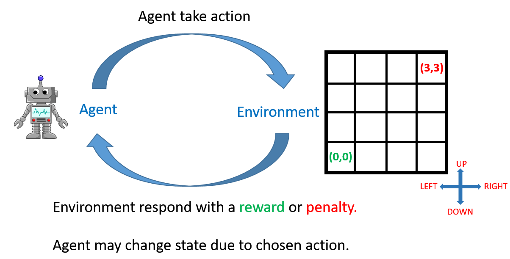

# Preface
Reinforcement Learning (RL) is the field of machine learning in which an 'agent' (i.e. the software being trained) learns to take actions to maximise some cumulative 'reward'.

Some classical examples of RL are driverless cars, game playing agents (Chess, Go, etc.), mechanical robots in factories/warehouses etc. The field of Reinforcement Learning has seen some major breakthroughs in recent years: 
- [DeepMind and the Deep Q learning architecture in 2014](https://deepmind.com/research/dqn/)
- [Beating the champion of the game of Go with AlphaGo](https://deepmind.com/research/alphago/) in 2016 (you can watch the short video related to it [here](https://www.youtube.com/watch?v=8dMFJpEGNLQ)), 
- [OpenAI and the PPO](https://blog.openai.com/openai-baselines-ppo/) in 2017
- [How Deep Blue beat a chess grandmaster](https://en.wikipedia.org/wiki/Deep_Blue_versus_Garry_Kasparov)

These achievements have in turn inspired other researchers and companies to turn to reinforcement learning. The most noticeable is the field of driverless cars. Several automobile companies are hard at work for building cutting-edge-technologies for self-driving cars. Tesla's Autopilot is one such system. Its 'driver assistance system' offers features such as lane-centring, adaptive cruise control, self-parking, etc.  Alphabet's Waymo, Ford's self-driving car are locked in the competition to reach the final level of autonomous driving.

There have been interesting developments in the field of robotics as well, where robots are trained for different tasks such as finding defects in objects, carrying an object from one place to other. Fanuc has deployed a robot that uses RL to pick a device from one box and put it in a container.

Another domain where RL is used is finance. RL is turning out to be a robust tool for evaluating trading strategies. Many companies are leveraging the 'Q-Learning' algorithm of RL with the simple objective of maximising the 'rewards' i.e. profits. You will study Q-learning and some of these applications in this course. 

## The Evolution of RL

The roots of Reinforcement Learning, acronymed as RL, go back to a psychologist, Edward L. Thorndike who talked about learning by trial and error.  He studied cats in puzzle boxes. The cat was motivated to come out of the box. The cat would fall around and eventually stumble upon the latch that would open the box. Once the cat managed to get out, the same cat would be put in the same box again. After successive runs, he observed that cats were getting faster in finding and pulling the latch. And on the basis of this behavioural experiment, Thorndike put forward the 'Law of Effect':

"Responses that produce a satisfying effect in a particular situation become more likely to occur again in that situation, and responses that produce a discomforting effect become less likely to occur again in that situation."

# What is Reinforcement Learning

Ever noticed how an infant learns to walk? She puts a step forward. If she falls, she realises 'that was probably the wrong way'. She keeps trying and relies on the feedbacks (e.g. falling, being able to walk easily, etc.) to judge whether ‘the current technique is correct or not’.

You learn from your interactions with the world aka 'environment'. When you are learning to drive a car (assuming you have no instructor), you completely rely on the feedback you get from the surroundings. If you cross a lane or come too close to a tree, you change your technique (or actions, such as putting more breaks, turning the steering a little lesser, etc.).

Let’s first start with an overview of the RL problem and look at some examples which will help build an intuition of RL.
- Solving a maze
- Managing Investment Portfolio
- Deciding among the pickup requests in cab-service scenario
- Process Control System

- Humanoid robot
  - Say, an engineer is learning to design a humanoid robot and his objective is to make it stand. 
  - He can do that by turning some joints. A wrong turn of a joint can make it fall. 
  - By trial and error experience, he will learn which sequence of turning joints is making robot stand and which is not. 
  - This is a reinforcement learning problem. 
  - Here, the engineer is the agent and the robot on which he is taking the actions is the environment; actions are 'turning the joints' and consequences could be robot falling or standing up.

Note:
- The agent is any robot that is trying to learn the task,
- While the environment is the world around it that gives it the feedback.

When you are learning to walk, you are the agent and the surroundings are the environment.

Reinforcement learning is similar to 'human learning'. Remember the first time you were trying to learn to ride a bicycle? Learning how to balance and manoeuvre comes with experience. Maybe, when you had a fall (a negative experience), you learnt that the action which led to the fall was wrong and you should not do that again. Similarly, when you had a positive experience, you learnt what actions (how to keep your feet on the pedal, how much to turn the handlebar, etc.) led to a happy ride.

The agent can interact with the environment, and take an action of its choice. However, it cannot control the consequences i.e. the outcome of taking the action. The consequence is a property of the environment itself.

# Questions

**A mobile robot has the job of collecting trash in an office. It has sensors for detecting cans, and an arm that picks it up. It runs on a rechargeable battery. The robot’s control system has components for interpreting sensory information, for navigating, and for controlling the arm.**

**It makes decisions depending upon the charge levels of battery. Consider there are three levels of charge: ‘high’, ‘medium’ and ‘low’. The agent needs to decide whether to (1) actively search for a can, (2) remain stationary and wait for someone to bring it a can, or (3) head back to its home base to recharge its battery.**

**Who is the agent in this case?**

- Robot's control system
- It’s a high-level agent which is responsible for interpreting sensory information, for navigating, and for controlling the arm and gripper

**What is the environment in this case?**

- Office Environment
- Environment presents a new state and reward to the agent basis its actions

**What are the actions in this case?**

- Agent’s decisions: (1) actively search for a can, (2) remain stationary and wait for someone to bring it a can, or (3) head back to its home base to recharge its battery
- Actions are tasks that an agent can perform

---

**Investment Management: You want to manage your investments such that the profit is maximised. Given that you can either buy, hold or sell a stock, what are the possible consequences (or outcomes)?**

- % Profit or Loss or no-profit-no-loss
- any action whether it’s buying or selling would either result in a profit or a loss or a no-profit-no-loss

**Which of the following is the best possible explanation of RL?**

| Statement                                                                                                                                                                | T/F |
|--------------------------------------------------------------------------------------------------------------------------------------------------------------------------|-----|
| RL is a learning problem where an agent learns from environment with help of a teacher telling what is right or wrong                                                    | F   |
| RL is a learning problem where an agent learns from the environment by taking actions and controlling the consequences in its favor                                      | F   |
| RL is a learning problem where an agent is trying to learn from its environment by taking an action and understanding the consequences; in order to achieve an objective | T   |

- Environment doesn't tell the agent what is right or wrong. It tells the agent what is the consequence of its action. 

---

# Agent-Environment Interaction

- agent observes the environment, then 
- takes an action which he thinks is good. After taking the action, 
- the environment tells him how good that action was, in the form of rewards; this also presents a new observation to the agent. 

## Example
Let’s take the example of a student learning to maximise grades in his training. 

- He has grades of the exam that happened two weeks back. 
- He observes the subjects in which he scored lower. 
- And then studies (action) only for those subjects. 
- For the remaining time, he plays or surfs. After a week, he goes through the exams again. 
- His grades improve and now only in one subject his marks are a little less than the average. 
- So, the action of studying had a positive consequence as his marks increased.
- Apart from this, he observes the subject in which he scored low marks - that becomes his new observation.

Reward, in this case, is the increase in marks. However, note that the reward is not enough to judge his action. What if he had failed the subjects for which he did not study in the second attempt? 

Reward only tells you how well you are carrying out the task. It does not guarantee that this is the best action. 

In other words, reward is an indicator, or a 'weak signal', which roughly indicates whether the agent is taking actions in the right direction. 

Unlike supervised learning, which classifies each observation as 'right' or 'wrong'; reward in reinforcement learning is just a number indicating how well you are performing the action. The robot needs to try and find out which actions are better than the others, if not the best. The objective here is to maximise the cumulative reward as the sequence of actions is taken.

## Two Types of Tasks
- Continuous: tasks that do not have a definite end - e.g. learning to walk, controlling a chemical plant, driving a car
- Episodic tasks: tasks that have a definite end - e.g. most games (videos games, Chess, Ludo) etc. are episodic since at the end of the game the agent either wins or loses. 
 

# Questions

**Rewards are under the control of the agent, i.e., after taking an action, it can modify the rewards obtained**
- False
- Rewards are the property of the environment

---

**Map out tasks as continuous or episodic**

| Task                    | Continuous / Episodic |
|-------------------------|-----------------------|
| Automated stock trading | Continuous            |
| Solving a maze          | Episodic              |
| Playing Tic-tac-toe     | Episodic              |

- Episodic tasks end in a terminal state, i.e., they terminate after time T.

---

**Objective of RL agent is to:**

- Find sequence of actions that accumulate maximum rewards
- The objective of RL agent is to carry out task well.  By doing the task well, it implies that its actions should be more aligned to accumulate maximum rewards

---

# State Vectors

- A state is a representation of the environment at any point in time. 
- The environment will give all the signals, but how relevant those signals are for the agent to take an action is what you have to decide.
- You can consider state vector as a list of features that help the agent to take an action.
- For each RL problem, state vector would be different.

Let’s take the example of a humanoid robot where your objective is to make him stand. Now, the environment offers you values for the following:

- pressure & temperature at some chemical plant
- robot’s joint positions
- the angle at the knee joint
- Bitcoin’s current price

Would all these variables impact the agent’s decision making? No. The pressure and temperature at the chemical plant would not help you decide which joint to turn. The action you need to make is on the basis of ‘which joint of the robot should be turned’. So, your 'state' will be the representation of robot’s joint positions and the angle at knee joint. These two are enough to take the next action.

State is your representation of the environment. Perhaps the environment would have a lot of things, but the state that you want to take will determine which parameters in the environment really matter to you.

## Examples of State Vectors, Actions and Rewards

1. Process Control System
- State Vector: (Pressure, Temperature)
- Action: Turning knobs, valves
- Rward: Yield

2. Investment Management Portfolio
- State Vector: (amount of cash, % investments in mutual funds, equity, FDs, etc.)
- Action: Sell / Buy / Hold
- Reware: Profit / Loss %

3. Cab Driver Problem
- State Vector: (location, time, day)
- Action: Service a request
- Reward: Money earned from a trip

So, the representation of the environment which is necessary for the agent to take an action is called state. In any real-life scenario, it will be left on your judgement to decide what variables are good for the agent to take an action.

# Questions

**Which statement is incorrect?**

| Statement                                                                                                                                                                                   | Correct / Incorrect |
|---------------------------------------------------------------------------------------------------------------------------------------------------------------------------------------------|---------------------|
| Agent interacts with the environment in the form of actions, and the environment responds to the agent by rewarding these actions and by presenting a new set of state vectors to the agent | Correct             |
| Reward is in the form of a vector                                                                                                                                                           | Incorrect           |
| State is usually represented by a number                                                                                                                                                    | Incorrect           |
| Agent observes the state variables and basis that takes some action                                                                                                                         | Correct             |

- State represents what features agent wants to observe from the environment. It is usually represented in form of a vector.
- Environment rewards the agent's action as a number. And it is just a weak signal of telling how good or bad an action is

**Self-driving cars: You are designing a self-driving car and you want the car to observe the values of the state vector to take the next action. Which of following options do you think makes a good state vector for this problem.**

- (Current position of car on road, speed of car, the angle of the steering wheel, distance of obstacles (other vehicles, buildings, pedestrian), the current position of obstacles (other vehicles, pedestrian) image in rear-view mirror, road condition, white marks on road, current traffic signal)

**Inventory Management: Say you are the owner of a retail shop. Your objective is to maximise the profits earned in a day. So, you need to place an order to meet the demand. On any day, you observe the ‘state vector’ and take an action for placing an order (from the supplier) which arrives later the next day. Assume that your demand is a function of the day of the week. Which of the following is the most relevant state vector?**

- (Current inventory level, the day of the week)

**Deciding cover for each movie/series on Netflix homepage: Say, Netflix wants to customize the home page for each of the customer. It wants to show very relevant cover photo for each movie or series it recommends. Example, a person watching a lot of horror movies, will be interested if he is shown some intense scene from the movie as a cover photo. So, the action is to decide the cover photo, basis some state vector. What could be the state vector in this case? Choose the most appropriate option.**

- (Customer’s past preferences of genres, actors, directors, ratings of movie he has watched)

---

# Objective of RL Agent

So far, you have learnt that the agent is interacting with the environment in an 'optimal manner' to achieve the objective. But, how do you define the objective of an RL problem? Can you say that the objective is to gather maximum rewards?

Take an episodic task, say a game of tic-tac-toe. How will you calculate the reward for each O (or X) you marked? You will get a reward after you win or lose the game. What is the agent’s end-objective in this case? Similarly, for a continuing task, say for stock market trading, you can define your reward as how much profit you earned in a month or a day. There is no end to continuing tasks, so how are you going to parametrise your objective?

You can summarise the objectives of the RL agent in the following manner:
- The objective of episodic tasks is to find such a sequence of actions that will make the majority of episodes successful.
- For continuing tasks, break it into multiple episodes and then find out actions that maximise the average rewards earned from those episodes.

**Note**
- The objective is defined after observing the state vector from the environment
- Just like the reward, the objective is also a property of the environment

## Question
**A self-driving car gets rewarded for every 1km of a ride. And after every 8 hours, it needs to charge itself. Which of following is the correct objective of a self-driving car?**

- Find out an action sequence that could accumulate maximum rewards in maximum rides. 
- Since the car needs to charge itself after every 8 hours, this makes it an episodic task. And the objective then would be to find a sequence of actions that would accumulate maximum rewards.

---

# Actions & Policy

So far, you have two pieces of information:

- An action leads to a reward and a change in state.
- The objective of the RL agent is to find the sequence of actions to maximise overall rewards.

How does an RL agent take an action from a given state? Are there some rules defined for each scenario?  Or is there some mathematical model of the environment which the agent learns over time and then takes an action?

Agent needs to learn about the environment before it behaves in an optimal manner. Learning essentially means that the agent interacts with the environment by trying out different actions and understanding their consequences. 

The consequence is two-fold, one in form of rewards, other in form of change of state. It is like a child learning how to walk. He needs to understand which foot to put forward, to keep both the legs straight, etc., and the consequence for each of these. So, he will remember what action he took and what consequence it led to. This memory of action and consequence is called knowledge-base or history for an RL agent.

Now, the agent can look up in its knowledge base and see which action leads to the best consequence when in a given state. You could also build a mathematical model of the environment rather than storing all possible (action, consequence) pairs.

All this is good for smaller problems where there are very few states and actions. In more realistic situations, it is very difficult to explore all possible states and actions and therefore makes it difficult to build a knowledge base or a model. 

A policy is a set of rules which helps the agent decide the action that it should take in a given state such that the agent can maximise its rewards in the long run. There are two types of policies:

- A deterministic policy: $\pi(s) \rightarrow a$
- A probabilistic policy: $\pi(a|s)$

A probabilistic policy becomes deterministic when $\pi(a|s) = 1$

For example, for a novice doing investment portfolio management, the policy could be: whenever the stock price reaches a certain threshold, he will sell all the stock. This is the deterministic case. He has fixed the action for a state. A probabilistic policy, on the other hand, could be: whenever the stock price reaches a certain threshold, sell the stock 60% of the times, retain the stock 35% of the times, and for rest of the times, buy the stock. What if the stock price keeps on increasing and he holds the stock rather than selling it? Well, he could earn more profit by selling it later.

**Which of following correctly defines a policy?**
- A mapping from state that helps the agent to figure out what action needs to be taken

---

# References

- [Reinforcement Learning for Humanoid Robotics
](https://faculty.cc.gatech.edu/~isbell/reading/papers/peters-ICHR2003.pdf)
