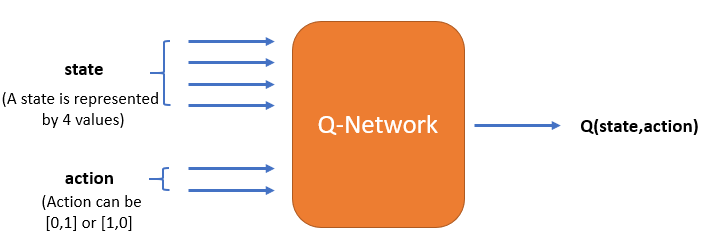

# Preface

In classical reinforcement learning, you learnt about the agent : environment interaction, Markov Decision Process, dynamic programming, Monte Carlo methods and Q-learning.

When the state space is relatively small, e.g. a 3x3 grid, or even a few thousand states etc., it is easy to visit each and every state and estimate its Q-value. However, when the state space is large, visiting every space may not be possible. So, the classical approach of estimating the Q-value by visiting each state-action pair wouldn't work.

DeepMind's AlphaGo recently defeated the 18-time world champion Lee Sedol 4-1 in a historic match. Go is an extremely complex board game : the number of possible 'states' in Go is more than the number of atoms in the universe! You can watch the trailer of a documentary on AlphaGo [here](https://www.youtube.com/watch?v=8tq1C8spV_g).

The algorithm used to train AlphaGo was based on deep reinforcement learning. 

Let's take another example : suppose you are training a robotic arm to play table tennis. How many positions (states) the arm can take in the space? Infinite, right? These positions will be guided by the position of the ball. The task of the robotic arm is to hit the ball. There can be infinite possible angles (the actions) to hit a ball in any given position. How will you decide the optimal action for each of these positions? By visiting each state-action pair and storing its Q-value? But there are infinite state-action pairs and you can not possibly visit ALL of them!

This is where deep learning comes in. Using deep learning, instead of finding the Q-value for every state, you learn the Q-function or policy etc. This is very similar to what you do in supervised machine learning. From a few hundred thousand samples, you learn a model to label the unseen samples.

# Why Deep Reinforcement Learning

In classical reinforcement learning, you make a Q-table representing all possible states. What happens if the agent encounters an unseen state? This unseen state would not be present in the Q-table. So, it would not have associated Q-values for each action. In such a case, you would not be able to decide the optimal action from the Q-table.

Let's take the example of a self-driving car.

In a self-driving car, if the state is represented by (position of the vehicles, number of vehicles on the road), the agent will always encounter new states, no matter how many states it has already seen. The Q-table will not have all possible (unseen) states, so you would not be able to estimate the best action for these states the regular RL way.

When you have a very large state-space, the agent may not be able to visit each state because the state-space is too large. In the Q-table, if a particular state is not present, you would not know which action should be taken and hence cannot find optimal action for an unvisited state.

Deep RL solves this problem by learning the model of the Q-value function $q(s, a)$. The deep learning network acts as a function approximator that tries to approximate the Q-value function. Please note that apart from the Q-value function, you can learn other functions as well such as the state value function $v(s)$ or even the policy $\pi(a|s)$

Also, to learn these functions, it is not necessary (in principle) to use deep learning models - you can use conventional machine learning models as well. However, since deep learning models can learn arbitrarily complex functions in practice they prove to work much better.

# Parameterized Representation

You saw that when the number of states is large, creating a 'Q-table' by visiting each state-action pair is not feasible. Thus, you try to approximate the Q-function. Thus, in the parametrised approach, the Q-function is represented as 

$w_0 + w_1S_1 + w_3S_3 + \ldots$

where $S$ represents the 'input' to the netowrk. Here, $S$ can represent a state or a (state, action) pair etc. The model here is the set of weights ($w_0, w_1, w_2 \ldots$) which are to be learnt during training. In deep learning, the function is far more complex (and almost never linear).

Recollect that the parameters of a deep learning model are basically the weights (and biases). In other words, a deep learning model is parametrised by its weights which are learnt during training.

# Generalizability in Deep RL

In deep reinforcement learning, you model the action-value function (or the policy or the value function) using the function approximator based on the 'seen' states. It becomes important that the model performs well on the 'unseen' states.

For example, say you are training an autonomous car. The car will be trained in certain traffic conditions and would be exposed to certain states, but it should be able to perform in new, unseen states as well.

A function approximator should be able to generalise well on the unseen states.

The model should be able to 'generalise' and take optimal actions on the states that the agent has not encountered before, assuming that the training dataset and the unseen dataset come from the same distribution.

For example, if you are playing table tennis with a robotic arm, the arm has to hit the ball for all possible positions of the ball (and not just for the positions of the ball it has learned during training).

So, the function approximator should be able to 'generalise' to unseen data points. Given some 'seen' states, it should be able to predict the optimal action for the 'unseen' positions of the ball. This property is valid for any (well-trained) model in machine learning. 

You will use a neural network for approximating these functions: state-value, action-value, policy etc. As pointed out by the professor, you can use other algorithms as well: decision trees, SVM etc., but in practice, the complexity of most RL tasks require deep neural networks.


### Advantages of Function Approximator

- Don’t have to visit every state, and able to approximate value function for unseen states.
    - The idea of using value function approximation is we do not have to visit each and every state to approximate its value. Also, even its not possible as the number of states will be too large to visit all the states. So, we need value function approximation to approximate/ generalise.
- Don’t have to store all the states and/or actions in the memory.
    - Since we are using function approximator, we don’t have to store all the states and/or action in Q-table in memory.


The first successful demonstration of deep RL at par with the human-level performance was playing Atari games by DeepMind. The screenshots of the game were taken. Each screenshot represented a state. Each state was then passed to the deep reinforcement learning network.

# Three classes of Deep RL

1. Deep Q-learning : value-based
    - The task is to learn the state (or state-action) value function
2. Policy Gradient : policy-based
    - The task is to learn the policy function
3. Actor-Critic : both value and policy based
    - The task is to learn both the state-value function and the policy function, and so these methods use two neural networks. 
    - The actor (policy-based) takes the action and the critic (value-based) tells how good that action is.

You know that neural networks are powerful function approximators and can approximate any complex function. The parameters of the neural network are the weights and the biases.


# Deep Q Learning

When you train a machine learning model, such as linear regression, you assume that the data points are independent and identically distributed (IID). For example, say you are using regression to predict the price of a house using its area, so you have (area, price) tuples as your training data. You assume that each data point is independent of each other (the price of a house does not affect that of another) and that all the data points are identically distributed. 

 

An identical distribution means that every time you draw a data point, whether you draw the first or the 100th data point, the probability of getting a particular data point is the same. For e.g. say there is a house with a large area (say 20,000 sq. ft.) and a very high price. Now, imagine that you create your training set by drawing data points from some probability distribution of (area, price). No matter which data point you are drawing - the probability of this (and any other house) appearing is the same.

 

Food for thought: Say you learn the action-value function using (say) Q-learning, i.e. the agent learns various (state, action, expected reward) triplets by simulating some episodes. Are these triplets IID.?


The neural network acts as a function approximator that approximates the Q-value function. It could be a multilayer perceptron, a convolutional neural network etc. depending on the problem. The arguments to the neural network for deep Q-learning are as follows:

- The (state, action) pair is the input - it will be a concatenation of state and action
- Corresponding to each (state, action) pair, a state-action value Q(s, a) is the output - the expected reward (Q-value) for the given state corresponding to the action you perform
 

Thus, a typical (Q-value based) neural network in deep RL learns to solve a regression problem.

However, there is a catch - the data samples when training the neural network should come from an independent and identical distribution which is not strictly the case in RL. The samples are not independent because the next state is usually highly dependent on the previous state and action. 

For example, let's say an agent is trying to learn to play an Atari video game. The state is represented by the screenshot of the game at any point. As you move from one screenshot to the next there will be little change in pixel values. Hence, the next state (screenshot) is dependent on the previous one.

The other problem is that of identical distribution. We said that an identical distribution means that every time you draw a data point whether you draw the first or the 100th data point the probability of getting a particular data point is the same.

Now, this is not the case in deep RL - the probability of a (state, action, reward) triplet appearing changes with 'time' (i.e. episodes). That is, say you are creating a training set of 1 million (state, action, reward) triplets. Towards the start the agent has not learnt much, so the probability of a (s, a, r) triplet will be very different from when the agent has learnt much more during the end of the game.

The Deep Q-Network algorithm is significant because it managed to solve these problems.

# Questions

**While learning the state-action value function using the neural network, what should be maximised to get an optimal model of the state-action value function?**
- The expected total reward from a particular state by taking an action 'a'

**If you are already giving action along with the state, as input to the neural network, does it mean that you already know the best action?**
- No, you will give all possible actions one by one to get the reward for each action, but choose only that action to go to the next state which gives the maximum expected total reward.

# Training in Deep Reinforcement Learning

Let's say that you initialise a neural network that can approximate the Q-value for a given (state, action) pair. Let's see how you would train such a network.

The state is represented by 4 values and there are 2 actions possible in each state.



1. Let's assume that you have data in the form of $(s,a,r,s')$
2. Suppose you take 50 samples (as a batch) to train the neural network
3. You initialise the network with random weights. So, you have an untrained model of the state-action value function $Q(s,a)$
4. You take a sample $(s,a,r,s')$ and input it into the untrained model you have from step 2
5. The predicted Q-value, by the model, for $(s,a)$ will be $Q(s,a)$
6. You set the target (or output)
7. Recall that the loss function is given by (target value - predicted value)
8. Follow steps 4, 5, 6 for all the 50 samples. For each of these samples:
    1. Input is (s,a)
    2. Predicted output is $Q(s,a)$
    3. Target output
9. You train the network using the above 50 samples and update the weights, hence the model

# Replay Buffer
Before training the neural network to learn the state-value function, you need to have a data set that can be used for training. However, in reinforcement learning tasks, you generally don't have the data set. You are required to create a data set of the form $(s,a,r,s')$

When in state $s$, the agent takes an action $a$. The environment returns the new state $s'$ and the reward $r$. This sample is stored as $(s,a,r,s')$ in memory. Again, in the new state $s'$, the agent performs another action, gets a reward and a new state from the environment. 

These samples generated by the interaction of the agent with the environment are collectively known as experience. You represent experience as a 4-tuple &lt;state, action, reward, next_state&gt;. The reward here is the immediate reward you get from the environment. These encountered experiences are stored in the memory. And this memory is called the replay buffer. 

Memory: Memory can be defined as queue. At one end, you insert data (enqueue), and at the other end, you remove data (dequeue). In Python, you can initialise a replay buffer (the memory) using the deque() function:

```py
memory = deque(maxlen=1000)
# Maximum of 1000 experiences can be stored
```

How many experiences should you store in the memory? This is a hyperparameter and can be tuned to make the training process faster.

To train the neural network, you need to have the data mimicking the interaction between the agent and the environment so that the neural network can 'learn' from that interaction and see what actions are rewarded positively. The agent-environment interaction generates the training data set for the neural network.

A neural network is trained in batches in which the data points are random (IID). But the agent's experience is generated sequentially, i.e. you go from one state to another state in a sequential, dependent fashion. So, to make a batch from a sequential process, you store them in memory and take random samples of batch size to train the network.

```py
batch = random.sample(memory, batch_size)
#  random.sample() function will return data of batch_size from the memory without replacement
```

### Questions

**What is the nature of the data generated by the environment? (sequential/batch)**

- A sequential process
- Since we go from one state to another in a sequential process, the data generated by the environment is sequential. 

**How do you make the experience generated by the environment into a batch of multiple samples, to train the neural network?**
- Store each experience in a memory and take a batch from memory.

Now that you have generated the data (s,a,r,s') and you have input to the network (s,a) . The input is the state-action pair from the replay buffer. What should be the target (or the output) for this network? Should it be the immediate reward r that is stored as experience in the memory?

# Generate Data for Training

Broadly, there are two steps involved while building a deep reinforcement learning model:
- First is to generate the data required for training
- Second is to train the neural net on the generated data to get the optimal Q-value function


## How do you generate the data

When in state $s$, the agent takes an action $a$. The environment returns the new state $s'$ and the reward $r$. This sample is stored as $(s,a,r,s')$ in memory. Again, in the new state $s'$, the agent performs another action, gets a reward and a new state from the environment. 

Once you have the sequential tuples &lt;s,a,r,s'&gt; in the memory, you randomly select samples from it. Each sample is then used for training. The input to the neural network is (s,a).


# Target in DQN

Now that you have stored the experiences in memory, you can pick a batch to train the network. The input to the network is $(s,a)$

However, what is the target value for the network? 

Recall that, in Q-learning, the sum of the immediate reward and the maximum total reward that you can expect in the next state is given by:

$r+\gamma*\text{max}_a Q(s',a)$

where $r$ is the immediate_3 reward you get on taking action $a$ in state $s$.

You want the neural network to achieve this reward for every state-action input. So this is the $target$ for the network. You look at all the actions in state $s'$ and choose the one with the highest Q-value.

Please note that if the next state $s'$ is terminal, the target is given by $r$. Because $Q(s',a)$ won't exist in such a case.

How do you calculate the target value?

$r$ is the immediate reward you get from the environment on going to the next state. The neural network, given state and action, gives the Q-value. You have the next state $s'$ as experience in the memory. Pass the $s'$ as input to the neural network, along with all possible actions to find the $\text{max}_aQ(s',a)$.

To summarise, you store the experience $(s,a,s',r)$ in memory and randomly pick a batch of samples to train the network. In the equation:

$Q(s,a) = Q(s,a) + \alpha(r+\gamma*\text{max}_aQ(s',a)-Q(s,a))$

Find $Q(s,a)$ by passing $(s,a)$ as input to the neural network. To calculate the target, $r+\gamma*\text{max}_aQ(s',a)$ you have $(r,s')$ from the memory and to get the $Q(s',a)$, pass $(s',a)$ as input to the network. The task is to minimized the difference between the target value and the predicted value $Q(s,a)$.


# When to Stop Training?

Can you just stop the training when the predicted value $Q(s,a)$ gets 'close enough' to the target value $r+\gamma*\text{max}_aQ(s',a)$?

Recall that both predicted and target (or ground truth) values are imporving over time during training. Will they ever come 'close enough'?

The loss function is given by $[Q(s,a) - (r+\gamma*\text{max}_aQ(s',a))]^2$

The predicted and the target values are improving over time as the Q-function gets better after each gradient update. This will give better rewards with each time step. For example, let's say that the predicted Q-value you get from the network is 20 and the expected value is 30. After training for a few time steps, you will get the predicted value as 27, but the target value could also increase to 35.

This type of situation will come in the initial stage of training, but after training for sufficient time, the network will stabilise. The parameters of the neural network will not change significantly, and that is when you can stop training further.

The time required to train is a hyperparameter and depends on the Markov Decision Process (MDP), layers in the neural network, etc. 

# Training pseudo code

The deep Q-learning pseudocode is as follows:

- Initialise replay memory D to a capacity of N (if N=2000, then it can store 2000 experiences)
- Initialise the action-value function Q (i.e. the neural net) with random weights
- Total number of episodes is M
- Each episode is of length (time steps) T 
- For 1 to M episodes, do the following step:
    - For 1 to T time steps, do the following steps:
        - Generate an experience of the form $(s,a,s',r)$
            - With probability epsilon, select a random action 
            - Else select $a = \text{argmax}_aQ(s,a)$
            - Go to the next state s'
            - Set next state as the current state
            - Store the experience in the replay memory D
        - Train the model on (say) 100 samples (batch size) randomly selected from the memory
            - Randomly sample transition $(s,a,s',r)$ of batch sized from replay buffer
            - Calculate the target (y): $r+\gamma*\text{max}_aQ(s',a)$
            - Calculate the Q-value for this state-action pair $(s,a)$ as predicted by the network
            - Train the model to minimize the 'squared error': $[Q(s,a) - y]^2$

Note: You are generating only one experience at every timestep while training on (say batch size = 100) 100 experiences at every timestep. This is so because it has been assumed that you must have generated 100 experiences previously and stored in memory. Training will start only after you have your 'first' 100 experiences. 

The Q-function is being updated at the end of every episode. Thus, you choose better actions after each update to generate the experiences. This will result in more optimal actions and next states, which will further improve the learning process (i.e. the policy).

Both the input and label are changing with time which leads to a dynamic dataset.

# Summary

In this session, you learnt that it may not be possible to visit every state in case the possible state space is huge. If you have missed certain states while training and don't have their Q-values stored in a Q-table, how would you take an action if you encounter these states? 

So, you use a function approximator to approximate the Q-value.  The neural network as function approximator is used because of its many advantages. The most important property of function approximator is the ability to 'generalise'. It should be able to find the optimal Q-value for an unvisited state, and obviously for a visited state. 

Then you learnt that the nature of the data in reinforcement learning is non IID. So, to train the network, you generate an experience &lt;s,a,s',r&gt;, store it in memory and take a random sample of batch size to train the Q-value neural network. 

The training process is, you randomly initialise a neural network, generate an experience and store it in the memory. Then you take random samples of batch size from the memory to find the Q(s,a) and Q(s',a) and train the network. The loss function is 'squared error'. After training for a single step in an episode, the parameters of the neural network will improve. So, use the updated neural network to generate the next experience. 


# Questions

**Which of the following statements are true for reinforcement learning?**

| Statement                                                                                                                        | True / False |
|----------------------------------------------------------------------------------------------------------------------------------|--------------|
| It is impossible to estimate Q-value from the Q-table for an unvisited state.                                                    | True         |
| It will require huge memory to store all (state-action) pairs if the state space is very large.                                  | True         |
| The parameter representation that is used to cater to huge state space can only be a neural network.                             | False        |
| The Q-value varies from 0 to infinity in deep Q network                                                                          | False        |
| The target Q-value is fixed and you have to make the predicted value as close to that target value as possible.                  | False        |
| Both the target and predicted Q-values will change during the training                                                           | True         |
| You always select the best action to improve the policy                                                                          | False        |
| The samples &lt;state, action, next_state, reward&gt; that are generated through agent-environment interactions are independent. | False        |


# References
- [Alpha Go](http://www.wired.co.uk/article/alphago-deepmind-google-wins-lee-sedol)
- [Go](https://en.wikipedia.org/wiki/Go_(game))
- [Robot learns to play Table Tennis](http://www.youtube.com/watch?v=SH3bADiB7uQ)
- [IID](https://en.wikipedia.org/wiki/Independent_and_identically_distributed_random_variables)
- [Playing Atari with Deep Reinforcement Learning](https://arxiv.org/pdf/1312.5602.pdf)
